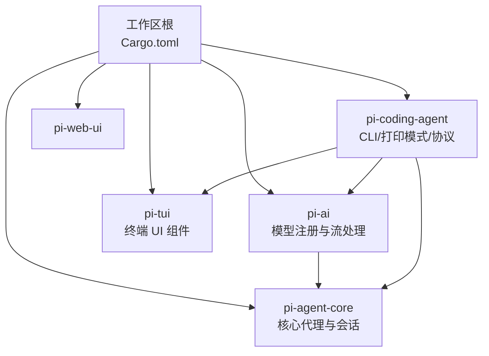
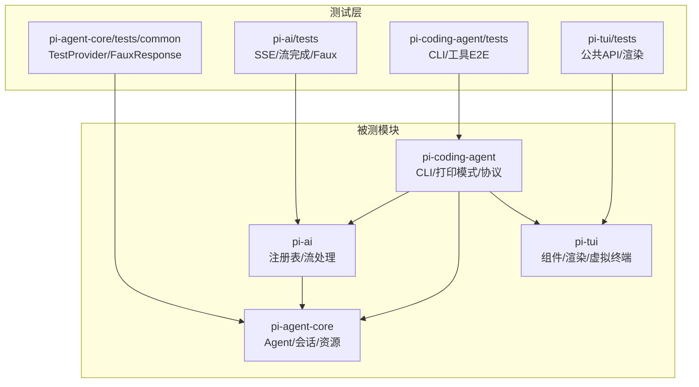
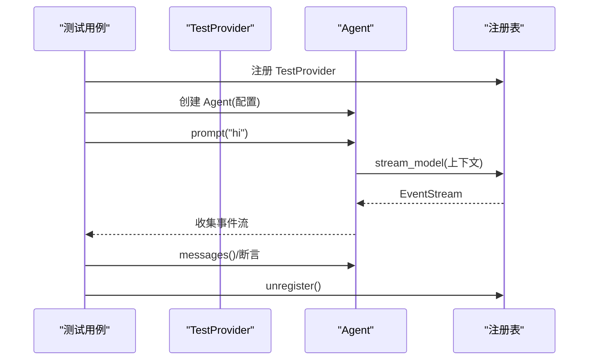
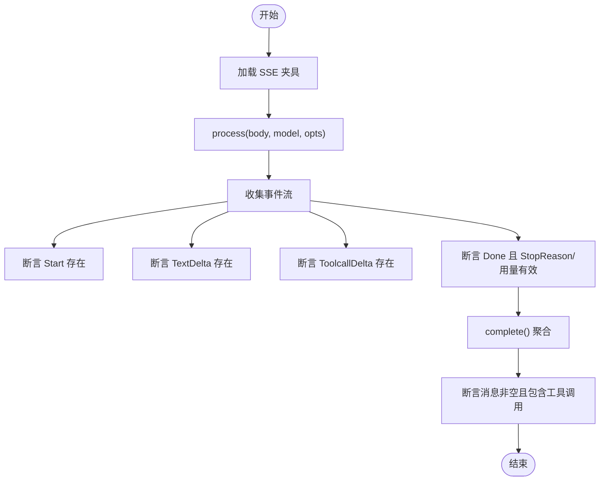
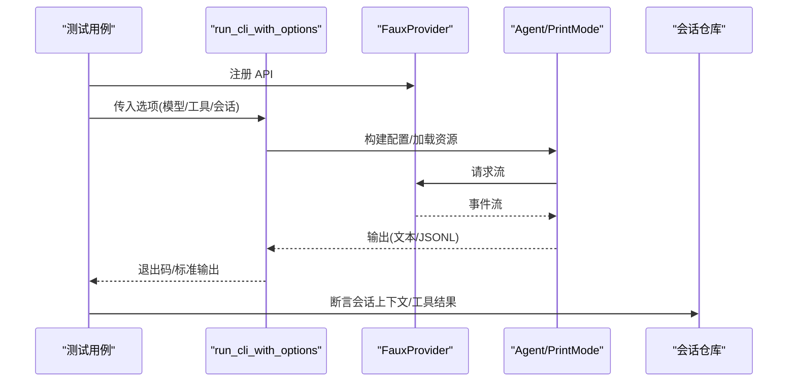
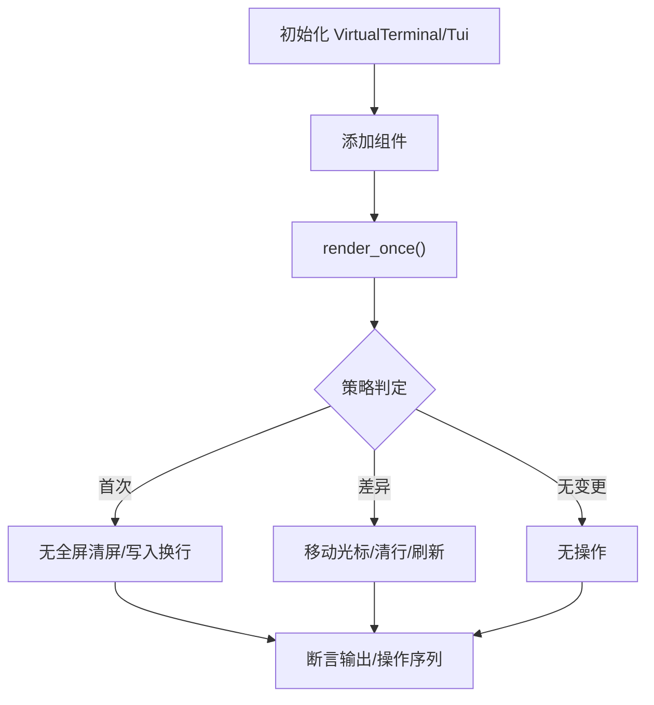
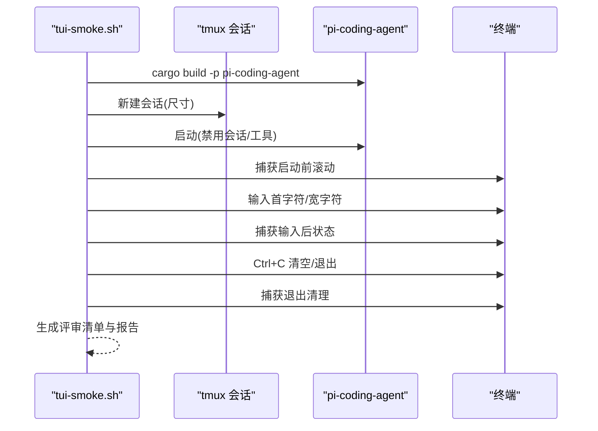
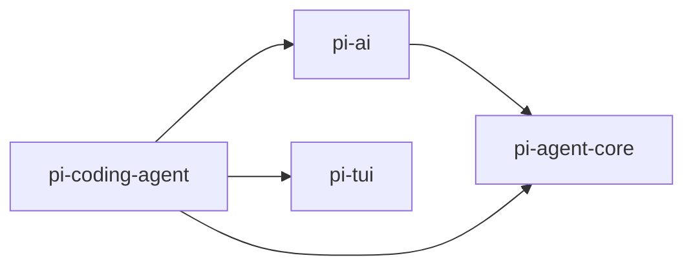

# 测试策略

<cite>
**本文引用的文件**
- [Cargo.toml](file://Cargo.toml)
- [pi-agent-core/Cargo.toml](file://crates/pi-agent-core/Cargo.toml)
- [pi-ai/Cargo.toml](file://crates/pi-ai/Cargo.toml)
- [pi-coding-agent/Cargo.toml](file://crates/pi-coding-agent/Cargo.toml)
- [pi-tui/Cargo.toml](file://crates/pi-tui/Cargo.toml)
- [pi-agent-core/tests/common/mod.rs](file://crates/pi-agent-core/tests/common/mod.rs)
- [pi-agent-core/tests/agent_loop.rs](file://crates/pi-agent-core/tests/agent_loop.rs)
- [pi-agent-core/tests/session_repo.rs](file://crates/pi-agent-core/tests/session_repo.rs)
- [pi-agent-core/tests/resources.rs](file://crates/pi-agent-core/tests/resources.rs)
- [pi-agent-core/src/lib.rs](file://crates/pi-agent-core/src/lib.rs)
- [pi-ai/tests/openai_responses.rs](file://crates/pi-ai/tests/openai_responses.rs)
- [pi-ai/tests/faux.rs](file://crates/pi-ai/tests/faux.rs)
- [pi-ai/src/lib.rs](file://crates/pi-ai/src/lib.rs)
- [pi-coding-agent/tests/tools_e2e.rs](file://crates/pi-coding-agent/tests/tools_e2e.rs)
- [pi-coding-agent/tests/cli.rs](file://crates/pi-coding-agent/tests/cli.rs)
- [pi-coding-agent/src/lib.rs](file://crates/pi-coding-agent/src/lib.rs)
- [pi-tui/tests/public_api.rs](file://crates/pi-tui/tests/public_api.rs)
- [pi-tui/tests/tui_render.rs](file://crates/pi-tui/tests/tui_render.rs)
- [pi-tui/src/lib.rs](file://crates/pi-tui/src/lib.rs)
- [scripts/tui-smoke.sh](file://scripts/tui-smoke.sh)
- [docs/tui-smoke.md](file://docs/tui-smoke.md)
</cite>

## 目录
1. [引言](#引言)
2. [项目结构](#项目结构)
3. [核心组件](#核心组件)
4. [架构总览](#架构总览)
5. [详细组件分析](#详细组件分析)
6. [依赖关系分析](#依赖关系分析)
7. [性能考虑](#性能考虑)
8. [故障排查指南](#故障排查指南)
9. [结论](#结论)
10. [附录](#附录)

## 引言
本文件系统化梳理 Pi-Rust 项目的测试策略与实现，覆盖单元测试、集成测试与端到端测试（含 TUI 烟雾测试、功能测试套件与回归测试），并给出测试框架选择、组织结构、编写指南、最佳实践、测试数据与模拟对象使用、测试环境配置以及常见问题与调试技巧。目标是帮助开发者在不深入源码的前提下快速理解测试体系，并在新增或维护功能时高效落地高质量测试。

## 项目结构
Pi-Rust 采用多 crate 工作区组织，核心测试分布在各 crate 的 tests 目录中，配合公共测试工具与脚本完成端到端验证。工作区根 Cargo.toml 声明了成员 crate；各 crate 的 Cargo.toml 定义了运行时与开发期依赖，其中 dev-dependencies 主要用于测试与基准场景。

图表来源
- [Cargo.toml:1-12](file://Cargo.toml#L1-L12)
- [pi-agent-core/Cargo.toml:1-23](file://crates/pi-agent-core/Cargo.toml#L1-L23)
- [pi-ai/Cargo.toml:1-21](file://crates/pi-ai/Cargo.toml#L1-L21)
- [pi-coding-agent/Cargo.toml:1-27](file://crates/pi-coding-agent/Cargo.toml#L1-L27)
- [pi-tui/Cargo.toml:1-14](file://crates/pi-tui/Cargo.toml#L1-L14)

章节来源
- [Cargo.toml:1-12](file://Cargo.toml#L1-L12)

## 核心组件
- pi-agent-core：代理循环、资源加载、会话持久化、编排钩子等。测试重点覆盖代理事件流、工具调用、消息序列与会话仓库行为。
- pi-ai：模型注册表、事件流处理、SSE 解析、FauxProvider 模拟等。测试重点覆盖事件映射、流完成、成本计算与错误传播。
- pi-coding-agent：CLI 参数解析、打印模式、JSON/RPC 协议、内置工具链端到端。测试重点覆盖 CLI 行为、工具链交互与会话运行。
- pi-tui：公共 API 可用性、渲染策略、虚拟终端操作、TUI 渲染流程。测试重点覆盖渲染无全局清屏、差异更新与光标定位。

章节来源
- [pi-agent-core/src/lib.rs:1-47](file://crates/pi-agent-core/src/lib.rs#L1-L47)
- [pi-ai/src/lib.rs:1-19](file://crates/pi-ai/src/lib.rs#L1-L19)
- [pi-coding-agent/src/lib.rs:1-352](file://crates/pi-coding-agent/src/lib.rs#L1-L352)
- [pi-tui/src/lib.rs:1-61](file://crates/pi-tui/src/lib.rs#L1-L61)

## 架构总览
测试架构围绕“模拟提供者 + 事件流 + 会话/资源加载 + CLI/协议 + TUI 渲染”展开，通过统一的注册表与事件流驱动，确保跨 crate 的行为一致性与可验证性。

图表来源
- [pi-agent-core/tests/common/mod.rs:1-214](file://crates/pi-agent-core/tests/common/mod.rs#L1-L214)
- [pi-ai/tests/openai_responses.rs:1-103](file://crates/pi-ai/tests/openai_responses.rs#L1-L103)
- [pi-ai/tests/faux.rs:1-193](file://crates/pi-ai/tests/faux.rs#L1-L193)
- [pi-coding-agent/tests/tools_e2e.rs:1-306](file://crates/pi-coding-agent/tests/tools_e2e.rs#L1-L306)
- [pi-coding-agent/tests/cli.rs:1-263](file://crates/pi-coding-agent/tests/cli.rs#L1-L263)
- [pi-tui/tests/public_api.rs:1-116](file://crates/pi-tui/tests/public_api.rs#L1-L116)
- [pi-tui/tests/tui_render.rs:1-274](file://crates/pi-tui/tests/tui_render.rs#L1-L274)

## 详细组件分析

### 代理与会话测试（pi-agent-core）
- 公共测试工具
  - TestProvider：基于队列的脚本化响应，支持文本、思考、工具调用三类事件流，便于断言事件顺序与停止原因。
  - 辅助构造函数：text_turn/tool_use_turn/faux_model/faux_text_turn，快速生成典型对话回合。
- 关键测试覆盖
  - 单轮文本响应：断言 AgentDone 与文本增量事件存在，校验消息数量与类型。
  - 工具调用：注册工具后，断言 ToolCallStart/End 与最终 Assistant 文本；未知工具应产生错误内容并继续。
  - 工具更新事件：工具异步更新应在 ToolCallEnd 之前到达，保证 UI/协议的正确时序。
  - 最大轮次限制：max_turns 超限时应返回错误；max_turns 未设置时应自然结束。
  - 中止与提供者错误：abort() 应触发中断错误；提供者错误事件应保留原始错误信息。
  - run() 输入约束：空消息与尾部 Assistant 消息应报错；用户消息尾部应成功。
- 会话仓库
  - 编码工作目录、列表/打开、fork 继承父会话头，确保会话树一致性。
- 资源加载
  - Frontmatter 解析、技能/模板加载、忽略规则、格式化输出，保障系统提示中的可用技能与模板正确注入。

图表来源
- [pi-agent-core/tests/common/mod.rs:1-214](file://crates/pi-agent-core/tests/common/mod.rs#L1-L214)
- [pi-agent-core/tests/agent_loop.rs:1-433](file://crates/pi-agent-core/tests/agent_loop.rs#L1-L433)

章节来源
- [pi-agent-core/tests/common/mod.rs:1-214](file://crates/pi-agent-core/tests/common/mod.rs#L1-L214)
- [pi-agent-core/tests/agent_loop.rs:1-433](file://crates/pi-agent-core/tests/agent_loop.rs#L1-L433)
- [pi-agent-core/tests/session_repo.rs:1-60](file://crates/pi-agent-core/tests/session_repo.rs#L1-L60)
- [pi-agent-core/tests/resources.rs:1-147](file://crates/pi-agent-core/tests/resources.rs#L1-L147)

### AI 提供者与流处理测试（pi-ai）
- OpenAI 响应测试
  - 使用 SSE 固定夹具，断言 Start/TextDelta/ToolcallDelta/Done 事件链路，校验 StopReason 与用量统计。
  - 注册内置提供者并断言可用性；complete() 返回完整消息且包含工具调用。
- FauxProvider 测试
  - 简单文本、工具调用、调用队列与 complete()，覆盖事件起止与 Done 停止原因。
- 关键点
  - 事件流完整性与顺序；错误事件保留；完成聚合逻辑。

图表来源
- [pi-ai/tests/openai_responses.rs:1-103](file://crates/pi-ai/tests/openai_responses.rs#L1-L103)
- [pi-ai/tests/faux.rs:1-193](file://crates/pi-ai/tests/faux.rs#L1-L193)

章节来源
- [pi-ai/tests/openai_responses.rs:1-103](file://crates/pi-ai/tests/openai_responses.rs#L1-L103)
- [pi-ai/tests/faux.rs:1-193](file://crates/pi-ai/tests/faux.rs#L1-L193)

### 编辑器代理 CLI 与工具链 E2E（pi-coding-agent）
- CLI 行为
  - --help/--version/--list-models 等选项返回期望退出码与输出；过滤与 JSON 输出格式校验；只读模式不创建会话文件。
  - 缺少提示词、未知模型等错误路径覆盖；打印模式与 JSON 模式输出校验。
- 工具链 E2E
  - 内置工具集合校验；read 成功/失败回传至模型并继续循环；grep 结果回传断言匹配；上下文记录断言工具结果出现在第二轮调用。
- 关键点
  - 注入模型与工具；会话运行选项；RPC 模式前置条件检查。

图表来源
- [pi-coding-agent/tests/cli.rs:1-263](file://crates/pi-coding-agent/tests/cli.rs#L1-L263)
- [pi-coding-agent/tests/tools_e2e.rs:1-306](file://crates/pi-coding-agent/tests/tools_e2e.rs#L1-L306)

章节来源
- [pi-coding-agent/tests/cli.rs:1-263](file://crates/pi-coding-agent/tests/cli.rs#L1-L263)
- [pi-coding-agent/tests/tools_e2e.rs:1-306](file://crates/pi-coding-agent/tests/tools_e2e.rs#L1-L306)

### TUI 组件与渲染测试（pi-tui）
- 公共 API 可用性
  - 校验导出符号、组件组合、主题与渲染入口；断言基本渲染与交互能力可用。
- 渲染策略
  - 首次渲染无全局清屏；差异渲染移动光标、清理行而不清屏；宽度变化触发局部重绘；收缩时按需清理行。
  - 行宽超限错误、标记光标移动、滚动回退等边界条件。

图表来源
- [pi-tui/tests/tui_render.rs:1-274](file://crates/pi-tui/tests/tui_render.rs#L1-L274)
- [pi-tui/tests/public_api.rs:1-116](file://crates/pi-tui/tests/public_api.rs#L1-L116)

章节来源
- [pi-tui/tests/public_api.rs:1-116](file://crates/pi-tui/tests/public_api.rs#L1-L116)
- [pi-tui/tests/tui_render.rs:1-274](file://crates/pi-tui/tests/tui_render.rs#L1-L274)

### TUI 烟雾测试（端到端）
- 自动化脚本
  - 使用 tmux 启动一次性会话，启动交互模式，捕获关键节点输出（启动前滚动、首字符输入、Ctrl+C 清空、宽字符、窗口尺寸变化、/help、真实提供商流、退出清理）。
- 手动评审清单
  - 跨终端（wezterm/kitty/iTerm2/Terminal.app/GNOME/Tmux/SSH+tmux）逐项核验：图像支持、真彩、滚动保存、光标稳定、尺寸变化范围控制、Ctrl+C 清理、退出恢复等。

图表来源
- [scripts/tui-smoke.sh:1-82](file://scripts/tui-smoke.sh#L1-L82)
- [docs/tui-smoke.md:1-54](file://docs/tui-smoke.md#L1-L54)

章节来源
- [scripts/tui-smoke.sh:1-82](file://scripts/tui-smoke.sh#L1-L82)
- [docs/tui-smoke.md:1-54](file://docs/tui-smoke.md#L1-L54)

## 依赖关系分析
- 运行时依赖
  - pi-coding-agent 依赖 pi-agent-core、pi-ai、pi-tui，形成“CLI → 代理 → AI 提供者/流 → TUI”的主链路。
  - pi-agent-core 依赖 pi-ai 的注册表与事件流类型，支撑代理循环与工具调用。
  - pi-ai 提供统一的 ApiProvider 抽象与 EventStream，是所有提供者实现的契约。
- 开发期依赖
  - 各 crate 在 dev-dependencies 中引入 tokio、tempfile、futures 等，支撑异步测试与临时文件管理。

图表来源
- [pi-coding-agent/Cargo.toml:13-15](file://crates/pi-coding-agent/Cargo.toml#L13-L15)
- [pi-agent-core/Cargo.toml:7-8](file://crates/pi-agent-core/Cargo.toml#L7-L8)
- [pi-ai/Cargo.toml:6-10](file://crates/pi-ai/Cargo.toml#L6-L10)

章节来源
- [pi-coding-agent/Cargo.toml:1-27](file://crates/pi-coding-agent/Cargo.toml#L1-L27)
- [pi-agent-core/Cargo.toml:1-23](file://crates/pi-agent-core/Cargo.toml#L1-L23)
- [pi-ai/Cargo.toml:1-21](file://crates/pi-ai/Cargo.toml#L1-L21)

## 性能考虑
- 事件流聚合与完成：优先使用 complete() 聚合事件，避免逐事件处理带来的额外开销。
- 会话与资源加载：批量加载与缓存策略减少 IO；忽略规则与排序确保确定性。
- TUI 渲染：差异更新与行级清屏优于全屏清屏；合理设置终端尺寸以减少重绘范围。
- 并发与锁：测试中使用 Mutex 仅限于必要场景（如录制上下文），避免阻塞主流程。

## 故障排查指南
- 代理循环异常
  - 检查 TestProvider 队列是否耗尽（应返回 Error 事件）；确认 ToolExecutionMode 与工具注册顺序。
  - 若出现“最大轮次”或“已中止”错误，核对配置与调用时机。
- 流处理失败
  - SSE 夹具格式与字段是否符合预期；StopReason 与用量是否正确填充。
  - complete() 返回错误时，检查事件流是否提前终止或缺少 Done。
- CLI 与工具链
  - --list-models 不创建会话文件；未知模型与缺失提示词的错误信息需与断言一致。
  - 工具链 E2E 中，工具错误应作为 ToolResult 回传给模型，第二轮上下文中可见。
- TUI 渲染
  - 出现全屏清屏或滚动丢失：检查渲染策略与终端操作序列；确保差异更新先移动光标再清行。
  - 行宽超限：调整组件宽度或截断策略，避免 LineTooWide 错误。
- TUI 烟雾测试
  - tmux 未安装或权限不足会导致脚本失败；按需启用真实提供商流并注意凭据与网络消耗。

章节来源
- [pi-agent-core/tests/agent_loop.rs:386-433](file://crates/pi-agent-core/tests/agent_loop.rs#L386-L433)
- [pi-ai/tests/openai_responses.rs:84-103](file://crates/pi-ai/tests/openai_responses.rs#L84-L103)
- [pi-coding-agent/tests/cli.rs:158-263](file://crates/pi-coding-agent/tests/cli.rs#L158-L263)
- [pi-tui/tests/tui_render.rs:69-91](file://crates/pi-tui/tests/tui_render.rs#L69-L91)
- [scripts/tui-smoke.sh:4-7](file://scripts/tui-smoke.sh#L4-L7)

## 结论
Pi-Rust 的测试策略以“模拟提供者 + 事件流 + 会话/资源 + CLI/协议 + TUI 渲染”为核心，通过统一注册表与事件流抽象，实现了跨 crate 的一致性验证。单元测试覆盖代理循环、资源与会话、AI 流处理与 FauxProvider、CLI 与工具链 E2E、TUI 公共 API 与渲染策略；端到端测试通过 TUI 烟雾测试覆盖跨终端行为。建议在新增功能时遵循现有测试组织方式，优先使用公共测试工具与夹具，确保测试可维护性与可扩展性。

## 附录

### 测试框架与配置
- 测试运行器：Rust 标准 #[tokio::test] 与普通 #[test]，配合 tokio rt-multi-thread 特性。
- 模拟对象：TestProvider/FauxProvider，统一 ApiProvider 接口，便于注入不同行为。
- 夹具与临时文件：SSE 固定夹具、tempfile 临时目录，确保可重复与隔离。

章节来源
- [pi-agent-core/Cargo.toml:20-22](file://crates/pi-agent-core/Cargo.toml#L20-L22)
- [pi-ai/Cargo.toml:19-20](file://crates/pi-ai/Cargo.toml#L19-L20)
- [pi-coding-agent/Cargo.toml:24-26](file://crates/pi-coding-agent/Cargo.toml#L24-L26)

### 测试编写指南与最佳实践
- 事件流断言：优先断言关键事件的存在与顺序，最后断言 Done 与 StopReason。
- 工具链测试：使用 RecordingProvider 记录上下文，断言工具结果回传与后续模型调用。
- 会话与资源：使用临时目录与固定编码规则，断言列表/打开/继承关系。
- TUI 渲染：断言终端操作序列与输出，避免全屏清屏与滚动丢失。
- 端到端：使用脚本捕获 tmux 输出，结合评审清单进行人工核验。

### 测试数据与模拟对象
- SSE 夹具：位于 pi-ai/tests/fixtures，包含多种事件组合。
- 脚本化回合：TestProvider/TestProvider::new，支持文本/工具调用/错误三种模式。
- 录制提供者：RecordingProvider，记录上下文与工具结果，便于断言。

章节来源
- [pi-ai/tests/openai_responses.rs:29-32](file://crates/pi-ai/tests/openai_responses.rs#L29-L32)
- [pi-agent-core/tests/common/mod.rs:12-93](file://crates/pi-agent-core/tests/common/mod.rs#L12-L93)
- [pi-coding-agent/tests/tools_e2e.rs:92-116](file://crates/pi-coding-agent/tests/tools_e2e.rs#L92-L116)