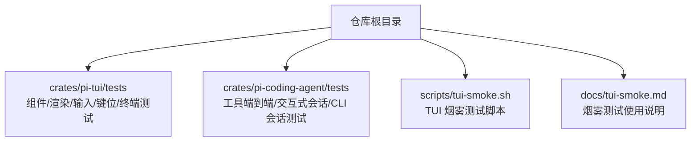
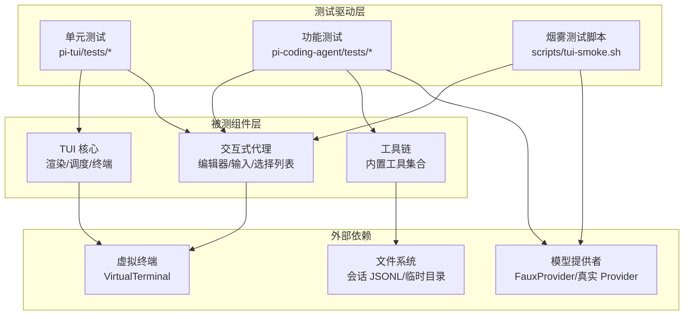
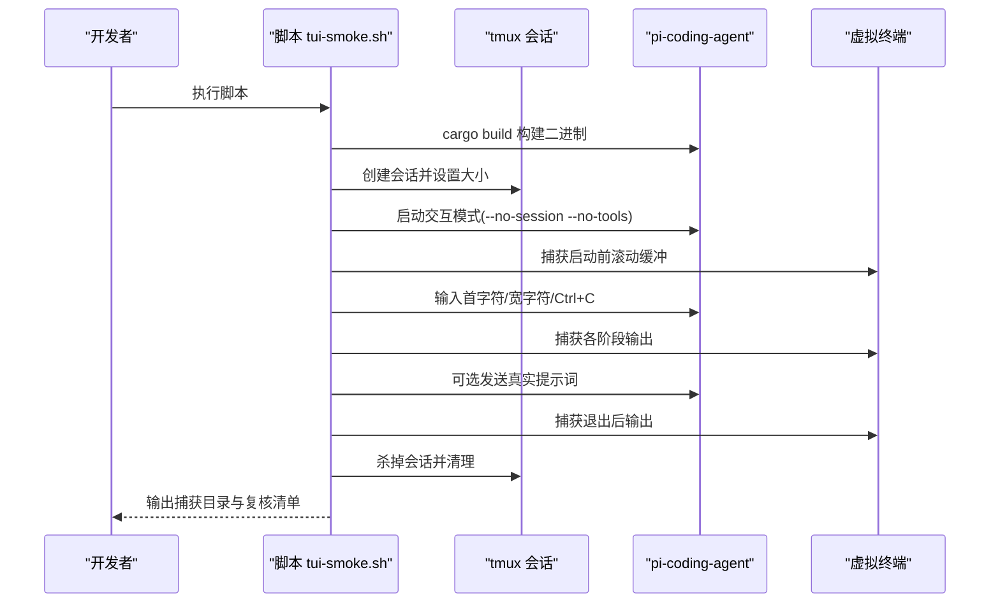
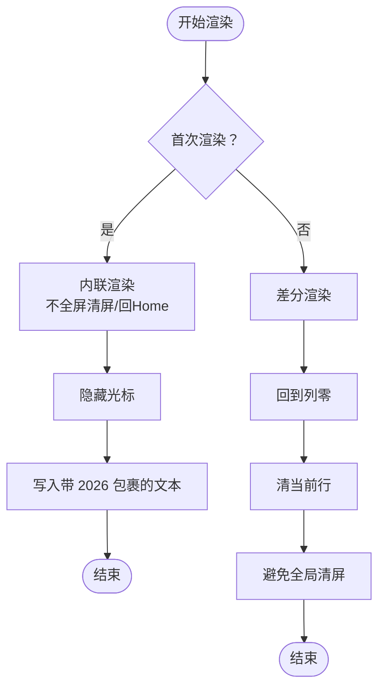
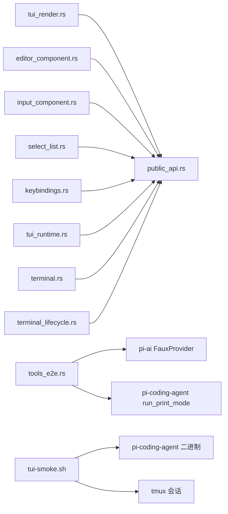

# 端到端测试

<cite>
**本文引用的文件**
- [scripts/tui-smoke.sh](file://scripts/tui-smoke.sh)
- [docs/tui-smoke.md](file://docs/tui-smoke.md)
- [crates/pi-tui/tests/components.rs](file://crates/pi-tui/tests/components.rs)
- [crates/pi-tui/tests/editor_component.rs](file://crates/pi-tui/tests/editor_component.rs)
- [crates/pi-tui/tests/input_component.rs](file://crates/pi-tui/tests/input_component.rs)
- [crates/pi-tui/tests/select_list.rs](file://crates/pi-tui/tests/select_list.rs)
- [crates/pi-tui/tests/keybindings.rs](file://crates/pi-tui/tests/keybindings.rs)
- [crates/pi-tui/tests/public_api.rs](file://crates/pi-tui/tests/public_api.rs)
- [crates/pi-tui/tests/tui_render.rs](file://crates/pi-tui/tests/tui_render.rs)
- [crates/pi-tui/tests/tui_runtime.rs](file://crates/pi-tui/tests/tui_runtime.rs)
- [crates/pi-tui/tests/terminal.rs](file://crates/pi-tui/tests/terminal.rs)
- [crates/pi-tui/tests/terminal_lifecycle.rs](file://crates/pi-tui/tests/terminal_lifecycle.rs)
- [crates/pi-coding-agent/tests/tools_e2e.rs](file://crates/pi-coding-agent/tests/tools_e2e.rs)
- [crates/pi-coding-agent/tests/interactive_sessions.rs](file://crates/pi-coding-agent/tests/interactive_sessions.rs)
- [crates/pi-coding-agent/tests/session_cli.rs](file://crates/pi-coding-agent/tests/session_cli.rs)
</cite>

## 目录
1. [引言](#引言)
2. [项目结构](#项目结构)
3. [核心组件](#核心组件)
4. [架构总览](#架构总览)
5. [详细组件分析](#详细组件分析)
6. [依赖关系分析](#依赖关系分析)
7. [性能考量](#性能考量)
8. [故障排查指南](#故障排查指南)
9. [结论](#结论)
10. [附录](#附录)

## 引言
本文件面向 Pi-Rust 项目的端到端测试体系，系统化阐述以下内容：
- TUI 烟雾测试（跨终端烟雾测试）的实现与执行机制，包括自动化脚本的工作原理、测试覆盖范围与人工复核清单。
- 功能测试套件设计与实现，覆盖编辑器、输入框、选择列表、键位绑定、渲染调度、终端生命周期等关键路径。
- 回归测试策略：如何维护测试用例以确保功能稳定性与可追溯性。
- 端到端测试环境搭建与配置：测试数据准备、清理策略与执行方式。
- 具体测试示例：展示从命令行到交互式会话的完整用户工作流。
- 测试结果分析与报告生成：如何基于捕获输出与断言进行质量评估。
- 常见问题与优化：测试环境一致性、测试数据管理、执行时间优化。

## 项目结构
Pi-Rust 的测试分布于多个子 crate 的 tests 目录中，并辅以仓库根目录下的烟雾测试脚本。TUI 子系统的测试主要集中在 crates/pi-tui/tests；交互式编码代理的功能测试集中在 crates/pi-coding-agent/tests；烟雾测试脚本位于 scripts/tui-smoke.sh，并配套文档 docs/tui-smoke.md。

图示来源
- [scripts/tui-smoke.sh:1-82](file://scripts/tui-smoke.sh#L1-L82)
- [docs/tui-smoke.md:1-54](file://docs/tui-smoke.md#L1-L54)

章节来源
- [scripts/tui-smoke.sh:1-82](file://scripts/tui-smoke.sh#L1-L82)
- [docs/tui-smoke.md:1-54](file://docs/tui-smoke.md#L1-L54)

## 核心组件
本节聚焦端到端测试所涉及的核心模块与测试覆盖面：
- TUI 渲染与终端操作：验证首次渲染、差分渲染、宽度超限错误、窗口尺寸变化、收缩清屏策略等。
- 组件行为：容器、文本、截断文本、边框盒等布局组件的渲染正确性。
- 输入与编辑：编辑器对换行、光标移动、单词跳转、剪贴板、撤销重做、自动补全、历史记录等行为的处理。
- 交互组件：输入框与选择列表在焦点、过滤、模糊匹配、渲染宽度限制等方面的行为。
- 键位绑定：默认键位与用户自定义键位冲突检测。
- 运行时与调度：组件焦点分发、输入事件路由、渲染调度器的合并与截止时间计算。
- 终端生命周期：启动/停止、标题设置、进度指示、协议状态跟踪。
- 编辑器工具链端到端：内置工具（读取、写入、编辑、bash、grep、find、ls）在打印模式与交互模式下的调用与回传。

章节来源
- [crates/pi-tui/tests/tui_render.rs:1-274](file://crates/pi-tui/tests/tui_render.rs#L1-L274)
- [crates/pi-tui/tests/components.rs:1-106](file://crates/pi-tui/tests/components.rs#L1-L106)
- [crates/pi-tui/tests/editor_component.rs:1-448](file://crates/pi-tui/tests/editor_component.rs#L1-L448)
- [crates/pi-tui/tests/input_component.rs:1-43](file://crates/pi-tui/tests/input_component.rs#L1-L43)
- [crates/pi-tui/tests/select_list.rs:1-76](file://crates/pi-tui/tests/select_list.rs#L1-L76)
- [crates/pi-tui/tests/keybindings.rs:1-41](file://crates/pi-tui/tests/keybindings.rs#L1-L41)
- [crates/pi-tui/tests/tui_runtime.rs:1-94](file://crates/pi-tui/tests/tui_runtime.rs#L1-L94)
- [crates/pi-tui/tests/terminal.rs:1-69](file://crates/pi-tui/tests/terminal.rs#L1-L69)
- [crates/pi-tui/tests/terminal_lifecycle.rs:1-31](file://crates/pi-tui/tests/terminal_lifecycle.rs#L1-L31)
- [crates/pi-coding-agent/tests/tools_e2e.rs:1-306](file://crates/pi-coding-agent/tests/tools_e2e.rs#L1-L306)
- [crates/pi-coding-agent/tests/interactive_sessions.rs:1-75](file://crates/pi-coding-agent/tests/interactive_sessions.rs#L1-L75)
- [crates/pi-coding-agent/tests/session_cli.rs:1-467](file://crates/pi-coding-agent/tests/session_cli.rs#L1-L467)

## 架构总览
下图展示了端到端测试的总体架构：测试驱动层（单元/集成/端到端）、被测组件层（TUI、交互式代理、工具集）、外部依赖（虚拟终端、模型提供者、文件系统）以及测试数据与报告。

图示来源
- [crates/pi-tui/tests/tui_render.rs:1-274](file://crates/pi-tui/tests/tui_render.rs#L1-L274)
- [crates/pi-tui/tests/editor_component.rs:1-448](file://crates/pi-tui/tests/editor_component.rs#L1-L448)
- [crates/pi-coding-agent/tests/tools_e2e.rs:1-306](file://crates/pi-coding-agent/tests/tools_e2e.rs#L1-L306)
- [scripts/tui-smoke.sh:1-82](file://scripts/tui-smoke.sh#L1-L82)

## 详细组件分析

### TUI 烟雾测试（跨终端烟雾套件）
- 目标：捕捉虚拟终端无法完全模拟的跨终端行为，通过一次性 tmux 会话运行交互式 UI 并捕获面板输出，验证滚动缓冲保留、光标稳定、窗口缩放、帮助命令、退出清理等关键点。
- 覆盖范围：启动前滚动缓冲、首字符输入、Ctrl+C 清空、宽字符（Unicode）输入、窄/宽窗口尺寸变化、/help 命令、实时 Provider 流（可选）、Ctrl+C 退出后的终端恢复。
- 执行流程：构建二进制 → 新建 tmux 会话 → 启动交互模式（禁用会话与工具）→ 捕获各阶段输出 → 可选发送一次真实提示词 → 再次捕获 → 清理会话 → 输出复核清单。
- 复核清单：逐项检查捕获文件是否满足预期（如滚动缓冲未丢失、光标不漂移、帮助命令不提交、退出后恢复 Shell 等）。

图示来源
- [scripts/tui-smoke.sh:19-63](file://scripts/tui-smoke.sh#L19-L63)
- [docs/tui-smoke.md:13-53](file://docs/tui-smoke.md#L13-L53)

章节来源
- [scripts/tui-smoke.sh:1-82](file://scripts/tui-smoke.sh#L1-L82)
- [docs/tui-smoke.md:1-54](file://docs/tui-smoke.md#L1-L54)

### TUI 渲染与终端操作测试
- 首次渲染：内联渲染不全屏清屏或回 Home，隐藏光标，使用 2026 模式包裹文本，输出包含链接序列。
- 差分渲染：返回列零再清行，避免全局清屏；根据硬件光标实际位置移动；仅变更行差分更新。
- 宽度超限：当某行超出最大宽度时，提前报错且不写入任何终端操作。
- 尺寸变化：宽度变化触发局部重绘，不进行全屏清屏；收缩时可按需清空多余行。
- 不变渲染：无变更时仍重定位硬件光标并 Flush。

图示来源
- [crates/pi-tui/tests/tui_render.rs:32-189](file://crates/pi-tui/tests/tui_render.rs#L32-L189)

章节来源
- [crates/pi-tui/tests/tui_render.rs:1-274](file://crates/pi-tui/tests/tui_render.rs#L1-L274)

### 组件渲染与布局测试
- 容器顺序渲染、文本换行与长词拆分、CJK 宽度处理、截断文本填充与裁剪、边框盒背景应用、清空子元素。
- 重点：可见宽度不超过指定宽度；长词不溢出；CJK 字符宽度计算正确。

章节来源
- [crates/pi-tui/tests/components.rs:1-106](file://crates/pi-tui/tests/components.rs#L1-L106)

### 编辑器行为测试
- 换行与提交：Shift+Enter 插入换行，Enter 提交；提交回调触发且内容清空。
- 换行宽度与行数边界：渲染时每行可见宽度不超过设定值；光标标记作为零宽参与换行。
- 光标移动：左右移动按图形素粒度；Home/Delete/End 等键位更新文本与光标。
- 单词导航与删除：安全处理多字节与表情符号；Ctrl+方向词跳转。
- 剪贴板与撤销重做：kill ring 与 yank/pop 行为；多行粘贴原子化；撤销历史随文本重置。
- 自动补全：斜杠命令建议渲染与应用；大段粘贴显示占位提示但提交时展开全文。
- 视口滚动：长输入显示上下滚动指示器。

章节来源
- [crates/pi-tui/tests/editor_component.rs:1-448](file://crates/pi-tui/tests/editor_component.rs#L1-L448)

### 输入框与选择列表测试
- 输入框：Unicode 图形素编辑、粘贴插入原始内容、焦点渲染光标标记。
- 选择列表：循环选择、过滤、模糊匹配（非连续输入）、按分数排序、渲染宽度限制。

章节来源
- [crates/pi-tui/tests/input_component.rs:1-43](file://crates/pi-tui/tests/input_component.rs#L1-L43)
- [crates/pi-tui/tests/select_list.rs:1-76](file://crates/pi-tui/tests/select_list.rs#L1-L76)

### 键位绑定测试
- 默认键位与编辑器动作匹配；用户自定义键位覆盖默认；重复键位冲突检测。

章节来源
- [crates/pi-tui/tests/keybindings.rs:1-41](file://crates/pi-tui/tests/keybindings.rs#L1-L41)

### 运行时与调度测试
- 组件焦点接收输入；渲染调度器合并请求并在间隔到期后触发；报告下次待渲染截止时间。

章节来源
- [crates/pi-tui/tests/tui_runtime.rs:1-94](file://crates/pi-tui/tests/tui_runtime.rs#L1-L94)

### 终端与生命周期测试
- 虚拟终端记录操作、游标状态、清屏次数、写入内容；支持 resize 与清空操作记录；生命周期操作（Start/Stop/SetTitle/SetProgress）。
- Kitty 协议状态跟踪与激活。

章节来源
- [crates/pi-tui/tests/terminal.rs:1-69](file://crates/pi-tui/tests/terminal.rs#L1-L69)
- [crates/pi-tui/tests/terminal_lifecycle.rs:1-31](file://crates/pi-tui/tests/terminal_lifecycle.rs#L1-L31)

### 编辑器工具链端到端测试
- 内置工具数量校验；读取工具成功循环完成；读取工具错误回传给模型并继续循环；grep 工具结果回传到模型。
- 使用伪造 Provider 注册/注销，模拟模型响应与工具调用，断言上下文消息链路与工具结果。

章节来源
- [crates/pi-coding-agent/tests/tools_e2e.rs:1-306](file://crates/pi-coding-agent/tests/tools_e2e.rs#L1-L306)

### 交互式会话测试
- 交互模式将内容追加至会话；同一会话跨多次提示保持上下文；JSONL 文件存在且包含预期内容。

章节来源
- [crates/pi-coding-agent/tests/interactive_sessions.rs:1-75](file://crates/pi-coding-agent/tests/interactive_sessions.rs#L1-L75)

### CLI 会话测试
- 继续上一会话上下文；禁用会话不写文件；指定会话路径追加；会话 ID 创建与重开；fork 创建父会话引用；命名会话写入信息；继续维持父子链；自定义会话目录写入。

章节来源
- [crates/pi-coding-agent/tests/session_cli.rs:1-467](file://crates/pi-coding-agent/tests/session_cli.rs#L1-L467)

## 依赖关系分析
- TUI 测试依赖 pi-tui 公共 API 与内部组件，覆盖渲染策略、终端操作、组件行为、键位绑定、运行时调度与终端生命周期。
- 编辑器工具链端到端测试依赖 pi-ai 提供的伪造 Provider 与事件流，以及 pi-coding-agent 的打印模式运行接口。
- 烟雾测试脚本依赖 tmux 与被测二进制，通过捕获 tmux 面板输出进行人工复核。

图示来源
- [crates/pi-tui/tests/public_api.rs:1-116](file://crates/pi-tui/tests/public_api.rs#L1-L116)
- [crates/pi-coding-agent/tests/tools_e2e.rs:1-306](file://crates/pi-coding-agent/tests/tools_e2e.rs#L1-L306)
- [scripts/tui-smoke.sh:1-82](file://scripts/tui-smoke.sh#L1-L82)

章节来源
- [crates/pi-tui/tests/public_api.rs:1-116](file://crates/pi-tui/tests/public_api.rs#L1-L116)
- [crates/pi-coding-agent/tests/tools_e2e.rs:1-306](file://crates/pi-coding-agent/tests/tools_e2e.rs#L1-L306)
- [scripts/tui-smoke.sh:1-82](file://scripts/tui-smoke.sh#L1-L82)

## 性能考量
- 渲染调度合并：RenderScheduler 在固定间隔内合并渲染请求，减少频繁刷新带来的终端压力与闪烁。
- 局部差分渲染：仅对变更行进行清行与重绘，避免全屏清屏，提高窗口尺寸变化时的性能表现。
- 宽度超限早失败：在写入前检测宽度，避免无效输出与后续重试成本。
- 终端操作最小化：隐藏光标、移动到列零、清行等操作精确控制，降低不必要的 I/O。

章节来源
- [crates/pi-tui/tests/tui_runtime.rs:56-93](file://crates/pi-tui/tests/tui_runtime.rs#L56-L93)
- [crates/pi-tui/tests/tui_render.rs:94-233](file://crates/pi-tui/tests/tui_render.rs#L94-L233)

## 故障排查指南
- 环境一致性
  - 确保已安装 tmux，否则烟雾测试脚本会直接退出。
  - 在不同终端（wezterm、kitty、iTerm2、Terminal.app、GNOME Terminal、tmux、SSH/tmux）上执行烟雾测试，对照复核清单逐项验证。
- 测试数据管理
  - 使用临时目录隔离会话与工具测试数据；测试结束后清理临时文件，避免污染。
  - 对于 CLI 会话测试，确认自定义会话目录存在且可写。
- 执行时间优化
  - 使用 RenderScheduler 合并渲染请求，避免高频刷新。
  - 控制编辑器视口大小与内容长度，减少差分渲染的行数。
- 常见问题定位
  - 渲染宽度超限：检查文本换行与可见宽度计算，确保不超过终端宽度。
  - 键位冲突：检查用户自定义键位映射，避免重复绑定。
  - 会话文件未生成：确认启用会话模式与正确的会话目录路径。

章节来源
- [scripts/tui-smoke.sh:4-7](file://scripts/tui-smoke.sh#L4-L7)
- [crates/pi-tui/tests/tui_render.rs:70-91](file://crates/pi-tui/tests/tui_render.rs#L70-L91)
- [crates/pi-tui/tests/keybindings.rs:24-40](file://crates/pi-tui/tests/keybindings.rs#L24-L40)
- [crates/pi-coding-agent/tests/session_cli.rs:424-466](file://crates/pi-coding-agent/tests/session_cli.rs#L424-L466)

## 结论
Pi-Rust 的端到端测试体系由“烟雾测试 + 组件级单元测试 + 功能测试”三层构成。烟雾测试通过 tmux 会话捕获真实终端行为，验证跨终端一致性；组件测试覆盖渲染、输入、键位、终端生命周期等关键路径；功能测试贯穿工具链与交互式会话，确保用户工作流的稳定性与正确性。结合合理的测试数据管理与性能优化策略，能够有效保障系统在多终端与复杂交互场景下的可靠性。

## 附录
- 烟雾测试复核清单（摘自文档）：滚动缓冲保留、光标稳定、窗口缩放范围控制、/help 命令行为、实时 Provider 流（可选）、退出清理与 Shell 恢复。
- TUI 公共 API 可导入性测试：验证导出符号可用性与基本行为，便于外部集成与二次开发。

章节来源
- [docs/tui-smoke.md:33-53](file://docs/tui-smoke.md#L33-L53)
- [crates/pi-tui/tests/public_api.rs:14-116](file://crates/pi-tui/tests/public_api.rs#L14-L116)