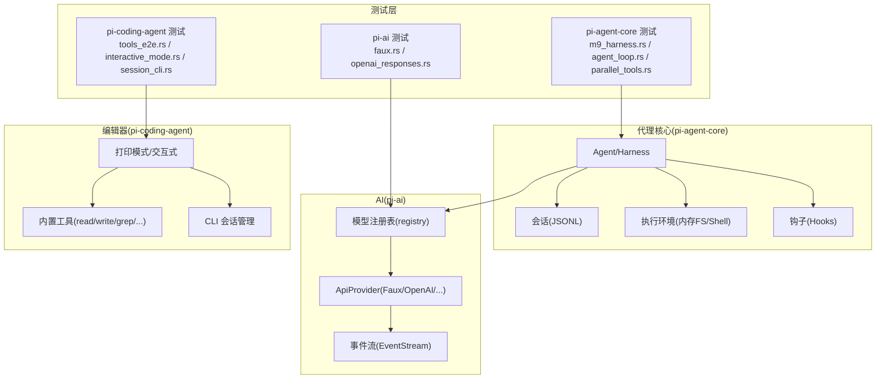
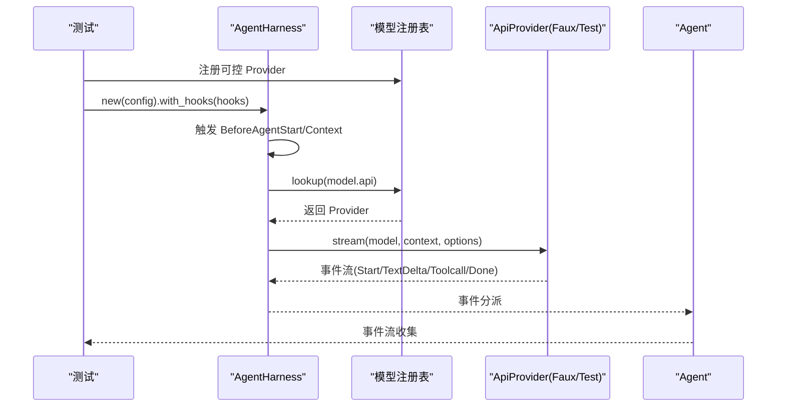
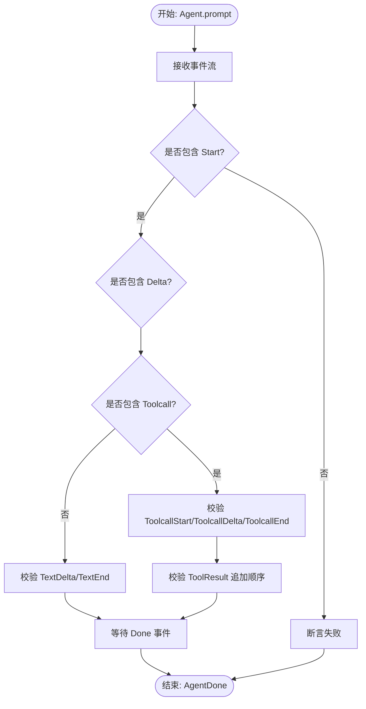
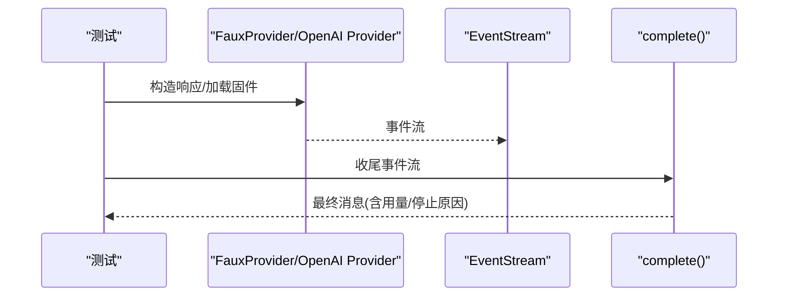
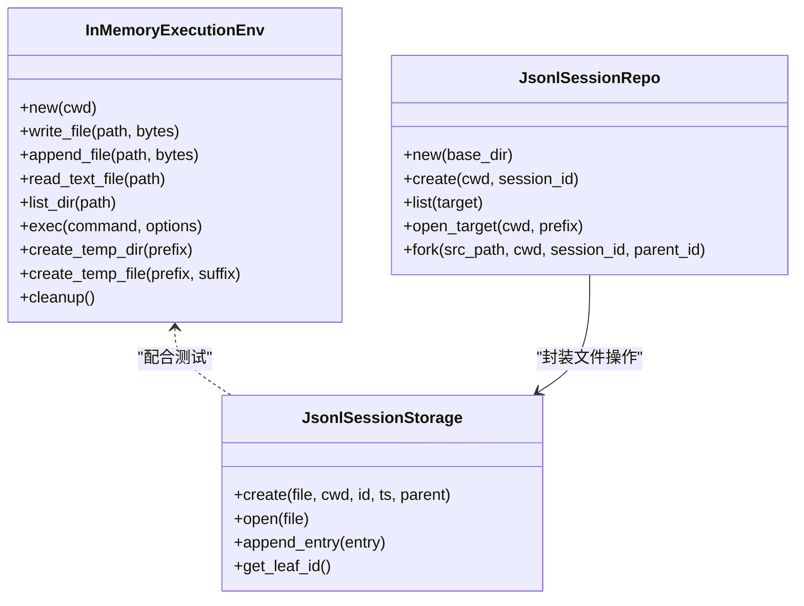
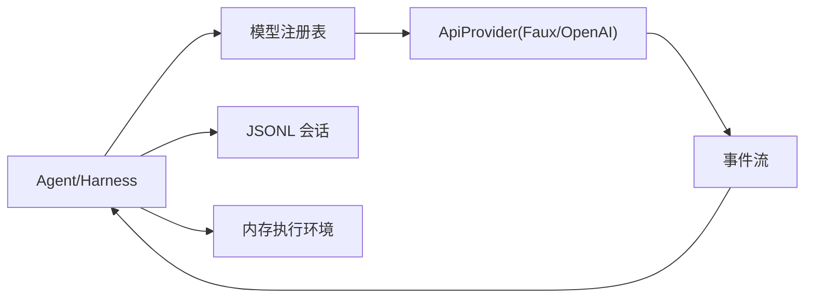

# 集成测试

<cite>
**本文引用的文件**
- [Cargo.toml](file://Cargo.toml)
- [crates/pi-agent-core/tests/common/mod.rs](file://crates/pi-agent-core/tests/common/mod.rs)
- [crates/pi-agent-core/tests/m9_harness.rs](file://crates/pi-agent-core/tests/m9_harness.rs)
- [crates/pi-agent-core/tests/agent_loop.rs](file://crates/pi-agent-core/tests/agent_loop.rs)
- [crates/pi-agent-core/tests/session_repo.rs](file://crates/pi-agent-core/tests/session_repo.rs)
- [crates/pi-agent-core/tests/session_jsonl.rs](file://crates/pi-agent-core/tests/session_jsonl.rs)
- [crates/pi-agent-core/tests/parallel_tools.rs](file://crates/pi-agent-core/tests/parallel_tools.rs)
- [crates/pi-ai/tests/faux.rs](file://crates/pi-ai/tests/faux.rs)
- [crates/pi-ai/tests/openai_responses.rs](file://crates/pi-ai/tests/openai_responses.rs)
- [crates/pi-ai/tests/fixtures/openai-responses-text-tool.sse](file://crates/pi-ai/tests/fixtures/openai-responses-text-tool.sse)
- [crates/pi-coding-agent/tests/tools_e2e.rs](file://crates/pi-coding-agent/tests/tools_e2e.rs)
- [crates/pi-coding-agent/tests/interactive_mode.rs](file://crates/pi-coding-agent/tests/interactive_mode.rs)
- [crates/pi-coding-agent/tests/session_cli.rs](file://crates/pi-coding-agent/tests/session_cli.rs)
- [crates/pi-agent-core/src/env.rs](file://crates/pi-agent-core/src/env.rs)
- [crates/pi-agent-core/src/harness.rs](file://crates/pi-agent-core/src/harness.rs)
- [crates/pi-agent-core/src/session/id.rs](file://crates/pi-agent-core/src/session/id.rs)
- [crates/pi-coding-agent/src/session.rs](file://crates/pi-coding-agent/src/session.rs)
</cite>

## 目录
1. 引言
2. 项目结构
3. 核心组件
4. 架构总览
5. 详细组件分析
6. 依赖关系分析
7. 性能考量
8. 故障排查指南
9. 结论
10. 附录

## 引言
本文件面向 Pi-Rust 项目的集成测试，系统化梳理跨 crate 的集成测试策略与实践，重点覆盖以下方面：
- 代理核心引擎与 AI 服务的集成测试方法
- 组件间交互测试（事件流、工具调用）
- 外部服务集成测试（LLM 提供商 API 的模拟与真实测试）
- 测试环境配置与管理（测试数据库、临时文件系统）
- 具体复杂场景的测试实现示例
- 常见问题与最佳实践（依赖管理、测试隔离、并发测试）

## 项目结构
Pi-Rust 采用多 crate 工作区组织，核心与测试分布如下：
- pi-agent-core：代理核心、会话存储、执行环境、钩子与编排
- pi-ai：模型注册表、提供商适配器、事件流与 SSE 解析
- pi-coding-agent：命令行与交互式运行时、内置工具、打印模式
- pi-tui：终端用户界面（用于交互式测试）
- pi-mom/pi-pods/pi-web-ui：其他子系统（在本文聚焦核心集成测试）

工作区根配置定义了成员 crate。

**章节来源**
- [Cargo.toml:1-12](file://Cargo.toml#L1-L12)

## 核心组件
- 代理核心（pi-agent-core）：提供 Agent、AgentHarness、会话存储（JSONL）、执行环境（内存文件/Shell）等能力，并通过钩子扩展请求上下文、认证与流选项。
- AI 层（pi-ai）：统一的 ApiProvider 接口与模型注册表；提供多种提供商适配器（含 FauxProvider 用于测试），以及 SSE/响应解析与事件流完成器。
- 编辑器与交互（pi-coding-agent）：打印模式、交互式 TUI、CLI 会话管理、内置工具（读写、搜索、编辑、Shell 等）。
- TUI（pi-tui）：终端渲染与输入处理，支撑交互式测试脚本。

这些组件共同构成端到端的集成测试面，从事件流到工具调用再到会话持久化，形成完整的闭环验证。

**章节来源**
- [crates/pi-agent-core/src/harness.rs:426-627](file://crates/pi-agent-core/src/harness.rs#L426-L627)
- [crates/pi-agent-core/src/env.rs:77-408](file://crates/pi-agent-core/src/env.rs#L77-L408)
- [crates/pi-ai/tests/faux.rs:1-193](file://crates/pi-ai/tests/faux.rs#L1-L193)
- [crates/pi-coding-agent/tests/tools_e2e.rs:1-306](file://crates/pi-coding-agent/tests/tools_e2e.rs#L1-L306)
- [crates/pi-coding-agent/tests/interactive_mode.rs:1-770](file://crates/pi-coding-agent/tests/interactive_mode.rs#L1-L770)

## 架构总览
下图展示了跨 crate 的集成测试架构：测试通过注册表注入可控的 ApiProvider（如 FauxProvider），驱动 Agent/Harness 执行；同时利用内存执行环境与临时目录进行文件/Shell 行为验证；会话通过 JSONL 存储进行持久化与回放。

**图表来源**
- [crates/pi-agent-core/tests/m9_harness.rs:1-559](file://crates/pi-agent-core/tests/m9_harness.rs#L1-L559)
- [crates/pi-agent-core/tests/agent_loop.rs:1-433](file://crates/pi-agent-core/tests/agent_loop.rs#L1-L433)
- [crates/pi-agent-core/tests/parallel_tools.rs:1-184](file://crates/pi-agent-core/tests/parallel_tools.rs#L1-L184)
- [crates/pi-ai/tests/faux.rs:1-193](file://crates/pi-ai/tests/faux.rs#L1-L193)
- [crates/pi-ai/tests/openai_responses.rs:1-103](file://crates/pi-ai/tests/openai_responses.rs#L1-L103)
- [crates/pi-coding-agent/tests/tools_e2e.rs:1-306](file://crates/pi-coding-agent/tests/tools_e2e.rs#L1-L306)
- [crates/pi-coding-agent/tests/interactive_mode.rs:1-770](file://crates/pi-coding-agent/tests/interactive_mode.rs#L1-L770)
- [crates/pi-coding-agent/tests/session_cli.rs:1-200](file://crates/pi-coding-agent/tests/session_cli.rs#L1-L200)

## 详细组件分析

### 代理核心与 AI 服务集成测试
- 测试策略
  - 使用 TestProvider/FauxProvider 注入可控的事件序列，覆盖文本、思维、工具调用与错误事件。
  - 通过注册表动态替换 ApiProvider，确保测试可重复且无外部依赖。
  - 利用 Harness 钩子对上下文、流选项、认证信息进行断言与补丁。
- 关键流程
  - 文本响应：验证 Start/TextDelta/TextEnd/Done 事件链路与停止原因。
  - 工具调用：验证 ToolcallStart/ToolcallDelta/ToolcallEnd 与 ToolResult 消息顺序。
  - 错误传播：Provider Error 事件应被保留并映射到 AgentError。
  - 并发工具：并行执行比串行更快，结束事件按完成顺序发出。
- 示例路径
  - 文本/工具调用/错误事件：[crates/pi-agent-core/tests/agent_loop.rs:46-384](file://crates/pi-agent-core/tests/agent_loop.rs#L46-L384)
  - Harness 钩子与请求补丁：[crates/pi-agent-core/tests/m9_harness.rs:144-316](file://crates/pi-agent-core/tests/m9_harness.rs#L144-L316)
  - 并行工具执行：[crates/pi-agent-core/tests/parallel_tools.rs:63-158](file://crates/pi-agent-core/tests/parallel_tools.rs#L63-L158)

**图表来源**
- [crates/pi-agent-core/tests/m9_harness.rs:144-316](file://crates/pi-agent-core/tests/m9_harness.rs#L144-L316)
- [crates/pi-agent-core/tests/agent_loop.rs:46-130](file://crates/pi-agent-core/tests/agent_loop.rs#L46-L130)
- [crates/pi-ai/tests/faux.rs:31-69](file://crates/pi-ai/tests/faux.rs#L31-L69)

**章节来源**
- [crates/pi-agent-core/tests/common/mod.rs:1-214](file://crates/pi-agent-core/tests/common/mod.rs#L1-L214)
- [crates/pi-agent-core/tests/m9_harness.rs:144-316](file://crates/pi-agent-core/tests/m9_harness.rs#L144-L316)
- [crates/pi-agent-core/tests/agent_loop.rs:46-384](file://crates/pi-agent-core/tests/agent_loop.rs#L46-L384)
- [crates/pi-agent-core/tests/parallel_tools.rs:63-158](file://crates/pi-agent-core/tests/parallel_tools.rs#L63-L158)
- [crates/pi-ai/tests/faux.rs:1-193](file://crates/pi-ai/tests/faux.rs#L1-L193)

### 组件间交互测试：事件流与工具调用
- 事件流验证
  - 断言事件类型与顺序：Start → TextDelta/ToolcallDelta → End/Done。
  - 断言停止原因与消息内容一致性。
- 工具调用验证
  - 工具参数增量更新与最终合并。
  - 工具结果按“助手顺序”追加，结束事件按完成顺序发出。
- 并发控制
  - 通过 ToolExecutionMode 控制并行/串行，验证性能差异与事件顺序。

**图表来源**
- [crates/pi-agent-core/tests/agent_loop.rs:132-191](file://crates/pi-agent-core/tests/agent_loop.rs#L132-L191)
- [crates/pi-agent-core/tests/parallel_tools.rs:105-158](file://crates/pi-agent-core/tests/parallel_tools.rs#L105-L158)

**章节来源**
- [crates/pi-agent-core/tests/agent_loop.rs:132-228](file://crates/pi-agent-core/tests/agent_loop.rs#L132-L228)
- [crates/pi-agent-core/tests/parallel_tools.rs:105-158](file://crates/pi-agent-core/tests/parallel_tools.rs#L105-L158)

### 外部服务集成测试：提供商 API 的模拟与真实测试
- 模拟测试（FauxProvider）
  - 简单文本、工具调用、调用队列与停止原因的断言。
  - 完成器（complete）对事件流的收尾处理。
- 真实测试（OpenAI 响应）
  - 使用 SSE 固件文件解析 OpenAI 响应，断言文本与工具调用事件、用量统计与 Done 事件。
- 示例路径
  - FauxProvider 简单文本/工具调用/完成：[crates/pi-ai/tests/faux.rs:31-135](file://crates/pi-ai/tests/faux.rs#L31-L135)
  - OpenAI 响应固件解析与断言：[crates/pi-ai/tests/openai_responses.rs:34-102](file://crates/pi-ai/tests/openai_responses.rs#L34-L102)
  - 固件数据：[crates/pi-ai/tests/fixtures/openai-responses-text-tool.sse:1-28](file://crates/pi-ai/tests/fixtures/openai-responses-text-tool.sse#L1-L28)

**图表来源**
- [crates/pi-ai/tests/faux.rs:115-135](file://crates/pi-ai/tests/faux.rs#L115-L135)
- [crates/pi-ai/tests/openai_responses.rs:84-102](file://crates/pi-ai/tests/openai_responses.rs#L84-L102)

**章节来源**
- [crates/pi-ai/tests/faux.rs:31-135](file://crates/pi-ai/tests/faux.rs#L31-L135)
- [crates/pi-ai/tests/openai_responses.rs:34-102](file://crates/pi-ai/tests/openai_responses.rs#L34-L102)
- [crates/pi-ai/tests/fixtures/openai-responses-text-tool.sse:1-28](file://crates/pi-ai/tests/fixtures/openai-responses-text-tool.sse#L1-L28)

### 集成测试环境配置与管理
- 临时文件系统
  - 使用 InMemoryExecutionEnv 在内存中模拟文件系统与 Shell 命令，支持写入、追加、读取、列出与执行。
  - 支持创建临时目录/文件，自动清理。
- 会话持久化
  - JSONL 会话存储：创建/打开、追加条目、校验头与叶子节点。
  - 会话仓库：按目标目录与前缀创建、列出、打开、分叉。
- 环境变量与会话目录
  - 通过环境变量配置会话根目录，确保测试隔离与可复现性。

**图表来源**
- [crates/pi-agent-core/src/env.rs:101-408](file://crates/pi-agent-core/src/env.rs#L101-L408)
- [crates/pi-agent-core/tests/session_jsonl.rs:19-77](file://crates/pi-agent-core/tests/session_jsonl.rs#L19-L77)
- [crates/pi-agent-core/tests/session_repo.rs:27-60](file://crates/pi-agent-core/tests/session_repo.rs#L27-L60)
- [crates/pi-coding-agent/src/session.rs:185-203](file://crates/pi-coding-agent/src/session.rs#L185-L203)

**章节来源**
- [crates/pi-agent-core/src/env.rs:101-408](file://crates/pi-agent-core/src/env.rs#L101-L408)
- [crates/pi-agent-core/tests/session_jsonl.rs:19-77](file://crates/pi-agent-core/tests/session_jsonl.rs#L19-L77)
- [crates/pi-agent-core/tests/session_repo.rs:27-60](file://crates/pi-agent-core/tests/session_repo.rs#L27-L60)
- [crates/pi-coding-agent/src/session.rs:185-203](file://crates/pi-coding-agent/src/session.rs#L185-L203)

### 具体集成测试示例
- 内置工具端到端测试（打印模式）
  - 使用 RecordingProvider 记录上下文与调用次数，断言工具调用与结果回传。
  - 验证错误场景（文件不存在）与 grep 结果格式。
  - 示例路径：[crates/pi-coding-agent/tests/tools_e2e.rs:173-305](file://crates/pi-coding-agent/tests/tools_e2e.rs#L173-L305)
- 交互式 TUI 测试
  - 使用脚本驱动输入，断言渲染、光标位置、会话克隆、模型切换、设置菜单等行为。
  - 示例路径：[crates/pi-coding-agent/tests/interactive_mode.rs:32-770](file://crates/pi-coding-agent/tests/interactive_mode.rs#L32-L770)
- CLI 会话管理
  - 继续上次会话、禁用会话、指定会话 ID/文件路径、命名会话等。
  - 示例路径：[crates/pi-coding-agent/tests/session_cli.rs:52-200](file://crates/pi-coding-agent/tests/session_cli.rs#L52-L200)

**章节来源**
- [crates/pi-coding-agent/tests/tools_e2e.rs:173-305](file://crates/pi-coding-agent/tests/tools_e2e.rs#L173-L305)
- [crates/pi-coding-agent/tests/interactive_mode.rs:32-770](file://crates/pi-coding-agent/tests/interactive_mode.rs#L32-L770)
- [crates/pi-coding-agent/tests/session_cli.rs:52-200](file://crates/pi-coding-agent/tests/session_cli.rs#L52-L200)

## 依赖关系分析
- 组件耦合
  - Agent/Harness 依赖注册表查找 Provider；Provider 实现统一事件流接口。
  - 会话存储与执行环境解耦于 Provider，便于测试隔离。
- 外部依赖
  - SSE 固件文件用于 OpenAI 响应解析测试。
  - 临时目录与环境变量用于会话持久化与配置隔离。
- 循环依赖
  - 测试层通过注册表注入 Provider，避免直接循环依赖。

**图表来源**
- [crates/pi-agent-core/src/harness.rs:426-627](file://crates/pi-agent-core/src/harness.rs#L426-L627)
- [crates/pi-ai/tests/openai_responses.rs:34-102](file://crates/pi-ai/tests/openai_responses.rs#L34-L102)
- [crates/pi-agent-core/src/env.rs:101-408](file://crates/pi-agent-core/src/env.rs#L101-L408)

**章节来源**
- [crates/pi-agent-core/src/harness.rs:426-627](file://crates/pi-agent-core/src/harness.rs#L426-L627)
- [crates/pi-ai/tests/openai_responses.rs:34-102](file://crates/pi-ai/tests/openai_responses.rs#L34-L102)

## 性能考量
- 并行工具执行显著降低总耗时，结束事件按完成顺序发出，保证结果一致性。
- 事件流批处理与渲染合并减少终端重绘压力。
- 建议在测试中使用短延迟与小批量数据，避免 CI 超时。

**章节来源**
- [crates/pi-agent-core/tests/parallel_tools.rs:63-158](file://crates/pi-agent-core/tests/parallel_tools.rs#L63-L158)
- [crates/pi-coding-agent/tests/interactive_mode.rs:156-174](file://crates/pi-coding-agent/tests/interactive_mode.rs#L156-L174)

## 故障排查指南
- Provider 注册与注销
  - 每个测试后需注销 Provider，避免影响后续测试。
  - 示例：[crates/pi-agent-core/tests/m9_harness.rs:75](file://crates/pi-agent-core/tests/m9_harness.rs#L75)、[crates/pi-ai/tests/faux.rs:68](file://crates/pi-ai/tests/faux.rs#L68)
- 会话文件未生成
  - 确认会话模式启用、会话目录存在且可写。
  - 示例：[crates/pi-coding-agent/tests/session_cli.rs:87-119](file://crates/pi-coding-agent/tests/session_cli.rs#L87-L119)
- 事件顺序异常
  - 检查工具执行模式（并行/串行）与更新回调时机。
  - 示例：[crates/pi-agent-core/tests/agent_loop.rs:132-191](file://crates/pi-agent-core/tests/agent_loop.rs#L132-L191)
- 临时文件清理
  - 使用 InMemoryExecutionEnv 自动清理，或在测试结束后手动删除临时目录。
  - 示例：[crates/pi-agent-core/src/env.rs:401-408](file://crates/pi-agent-core/src/env.rs#L401-L408)

**章节来源**
- [crates/pi-agent-core/tests/m9_harness.rs:75](file://crates/pi-agent-core/tests/m9_harness.rs#L75)
- [crates/pi-ai/tests/faux.rs:68](file://crates/pi-ai/tests/faux.rs#L68)
- [crates/pi-coding-agent/tests/session_cli.rs:87-119](file://crates/pi-coding-agent/tests/session_cli.rs#L87-L119)
- [crates/pi-agent-core/tests/agent_loop.rs:132-191](file://crates/pi-agent-core/tests/agent_loop.rs#L132-L191)
- [crates/pi-agent-core/src/env.rs:401-408](file://crates/pi-agent-core/src/env.rs#L401-L408)

## 结论
本文系统梳理了 Pi-Rust 的跨 crate 集成测试策略，围绕代理核心与 AI 服务的交互、事件流与工具调用、提供商 API 的模拟与真实测试、以及测试环境的配置与管理进行了深入分析。通过注册表注入可控 Provider、内存执行环境与 JSONL 会话持久化，结合并发工具与 TUI/CLI 场景，形成了覆盖全面、可维护的集成测试体系。

## 附录
- 会话标识与时间戳生成
  - 会话 ID 采用 UUID v7，时间戳遵循 RFC3339，条目 ID 生成策略避免冲突。
  - 示例路径：[crates/pi-agent-core/src/session/id.rs:6-53](file://crates/pi-agent-core/src/session/id.rs#L6-L53)

**章节来源**
- [crates/pi-agent-core/src/session/id.rs:6-53](file://crates/pi-agent-core/src/session/id.rs#L6-L53)