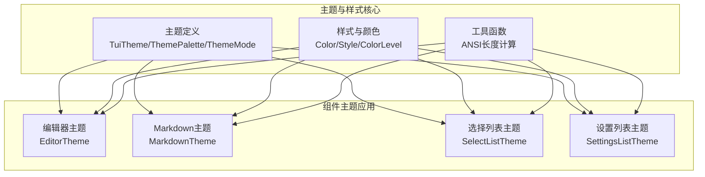
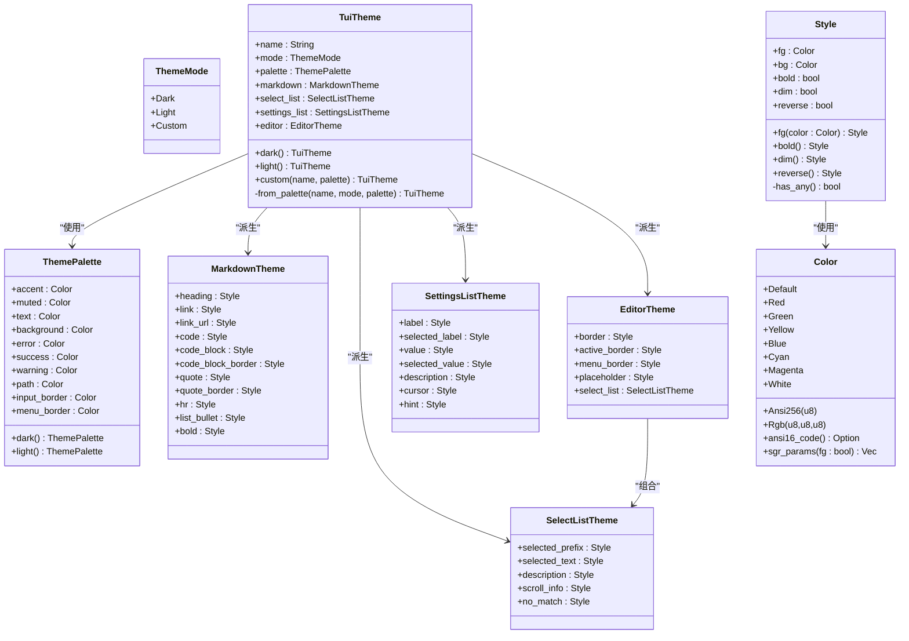
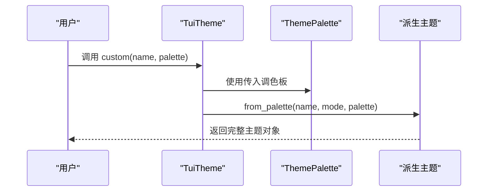
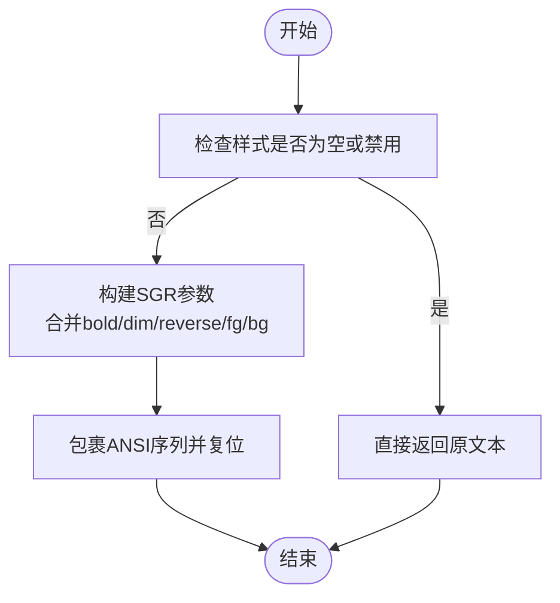
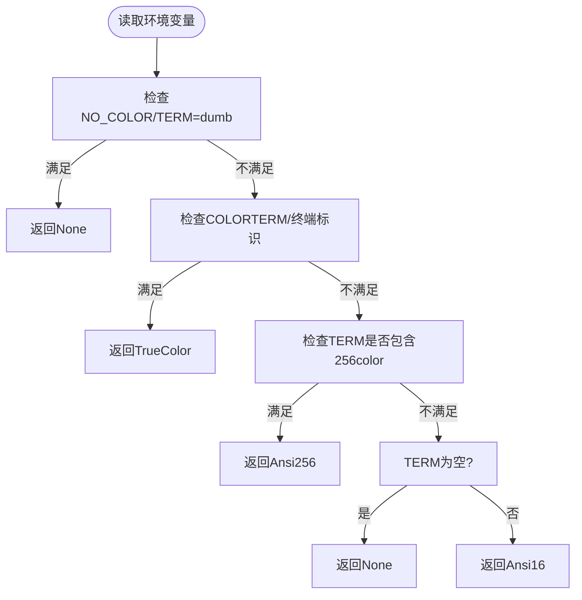
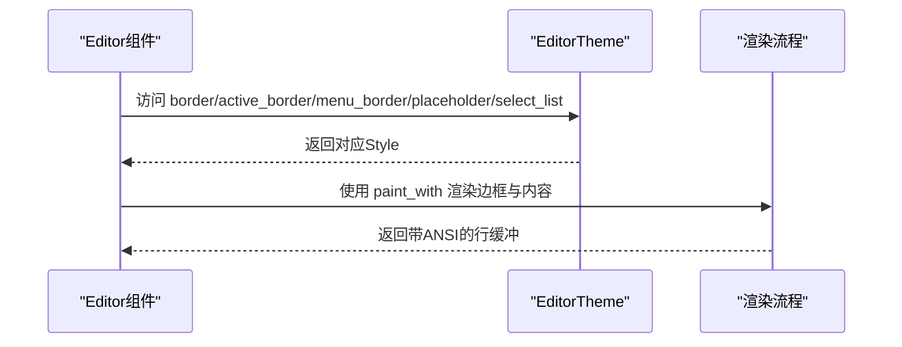
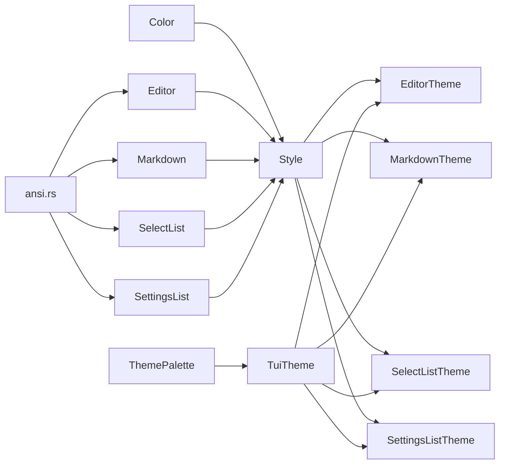

# 主题与样式系统

<cite>
**本文档引用的文件**
- [theme.rs](file://crates/pi-tui/src/theme.rs)
- [style.rs](file://crates/pi-tui/src/style.rs)
- [editor.rs](file://crates/pi-tui/src/components/editor.rs)
- [markdown.rs](file://crates/pi-tui/src/components/markdown.rs)
- [select_list.rs](file://crates/pi-tui/src/components/select_list.rs)
- [settings_list.rs](file://crates/pi-tui/src/components/settings_list.rs)
- [lib.rs](file://crates/pi-tui/src/lib.rs)
- [ansi.rs](file://crates/pi-tui/src/utils/ansi.rs)
- [theme.rs（测试）](file://crates/pi-tui/tests/theme.rs)
- [style.rs（测试）](file://crates/pi-tui/tests/style.rs)
- [public_api.rs（测试）](file://crates/pi-tui/tests/public_api.rs)
</cite>

## 目录
1. [简介](#简介)
2. [项目结构](#项目结构)
3. [核心组件](#核心组件)
4. [架构概览](#架构概览)
5. [详细组件分析](#详细组件分析)
6. [依赖关系分析](#依赖关系分析)
7. [性能考虑](#性能考虑)
8. [故障排除指南](#故障排除指南)
9. [结论](#结论)
10. [附录](#附录)

## 简介
本文件全面解析 pi-tui crate 的主题与样式系统，涵盖主题定义、调色板管理、明暗模式切换、样式数据结构、ANSI 转义序列处理、颜色级别检测与降级策略，以及编辑器、Markdown、选择列表、设置列表等主题应用场景。同时提供自定义主题开发指南与终端兼容性处理建议。

## 项目结构
主题与样式系统主要位于 pi-tui crate 的以下模块：
- 主题与调色板：theme.rs
- 样式与颜色：style.rs
- 组件主题应用：各组件模块（editor、markdown、select_list、settings_list）
- 工具函数：utils/ansi.rs
- 公共导出：lib.rs
- 测试验证：tests 下的 theme.rs、style.rs、public_api.rs

**图表来源**
- [theme.rs:1-237](file://crates/pi-tui/src/theme.rs#L1-L237)
- [style.rs:1-234](file://crates/pi-tui/src/style.rs#L1-L234)
- [editor.rs:1-800](file://crates/pi-tui/src/components/editor.rs#L1-L800)
- [markdown.rs:1-528](file://crates/pi-tui/src/components/markdown.rs#L1-L528)
- [select_list.rs:1-235](file://crates/pi-tui/src/components/select_list.rs#L1-L235)
- [settings_list.rs:1-444](file://crates/pi-tui/src/components/settings_list.rs#L1-L444)
- [ansi.rs:1-41](file://crates/pi-tui/src/utils/ansi.rs#L1-L41)

**章节来源**
- [lib.rs:1-61](file://crates/pi-tui/src/lib.rs#L1-L61)

## 核心组件
本节深入解析主题与样式系统的核心数据结构与行为。

- 主题模式（ThemeMode）
  - 支持 Dark、Light、Custom 三种模式，用于驱动调色板与派生主题。
- 调色板（ThemePalette）
  - 定义品牌色、柔和色、文本色、背景色、错误/成功/警告色、路径色、输入边框色、菜单边框色等关键色彩。
  - 提供 dark() 与 light() 预设，并通过 from_palette 派生各组件主题。
- 主题（TuiTheme）
  - 包含名称、模式、调色板、Markdown、选择列表、设置列表、编辑器主题。
  - 提供 dark()、light()、custom() 构造器，内部通过 from_palette 将调色板映射到各子主题。
- 样式（Style）
  - 字段：前景色（fg）、背景色（bg）、粗体（bold）、弱化（dim）、反显（reverse）。
  - 提供 fg() 构造器与 bold/dim/reverse 方法。
- 颜色（Color）
  - 支持 Default、ANSI 16 色、ANSI 256 色、RGB 三通道真彩。
  - 提供 ANSI 参数生成逻辑，用于构建 SGR 序列。
- 颜色级别（ColorLevel）
  - None、Ansi16、Ansi256、TrueColor 四个等级，决定样式渲染能力。
- 颜色检测（detect_color_level_from_env）
  - 基于环境变量与终端标识判断颜色支持能力，缓存结果避免重复计算。

**章节来源**
- [theme.rs:1-237](file://crates/pi-tui/src/theme.rs#L1-L237)
- [style.rs:1-234](file://crates/pi-tui/src/style.rs#L1-L234)

## 架构概览
主题系统采用“调色板驱动”的设计：由 ThemePalette 决定基础色彩，TuiTheme 从调色板派生各组件主题；组件在渲染时根据当前主题对文本进行 ANSI 转义包装，最终输出带格式的字符串。

**图表来源**
- [theme.rs:1-237](file://crates/pi-tui/src/theme.rs#L1-L237)
- [style.rs:1-234](file://crates/pi-tui/src/style.rs#L1-L234)

## 详细组件分析

### 主题系统设计与派生机制
- 调色板预设：dark() 与 light() 返回固定配色，确保明暗两种基础体验。
- 自定义主题：custom(name, palette) 接受任意 ThemePalette，通过 from_palette 将调色板映射到各组件主题字段。
- 组件主题映射规则：
  - 选择列表：选中前缀与文本使用 accent，描述与滚动信息使用 muted。
  - Markdown：标题、链接、引用、代码块等使用 palette 对应色或基于 text/muted 的组合。
  - 设置列表：标签、值、描述、光标、提示等使用 palette 的 text/muted/accent。
  - 编辑器：边框、活动边框、菜单边框、占位符分别使用 muted/input_border/menu_border/text 等。

**图表来源**
- [theme.rs:176-227](file://crates/pi-tui/src/theme.rs#L176-L227)

**章节来源**
- [theme.rs:156-227](file://crates/pi-tui/src/theme.rs#L156-L227)

### 样式系统与 ANSI 转义序列
- 颜色编码：
  - ANSI 16 色：通过 ANSI 代码映射生成 SGR 参数。
  - ANSI 256 色：使用 "38;5;index" 或 "48;5;index"。
  - RGB 真彩：使用 "38;2;r;g;b" 或 "48;2;r;g;b"。
- 样式叠加：
  - 合并粗体（1）、弱化（2）、反显（7）与前景/背景颜色参数，形成单一 SGR 序列。
- 输出格式：将转义序列包裹文本后追加复位序列，保证后续文本不受影响。

**图表来源**
- [style.rs:113-148](file://crates/pi-tui/src/style.rs#L113-L148)

**章节来源**
- [style.rs:1-234](file://crates/pi-tui/src/style.rs#L1-L234)

### 颜色级别检测与兼容性
- 环境变量优先级：
  - NO_COLOR 或 TERM=dumb：强制禁用颜色。
  - COLORTERM=truecolor 或终端标识（如 kitty、ghostty、wezterm、iterm、Windows Terminal）：启用真彩。
  - TERM 包含 "256color"：启用 ANSI 256 色。
  - TERM 为空：None；否则：Ansi16。
- 结果缓存：使用 OnceLock 缓存检测结果，避免重复解析。

**图表来源**
- [style.rs:160-224](file://crates/pi-tui/src/style.rs#L160-L224)

**章节来源**
- [style.rs:150-224](file://crates/pi-tui/src/style.rs#L150-L224)

### 编辑器主题（EditorTheme）
- 边框与活动边框：使用 muted 与 input_border 色，突出焦点状态。
- 菜单边框：使用 menu_border 色。
- 占位符：使用 muted 色弱化显示。
- 选择列表嵌套：复用 SelectListTheme，保持一致的选中态与描述风格。

**图表来源**
- [editor.rs:1-800](file://crates/pi-tui/src/components/editor.rs#L1-L800)
- [theme.rs:135-154](file://crates/pi-tui/src/theme.rs#L135-L154)

**章节来源**
- [editor.rs:1-800](file://crates/pi-tui/src/components/editor.rs#L1-L800)
- [theme.rs:135-154](file://crates/pi-tui/src/theme.rs#L135-L154)

### Markdown 主题（MarkdownTheme）
- 标题：使用 accent 色并加粗。
- 链接与链接地址：使用 accent 与 muted 色，区分可点击与展示形态。
- 代码与代码块：使用 warning 与 muted 色，强调语法高亮与弱化显示。
- 引用与分隔线：使用 muted 色弱化。
- 行内粗体：使用 text 色并加粗。

渲染流程要点：
- 解析 Markdown 事件流，按块类型（标题、段落、列表、引用、代码块、分割线）组织内容。
- 对内联元素（代码、粗体、链接）应用相应 Style。
- 处理超链接：可选启用终端超链接协议，或以附加样式显示 URL。

**章节来源**
- [markdown.rs:1-528](file://crates/pi-tui/src/components/markdown.rs#L1-L528)
- [theme.rs:56-87](file://crates/pi-tui/src/theme.rs#L56-L87)

### 选择列表主题（SelectListTheme）
- 选中项前缀与文本：使用 accent 色并加粗，突出当前选择。
- 描述与滚动信息：使用 muted 色并弱化。
- 无匹配项：使用 muted 色弱化提示。

渲染流程要点：
- 使用模糊过滤生成可见项索引，逐行渲染。
- 选中行使用 selected_prefix 与 selected_text 的 Style。
- 描述文本单独应用 description 的 Style。

**章节来源**
- [select_list.rs:1-235](file://crates/pi-tui/src/components/select_list.rs#L1-L235)
- [theme.rs:89-108](file://crates/pi-tui/src/theme.rs#L89-L108)

### 设置列表主题（SettingsListTheme）
- 标签与选中标签：使用 text 与 accent 色，选中时加粗。
- 值与选中值：使用 muted 与 accent 色，选中时加粗。
- 描述、光标、提示：使用 muted 色，弱化显示。

渲染流程要点：
- 可选启用搜索：根据输入动态过滤。
- 支持子菜单工厂：为特定设置项打开子菜单进行多值选择。
- 选中项激活时更新值并触发回调。

**章节来源**
- [settings_list.rs:1-444](file://crates/pi-tui/src/components/settings_list.rs#L1-L444)
- [theme.rs:110-133](file://crates/pi-tui/src/theme.rs#L110-L133)

## 依赖关系分析
- 主题依赖：
  - TuiTheme 依赖 ThemePalette 与 Style。
  - 各组件主题（EditorTheme、MarkdownTheme、SelectListTheme、SettingsListTheme）依赖 Style 与 Color。
- 组件依赖：
  - Editor、Markdown、SelectList、SettingsList 在渲染时使用 paint_with 与 color_enabled 控制 ANSI 输出。
  - ANSI 长度计算工具用于正确测量可视宽度，避免误判导致的截断问题。
- 公共导出：
  - lib.rs 将 Color、Style、TuiTheme、主题构造函数等统一导出，便于外部使用。

**图表来源**
- [theme.rs:1-237](file://crates/pi-tui/src/theme.rs#L1-L237)
- [style.rs:1-234](file://crates/pi-tui/src/style.rs#L1-L234)
- [editor.rs:1-800](file://crates/pi-tui/src/components/editor.rs#L1-L800)
- [markdown.rs:1-528](file://crates/pi-tui/src/components/markdown.rs#L1-L528)
- [select_list.rs:1-235](file://crates/pi-tui/src/components/select_list.rs#L1-L235)
- [settings_list.rs:1-444](file://crates/pi-tui/src/components/settings_list.rs#L1-L444)
- [ansi.rs:1-41](file://crates/pi-tui/src/utils/ansi.rs#L1-L41)

**章节来源**
- [lib.rs:1-61](file://crates/pi-tui/src/lib.rs#L1-L61)

## 性能考虑
- 颜色级别检测缓存：使用 OnceLock 缓存 color_level 结果，避免重复解析环境变量。
- 样式渲染最小化：当 ColorLevel 为 None 或 Style 未设置任何属性时，直接返回原文本，减少字符串拼接与内存分配。
- 文本宽度计算：ANSI 序列长度计算用于正确测量可视宽度，避免因转义字符导致的截断错误。
- 组件渲染优化：选择列表与设置列表仅渲染可见区域，结合最大可见数控制内存占用。

[本节为通用性能讨论，无需具体文件分析]

## 故障排除指南
- 样式未生效
  - 检查 color_enabled 是否为 true，确认终端支持颜色且未被 NO_COLOR 或 TERM=dumb 禁用。
  - 使用 paint_with_level 手动指定 ColorLevel 进行调试。
- 颜色显示异常
  - 确认终端是否支持 ANSI 256 色或真彩。若仅支持 ANSI 16 色，部分 RGB/256 色会被降级。
  - 使用 detect_color_level_from_env 检测当前环境下的颜色级别。
- 文本截断错位
  - 使用 ansi_sequence_len 正确计算 ANSI 序列长度，配合 visible_width 与 truncate_to_width 实现准确截断。
- 主题不一致
  - 确保在组件初始化时注入了正确的主题对象（如 Markdown::with_theme、SelectList::with_theme）。
  - 自定义主题时，注意调色板字段的完整性与语义一致性。

**章节来源**
- [style.rs（测试）:1-119](file://crates/pi-tui/tests/style.rs#L1-L119)
- [theme.rs（测试）:1-97](file://crates/pi-tui/tests/theme.rs#L1-L97)
- [public_api.rs（测试）:1-116](file://crates/pi-tui/tests/public_api.rs#L1-L116)
- [ansi.rs:1-41](file://crates/pi-tui/src/utils/ansi.rs#L1-L41)

## 结论
本主题与样式系统通过“调色板驱动”的方式实现了高度一致的视觉语言，结合颜色级别检测与 ANSI 转义序列处理，能够在不同终端环境下提供稳定、可定制的渲染效果。组件主题（编辑器、Markdown、选择列表、设置列表）均以 Style 为核心，确保在不同模式下（明/暗/自定义）具备良好的可读性与交互反馈。

## 附录

### 自定义主题开发指南
- 设计调色板
  - 明确 accent、muted、text、background、error/success/warning、path、input_border、menu_border 等关键色。
  - 参考 dark() 与 light() 的配色思路，确保对比度与可读性。
- 构建主题
  - 使用 TuiTheme::custom(name, palette) 创建自定义主题。
  - 如需微调组件主题，可直接覆盖 MarkdownTheme、SelectListTheme、SettingsListTheme、EditorTheme 的个别字段。
- 验证与测试
  - 使用测试用例验证主题在不同模式下的表现，确保关键样式（如选中文本、链接、引用）符合预期。
  - 在目标终端运行 public_api 测试，确认颜色级别检测与渲染行为正常。

**章节来源**
- [theme.rs:176-227](file://crates/pi-tui/src/theme.rs#L176-L227)
- [theme.rs（测试）:22-45](file://crates/pi-tui/tests/theme.rs#L22-L45)

### 颜色兼容性处理方法
- 强制降级：当 ColorLevel 为 None 时，所有样式输出将回退为纯文本。
- 自适应降级：根据 detect_color_level_from_env 的结果，自动选择 ANSI 16/256/真彩渲染路径。
- 终端识别：通过 TERM、COLORTERM、TERM_PROGRAM、TERMINAL_EMULATOR 等环境变量与终端标识判断能力。
- 回退策略：优先保证可读性与一致性，必要时使用 muted/text 色替代 accent 色。

**章节来源**
- [style.rs:150-224](file://crates/pi-tui/src/style.rs#L150-L224)
- [style.rs（测试）:92-118](file://crates/pi-tui/tests/style.rs#L92-L118)
- [public_api.rs（测试）:67-95](file://crates/pi-tui/tests/public_api.rs#L67-L95)