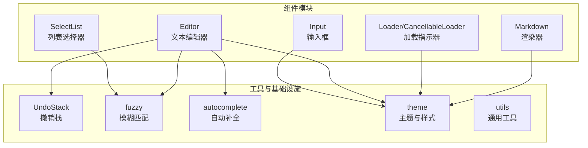
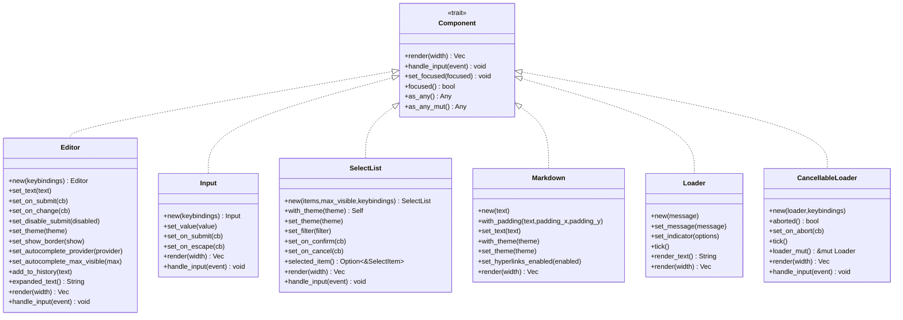
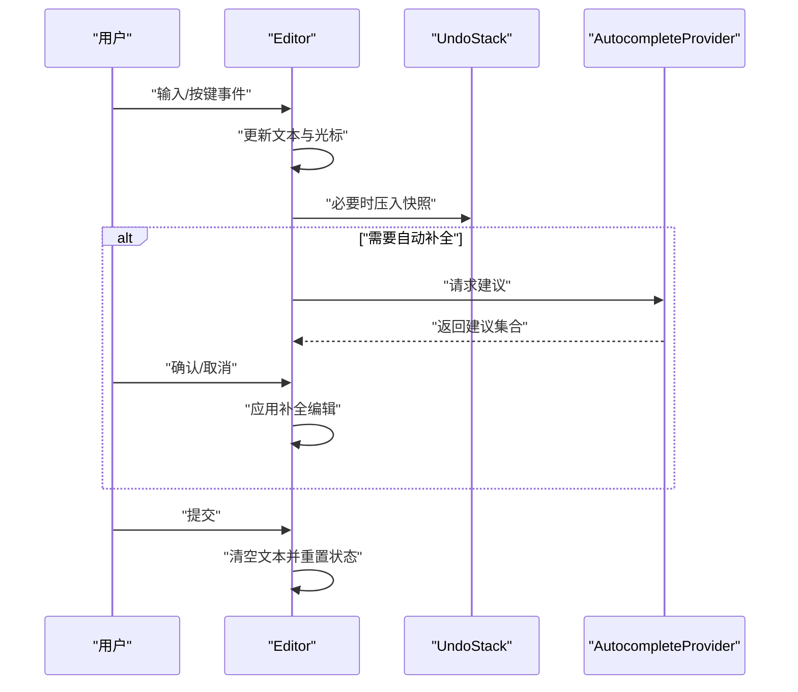
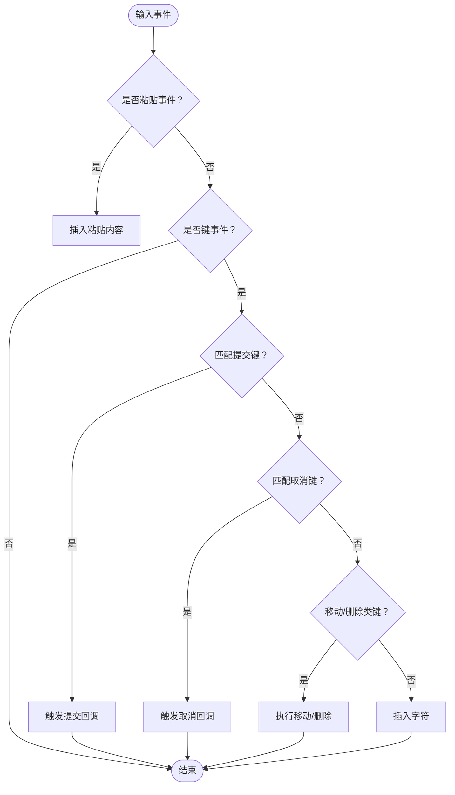
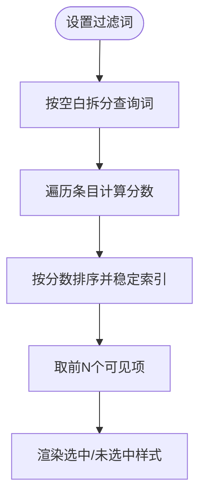
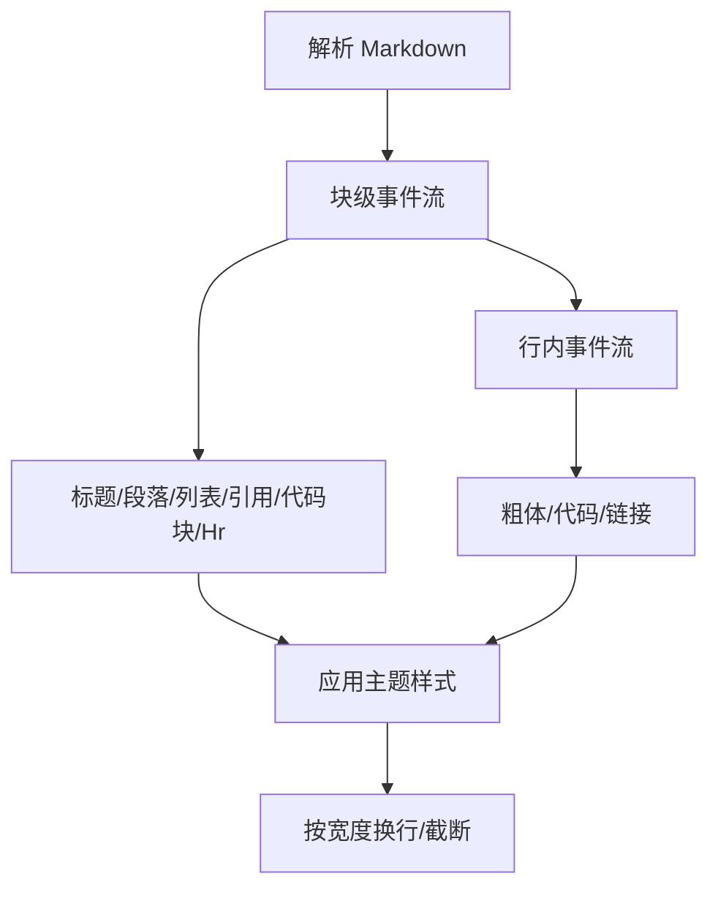
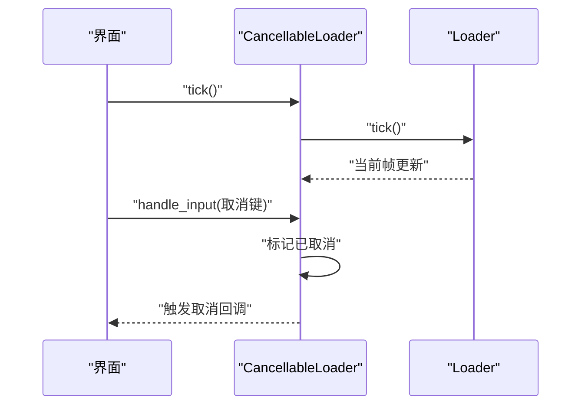
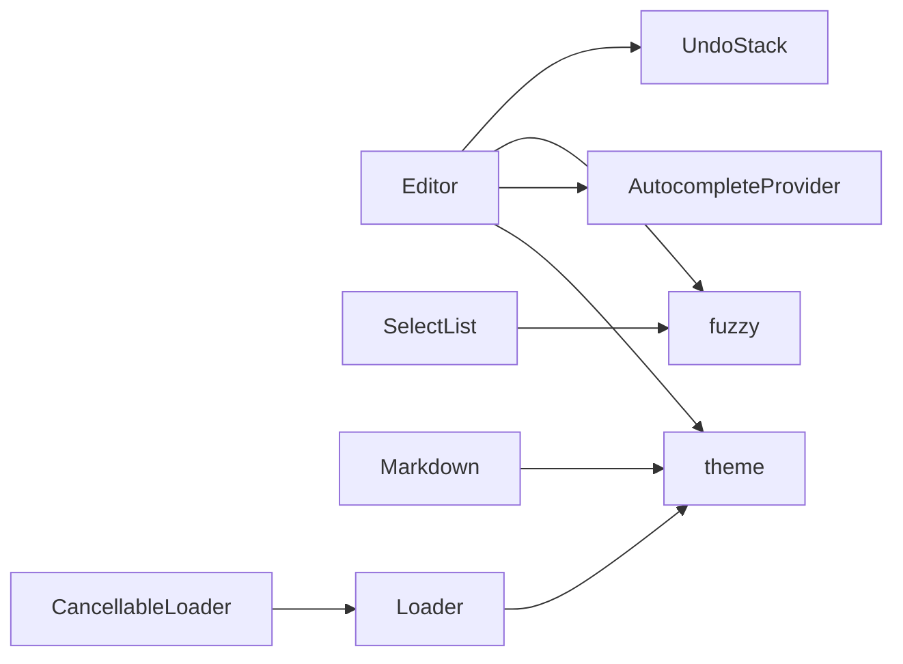

# 可复用组件库

<cite>
**本文引用的文件**
- [editor.rs](file://crates/pi-tui/src/components/editor.rs)
- [input.rs](file://crates/pi-tui/src/components/input.rs)
- [select_list.rs](file://crates/pi-tui/src/components/select_list.rs)
- [markdown.rs](file://crates/pi-tui/src/components/markdown.rs)
- [loader.rs](file://crates/pi-tui/src/components/loader.rs)
- [lib.rs](file://crates/pi-tui/src/lib.rs)
- [mod.rs](file://crates/pi-tui/src/components/mod.rs)
- [theme.rs](file://crates/pi-tui/src/theme.rs)
- [undo_stack.rs](file://crates/pi-tui/src/undo_stack.rs)
- [fuzzy.rs](file://crates/pi-tui/src/fuzzy.rs)
- [autocomplete.rs](file://crates/pi-tui/src/autocomplete.rs)
- [editor_component.rs](file://crates/pi-tui/tests/editor_component.rs)
- [input_component.rs](file://crates/pi-tui/tests/input_component.rs)
- [select_list.rs](file://crates/pi-tui/tests/select_list.rs)
</cite>

## 目录
1. [简介](#简介)
2. [项目结构](#项目结构)
3. [核心组件](#核心组件)
4. [架构总览](#架构总览)
5. [详细组件分析](#详细组件分析)
6. [依赖关系分析](#依赖关系分析)
7. [性能考量](#性能考量)
8. [故障排查指南](#故障排查指南)
9. [结论](#结论)
10. [附录](#附录)

## 简介
本文件为可复用组件库的技术文档，聚焦以下组件：Editor 文本编辑器（光标管理、撤销重做、历史记录、剪贴板与撤销栈、自动补全）、Input 输入框（验证与事件处理）、SelectList 列表选择器（模糊匹配、键盘导航、选项渲染）、Markdown 渲染器（语法解析、样式应用、链接处理）、Loader 加载指示器（动画帧与可取消）。文档从设计与实现角度深入剖析各组件的属性配置、事件回调、主题与样式支持，并给出组合使用与性能优化建议。

## 项目结构
组件库位于 TUI 子工程中，采用按功能模块划分的组织方式，核心组件均实现统一的组件接口以保证一致的生命周期与渲染行为。

图示来源
- [mod.rs:1-26](file://crates/pi-tui/src/components/mod.rs#L1-L26)
- [lib.rs:20-61](file://crates/pi-tui/src/lib.rs#L20-L61)

章节来源
- [mod.rs:1-26](file://crates/pi-tui/src/components/mod.rs#L1-L26)
- [lib.rs:20-61](file://crates/pi-tui/src/lib.rs#L20-L61)

## 核心组件
- Editor：多行文本编辑，支持图形单元安全的光标移动、单词跳转、行内删除、剪贴板（KillRing）与撤销重做、历史记录、跳转模式、自动补全、换行与滚动。
- Input：单行输入，支持图形单元安全的前后移动、退格、前进删除、粘贴、提交与取消事件。
- SelectList：基于模糊匹配的列表选择，支持过滤、键盘上下翻页、确认与取消回调。
- Markdown：基于 pulldown_cmark 的渲染管线，支持标题、段落、列表、块引用、代码块、粗体、删除线、表格、行内代码与链接，以及可选超链接。
- Loader：简单帧动画加载指示器，支持消息与可取消版本。

章节来源
- [editor.rs:48-115](file://crates/pi-tui/src/components/editor.rs#L48-L115)
- [input.rs:7-26](file://crates/pi-tui/src/components/input.rs#L7-L26)
- [select_list.rs:28-59](file://crates/pi-tui/src/components/select_list.rs#L28-L59)
- [markdown.rs:9-52](file://crates/pi-tui/src/components/markdown.rs#L9-L52)
- [loader.rs:12-38](file://crates/pi-tui/src/components/loader.rs#L12-L38)

## 架构总览
组件遵循统一的生命周期接口，渲染时根据宽度进行换行与截断，输入事件通过键绑定管理器分发到具体组件。主题系统提供统一的样式与配色方案。

图示来源
- [lib.rs:24-29](file://crates/pi-tui/src/lib.rs#L24-L29)
- [editor.rs:772-772](file://crates/pi-tui/src/components/editor.rs#L772-L772)
- [input.rs:76-164](file://crates/pi-tui/src/components/input.rs#L76-L164)
- [select_list.rs:111-219](file://crates/pi-tui/src/components/select_list.rs#L111-L219)
- [markdown.rs:54-89](file://crates/pi-tui/src/components/markdown.rs#L54-L89)
- [loader.rs:58-142](file://crates/pi-tui/src/components/loader.rs#L58-L142)

## 详细组件分析

### Editor 文本编辑器
- 光标管理
  - 图形单元安全的左右移动、单词跳转、行首/行尾移动、上下在视觉列对齐移动。
  - 支持“跳转到字符”模式，通过键绑定触发后等待用户输入目标字符，再定位到该位置。
- 撤销重做与历史
  - 使用撤销栈保存快照，支持撤销与重做；插入、删除、剪切等操作会按语义合并快照。
  - 支持提交历史记录，上下方向键浏览历史，空输入或重复项会被跳过。
- 剪贴板与撤销栈
  - KillRing 支持累积删除内容，Yank/YankPop 实现循环替换。
  - 大段粘贴会以占位符形式暂存，提交时展开真实内容。
- 自动补全
  - 通过 AutocompleteProvider 获取建议，支持斜杠命令、环境变量、路径等场景。
  - 支持强制触发与显式 Tab 触发，自动补全项按模糊匹配分数排序。
- 渲染与滚动
  - 根据可视宽度进行换行，保持光标在可视窗口内，顶部/底部显示滚动提示。
  - 支持边框与主题定制。

图示来源
- [editor.rs:201-247](file://crates/pi-tui/src/components/editor.rs#L201-L247)
- [editor.rs:363-377](file://crates/pi-tui/src/components/editor.rs#L363-L377)
- [editor.rs:622-675](file://crates/pi-tui/src/components/editor.rs#L622-L675)
- [autocomplete.rs:127-168](file://crates/pi-tui/src/autocomplete.rs#L127-L168)

章节来源
- [editor.rs:48-115](file://crates/pi-tui/src/components/editor.rs#L48-L115)
- [editor.rs:201-247](file://crates/pi-tui/src/components/editor.rs#L201-L247)
- [editor.rs:363-377](file://crates/pi-tui/src/components/editor.rs#L363-L377)
- [editor.rs:581-620](file://crates/pi-tui/src/components/editor.rs#L581-L620)
- [editor.rs:622-709](file://crates/pi-tui/src/components/editor.rs#L622-L709)
- [editor.rs:772-800](file://crates/pi-tui/src/components/editor.rs#L772-L800)
- [undo_stack.rs:7-33](file://crates/pi-tui/src/undo_stack.rs#L7-L33)
- [autocomplete.rs:75-101](file://crates/pi-tui/src/autocomplete.rs#L75-L101)
- [autocomplete.rs:127-168](file://crates/pi-tui/src/autocomplete.rs#L127-L168)

### Input 输入组件
- 功能要点
  - 单行文本输入，支持图形单元安全的前后移动、退格、前进删除、粘贴。
  - 键绑定支持提交与取消（Escape），焦点态下渲染光标标记。
- 事件处理
  - 将键事件映射到对应操作，忽略修饰键组合的非期望输入。

图示来源
- [input.rs:85-147](file://crates/pi-tui/src/components/input.rs#L85-L147)

章节来源
- [input.rs:16-74](file://crates/pi-tui/src/components/input.rs#L16-L74)
- [input.rs:85-147](file://crates/pi-tui/src/components/input.rs#L85-L147)

### SelectList 列表选择器
- 模糊匹配与排序
  - 基于查询词分词进行模糊匹配，按分数排序，支持大小写与分隔符边界处理。
- 键盘导航
  - 上/下/分页移动选择，确认与取消回调；支持空格作为过滤输入。
- 渲染
  - 限制最大可见条数，选中项带前缀与强调样式，描述信息可选展示。

图示来源
- [fuzzy.rs:31-66](file://crates/pi-tui/src/fuzzy.rs#L31-L66)
- [select_list.rs:94-99](file://crates/pi-tui/src/components/select_list.rs#L94-L99)
- [select_list.rs:112-152](file://crates/pi-tui/src/components/select_list.rs#L112-L152)

章节来源
- [select_list.rs:28-99](file://crates/pi-tui/src/components/select_list.rs#L28-L99)
- [select_list.rs:111-219](file://crates/pi-tui/src/components/select_list.rs#L111-L219)
- [fuzzy.rs:7-176](file://crates/pi-tui/src/fuzzy.rs#L7-L176)

### Markdown 渲染器
- 解析与块级处理
  - 使用 pulldown_cmark 解析，支持标题、段落、列表、块引用、代码块、水平线等。
- 行内样式
  - 行内粗体、代码、链接，链接可直接超链接或附加 URL 后缀。
- 换行与截断
  - 按内容宽度换行，保留代码块原格式不参与普通换行规则；支持内边距与主题样式。

图示来源
- [markdown.rs:91-295](file://crates/pi-tui/src/components/markdown.rs#L91-L295)
- [markdown.rs:375-459](file://crates/pi-tui/src/components/markdown.rs#L375-L459)

章节来源
- [markdown.rs:9-52](file://crates/pi-tui/src/components/markdown.rs#L9-L52)
- [markdown.rs:54-89](file://crates/pi-tui/src/components/markdown.rs#L54-L89)
- [markdown.rs:91-295](file://crates/pi-tui/src/components/markdown.rs#L91-L295)
- [markdown.rs:375-459](file://crates/pi-tui/src/components/markdown.rs#L375-L459)

### Loader 加载指示器
- 帧动画
  - 默认一组旋转帧，支持自定义帧序列；每帧推进一次。
- 可取消版本
  - 绑定取消键，触发后进入已取消状态并回调。

图示来源
- [loader.rs:39-55](file://crates/pi-tui/src/components/loader.rs#L39-L55)
- [loader.rs:100-117](file://crates/pi-tui/src/components/loader.rs#L100-L117)
- [loader.rs:124-133](file://crates/pi-tui/src/components/loader.rs#L124-L133)

章节来源
- [loader.rs:12-38](file://crates/pi-tui/src/components/loader.rs#L12-L38)
- [loader.rs:58-73](file://crates/pi-tui/src/components/loader.rs#L58-L73)
- [loader.rs:75-117](file://crates/pi-tui/src/components/loader.rs#L75-L117)
- [loader.rs:119-142](file://crates/pi-tui/src/components/loader.rs#L119-L142)

## 依赖关系分析
- 组件间耦合
  - Editor 依赖 UndoStack、KillRing、AutocompleteProvider、fuzzy、theme；SelectList 依赖 fuzzy；Markdown 依赖 theme；Loader 依赖 theme。
- 外部依赖
  - pulldown_cmark 用于 Markdown 解析；unicode_segmentation 保障图形单元安全；ANSI 工具函数用于颜色与宽度计算。

图示来源
- [editor.rs:1-13](file://crates/pi-tui/src/components/editor.rs#L1-L13)
- [select_list.rs:1-4](file://crates/pi-tui/src/components/select_list.rs#L1-L4)
- [markdown.rs:1-7](file://crates/pi-tui/src/components/markdown.rs#L1-L7)
- [loader.rs:1-3](file://crates/pi-tui/src/components/loader.rs#L1-L3)

章节来源
- [editor.rs:1-13](file://crates/pi-tui/src/components/editor.rs#L1-L13)
- [select_list.rs:1-4](file://crates/pi-tui/src/components/select_list.rs#L1-L4)
- [markdown.rs:1-7](file://crates/pi-tui/src/components/markdown.rs#L1-L7)
- [loader.rs:1-3](file://crates/pi-tui/src/components/loader.rs#L1-L3)

## 性能考量
- 字符安全与宽度计算
  - 所有光标移动与删除均使用图形单元边界函数，避免错误切分复合字符；渲染前先截断后换行，减少不必要的重排。
- 模糊匹配
  - 查询词拆分为独立 token，逐条目计算分数并排序，结果缓存索引；建议控制最大可见条数与查询复杂度。
- 撤销栈
  - 固定容量的撤销栈，避免内存无限增长；仅在语义变化时压栈，减少冗余快照。
- 大段粘贴
  - 超过阈值的粘贴以占位符存储，提交时再展开，降低渲染压力。
- 主题与颜色
  - 颜色启用检测与级别判定，避免在无色终端上进行昂贵的颜色计算。

章节来源
- [editor.rs:469-512](file://crates/pi-tui/src/components/editor.rs#L469-L512)
- [fuzzy.rs:31-66](file://crates/pi-tui/src/fuzzy.rs#L31-L66)
- [undo_stack.rs:7-33](file://crates/pi-tui/src/undo_stack.rs#L7-L33)
- [theme.rs:57-87](file://crates/pi-tui/src/theme.rs#L57-L87)

## 故障排查指南
- 提交无效
  - 若禁用了提交，Enter 不会触发回调；检查禁用标志与键绑定。
- 光标跳变异常
  - 确认输入包含复合字符时使用图形单元边界函数；测试用例覆盖了多字节与 emoji 场景。
- 自动补全不生效
  - 检查是否设置了提供者、触发条件与前缀提取；斜杠命令需在空格前触发。
- 列表过滤不正确
  - 确认过滤字符串为空时的行为与大小写敏感策略；检查模糊匹配分数排序。
- Markdown 链接显示问题
  - 超链接开关决定是否输出终端可点击链接；否则会附加 URL 后缀便于复制。

章节来源
- [editor_component.rs:294-334](file://crates/pi-tui/tests/editor_component.rs#L294-L334)
- [editor_component.rs:355-381](file://crates/pi-tui/tests/editor_component.rs#L355-L381)
- [editor_component.rs:430-448](file://crates/pi-tui/tests/editor_component.rs#L430-L448)
- [input_component.rs:10-43](file://crates/pi-tui/tests/input_component.rs#L10-L43)
- [select_list.rs:46-76](file://crates/pi-tui/tests/select_list.rs#L46-L76)

## 结论
该组件库围绕统一的组件接口与主题体系构建，提供了从基础输入到富文本编辑、列表选择与内容渲染的完整能力。通过图形单元安全、语义化撤销、模糊匹配与可扩展的主题系统，既保证了跨平台一致性，也为复杂交互场景提供了良好支撑。建议在实际使用中结合业务需求合理配置主题与可见数量，并注意大文本与频繁输入场景下的性能优化。

## 附录
- 属性与回调清单（概览）
  - Editor：文本、光标、主题、边框、撤销栈、历史、自动补全提供者、提交/变更回调、滚动回调、禁用提交。
  - Input：值、主题、提交/取消回调、焦点状态。
  - SelectList：条目、过滤词、最大可见数、主题、确认/取消回调。
  - Markdown：文本、内边距、主题、超链接开关。
  - Loader：消息、帧序列、可取消回调。
- 最佳实践
  - 组合使用：在对话式界面中，将 Input 与 Editor 结合，配合 Markdown 展示反馈；SelectList 用于命令与文件选择；Loader 用于长任务提示。
  - 主题一致性：统一使用主题对象，确保不同组件风格一致。
  - 性能优化：限制最大可见条数、控制撤销栈深度、避免高频重绘；对大文本采用占位符粘贴与延迟展开。