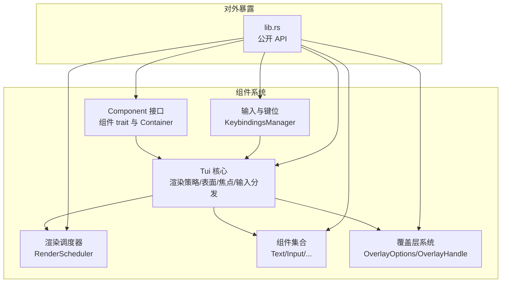
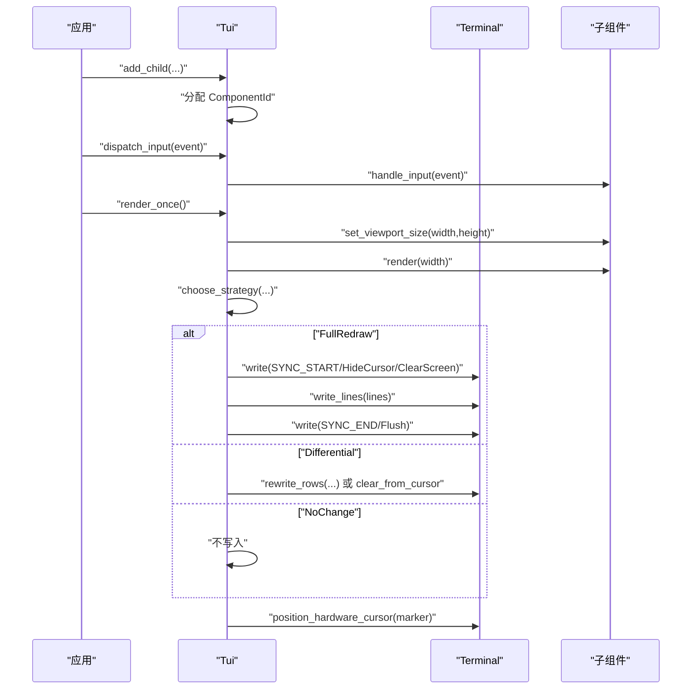
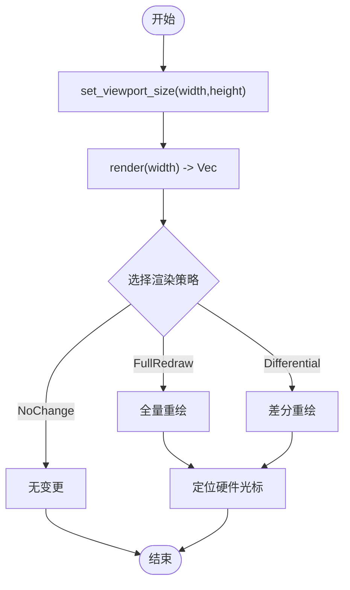
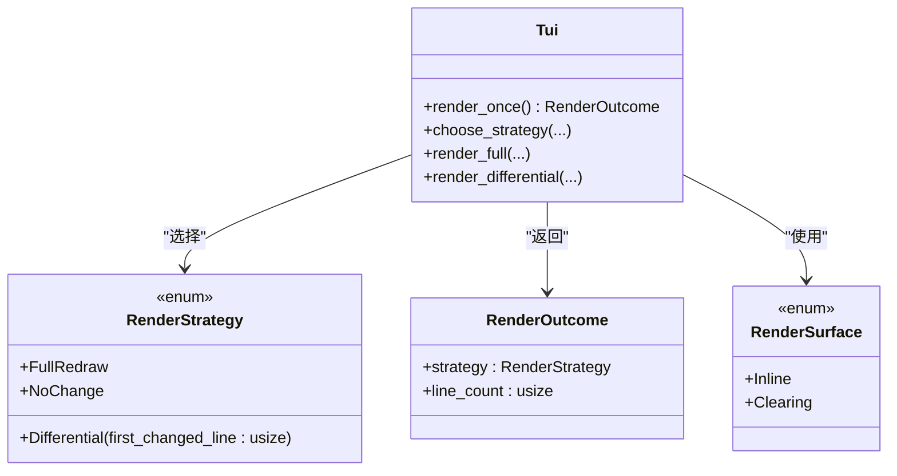
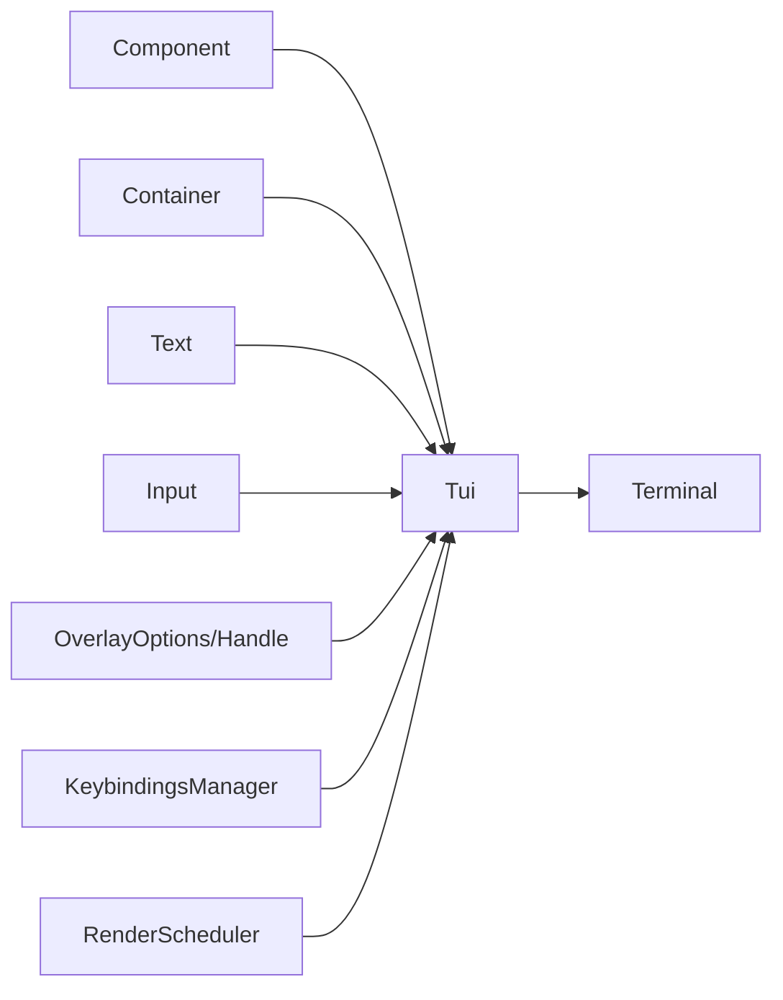
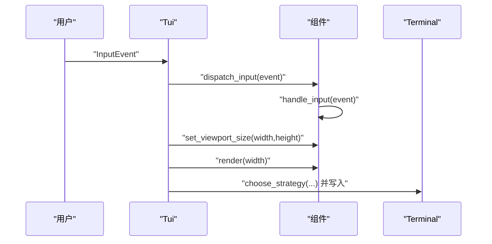

# 组件系统架构

<cite>
**本文引用的文件**
- [component.rs](file://crates/pi-tui/src/component.rs)
- [tui.rs](file://crates/pi-tui/src/tui.rs)
- [runtime.rs](file://crates/pi-tui/src/runtime.rs)
- [lib.rs](file://crates/pi-tui/src/lib.rs)
- [text.rs](file://crates/pi-tui/src/components/text.rs)
- [input.rs](file://crates/pi-tui/src/components/input.rs)
- [overlay.rs](file://crates/pi-tui/src/overlay.rs)
- [keybindings.rs](file://crates/pi-tui/src/input/keybindings.rs)
- [tui_render.rs](file://crates/pi-tui/tests/tui_render.rs)
- [overlay.rs（测试）](file://crates/pi-tui/tests/overlay.rs)
- [2026-06-04-pi-tui-rust-poc.md](file://docs/superpowers/plans/2026-06-04-pi-tui-rust-poc.md)
</cite>

## 目录
1. [引言](#引言)
2. [项目结构](#项目结构)
3. [核心组件](#核心组件)
4. [架构总览](#架构总览)
5. [详细组件分析](#详细组件分析)
6. [依赖关系分析](#依赖关系分析)
7. [性能考量](#性能考量)
8. [故障排查指南](#故障排查指南)
9. [结论](#结论)
10. [附录](#附录)

## 引言
本文件面向组件系统架构，围绕 TUI 组件模型进行系统化技术说明。重点涵盖：
- 组件接口设计：Component trait 的职责边界与默认行为
- 唯一标识机制：ComponentId 的分配与使用
- 容器管理：Container 对子组件的组合与渲染
- 生命周期管理：初始化、输入分发、渲染与焦点控制
- 渲染策略：RenderStrategy 的三种模式与 RenderOutcome 的结果封装
- 渲染表面：Inline 与 Clearing 两种输出模式
- 最佳实践与性能优化：减少全量重绘、差分更新与最小化终端操作
- 组件间通信与事件传递：焦点切换、输入路由、覆盖层交互

## 项目结构
pi-tui crate 提供了完整的 TUI 组件系统，核心模块如下：
- 组件接口与容器：component.rs
- 核心调度与渲染：tui.rs
- 渲染调度器：runtime.rs
- 组件集合：components 子模块
- 覆盖层系统：overlay.rs
- 输入与键位绑定：input/keybindings.rs
- 公开 API 汇总：lib.rs
- 行为验证与回归测试：tests 下的渲染与覆盖层测试

图表来源
- [lib.rs:1-61](file://crates/pi-tui/src/lib.rs#L1-L61)
- [component.rs:1-59](file://crates/pi-tui/src/component.rs#L1-L59)
- [tui.rs:52-72](file://crates/pi-tui/src/tui.rs#L52-L72)
- [runtime.rs:1-59](file://crates/pi-tui/src/runtime.rs#L1-L59)
- [overlay.rs:1-98](file://crates/pi-tui/src/overlay.rs#L1-L98)
- [keybindings.rs:21-63](file://crates/pi-tui/src/input/keybindings.rs#L21-L63)

章节来源
- [lib.rs:1-61](file://crates/pi-tui/src/lib.rs#L1-L61)

## 核心组件
本节聚焦组件接口、唯一标识与容器管理。

- Component trait
  - 渲染：render(width) 返回按行字符串列表
  - 视口尺寸：set_viewport_size(width,height) 用于按终端宽度换行
  - 输入处理：handle_input(event) 由 Tui 将事件路由到当前焦点组件
  - 焦点管理：wants_key_release/focused/set_focused 控制按键释放行为与焦点状态
  - 类型转换：as_any/as_any_mut 支持类型安全的 downcast
  - 无效化：invalidate 作为缓存失效钩子
- Container
  - 组合多个子组件，依次渲染并拼接行
  - 通过 add_child 添加子组件
- ComponentId
  - 使用 usize 作为组件唯一 ID，Tui 在添加子组件时自增分配

章节来源
- [component.rs:1-59](file://crates/pi-tui/src/component.rs#L1-L59)
- [tui.rs:113-138](file://crates/pi-tui/src/tui.rs#L113-L138)

## 架构总览
Tui 作为顶层协调者，负责：
- 组件树管理：维护 children 与 overlays，分配 ComponentId
- 输入路由：根据焦点将 InputEvent 分发给目标组件
- 渲染编排：计算视口尺寸、调用各组件 render、合成覆盖层
- 渲染策略选择：基于上次渲染结果与终端尺寸变化决定 FullRedraw/Differential/NoChange
- 渲染表面：Inline/Clearing 两种写入模式
- 光标定位：根据游标标记移动硬件光标

图表来源
- [tui.rs:287-320](file://crates/pi-tui/src/tui.rs#L287-L320)
- [tui.rs:395-408](file://crates/pi-tui/src/tui.rs#L395-L408)
- [tui.rs:410-456](file://crates/pi-tui/src/tui.rs#L410-L456)
- [tui.rs:458-531](file://crates/pi-tui/src/tui.rs#L458-L531)

章节来源
- [tui.rs:52-72](file://crates/pi-tui/src/tui.rs#L52-L72)
- [tui.rs:287-320](file://crates/pi-tui/src/tui.rs#L287-L320)

## 详细组件分析

### 组件接口与生命周期
- 初始化
  - 组件在被添加到 Tui 后，首次渲染前会收到 set_viewport_size(width,height)
- 更新
  - 每次渲染前，Tui 会调用 render(width)，返回按行字符串
  - 输入事件通过 dispatch_input 路由到当前焦点组件
- 渲染
  - Tui 根据策略执行 FullRedraw 或 Differential，并最终定位硬件光标
- 销毁
  - 通过 remove_child 移除组件；Overlay 通过 hide_overlay 或 set_overlay_hidden 控制可见性

图表来源
- [tui.rs:322-330](file://crates/pi-tui/src/tui.rs#L322-L330)
- [tui.rs:395-408](file://crates/pi-tui/src/tui.rs#L395-L408)
- [tui.rs:574-598](file://crates/pi-tui/src/tui.rs#L574-L598)

章节来源
- [component.rs:3-29](file://crates/pi-tui/src/component.rs#L3-L29)
- [tui.rs:202-235](file://crates/pi-tui/src/tui.rs#L202-L235)

### 渲染策略与结果
- RenderStrategy
  - FullRedraw：首次渲染或终端尺寸变化、收缩且开启清空时触发
  - Differential：从首处变更行开始的增量更新
  - NoChange：内容未变
- RenderOutcome
  - 记录所选策略与本次行数
- RenderSurface
  - Inline：在现有输出上增量写入
  - Clearing：先清屏再全量写入

图表来源
- [tui.rs:14-31](file://crates/pi-tui/src/tui.rs#L14-L31)
- [tui.rs:21-25](file://crates/pi-tui/src/tui.rs#L21-L25)
- [tui.rs:283-285](file://crates/pi-tui/src/tui.rs#L283-L285)
- [tui.rs:395-408](file://crates/pi-tui/src/tui.rs#L395-L408)

章节来源
- [tui.rs:14-31](file://crates/pi-tui/src/tui.rs#L14-L31)
- [tui.rs:21-25](file://crates/pi-tui/src/tui.rs#L21-L25)
- [tui.rs:283-285](file://crates/pi-tui/src/tui.rs#L283-L285)
- [tui.rs:395-408](file://crates/pi-tui/src/tui.rs#L395-L408)

### Container 容器管理
- Container 实现 Component，遍历子组件依次渲染并拼接行
- 适合组合布局与复合组件

章节来源
- [component.rs:31-59](file://crates/pi-tui/src/component.rs#L31-L59)

### 文本组件 Text
- 将长文本按终端宽度折行，支持末尾换行符保留空行
- 实现 as_any/as_any_mut 以支持类型安全访问

章节来源
- [text.rs:17-43](file://crates/pi-tui/src/components/text.rs#L17-L43)

### 输入组件 Input
- 维护值与光标位置，渲染时插入游标标记
- 处理粘贴、删除、左右移动、行首/行尾等编辑操作
- 通过 KeybindingsManager 匹配预定义键位，支持提交与退出回调

章节来源
- [input.rs:76-164](file://crates/pi-tui/src/components/input.rs#L76-L164)
- [keybindings.rs:31-63](file://crates/pi-tui/src/input/keybindings.rs#L31-L63)

### 覆盖层系统 Overlay
- OverlayOptions 定义锚点、宽高、边距、偏移、最大高度等
- OverlayHandle 提供隐藏/显示/聚焦/取消聚焦等操作
- Tui 在合成基线行后，将覆盖层按选项拼接到指定区域

章节来源
- [overlay.rs:36-65](file://crates/pi-tui/src/overlay.rs#L36-L65)
- [overlay.rs:67-97](file://crates/pi-tui/src/overlay.rs#L67-L97)
- [tui.rs:354-393](file://crates/pi-tui/src/tui.rs#L354-L393)

### 渲染调度器 RenderScheduler
- 控制渲染请求与最小间隔，避免过度刷新
- 支持强制渲染与时间窗口判断

章节来源
- [runtime.rs:1-59](file://crates/pi-tui/src/runtime.rs#L1-L59)

## 依赖关系分析
- 组件接口依赖
  - Component 依赖 input::InputEvent 与 utils 的宽度计算工具
  - Container 依赖 Component trait
- Tui 依赖
  - Terminal 抽象、OverlayEntry、KeybindingsManager
  - 渲染策略函数：first_changed_line、fit_to_width、splice_by_columns 等
- 测试依赖
  - tui_render.rs 与 overlay.rs 测试覆盖渲染策略与覆盖层行为

图表来源
- [component.rs:1-59](file://crates/pi-tui/src/component.rs#L1-L59)
- [tui.rs:52-72](file://crates/pi-tui/src/tui.rs#L52-L72)
- [overlay.rs:1-98](file://crates/pi-tui/src/overlay.rs#L1-L98)
- [keybindings.rs:21-63](file://crates/pi-tui/src/input/keybindings.rs#L21-L63)
- [runtime.rs:1-59](file://crates/pi-tui/src/runtime.rs#L1-L59)

章节来源
- [lib.rs:20-61](file://crates/pi-tui/src/lib.rs#L20-L61)

## 性能考量
- 减少全量重绘
  - 利用 Differential 模式从首处变更行开始更新
  - 避免不必要的宽度变化与收缩导致的 FullRedraw
- 控制终端操作
  - Inline 模式优先，仅在必要时使用 Clearing
  - 合理设置 clear_on_shrink，避免在收缩时清空过多行
- 输入处理
  - 组件内部尽量避免频繁重建字符串，复用缓冲区
  - 使用 as_any/as_any_mut 进行局部更新而非整体重建
- 渲染调度
  - 使用 RenderScheduler 控制渲染频率，避免高频刷新

## 故障排查指南
- 行宽超限错误
  - 当某行可见宽度超过终端宽度时，抛出 TuiError::LineTooWide
  - 解决：确保组件 render 输出符合宽度限制
- 光标定位异常
  - 若未正确插入游标标记或未调用 position_hardware_cursor，可能导致光标错位
  - 解决：在组件渲染中插入游标标记，并确保 Tui 正确提取与定位
- 差分更新未生效
  - 检查 first_changed_line 是否正确识别首处变更行
  - 确认终端尺寸未变化且未触发 FullRedraw 条件
- 覆盖层遮挡问题
  - 检查 OverlayOptions 的锚点、宽高、边距与偏移是否合理
  - 确认覆盖层未被隐藏或非捕获模式影响焦点

章节来源
- [tui.rs:40-50](file://crates/pi-tui/src/tui.rs#L40-L50)
- [tui.rs:611-624](file://crates/pi-tui/src/tui.rs#L611-L624)
- [tui_render.rs:1141-1163](file://crates/pi-tui/tests/tui_render.rs#L1141-L1163)
- [overlay.rs（测试）:19-52](file://crates/pi-tui/tests/overlay.rs#L19-L52)

## 结论
该组件系统以 Component trait 为核心，结合 Tui 的统一调度与渲染策略，实现了高效、可扩展的 TUI 渲染框架。通过 Container 组合、Overlay 覆盖层与键位绑定系统，满足复杂界面需求。配合 RenderScheduler 与多种渲染策略，可在保证用户体验的同时显著降低终端 I/O 开销。

## 附录

### 组件开发最佳实践
- 渲染稳定性
  - render 输出应稳定且可预测，避免同一输入产生不同行数
  - 避免在 render 中进行昂贵计算，必要时缓存结果并在 invalidate 时清理
- 输入处理
  - 在 handle_input 中只做必要的状态变更，避免阻塞渲染
  - 对于复杂编辑逻辑，考虑在组件内部维护状态机
- 焦点与键位
  - 合理使用 wants_key_release，避免误收按键释放事件
  - 使用 KeybindingsManager 统一管理键位映射，便于用户配置
- 覆盖层
  - 设置合理的 OverlayOptions，避免遮挡关键信息
  - 注意覆盖层隐藏时恢复焦点与状态

### 关键流程图：输入到渲染

图表来源
- [tui.rs:223-235](file://crates/pi-tui/src/tui.rs#L223-L235)
- [tui.rs:322-330](file://crates/pi-tui/src/tui.rs#L322-L330)
- [tui.rs:395-408](file://crates/pi-tui/src/tui.rs#L395-L408)