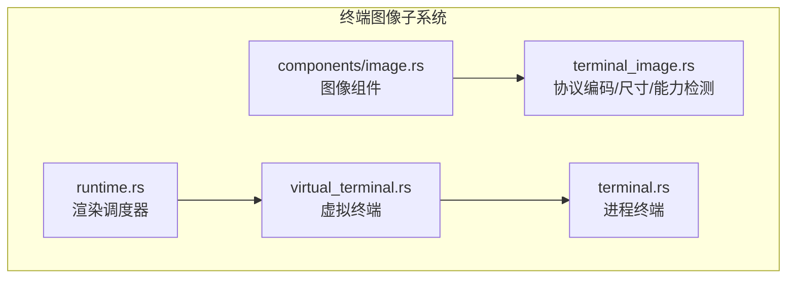
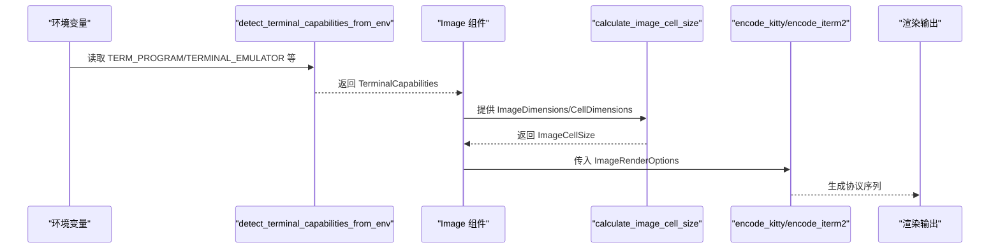
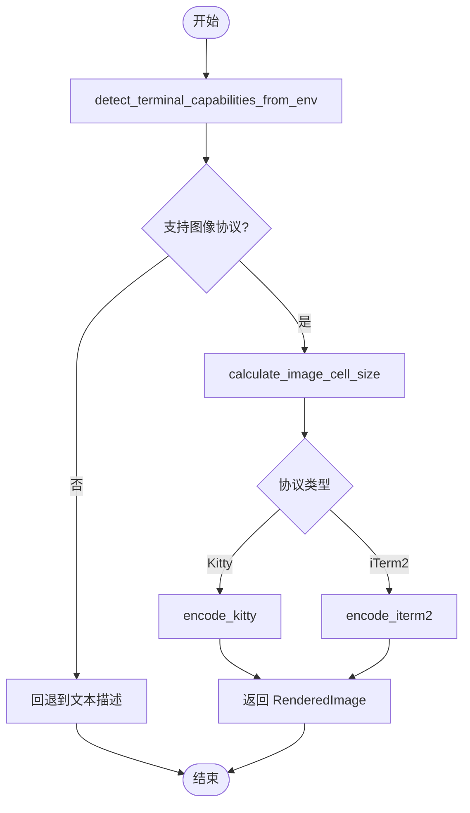
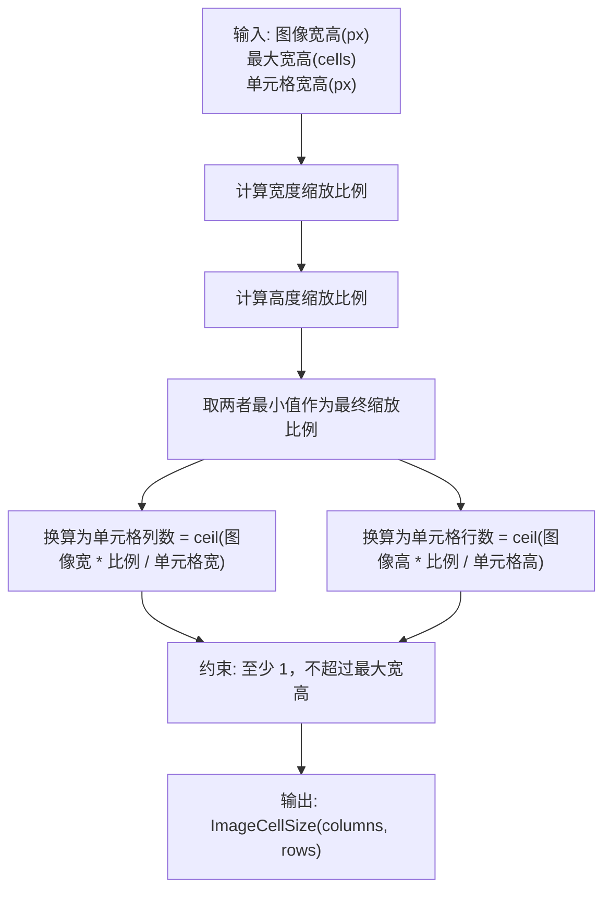
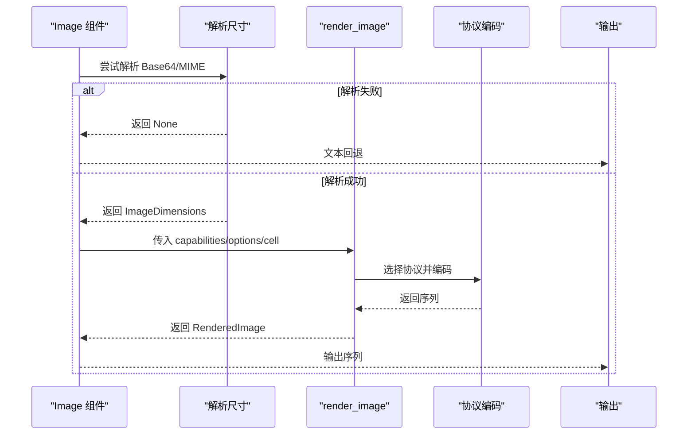
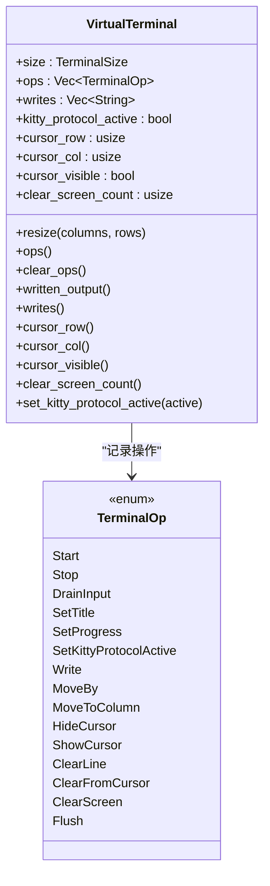
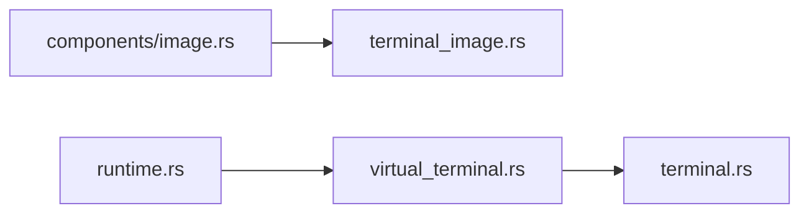

# 终端图像支持

<cite>
**本文引用的文件**
- [terminal_image.rs](file://crates/pi-tui/src/terminal_image.rs)
- [image.rs](file://crates/pi-tui/src/components/image.rs)
- [virtual_terminal.rs](file://crates/pi-tui/src/virtual_terminal.rs)
- [terminal.rs](file://crates/pi-tui/src/terminal.rs)
- [lib.rs](file://crates/pi-tui/src/lib.rs)
- [runtime.rs](file://crates/pi-tui/src/runtime.rs)
- [terminal_image 测试](file://crates/pi-tui/tests/terminal_image.rs)
- [image_component 测试](file://crates/pi-tui/tests/image_component.rs)
- [terminal 测试](file://crates/pi-tui/tests/terminal.rs)
- [terminal_lifecycle 测试](file://crates/pi-tui/tests/terminal_lifecycle.rs)
- [public_api 测试](file://crates/pi-tui/tests/public_api.rs)
- [stdin_buffer.rs](file://crates/pi-tui/src/input/stdin_buffer.rs)
</cite>

## 目录
1. [简介](#简介)
2. [项目结构](#项目结构)
3. [核心组件](#核心组件)
4. [架构总览](#架构总览)
5. [详细组件分析](#详细组件分析)
6. [依赖关系分析](#依赖关系分析)
7. [性能考虑](#性能考虑)
8. [故障排查指南](#故障排查指南)
9. [结论](#结论)
10. [附录](#附录)

## 简介
本文件系统化梳理了终端图像支持的实现，覆盖以下关键主题：
- 图像渲染协议：Kitty 图像协议与 iTerm2 图像协议的差异与实现要点
- 协议选择机制：基于环境变量与终端能力检测的自动选择策略
- 渲染配置：ImageRenderOptions 的参数体系与行为
- 虚拟终端：VT100 兼容性、TerminalOp 操作指令与终端能力检测
- 尺寸计算：图像像素到单元格的换算、最大宽高限制与纵横比保持
- 图像删除：Kitty 图像删除序列与批量清理
- 性能优化：分块传输、调度器与最小刷新策略
- 兼容性：跨终端适配、回退方案与超链接支持
- 扩展场景：图像超链接、动态图像与批量渲染实践

## 项目结构
本功能主要集中在 pi-tui crate 中，核心模块如下：
- terminal_image.rs：图像协议编码、尺寸计算、能力检测与工具函数
- components/image.rs：图像组件封装，负责渲染与回退逻辑
- virtual_terminal.rs：虚拟终端记录与模拟，支持 VT100 风格操作
- terminal.rs：真实进程终端抽象，提供 crossterm 命令封装
- runtime.rs：渲染调度器，控制最小刷新间隔与强制刷新
- tests/*：覆盖协议检测、尺寸计算、渲染输出与生命周期等测试

**图表来源**
- [terminal_image.rs:1-324](file://crates/pi-tui/src/terminal_image.rs#L1-L324)
- [image.rs:1-124](file://crates/pi-tui/src/components/image.rs#L1-L124)
- [virtual_terminal.rs:1-247](file://crates/pi-tui/src/virtual_terminal.rs#L1-L247)
- [terminal.rs:1-164](file://crates/pi-tui/src/terminal.rs#L1-L164)
- [runtime.rs:1-59](file://crates/pi-tui/src/runtime.rs#L1-L59)

**章节来源**
- [lib.rs:1-61](file://crates/pi-tui/src/lib.rs#L1-L61)

## 核心组件
- ImageProtocol：枚举型协议标识（Kitty、ITerm2）
- TerminalCapabilities：终端能力集合（是否支持图像协议、真彩、超链接）
- CellDimensions：单元格像素尺寸（默认 9x18）
- ImageDimensions：图像像素尺寸
- ImageCellSize：渲染后占用的单元格行列数
- ImageRenderOptions：渲染选项（最大宽高单元格、保持纵横比、图像 ID、光标移动、行列指定、名称）
- RenderedImage：渲染结果（序列、行数、可选图像 ID）

这些类型在 terminal_image.rs 中定义，并被组件与测试广泛使用。

**章节来源**
- [terminal_image.rs:3-60](file://crates/pi-tui/src/terminal_image.rs#L3-L60)

## 架构总览
图像渲染从“能力检测”开始，根据终端能力选择协议，随后进行尺寸计算与编码，最终生成渲染序列。组件层负责在无法使用协议时回退到文本描述。

**图表来源**
- [terminal_image.rs:77-152](file://crates/pi-tui/src/terminal_image.rs#L77-L152)
- [terminal_image.rs:236-301](file://crates/pi-tui/src/terminal_image.rs#L236-L301)
- [image.rs:90-114](file://crates/pi-tui/src/components/image.rs#L90-L114)

## 详细组件分析

### 图像协议与编码
- Kitty 协议
  - 支持分块传输（CHUNK_SIZE），通过参数控制列数、行数、图像 ID、光标移动等
  - 删除单个或全部图像的专用序列
- iTerm2 协议
  - inline 参数启用内联显示，支持 width/height 与 preserveAspectRatio 控制
- 超链接
  - 提供 hyperlink 工具函数，用于包裹文本为可点击超链接

**图表来源**
- [terminal_image.rs:77-152](file://crates/pi-tui/src/terminal_image.rs#L77-L152)
- [terminal_image.rs:174-234](file://crates/pi-tui/src/terminal_image.rs#L174-L234)
- [terminal_image.rs:236-301](file://crates/pi-tui/src/terminal_image.rs#L236-L301)

**章节来源**
- [terminal_image.rs:174-234](file://crates/pi-tui/src/terminal_image.rs#L174-L234)
- [terminal_image.rs:214-220](file://crates/pi-tui/src/terminal_image.rs#L214-L220)
- [terminal_image.rs:170-172](file://crates/pi-tui/src/terminal_image.rs#L170-L172)

### 图像尺寸计算与单元格转换
- 输入：图像像素宽高、最大单元格宽高、单元格像素尺寸
- 计算：分别按宽度与高度的最大可用像素计算缩放比例，取较小者；再换算为单元格行列数
- 边界：至少 1 行 1 列，且不超过最大宽高限制

**图表来源**
- [terminal_image.rs:236-260](file://crates/pi-tui/src/terminal_image.rs#L236-L260)

**章节来源**
- [terminal_image.rs:236-260](file://crates/pi-tui/src/terminal_image.rs#L236-L260)

### 组件渲染流程（Image）
- 当 width 为 0 或无法解析图像尺寸时，回退为文本描述（包含文件名、MIME、尺寸等）
- 否则调用 render_image，传入 capabilities、options 与 cell 尺寸，得到 RenderedImage 序列
- 最终输出一行渲染序列

**图表来源**
- [image.rs:90-114](file://crates/pi-tui/src/components/image.rs#L90-L114)
- [terminal_image.rs:279-301](file://crates/pi-tui/src/terminal_image.rs#L279-L301)

**章节来源**
- [image.rs:90-114](file://crates/pi-tui/src/components/image.rs#L90-L114)

### 虚拟终端与 VT100 兼容性
- VirtualTerminal 记录所有操作（TerminalOp），包括写入、移动、清屏、标题设置、进度指示、协议状态等
- 提供 cursor_row/col、cursor_visible、clear_screen_count 等状态查询
- 支持 kitty_protocol_active 状态标记，便于上层控制

**图表来源**
- [virtual_terminal.rs:8-36](file://crates/pi-tui/src/virtual_terminal.rs#L8-L36)
- [virtual_terminal.rs:152-246](file://crates/pi-tui/src/virtual_terminal.rs#L152-L246)

**章节来源**
- [virtual_terminal.rs:152-246](file://crates/pi-tui/src/virtual_terminal.rs#L152-L246)

### 进程终端与 VT100 命令
- ProcessTerminal 实现 Terminal trait，封装 crossterm 命令（移动、清屏、隐藏/显示光标、设置标题、进度等）
- start/stop 时发送原始模式与协议开关序列，确保兼容性

**章节来源**
- [terminal.rs:72-163](file://crates/pi-tui/src/terminal.rs#L72-L163)

### 终端能力检测与协议选择
- 依据环境变量（TERM_PROGRAM、TERMINAL_EMULATOR、TERM、COLORTERM、TMUX 等）判断
- 优先级：WezTerm（Kitty）、iTerm2（iTerm2）、Windows Terminal/VSCode/Alacritty（无图像协议但支持真彩与超链接）、JetBrains JEDiterm（无超链接）
- 默认回退：若未检测到明确支持，则仅启用真彩与超链接能力

**章节来源**
- [terminal_image.rs:77-152](file://crates/pi-tui/src/terminal_image.rs#L77-L152)

### 图像删除机制
- Kitty 单图删除：通过图像 ID 删除指定图像
- Kitty 全量删除：清除当前会话中所有图像

**章节来源**
- [terminal_image.rs:214-220](file://crates/pi-tui/src/terminal_image.rs#L214-L220)

### 超链接与文本包装
- hyperlink：生成可点击超链接序列
- wrap_text_with_ansi/truncate_to_width：文本宽度控制与 ANSI 宽度计算

**章节来源**
- [terminal_image.rs:170-172](file://crates/pi-tui/src/terminal_image.rs#L170-L172)
- [lib.rs:57-59](file://crates/pi-tui/src/lib.rs#L57-L59)

## 依赖关系分析
- 组件依赖 terminal_image 的尺寸计算与渲染函数
- 虚拟终端与进程终端共同实现 Terminal trait，供上层 TUI 使用
- 渲染调度器控制刷新节奏，减少不必要的重绘

**图表来源**
- [image.rs:1-4](file://crates/pi-tui/src/components/image.rs#L1-L4)
- [terminal_image.rs:1-3](file://crates/pi-tui/src/terminal_image.rs#L1-L3)
- [virtual_terminal.rs:1-6](file://crates/pi-tui/src/virtual_terminal.rs#L1-L6)
- [terminal.rs:1-7](file://crates/pi-tui/src/terminal.rs#L1-L7)
- [runtime.rs:1-9](file://crates/pi-tui/src/runtime.rs#L1-L9)

**章节来源**
- [lib.rs:24-60](file://crates/pi-tui/src/lib.rs#L24-L60)

## 性能考虑
- 分块传输：Kitty 协议对大图像采用分块传输，避免单次过长导致的终端阻塞
- 尺寸预估：先按最大单元格宽高计算缩放，再换算为单元格行列，避免超限渲染
- 刷新调度：使用 RenderScheduler 控制最小刷新间隔，避免高频抖动
- 回退策略：当协议不可用时直接回退文本描述，避免无效渲染

**章节来源**
- [terminal_image.rs:174-212](file://crates/pi-tui/src/terminal_image.rs#L174-L212)
- [runtime.rs:11-59](file://crates/pi-tui/src/runtime.rs#L11-L59)

## 故障排查指南
- 图像不显示
  - 检查终端能力检测结果，确认 TERM_PROGRAM/TERMINAL_EMULATOR 等环境变量是否正确
  - 确认 capabilities 中 images 是否为 Some
- 图像变形
  - 检查 preserve_aspect_ratio 选项与 max_width_cells/max_height_cells 的设置
  - 核对 CellDimensions 是否与实际终端一致
- 图像无法删除
  - 确认使用 Kitty 协议并传入正确的 image_id
  - 使用 delete_kitty_image 或 delete_all_kitty_images
- 超链接无效
  - 确认终端支持超链接（hyperlinks 为 true）
  - 检查 hyperlink 包裹范围与 URL 正确性
- 终端输入解析异常
  - 检查 ESC/OCS/字符串终止序列长度计算，避免误判

**章节来源**
- [terminal_image.rs:77-152](file://crates/pi-tui/src/terminal_image.rs#L77-L152)
- [terminal_image.rs:214-220](file://crates/pi-tui/src/terminal_image.rs#L214-L220)
- [stdin_buffer.rs:183-231](file://crates/pi-tui/src/input/stdin_buffer.rs#L183-L231)

## 结论
该实现以清晰的协议抽象与能力检测为基础，结合组件化的渲染流程与完善的回退策略，实现了跨终端的图像显示能力。通过分块传输、尺寸预估与渲染调度，兼顾了性能与兼容性。建议在生产环境中：
- 明确设置 CellDimensions 以提升尺寸计算精度
- 对大图像启用分块传输与合理的最大单元格限制
- 使用 RenderScheduler 控制刷新频率
- 在不支持图像协议的终端中提供高质量的文本回退

## 附录

### API 参考（路径索引）
- 能力检测：[detect_terminal_capabilities_from_env:77-152](file://crates/pi-tui/src/terminal_image.rs#L77-L152)
- 协议编码：[encode_kitty:174-212](file://crates/pi-tui/src/terminal_image.rs#L174-L212)、[encode_iterm2:222-234](file://crates/pi-tui/src/terminal_image.rs#L222-L234)
- 尺寸计算：[calculate_image_cell_size:236-260](file://crates/pi-tui/src/terminal_image.rs#L236-L260)
- 渲染入口：[render_image:279-301](file://crates/pi-tui/src/terminal_image.rs#L279-L301)
- 图像维度解析：[image_dimensions_from_base64:262-267](file://crates/pi-tui/src/terminal_image.rs#L262-L267)、[image_dimensions_from_bytes:269-277](file://crates/pi-tui/src/terminal_image.rs#L269-L277)
- 图像删除：[delete_kitty_image:214-216](file://crates/pi-tui/src/terminal_image.rs#L214-L216)、[delete_all_kitty_images:218-220](file://crates/pi-tui/src/terminal_image.rs#L218-L220)
- 超链接：[hyperlink:170-172](file://crates/pi-tui/src/terminal_image.rs#L170-L172)
- 终端能力：[TerminalCapabilities:10-14](file://crates/pi-tui/src/terminal_image.rs#L10-L14)
- 渲染选项：[ImageRenderOptions:51-75](file://crates/pi-tui/src/terminal_image.rs#L51-L75)
- 组件：[Image:6-16](file://crates/pi-tui/src/components/image.rs#L6-L16)
- 虚拟终端：[VirtualTerminal:27-36](file://crates/pi-tui/src/virtual_terminal.rs#L27-L36)、[TerminalOp:9-25](file://crates/pi-tui/src/virtual_terminal.rs#L9-L25)
- 进程终端：[ProcessTerminal:52-55](file://crates/pi-tui/src/terminal.rs#L52-L55)
- 渲染调度：[RenderScheduler:4-9](file://crates/pi-tui/src/runtime.rs#L4-L9)

### 测试参考（路径索引）
- 能力检测与协议序列：[terminal_image 测试:14-38](file://crates/pi-tui/tests/terminal_image.rs#L14-L38)
- 尺寸计算与渲染：[terminal_image 测试:119-163](file://crates/pi-tui/tests/terminal_image.rs#L119-L163)
- 组件回退与 Kitty 序列：[image_component 测试:16-32](file://crates/pi-tui/tests/image_component.rs#L16-L32)、[image_component 测试:35-58](file://crates/pi-tui/tests/image_component.rs#L35-L58)
- 虚拟终端生命周期与协议状态：[terminal_lifecycle 测试:4-30](file://crates/pi-tui/tests/terminal_lifecycle.rs#L4-L30)
- 终端操作记录与尺寸：[terminal 测试:4-35](file://crates/pi-tui/tests/terminal.rs#L4-L35)
- 公共 API 覆盖：[public_api 测试:68-115](file://crates/pi-tui/tests/public_api.rs#L68-L115)