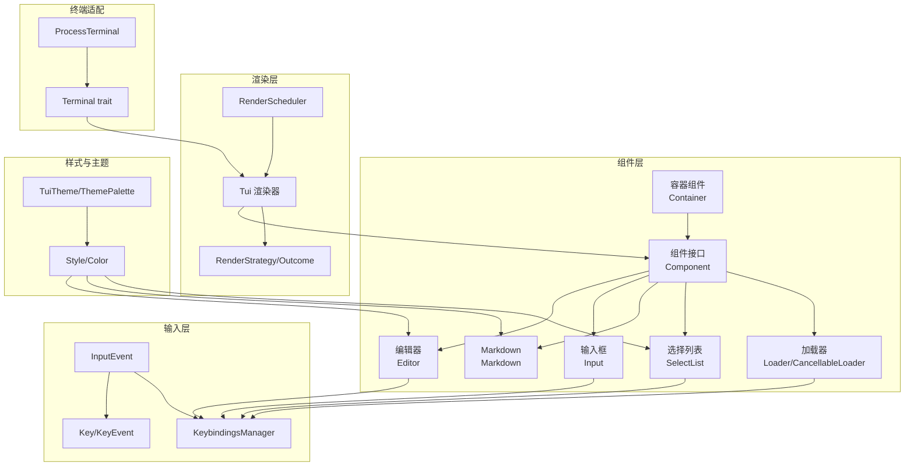
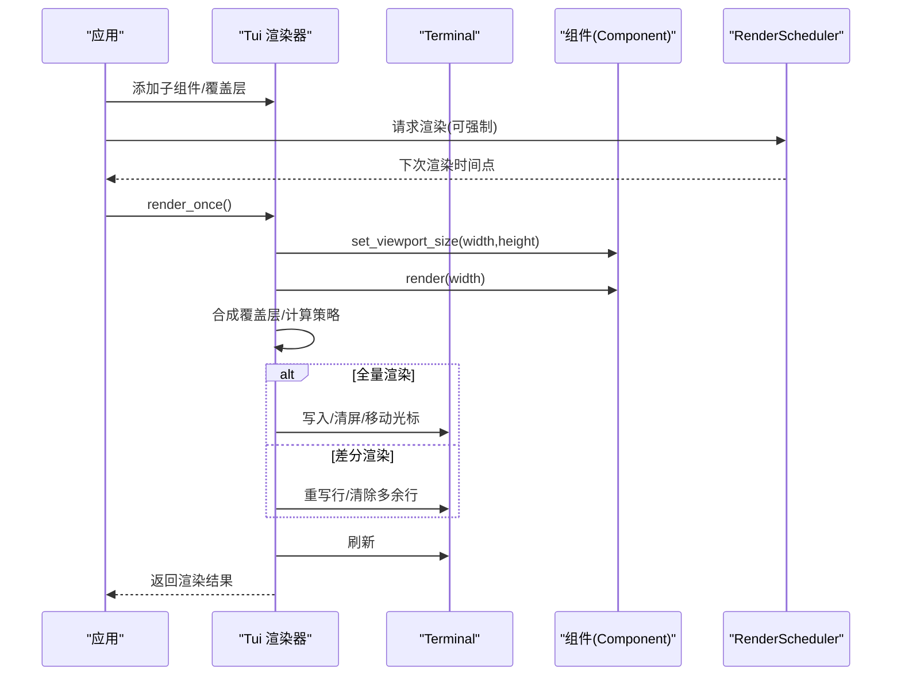
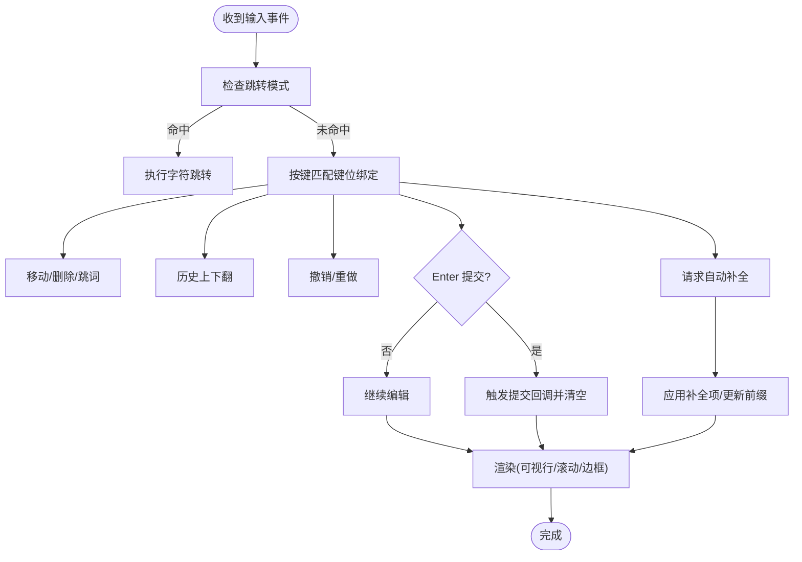
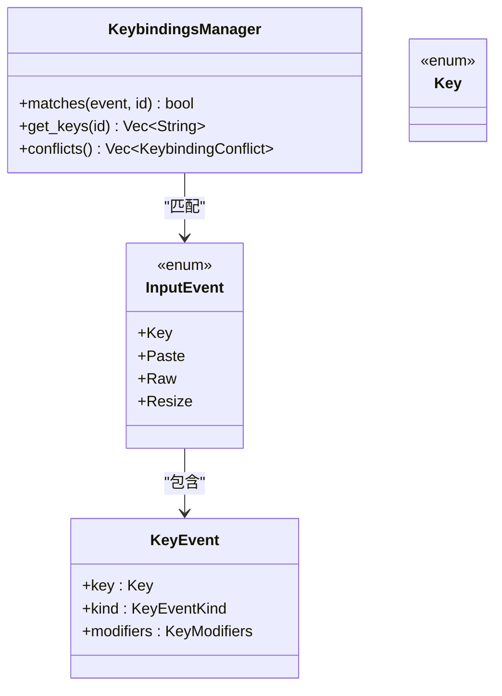
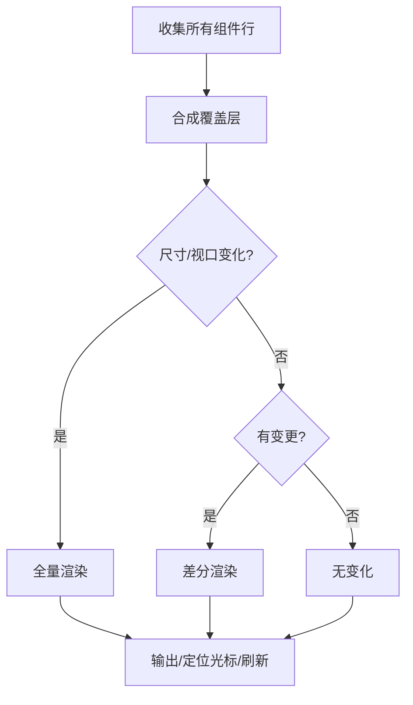
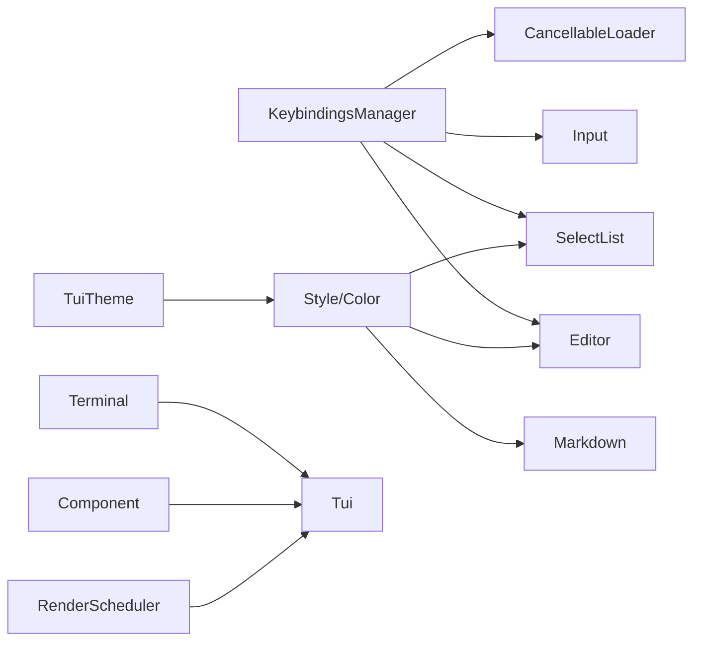

# 终端用户界面

<cite>
**本文引用的文件**
- [lib.rs](file://crates/pi-tui/src/lib.rs)
- [tui.rs](file://crates/pi-tui/src/tui.rs)
- [component.rs](file://crates/pi-tui/src/component.rs)
- [components/mod.rs](file://crates/pi-tui/src/components/mod.rs)
- [components/editor.rs](file://crates/pi-tui/src/components/editor.rs)
- [components/input.rs](file://crates/pi-tui/src/components/input.rs)
- [components/markdown.rs](file://crates/pi-tui/src/components/markdown.rs)
- [components/select_list.rs](file://crates/pi-tui/src/components/select_list.rs)
- [components/loader.rs](file://crates/pi-tui/src/components/loader.rs)
- [input/mod.rs](file://crates/pi-tui/src/input/mod.rs)
- [input/keybindings.rs](file://crates/pi-tui/src/input/keybindings.rs)
- [style.rs](file://crates/pi-tui/src/style.rs)
- [theme.rs](file://crates/pi-tui/src/theme.rs)
- [runtime.rs](file://crates/pi-tui/src/runtime.rs)
- [terminal.rs](file://crates/pi-tui/src/terminal.rs)
</cite>

## 目录
1. [简介](#简介)
2. [项目结构](#项目结构)
3. [核心组件](#核心组件)
4. [架构总览](#架构总览)
5. [组件详解](#组件详解)
6. [依赖关系分析](#依赖关系分析)
7. [性能考量](#性能考量)
8. [故障排查指南](#故障排查指南)
9. [结论](#结论)
10. [附录](#附录)

## 简介
本文件面向终端用户界面（TUI）子系统的终端开发者与使用者，系统化阐述组件系统架构、输入处理机制、可复用组件库、主题与样式体系、渲染策略与调度、以及性能优化与跨平台兼容性建议。目标是帮助读者快速理解并高效扩展该 TUI 框架。

## 项目结构
- 核心模块
  - 组件系统：统一的 Component 接口与容器组合模式
  - 输入系统：事件抽象、键位绑定与解析
  - 主题与样式：颜色层级检测、样式应用与主题配置
  - 渲染与调度：增量/全量渲染策略、硬件光标定位、帧调度
  - 终端适配：抽象 Terminal trait 与进程内实现
- 可复用组件库：编辑器、输入框、Markdown 渲染、选择列表、加载指示器等

图表来源
- [component.rs:1-82](file://crates/pi-tui/src/component.rs#L1-L82)
- [components/mod.rs:1-26](file://crates/pi-tui/src/components/mod.rs#L1-L26)
- [input/mod.rs:12-19](file://crates/pi-tui/src/input/mod.rs#L12-L19)
- [input/keybindings.rs:21-63](file://crates/pi-tui/src/input/keybindings.rs#L21-L63)
- [tui.rs:52-103](file://crates/pi-tui/src/tui.rs#L52-L103)
- [tui.rs:14-25](file://crates/pi-tui/src/tui.rs#L14-L25)
- [runtime.rs:4-19](file://crates/pi-tui/src/runtime.rs#L4-L19)
- [style.rs:70-111](file://crates/pi-tui/src/style.rs#L70-L111)
- [theme.rs:156-165](file://crates/pi-tui/src/theme.rs#L156-L165)
- [terminal.rs:15-50](file://crates/pi-tui/src/terminal.rs#L15-L50)
- [terminal.rs:72-163](file://crates/pi-tui/src/terminal.rs#L72-L163)

章节来源
- [lib.rs:1-61](file://crates/pi-tui/src/lib.rs#L1-L61)
- [components/mod.rs:1-26](file://crates/pi-tui/src/components/mod.rs#L1-L26)

## 核心组件
- 组件接口与生命周期
  - Component 定义了渲染、输入处理、焦点管理、失效通知等能力
  - Container 提供子组件聚合与传播
- 输入事件与键位绑定
  - InputEvent 抽象键盘、粘贴、原始字符串与终端尺寸变化
  - KeybindingsManager 支持默认与用户覆盖键位映射，冲突检测
- 渲染与调度
  - Tui 负责子组件与覆盖层的合成、策略选择与输出
  - RenderScheduler 控制最小刷新间隔与强制刷新
- 终端适配
  - Terminal trait 封装光标、清屏、写入等操作
  - ProcessTerminal 提供 crossterm 实现与 raw 模式切换

章节来源
- [component.rs:3-29](file://crates/pi-tui/src/component.rs#L3-L29)
- [component.rs:31-81](file://crates/pi-tui/src/component.rs#L31-L81)
- [input/mod.rs:12-19](file://crates/pi-tui/src/input/mod.rs#L12-L19)
- [input/keybindings.rs:21-63](file://crates/pi-tui/src/input/keybindings.rs#L21-L63)
- [tui.rs:52-103](file://crates/pi-tui/src/tui.rs#L52-L103)
- [runtime.rs:4-19](file://crates/pi-tui/src/runtime.rs#L4-L19)
- [terminal.rs:15-50](file://crates/pi-tui/src/terminal.rs#L15-L50)

## 架构总览
Tui 作为顶层协调者，持有若干子组件与覆盖层，按宽度裁剪与高度限制进行布局；根据前后帧差异选择全量或差分渲染；通过 RenderScheduler 控制刷新节奏；通过 Terminal trait 输出到终端。

图表来源
- [tui.rs:287-320](file://crates/pi-tui/src/tui.rs#L287-L320)
- [tui.rs:395-408](file://crates/pi-tui/src/tui.rs#L395-L408)
- [tui.rs:410-531](file://crates/pi-tui/src/tui.rs#L410-L531)
- [runtime.rs:30-48](file://crates/pi-tui/src/runtime.rs#L30-L48)
- [terminal.rs:72-163](file://crates/pi-tui/src/terminal.rs#L72-L163)

## 组件详解

### 文本编辑器（Editor）
- 功能要点
  - 多行文本、可视行滚动、光标定位与硬件光标标记
  - 剪贴板环（KillRing）、撤销/重做栈
  - 历史记录、跳转模式、自动补全（可插拔 Provider）
  - 粘贴缓冲与大段粘贴占位符
- 输入处理
  - 键位绑定驱动光标移动、删除、历史导航、撤销/重做
  - Tab 触发自动补全，支持强制与常规两种模式
  - Enter 提交，禁用提交时忽略
- 渲染策略
  - 计算可视行范围，动态调整滚动偏移
  - 边框可选，边框占用高度影响可见行数
  - 自动补全弹出层在覆盖层中渲染

图表来源
- [components/editor.rs:48-115](file://crates/pi-tui/src/components/editor.rs#L48-L115)
- [components/editor.rs:228-247](file://crates/pi-tui/src/components/editor.rs#L228-L247)
- [components/editor.rs:469-504](file://crates/pi-tui/src/components/editor.rs#L469-L504)
- [components/editor.rs:622-634](file://crates/pi-tui/src/components/editor.rs#L622-L634)
- [components/editor.rs:772-800](file://crates/pi-tui/src/components/editor.rs#L772-L800)

章节来源
- [components/editor.rs:48-115](file://crates/pi-tui/src/components/editor.rs#L48-L115)
- [components/editor.rs:228-247](file://crates/pi-tui/src/components/editor.rs#L228-L247)
- [components/editor.rs:469-504](file://crates/pi-tui/src/components/editor.rs#L469-L504)
- [components/editor.rs:622-634](file://crates/pi-tui/src/components/editor.rs#L622-L634)
- [components/editor.rs:772-800](file://crates/pi-tui/src/components/editor.rs#L772-L800)

### 输入框（Input）
- 功能要点
  - 单行文本输入，光标插入与左右移动
  - 键位绑定支持退格、删除、行首/行尾移动
  - Enter 提交，Esc 回调
- 输入处理
  - 粘贴事件直接插入
  - 字符键过滤修饰键组合，避免非预期输入

章节来源
- [components/input.rs:7-26](file://crates/pi-tui/src/components/input.rs#L7-L26)
- [components/input.rs:85-147](file://crates/pi-tui/src/components/input.rs#L85-L147)

### Markdown 渲染器（Markdown）
- 功能要点
  - 解析标题、段落、列表、块引用、代码块、粗体、链接等
  - 行内样式叠加（粗体、代码、链接），支持超链接增强
  - 按宽度折行，支持内容区内外边距
- 渲染策略
  - 预处理代码块为“预着色”行，避免二次换行
  - 按宽度拆分长单词，保留 ANSI 序列安全

章节来源
- [components/markdown.rs:91-295](file://crates/pi-tui/src/components/markdown.rs#L91-L295)
- [components/markdown.rs:465-527](file://crates/pi-tui/src/components/markdown.rs#L465-L527)

### 选择列表（SelectList）
- 功能要点
  - 模糊过滤与排序，支持描述字段参与搜索
  - 上下/翻页/确认/取消键位绑定
  - 选中项高亮与描述展示
- 输入处理
  - 字母键追加过滤串，空格键特殊处理
  - 退格删除过滤串

章节来源
- [components/select_list.rs:28-59](file://crates/pi-tui/src/components/select_list.rs#L28-L59)
- [components/select_list.rs:154-209](file://crates/pi-tui/src/components/select_list.rs#L154-L209)

### 加载指示器（Loader/CancellableLoader）
- 功能要点
  - 旋转帧动画与消息显示
  - 可取消加载器支持 ESC 中止并回调
- 输入处理
  - ESC 触发中止流程

章节来源
- [components/loader.rs:12-56](file://crates/pi-tui/src/components/loader.rs#L12-L56)
- [components/loader.rs:119-133](file://crates/pi-tui/src/components/loader.rs#L119-L133)

### 主题与样式系统
- 颜色与样式
  - Color/Style 支持 ANSI16/256/真彩，自动检测终端能力
  - 预置语义样式（用户、工具名、错误、状态等）
- 主题
  - TuiTheme 包含调色板与各组件主题（编辑器、Markdown、选择列表、设置列表）
  - 提供深色/浅色内置主题与自定义主题工厂

章节来源
- [style.rs:3-58](file://crates/pi-tui/src/style.rs#L3-L58)
- [style.rs:70-111](file://crates/pi-tui/src/style.rs#L70-L111)
- [style.rs:156-224](file://crates/pi-tui/src/style.rs#L156-L224)
- [theme.rs:156-228](file://crates/pi-tui/src/theme.rs#L156-L228)

### 输入处理系统
- 事件模型
  - InputEvent：键盘、粘贴、原始字符串、终端尺寸变化
  - Key/KeyEvent：键值、修饰键、按下/释放
- 键位绑定
  - 默认键位集合覆盖编辑器、输入、选择、模型切换等场景
  - 用户可覆盖默认映射，冲突检测与报告

图表来源
- [input/keybindings.rs:21-63](file://crates/pi-tui/src/input/keybindings.rs#L21-L63)
- [input/mod.rs:12-19](file://crates/pi-tui/src/input/mod.rs#L12-L19)
- [input/mod.rs:5-6](file://crates/pi-tui/src/input/mod.rs#L5-L6)

章节来源
- [input/mod.rs:12-19](file://crates/pi-tui/src/input/mod.rs#L12-L19)
- [input/keybindings.rs:21-63](file://crates/pi-tui/src/input/keybindings.rs#L21-L63)
- [input/keybindings.rs:116-331](file://crates/pi-tui/src/input/keybindings.rs#L116-L331)

### 渲染策略与调度
- 渲染策略
  - 全量渲染：清屏/重绘整屏
  - 差分渲染：仅重写变更行，必要时清除多余行
  - 无变化：跳过输出
- 覆盖层合成
  - 计算锚点、边距、最大高度，按列拼接覆盖层内容
- 调度
  - 最小刷新间隔控制，支持强制立即渲染

图表来源
- [tui.rs:322-330](file://crates/pi-tui/src/tui.rs#L322-L330)
- [tui.rs:354-393](file://crates/pi-tui/src/tui.rs#L354-L393)
- [tui.rs:395-408](file://crates/pi-tui/src/tui.rs#L395-L408)
- [tui.rs:458-531](file://crates/pi-tui/src/tui.rs#L458-L531)

章节来源
- [tui.rs:14-25](file://crates/pi-tui/src/tui.rs#L14-L25)
- [tui.rs:395-408](file://crates/pi-tui/src/tui.rs#L395-L408)
- [tui.rs:458-531](file://crates/pi-tui/src/tui.rs#L458-L531)
- [runtime.rs:4-19](file://crates/pi-tui/src/runtime.rs#L4-L19)

### 终端兼容性与协议
- 终端适配
  - Terminal trait 抽象终端操作，ProcessTerminal 使用 crossterm 实现
  - 支持 raw 模式、光标隐藏/显示、清屏、移动、刷新
- 颜色能力检测
  - 基于环境变量与程序名称推断终端类型，支持 TrueColor/ANSI256/ANSI16/无色
- 图像与超链接（扩展能力）
  - Kitty/iTerm2 图像协议与超链接编码（由终端图像模块提供）

章节来源
- [terminal.rs:15-50](file://crates/pi-tui/src/terminal.rs#L15-L50)
- [terminal.rs:72-163](file://crates/pi-tui/src/terminal.rs#L72-L163)
- [style.rs:156-224](file://crates/pi-tui/src/style.rs#L156-L224)

## 依赖关系分析
- 组件对输入与样式的依赖
  - Editor/Input/SelectList/Loader 均依赖 KeybindingsManager 与 Style/Color
- 渲染器耦合
  - Tui 依赖 Terminal、Component、Overlay、RenderStrategy
- 主题与样式
  - 各组件主题来自 TuiTheme，颜色能力由 style 模块统一检测

图表来源
- [input/keybindings.rs:21-63](file://crates/pi-tui/src/input/keybindings.rs#L21-L63)
- [style.rs:70-111](file://crates/pi-tui/src/style.rs#L70-L111)
- [theme.rs:156-165](file://crates/pi-tui/src/theme.rs#L156-L165)
- [tui.rs:52-103](file://crates/pi-tui/src/tui.rs#L52-L103)
- [runtime.rs:4-19](file://crates/pi-tui/src/runtime.rs#L4-L19)

章节来源
- [lib.rs:20-61](file://crates/pi-tui/src/lib.rs#L20-L61)

## 性能考量
- 渲染策略
  - 优先使用差分渲染以减少屏幕重绘；全量渲染仅在尺寸变化或收缩时触发
  - 合理设置覆盖层最大高度与锚点，避免大面积重绘
- 文本处理
  - 使用可见宽度计算替代字节长度，避免 ANSI 序列破坏布局
  - 长单词拆分与按列拼接，确保覆盖层边界正确
- 调度
  - 使用 RenderScheduler 设置合理最小间隔，避免高频抖动
- 组件开销
  - 编辑器撤销/重做栈与历史列表应限制容量，防止内存膨胀
  - 自动补全建议限制最大可见条目与请求频率

## 故障排查指南
- 常见错误
  - 行宽超限：当某行可见宽度超过终端宽度时抛出错误，需检查样式与换行逻辑
  - 键位冲突：用户自定义键位可能与多个功能冲突，可通过冲突列表定位
  - 颜色不生效：检查终端是否支持相应颜色等级，或被 NO_COLOR 等环境变量禁用
- 定位方法
  - 打印当前渲染行与策略，核对覆盖层位置与尺寸
  - 在输入事件路径上增加日志，确认键位匹配与事件分发
  - 检查颜色能力检测函数返回值，确认终端类型识别

章节来源
- [tui.rs:40-50](file://crates/pi-tui/src/tui.rs#L40-L50)
- [input/keybindings.rs:65-100](file://crates/pi-tui/src/input/keybindings.rs#L65-L100)
- [style.rs:156-224](file://crates/pi-tui/src/style.rs#L156-L224)

## 结论
该 TUI 子系统以清晰的组件接口、灵活的输入键位绑定、稳健的渲染策略与完善的主题样式体系为核心，既满足终端交互的复杂需求，又保持良好的可扩展性与跨平台兼容性。通过合理的调度与性能优化策略，可在不同终端环境下稳定运行。

## 附录

### 组件开发指南与最佳实践
- 新增组件
  - 实现 Component 接口，按需覆写 set_viewport_size/render/handle_input/set_focused/invalidate
  - 使用 CURSOR_MARKER 插入光标标记，确保焦点态正确
- 输入处理
  - 优先使用 KeybindingsManager 进行键位匹配，避免硬编码
  - 对粘贴、多字节字符与修饰键进行过滤与兼容处理
- 渲染与布局
  - 使用 fit_line/truncate_to_width/visible_width 确保列对齐与截断正确
  - 合理设置覆盖层锚点与边距，避免遮挡主内容
- 主题与样式
  - 通过 TuiTheme 统一风格，避免硬编码颜色
  - 使用 paint_with/paint_with_level 应用样式，尊重颜色能力检测

### 跨平台兼容性建议
- 颜色能力
  - 通过 detect_color_level_from_env 识别终端类型，回退至 ANSI16 或无色
- 终端协议
  - 仅在支持的终端启用 Kitty/iTerm2 图像与超链接协议
- 输入与光标
  - 不同终端对光标移动与清屏指令支持存在差异，遵循 crossterm 的通用行为
- 测试
  - 在常见终端（如 iTerm2、WezTerm、Alacritty、Windows Terminal）中验证渲染与颜色表现