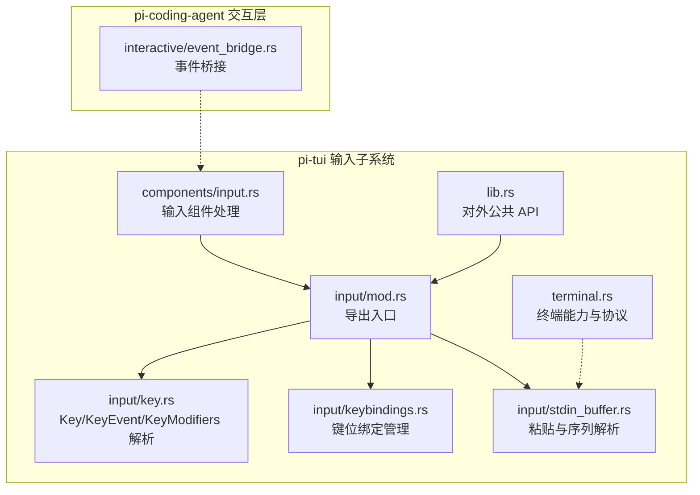
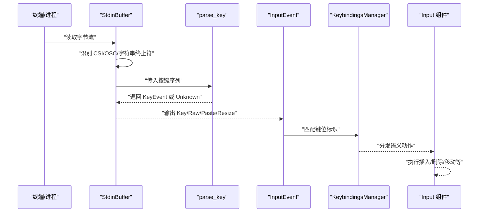
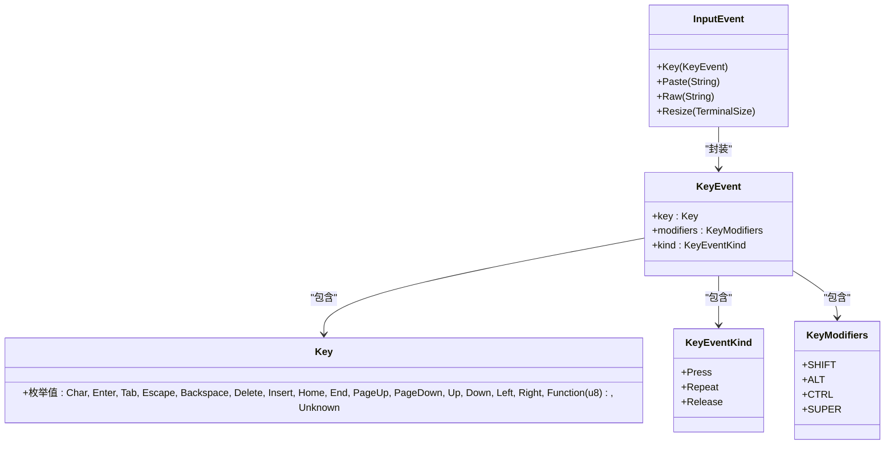
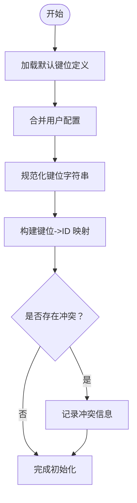
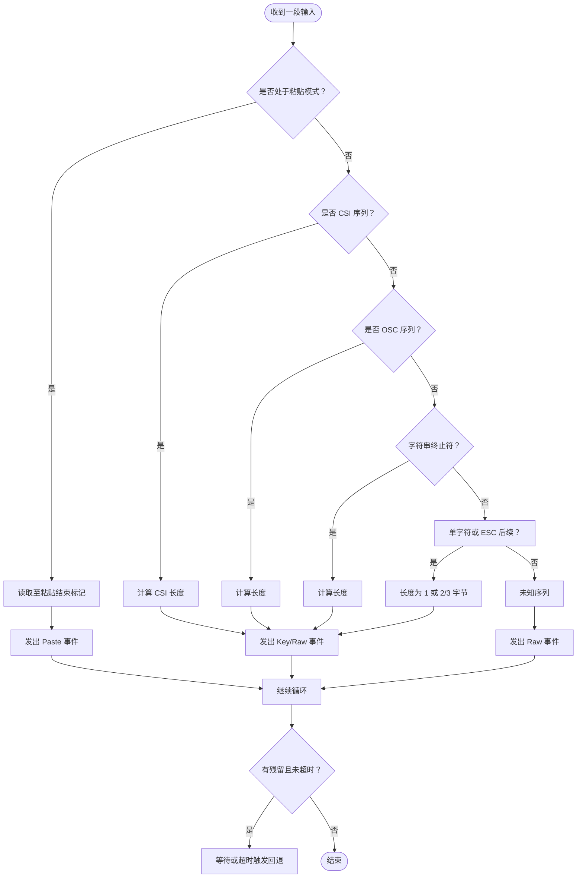
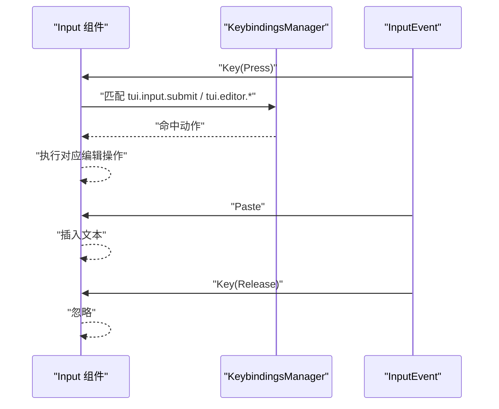
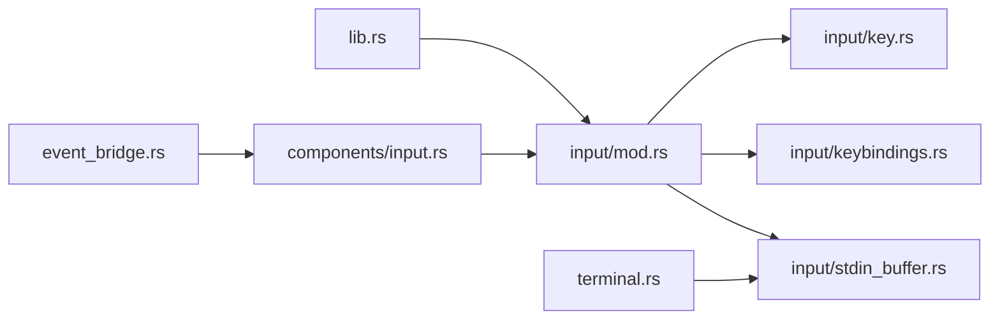

# 输入处理系统

<cite>
**本文引用的文件**
- [crates/pi-tui/src/input/mod.rs](file://crates/pi-tui/src/input/mod.rs)
- [crates/pi-tui/src/input/key.rs](file://crates/pi-tui/src/input/key.rs)
- [crates/pi-tui/src/input/keybindings.rs](file://crates/pi-tui/src/input/keybindings.rs)
- [crates/pi-tui/src/input/stdin_buffer.rs](file://crates/pi-tui/src/input/stdin_buffer.rs)
- [crates/pi-tui/src/components/input.rs](file://crates/pi-tui/src/components/input.rs)
- [crates/pi-tui/src/lib.rs](file://crates/pi-tui/src/lib.rs)
- [crates/pi-tui/src/terminal.rs](file://crates/pi-tui/src/terminal.rs)
- [crates/pi-coding-agent/src/interactive/event_bridge.rs](file://crates/pi-coding-agent/src/interactive/event_bridge.rs)
</cite>

## 目录
1. [引言](#引言)
2. [项目结构](#项目结构)
3. [核心组件](#核心组件)
4. [架构总览](#架构总览)
5. [详细组件分析](#详细组件分析)
6. [依赖关系分析](#依赖关系分析)
7. [性能考虑](#性能考虑)
8. [故障排查指南](#故障排查指南)
9. [结论](#结论)
10. [附录](#附录)

## 引言
本技术文档围绕输入处理系统展开，重点覆盖键盘事件解析与封装、修饰键处理、键位绑定管理、粘贴（Bracketed Paste）支持、跨平台兼容性以及性能优化策略。读者将获得从数据结构到运行时流程的完整理解，并掌握如何扩展自定义键位绑定与调试输入事件。

## 项目结构
输入处理系统主要位于 pi-tui crate 的 input 子模块中，同时在 components/input.rs 中对输入组件进行具体行为编排；在 terminal.rs 中负责底层终端协议与原始模式开关；在 pi-coding-agent 的 event_bridge.rs 中体现输入事件与上层交互的桥接。

图表来源
- [crates/pi-tui/src/input/mod.rs:1-19](file://crates/pi-tui/src/input/mod.rs#L1-L19)
- [crates/pi-tui/src/input/key.rs:1-407](file://crates/pi-tui/src/input/key.rs#L1-L407)
- [crates/pi-tui/src/input/keybindings.rs:1-331](file://crates/pi-tui/src/input/keybindings.rs#L1-L331)
- [crates/pi-tui/src/input/stdin_buffer.rs:1-348](file://crates/pi-tui/src/input/stdin_buffer.rs#L1-L348)
- [crates/pi-tui/src/components/input.rs:1-181](file://crates/pi-tui/src/components/input.rs#L1-L181)
- [crates/pi-tui/src/lib.rs:32-36](file://crates/pi-tui/src/lib.rs#L32-L36)
- [crates/pi-tui/src/terminal.rs:15-50](file://crates/pi-tui/src/terminal.rs#L15-L50)
- [crates/pi-coding-agent/src/interactive/event_bridge.rs:1-129](file://crates/pi-coding-agent/src/interactive/event_bridge.rs#L1-L129)

章节来源
- [crates/pi-tui/src/input/mod.rs:1-19](file://crates/pi-tui/src/input/mod.rs#L1-L19)
- [crates/pi-tui/src/lib.rs:32-36](file://crates/pi-tui/src/lib.rs#L32-L36)

## 核心组件
- 键盘事件模型：Key、KeyEvent、KeyEventKind、KeyModifiers
- 输入事件封装：InputEvent（Key、Paste、Raw、Resize）
- 键位绑定管理：KeybindingsManager、KeybindingDefinition、TUI_KEYBINDINGS
- 粘贴支持：StdinBuffer（Bracketed Paste、超时回退）
- 终端协议：ProcessTerminal（raw mode、kitty 协议探测）

章节来源
- [crates/pi-tui/src/input/key.rs:3-46](file://crates/pi-tui/src/input/key.rs#L3-L46)
- [crates/pi-tui/src/input/mod.rs:12-19](file://crates/pi-tui/src/input/mod.rs#L12-L19)
- [crates/pi-tui/src/input/keybindings.rs:7-26](file://crates/pi-tui/src/input/keybindings.rs#L7-L26)
- [crates/pi-tui/src/input/stdin_buffer.rs:10-17](file://crates/pi-tui/src/input/stdin_buffer.rs#L10-L17)
- [crates/pi-tui/src/terminal.rs:52-70](file://crates/pi-tui/src/terminal.rs#L52-L70)

## 架构总览
输入处理从底层终端读取原始字节流，通过 StdinBuffer 按 VT/CSI 序列与 Bracketed Paste 规范进行识别与拼接，生成 InputEvent；随后由 Key/KeyEvent 解析器统一转换为标准事件；KeybindingsManager 将用户或默认键位映射到语义化动作；最终由组件（如 Input）消费事件并执行相应编辑操作。

图表来源
- [crates/pi-tui/src/input/stdin_buffer.rs:60-118](file://crates/pi-tui/src/input/stdin_buffer.rs#L60-L118)
- [crates/pi-tui/src/input/key.rs:48-84](file://crates/pi-tui/src/input/key.rs#L48-L84)
- [crates/pi-tui/src/input/keybindings.rs:44-50](file://crates/pi-tui/src/input/keybindings.rs#L44-L50)
- [crates/pi-tui/src/components/input.rs:85-147](file://crates/pi-tui/src/components/input.rs#L85-L147)

## 详细组件分析

### 键盘事件与修饰键处理
- Key 表示可打印字符、功能键、方向键、函数键等；KeyEvent 包含 Key、KeyModifiers、KeyEventKind；KeyModifiers 使用位标志表示 Shift/Alt/Ctrl/Super。
- parse_key 支持 Kitty CSI-u、传统 CSI、SS3、控制字符与未知转义序列；并能将 ASCII 控制码映射为 Ctrl+X 语义。
- matches_key 用于将 InputEvent 与“键位 ID”字符串（如 ctrl+c）进行匹配，忽略释放事件。

图表来源
- [crates/pi-tui/src/input/key.rs:3-46](file://crates/pi-tui/src/input/key.rs#L3-L46)
- [crates/pi-tui/src/input/mod.rs:12-19](file://crates/pi-tui/src/input/mod.rs#L12-L19)

章节来源
- [crates/pi-tui/src/input/key.rs:24-32](file://crates/pi-tui/src/input/key.rs#L24-L32)
- [crates/pi-tui/src/input/key.rs:34-46](file://crates/pi-tui/src/input/key.rs#L34-L46)
- [crates/pi-tui/src/input/key.rs:48-84](file://crates/pi-tui/src/input/key.rs#L48-L84)
- [crates/pi-tui/src/input/key.rs:86-99](file://crates/pi-tui/src/input/key.rs#L86-L99)

### 键位绑定系统
- KeybindingDefinition 定义单个语义动作的默认键位列表与描述；KeybindingsManager 负责合并用户配置与默认定义，检测键位冲突。
- TUI_KEYBINDINGS 提供默认键位集合；KeybindingsManager::new 初始化时完成规范化与冲突计算。
- 匹配逻辑：normalize_keys 去重与修剪；resolve_bindings 将用户键位映射到键位 ID，并统计冲突。

图表来源
- [crates/pi-tui/src/input/keybindings.rs:65-100](file://crates/pi-tui/src/input/keybindings.rs#L65-L100)
- [crates/pi-tui/src/input/keybindings.rs:102-114](file://crates/pi-tui/src/input/keybindings.rs#L102-L114)
- [crates/pi-tui/src/input/keybindings.rs:116-315](file://crates/pi-tui/src/input/keybindings.rs#L116-L315)

章节来源
- [crates/pi-tui/src/input/keybindings.rs:7-26](file://crates/pi-tui/src/input/keybindings.rs#L7-L26)
- [crates/pi-tui/src/input/keybindings.rs:31-63](file://crates/pi-tui/src/input/keybindings.rs#L31-L63)
- [crates/pi-tui/src/input/keybindings.rs:116-315](file://crates/pi-tui/src/input/keybindings.rs#L116-L315)

### 粘贴支持与 Bracketed Paste
- StdinBuffer 以增量方式处理输入：检测 BRACKETED_PASTE_START/END，将粘贴块整体作为 Paste 事件输出；在非粘贴状态下，按 VT/CSI/OSC/字符串终止符边界切分序列。
- 对于不完整的转义序列，使用 pending_timeout（默认 10ms）在超时后回退为 Raw/Key 事件，避免阻塞。
- flush/tick 接口用于显式强制输出残留内容或基于时间驱动的超时回退。

图表来源
- [crates/pi-tui/src/input/stdin_buffer.rs:60-118](file://crates/pi-tui/src/input/stdin_buffer.rs#L60-L118)
- [crates/pi-tui/src/input/stdin_buffer.rs:183-242](file://crates/pi-tui/src/input/stdin_buffer.rs#L183-L242)
- [crates/pi-tui/src/input/stdin_buffer.rs:135-140](file://crates/pi-tui/src/input/stdin_buffer.rs#L135-L140)

章节来源
- [crates/pi-tui/src/input/stdin_buffer.rs:5-8](file://crates/pi-tui/src/input/stdin_buffer.rs#L5-L8)
- [crates/pi-tui/src/input/stdin_buffer.rs:60-118](file://crates/pi-tui/src/input/stdin_buffer.rs#L60-L118)
- [crates/pi-tui/src/input/stdin_buffer.rs:183-242](file://crates/pi-tui/src/input/stdin_buffer.rs#L183-L242)

### 输入组件与事件消费
- Input 组件接收 InputEvent，处理 Paste 插入文本；根据 KeybindingsManager 匹配动作，执行光标移动、删除、提交等操作；忽略 Release 事件。
- 文本编辑采用 Unicode grapheme 边界保证多字节字符正确处理。

图表来源
- [crates/pi-tui/src/components/input.rs:85-147](file://crates/pi-tui/src/components/input.rs#L85-L147)
- [crates/pi-tui/src/input/keybindings.rs:44-50](file://crates/pi-tui/src/input/keybindings.rs#L44-L50)

章节来源
- [crates/pi-tui/src/components/input.rs:76-164](file://crates/pi-tui/src/components/input.rs#L76-L164)

### 终端协议与跨平台兼容
- ProcessTerminal 实现 Terminal trait，负责 raw mode 切换、光标隐藏/显示、清屏、标题设置、进度指示以及 Kitty 协议探测。
- 启动时启用 bracketed paste（2004h）、查询终端能力（CSI ? u/CSI >7u），停止时清理状态并退出 raw mode。
- 通过 is_key_release 与 KeyEventKind::Release 进行按键释放检测，确保只响应 Press/Repeat。

章节来源
- [crates/pi-tui/src/terminal.rs:72-163](file://crates/pi-tui/src/terminal.rs#L72-L163)
- [crates/pi-tui/src/input/key.rs:101-109](file://crates/pi-tui/src/input/key.rs#L101-L109)

## 依赖关系分析
- input/mod.rs 作为统一导出入口，向上层暴露 Key、KeyEvent、KeyModifiers、InputEvent、KeybindingsManager、StdinBuffer、TUI_KEYBINDINGS 等。
- components/input.rs 依赖 input 模块提供的事件与键位匹配能力。
- terminal.rs 为输入缓冲与解析提供底层终端能力支撑。
- pi-coding-agent 的 event_bridge.rs 展示了如何将底层输入事件与上层交互（如工具调用、消息流）衔接。

图表来源
- [crates/pi-tui/src/lib.rs:32-36](file://crates/pi-tui/src/lib.rs#L32-L36)
- [crates/pi-tui/src/input/mod.rs:5-10](file://crates/pi-tui/src/input/mod.rs#L5-L10)
- [crates/pi-tui/src/components/input.rs:3-5](file://crates/pi-tui/src/components/input.rs#L3-L5)
- [crates/pi-tui/src/terminal.rs:15-50](file://crates/pi-tui/src/terminal.rs#L15-L50)
- [crates/pi-coding-agent/src/interactive/event_bridge.rs:1-129](file://crates/pi-coding-agent/src/interactive/event_bridge.rs#L1-L129)

章节来源
- [crates/pi-tui/src/lib.rs:32-36](file://crates/pi-tui/src/lib.rs#L32-L36)

## 性能考虑
- 序列解析采用线性扫描与固定前缀判断，避免正则开销；CSI/OSC/字符串终止符长度计算仅在必要时进行。
- StdinBuffer 使用增量缓冲与惰性切分，减少内存复制；pending_timeout 默认 10ms 平衡延迟与鲁棒性。
- Key/KeyEvent 解析分支明确，控制字符映射直接查表，复杂度 O(n)。
- 组件层尽量在匹配后短路返回，避免重复计算。

[本节为通用性能讨论，无需特定文件来源]

## 故障排查指南
- 无法识别某些功能键：检查终端是否支持 Kitty CSI-u；确认启动阶段已发送能力查询与启用 bracketed paste。
- 粘贴被拆分为多个字符：确认终端支持 Bracketed Paste；若不支持，粘贴内容会作为 Raw/Key 流水线式进入。
- 键位不生效：使用 matches_key 与键位 ID 字符串核对（如 ctrl+c）；检查 KeybindingsManager 是否存在冲突；查看 conflicts 输出。
- 释放事件误触发：确保仅在 Press/Repeat 时处理；Release 事件会被忽略。
- 调试建议：在组件层打印 InputEvent 类型与内容；在 StdinBuffer 中观察 pending_timeout_at 与 has_pending_residual 状态；在 Key 解析处验证 parse_key 返回。

章节来源
- [crates/pi-tui/src/input/stdin_buffer.rs:135-153](file://crates/pi-tui/src/input/stdin_buffer.rs#L135-L153)
- [crates/pi-tui/src/input/key.rs:86-99](file://crates/pi-tui/src/input/key.rs#L86-L99)
- [crates/pi-tui/src/input/keybindings.rs:60-62](file://crates/pi-tui/src/input/keybindings.rs#L60-L62)

## 结论
该输入处理系统以清晰的数据结构与解析流程为核心，结合键位绑定与粘贴支持，实现了跨平台、可扩展的终端输入体验。通过标准化 InputEvent 与 KeybindingsManager，开发者可以便捷地扩展自定义键位与交互行为；通过 Bracketed Paste 与超时回退机制，兼顾了兼容性与实时性。

[本节为总结性内容，无需特定文件来源]

## 附录

### 自定义键位绑定开发指南
- 在用户配置中为键位 ID 指定一个或多个键位字符串（如 ["ctrl+x", "alt+x"]），系统会去重并规范化。
- 若多个键位指向同一键位 ID，不会冲突；若不同键位指向同一物理键，将产生冲突并记录。
- 参考默认键位集合，新增键位 ID 时应提供清晰描述，便于用户理解。

章节来源
- [crates/pi-tui/src/input/keybindings.rs:65-100](file://crates/pi-tui/src/input/keybindings.rs#L65-L100)
- [crates/pi-tui/src/input/keybindings.rs:116-315](file://crates/pi-tui/src/input/keybindings.rs#L116-L315)

### 输入事件调试方法
- 在组件 handle_input 处打印 InputEvent 类型与关键字段（如 KeyEvent 的 key/modifiers/kind）。
- 在 StdinBuffer 中使用 pending_timeout_at 与 has_pending_residual 检查残留状态。
- 使用 matches_key 与键位 ID 字符串进行断点验证，确保匹配逻辑符合预期。

章节来源
- [crates/pi-tui/src/components/input.rs:85-147](file://crates/pi-tui/src/components/input.rs#L85-L147)
- [crates/pi-tui/src/input/stdin_buffer.rs:135-153](file://crates/pi-tui/src/input/stdin_buffer.rs#L135-L153)
- [crates/pi-tui/src/input/key.rs:86-99](file://crates/pi-tui/src/input/key.rs#L86-L99)