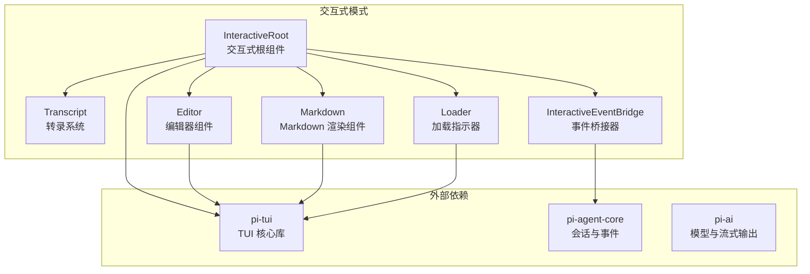
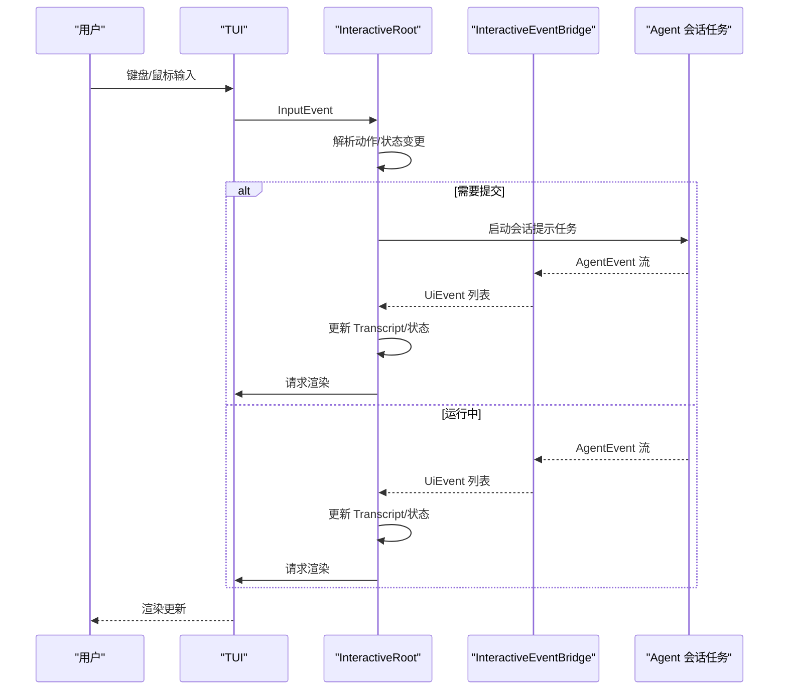
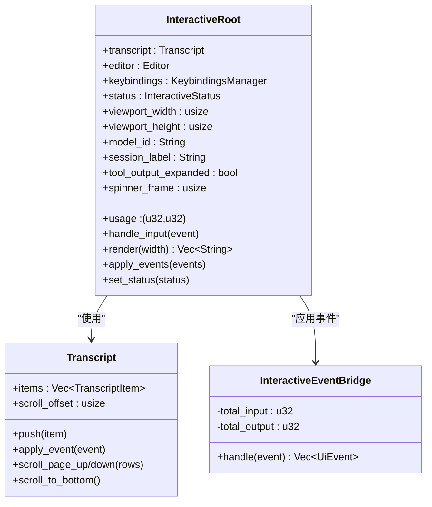
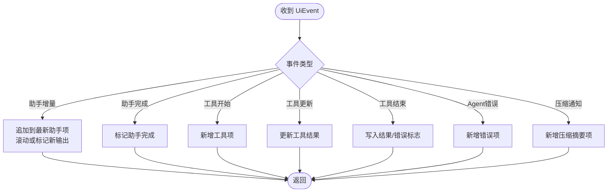
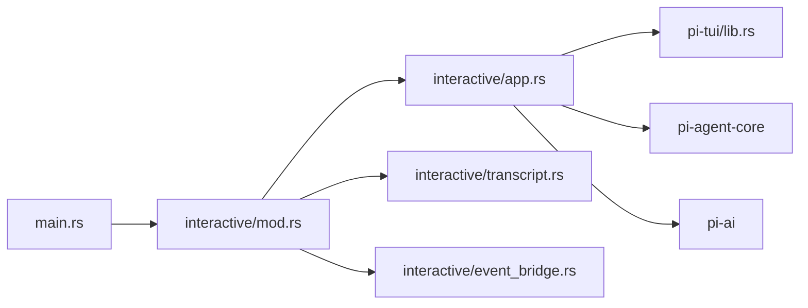

# 交互式模式

<cite>
**本文引用的文件**
- [app.rs](file://crates/pi-coding-agent/src/interactive/app.rs)
- [transcript.rs](file://crates/pi-coding-agent/src/interactive/transcript.rs)
- [event_bridge.rs](file://crates/pi-coding-agent/src/interactive/event_bridge.rs)
- [input.rs](file://crates/pi-coding-agent/src/input.rs)
- [mod.rs](file://crates/pi-coding-agent/src/interactive/mod.rs)
- [lib.rs](file://crates/pi-tui/src/lib.rs)
- [key_hints.rs](file://crates/pi-coding-agent/src/interactive/key_hints.rs)
- [main.rs](file://src/main.rs)
</cite>

## 目录
1. [简介](#简介)
2. [项目结构](#项目结构)
3. [核心组件](#核心组件)
4. [架构总览](#架构总览)
5. [详细组件分析](#详细组件分析)
6. [依赖关系分析](#依赖关系分析)
7. [性能考虑](#性能考虑)
8. [故障排查指南](#故障排查指南)
9. [结论](#结论)
10. [附录](#附录)

## 简介
本文件面向交互式模式的技术文档，聚焦于交互式应用的架构设计与实现细节，包括：
- App 结构体的状态管理与生命周期
- 事件循环与渲染调度机制
- 转录系统（transcript）的消息历史记录、显示格式与滚动行为
- 输入处理机制（键盘事件、粘贴支持、命令解析）
- TUI 集成（组件渲染、布局管理、界面更新）
- 配置选项、快捷键绑定与用户体验优化建议

## 项目结构
交互式模式位于编码代理子项目中，围绕交互式根组件、转录系统、事件桥接器与 TUI 组件协作，形成完整的终端交互闭环。

图表来源
- [app.rs:1731-1887](file://crates/pi-coding-agent/src/interactive/app.rs#L1731-L1887)
- [transcript.rs:48-92](file://crates/pi-coding-agent/src/interactive/transcript.rs#L48-L92)
- [event_bridge.rs:38-97](file://crates/pi-coding-agent/src/interactive/event_bridge.rs#L38-L97)
- [lib.rs:1-61](file://crates/pi-tui/src/lib.rs#L1-L61)

章节来源
- [app.rs:1-120](file://crates/pi-coding-agent/src/interactive/app.rs#L1-L120)
- [mod.rs:1-11](file://crates/pi-coding-agent/src/interactive/mod.rs#L1-L11)
- [lib.rs:1-61](file://crates/pi-tui/src/lib.rs#L1-L61)

## 核心组件
- 交互式根组件（InteractiveRoot）
  - 聚合转录系统、编辑器、键盘绑定、状态机与渲染状态
  - 处理输入事件、触发动作（提交、退出、切换模型等）、驱动渲染
- 转录系统（Transcript）
  - 记录用户、助手、工具、错误与系统消息
  - 支持滚动、新增输出标记与隐藏变化后的视图保持
- 事件桥接器（InteractiveEventBridge）
  - 将底层 Agent 事件转换为 UI 可消费的 UiEvent
  - 统计用量并广播到 UI
- 输入泵（InputPump）
  - 异步从标准输入读取文本块，供事件循环消费
- TUI 集成
  - 使用 pi-tui 的组件与渲染调度器进行高效刷新

章节来源
- [app.rs:522-710](file://crates/pi-coding-agent/src/interactive/app.rs#L522-L710)
- [transcript.rs:48-135](file://crates/pi-coding-agent/src/interactive/transcript.rs#L48-L135)
- [event_bridge.rs:38-116](file://crates/pi-coding-agent/src/interactive/event_bridge.rs#L38-L116)
- [lib.rs:20-61](file://crates/pi-tui/src/lib.rs#L20-L61)

## 架构总览
交互式模式采用“事件驱动 + 组件化渲染”的架构：
- 事件循环在运行时接收来自 InputPump 的输入事件、来自 Agent 的事件以及定时器信号
- 事件桥接器将底层事件映射为 UI 事件，由交互式根组件应用到转录系统
- 渲染调度器按帧率控制刷新，确保 UI 响应流畅

图表来源
- [app.rs:2033-2215](file://crates/pi-coding-agent/src/interactive/app.rs#L2033-L2215)
- [event_bridge.rs:49-97](file://crates/pi-coding-agent/src/interactive/event_bridge.rs#L49-L97)

章节来源
- [app.rs:1951-2215](file://crates/pi-coding-agent/src/interactive/app.rs#L1951-L2215)
- [event_bridge.rs:38-116](file://crates/pi-coding-agent/src/interactive/event_bridge.rs#L38-L116)

## 详细组件分析

### 交互式根组件（InteractiveRoot）
- 状态管理
  - 内部维护交互状态（空闲/运行）、动作队列、滚动命令、剪贴板、主题等
  - 提供 take_* 方法用于事件循环提取一次性动作
- 输入处理
  - 通过 Editor 接收输入并分发到不同处理分支：普通输入、斜杠命令建议、模型选择、会话选择、设置菜单
  - 支持 Ctrl+C 中断、Ctrl+O 展开工具输出、上下翻页滚动
- 渲染
  - render 方法组合转录行、编辑框、菜单或建议列表、底部状态栏
  - 根据工具输出展开状态控制工具结果行数上限
- 交互动作
  - 支持斜杠命令（帮助、设置、模型、导出、导入、复制、重命名、会话信息、热键、克隆、新会话、重载、退出等）
  - 模型轮换（Ctrl+P/Ctrl+Shift+P）

图表来源
- [app.rs:522-710](file://crates/pi-coding-agent/src/interactive/app.rs#L522-L710)
- [transcript.rs:48-92](file://crates/pi-coding-agent/src/interactive/transcript.rs#L48-L92)
- [event_bridge.rs:38-97](file://crates/pi-coding-agent/src/interactive/event_bridge.rs#L38-L97)

章节来源
- [app.rs:1731-1887](file://crates/pi-coding-agent/src/interactive/app.rs#L1731-L1887)
- [app.rs:1281-1300](file://crates/pi-coding-agent/src/interactive/app.rs#L1281-L1300)
- [app.rs:1731-1761](file://crates/pi-coding-agent/src/interactive/app.rs#L1731-L1761)

### 转录系统（Transcript）
- 数据结构
  - TranscriptItem：用户、助手、工具、错误、系统消息
  - Transcript：维护消息列表、滚动偏移与“下方有新输出”标记
- 行为特性
  - 新增助手增量内容时自动滚动至底部或标记“下方有新输出”
  - 工具调用开始/结束/更新分别对应不同的 UI 表现
  - 隐藏变化后保留滚动位置，避免打断阅读体验
- 渲染
  - 用户消息以“用户: 文本”形式渲染
  - 助手消息通过 Markdown 组件渲染
  - 工具消息包含名称、调用 ID、状态与结果，支持截断

图表来源
- [transcript.rs:105-135](file://crates/pi-coding-agent/src/interactive/transcript.rs#L105-L135)
- [transcript.rs:182-217](file://crates/pi-coding-agent/src/interactive/transcript.rs#L182-L217)

章节来源
- [transcript.rs:48-227](file://crates/pi-coding-agent/src/interactive/transcript.rs#L48-L227)

### 事件桥接器（InteractiveEventBridge）
- 职责
  - 将 AgentEvent 映射为 UiEvent（TurnStart、AssistantDelta/Done、ToolStarted/Updated/Finished、AgentError、CompactionNotice、UsageUpdate）
  - 累积用量并在完成时广播
- 关键点
  - LLM 文本增量事件映射为 AssistantDelta
  - 工具调用链路完整映射到 UI 事件序列

章节来源
- [event_bridge.rs:38-116](file://crates/pi-coding-agent/src/interactive/event_bridge.rs#L38-L116)

### 输入处理与命令解析
- 输入泵（InputPump）
  - 从标准输入异步读取字节块，转换为字符串并通过通道传递
  - 支持测试场景下的分块注入
- 编辑器与键盘绑定
  - Editor 负责文本输入、历史、光标与滚动
  - KeybindingsManager 提供按键匹配与提示
- 斜杠命令解析
  - 以“/”开头的单行命令解析为命令名与参数
  - 内置命令集合覆盖帮助、设置、模型、导出/导入、复制、重命名、会话信息、热键、克隆、新会话、重载、退出等
- 快捷键提示
  - key_hints 提供按键提示格式化与回退策略

章节来源
- [app.rs:85-127](file://crates/pi-coding-agent/src/interactive/app.rs#L85-L127)
- [app.rs:325-350](file://crates/pi-coding-agent/src/interactive/app.rs#L325-L350)
- [key_hints.rs:1-115](file://crates/pi-coding-agent/src/interactive/key_hints.rs#L1-L115)

### TUI 集成与渲染
- 组件体系
  - Editor、Markdown、Loader、Input、SelectList 等组件由 pi-tui 提供
  - 主题与样式统一由 TuiTheme 管理
- 渲染调度
  - RenderScheduler 控制刷新节奏（默认约 16ms 帧间隔）
  - flush_render_if_ready 在到达刷新时机时执行一次渲染
- 布局与更新
  - InteractiveRoot.render 组合转录行、编辑框、菜单/建议、底部状态栏
  - 工具输出可折叠/展开，避免长输出阻塞界面

章节来源
- [lib.rs:20-61](file://crates/pi-tui/src/lib.rs#L20-L61)
- [app.rs:1731-1761](file://crates/pi-coding-agent/src/interactive/app.rs#L1731-L1761)
- [app.rs:2279-2300](file://crates/pi-coding-agent/src/interactive/app.rs#L2279-L2300)

### 会话与资源上下文
- PromptContext
  - 包含模型、工具、系统提示、会话目标、主题、模型轮换与会话选择等
  - 由构建函数根据 CLI 参数与配置加载
- 会话选择
  - 支持按 ID、名称、路径、工作目录模糊筛选
- 导出/导入
  - 支持导出为 HTML 或 JSONL；导入 JSONL 并恢复会话

章节来源
- [app.rs:129-150](file://crates/pi-coding-agent/src/interactive/app.rs#L129-L150)
- [app.rs:2479-2605](file://crates/pi-coding-agent/src/interactive/app.rs#L2479-L2605)
- [app.rs:2607-2654](file://crates/pi-coding-agent/src/interactive/app.rs#L2607-L2654)

## 依赖关系分析
- 交互式模式依赖
  - pi-tui：组件、输入、渲染调度、主题
  - pi-agent-core：会话、事件、存储
  - pi-ai：模型、流式响应
- 内部模块
  - interactive 子模块导出 run_interactive_mode、Transcript、UiEvent 等
  - main.rs 在非 RPC 模式下进入 CLI 流程，TTY 检测失败则直接退出

图表来源
- [main.rs:1-60](file://src/main.rs#L1-L60)
- [mod.rs:1-11](file://crates/pi-coding-agent/src/interactive/mod.rs#L1-L11)
- [lib.rs:1-61](file://crates/pi-tui/src/lib.rs#L1-L61)

章节来源
- [main.rs:1-60](file://src/main.rs#L1-L60)
- [mod.rs:1-11](file://crates/pi-coding-agent/src/interactive/mod.rs#L1-L11)

## 性能考虑
- 渲染节流
  - 使用 RenderScheduler 控制刷新频率，避免过度绘制
- 滚动优化
  - 隐藏变化后仅计算相对行数差值，减少重排成本
- 工具输出截断
  - 默认仅展示少量工具输出行，长输出可展开查看
- 输入缓冲
  - StdinBuffer 对粘滞转义序列进行延迟合并，降低抖动

章节来源
- [app.rs:2250-2277](file://crates/pi-coding-agent/src/interactive/app.rs#L2250-L2277)
- [app.rs:2782-2837](file://crates/pi-coding-agent/src/interactive/app.rs#L2782-L2837)

## 故障排查指南
- 无法进入交互式模式
  - 现象：提示需要 TTY
  - 排查：确认标准输入/输出是否为终端
- 无按键响应
  - 现象：键盘无反应
  - 排查：检查 TUI_KEYBINDINGS 是否正确加载；确认终端能力与颜色级别
- 会话导入失败
  - 现象：/import 报错
  - 排查：确认 JSONL 文件存在且格式有效；检查路径是否绝对或相对于当前工作目录
- 工具输出过长导致卡顿
  - 现象：界面卡顿
  - 措施：使用 Ctrl+O 展开查看，或调整终端宽度以影响截断阈值
- 模型不可用
  - 现象：/model 无法选择
  - 排查：确认已配置相应提供商密钥；检查可用模型列表

章节来源
- [app.rs:52-74](file://crates/pi-coding-agent/src/interactive/app.rs#L52-L74)
- [app.rs:811-842](file://crates/pi-coding-agent/src/interactive/app.rs#L811-L842)
- [app.rs:1407-1483](file://crates/pi-coding-agent/src/interactive/app.rs#L1407-L1483)

## 结论
交互式模式通过清晰的组件边界与事件驱动架构，实现了高效的终端交互体验。其核心在于：
- 以 InteractiveRoot 为中心的状态与输入处理
- 以 Transcript 为核心的转录与滚动管理
- 以 RenderScheduler 为核心的渲染节流
- 以斜杠命令与键盘绑定为核心的易用性设计

该架构既保证了扩展性（新增命令、主题、组件），也兼顾了性能与可维护性。

## 附录

### 快捷键与命令速查
- 提交/换行：提交输入、插入换行
- 中断/退出：中断运行或退出程序
- 展开工具输出：切换工具输出折叠/展开
- 上/下/翻页：在编辑器与菜单间导航
- 模型轮换：Ctrl+P/Ctrl+Shift+P 循环模型
- 斜杠命令：/help、/settings、/model、/export、/import、/copy、/name、/session、/hotkeys、/clone、/new、/reload、/quit 等

章节来源
- [app.rs:1232-1243](file://crates/pi-coding-agent/src/interactive/app.rs#L1232-L1243)
- [key_hints.rs:27-61](file://crates/pi-coding-agent/src/interactive/key_hints.rs#L27-L61)

### 配置与环境建议
- 主题
  - 通过配置或资源加载选择深色/浅色主题，或自定义主题
- 模型轮换
  - 使用 --models 指定轮换范围，结合 Provider 密钥启用可用模型
- 会话持久化
  - 启用会话功能后，支持导入/导出会话 JSONL，便于复用与分享
- 粘贴与图片
  - 支持 @file 引用与图片内联（经尺寸压缩与编码），提升多模态输入体验

章节来源
- [app.rs:2521-2528](file://crates/pi-coding-agent/src/interactive/app.rs#L2521-L2528)
- [input.rs:46-126](file://crates/pi-coding-agent/src/input.rs#L46-L126)
- [app.rs:2656-2667](file://crates/pi-coding-agent/src/interactive/app.rs#L2656-L2667)