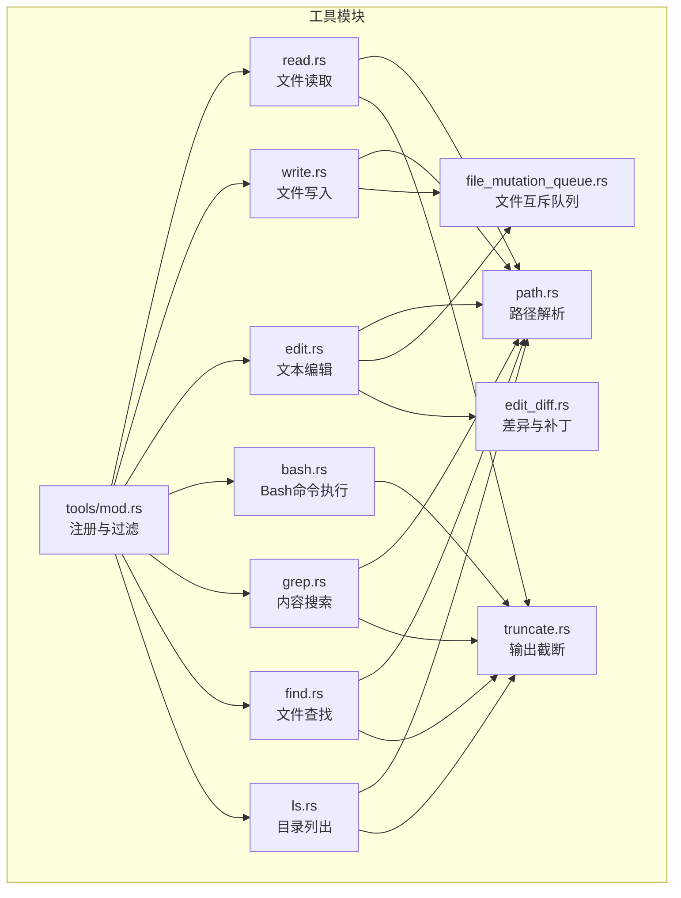
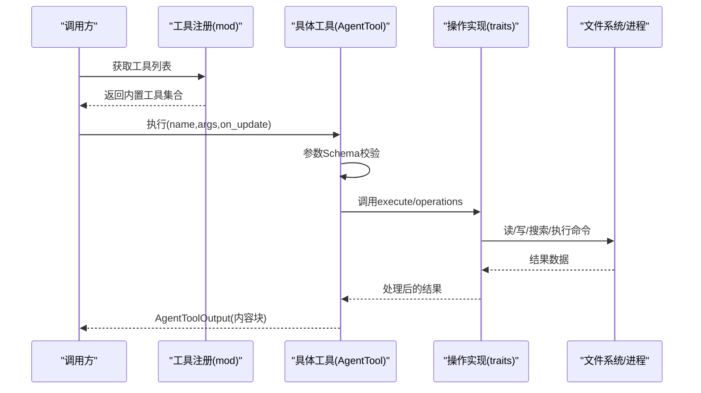
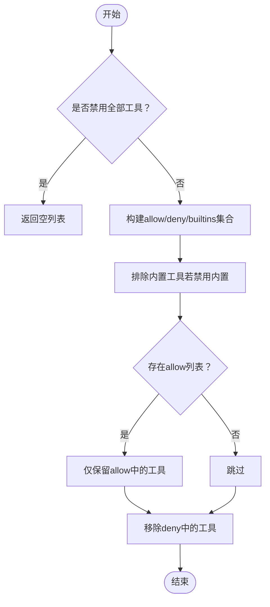
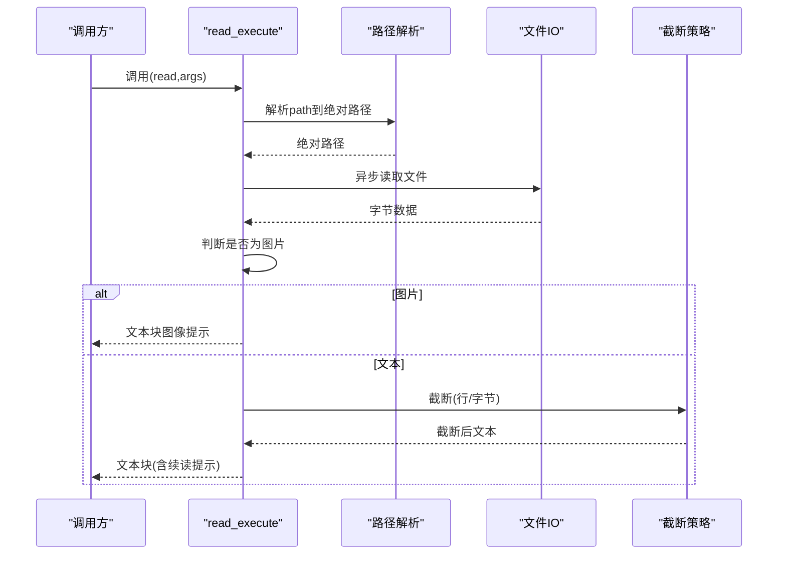
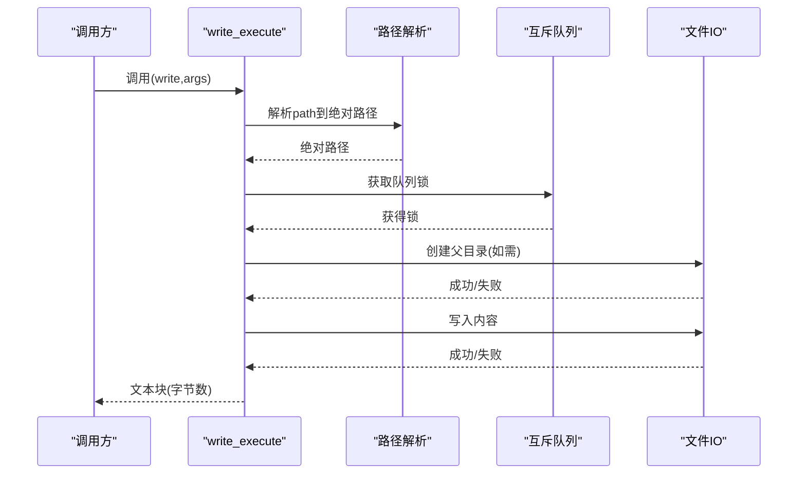
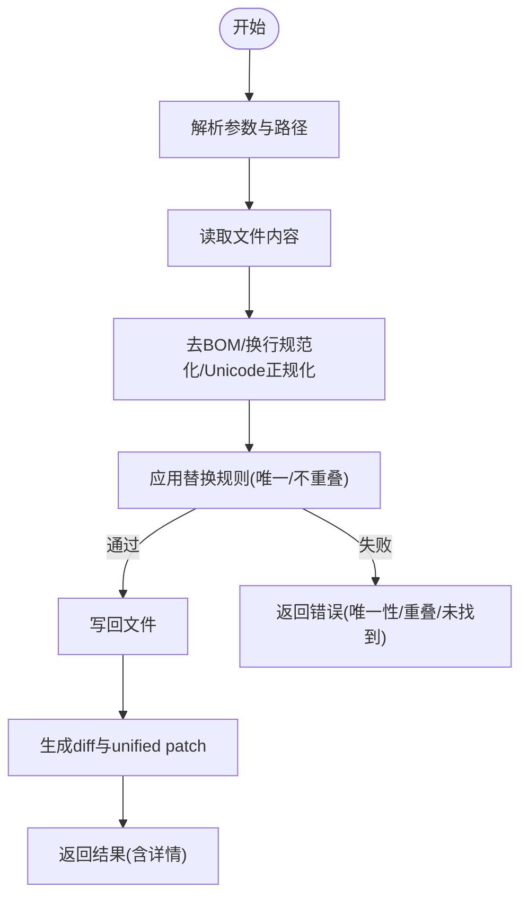
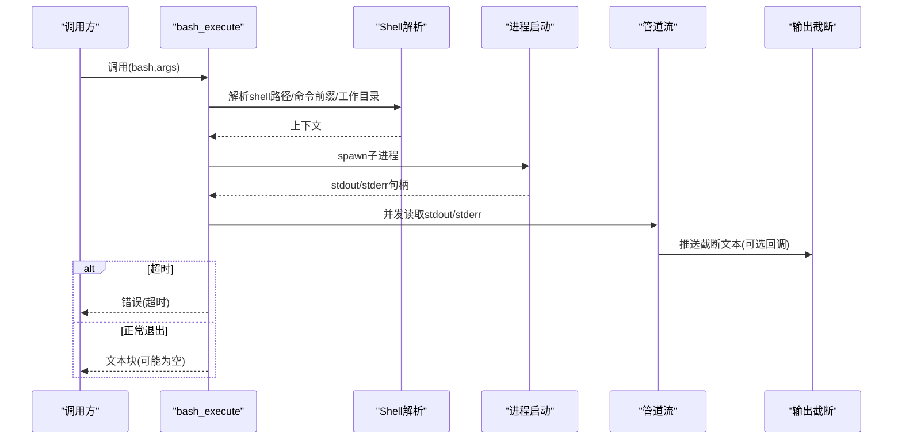
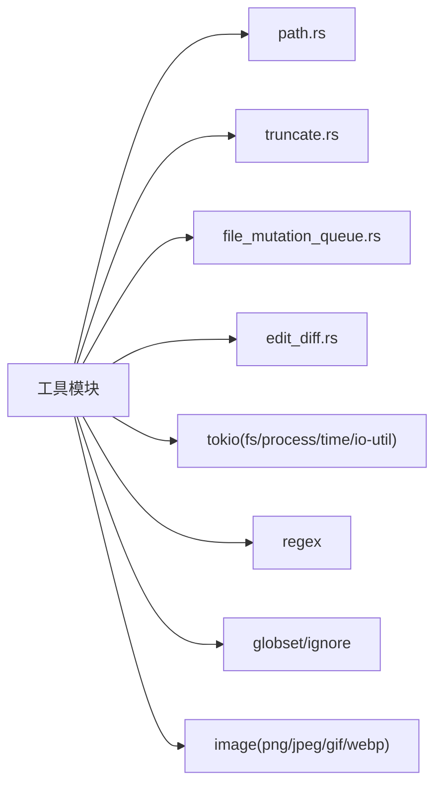

# 内置工具系统

<cite>
**本文引用的文件**
- [crates/pi-coding-agent/src/tools/mod.rs](file://crates/pi-coding-agent/src/tools/mod.rs)
- [crates/pi-coding-agent/src/tools/read.rs](file://crates/pi-coding-agent/src/tools/read.rs)
- [crates/pi-coding-agent/src/tools/write.rs](file://crates/pi-coding-agent/src/tools/write.rs)
- [crates/pi-coding-agent/src/tools/edit.rs](file://crates/pi-coding-agent/src/tools/edit.rs)
- [crates/pi-coding-agent/src/tools/bash.rs](file://crates/pi-coding-agent/src/tools/bash.rs)
- [crates/pi-coding-agent/src/tools/grep.rs](file://crates/pi-coding-agent/src/tools/grep.rs)
- [crates/pi-coding-agent/src/tools/find.rs](file://crates/pi-coding-agent/src/tools/find.rs)
- [crates/pi-coding-agent/src/tools/ls.rs](file://crates/pi-coding-agent/src/tools/ls.rs)
- [crates/pi-coding-agent/src/tools/path.rs](file://crates/pi-coding-agent/src/tools/path.rs)
- [crates/pi-coding-agent/src/tools/truncate.rs](file://crates/pi-coding-agent/src/tools/truncate.rs)
- [crates/pi-coding-agent/src/tools/file_mutation_queue.rs](file://crates/pi-coding-agent/src/tools/file_mutation_queue.rs)
- [crates/pi-coding-agent/src/tools/edit_diff.rs](file://crates/pi-coding-agent/src/tools/edit_diff.rs)
- [crates/pi-coding-agent/Cargo.toml](file://crates/pi-coding-agent/Cargo.toml)
</cite>

## 目录
1. [简介](#简介)
2. [项目结构](#项目结构)
3. [核心组件](#核心组件)
4. [架构总览](#架构总览)
5. [详细组件分析](#详细组件分析)
6. [依赖分析](#依赖分析)
7. [性能考虑](#性能考虑)
8. [故障排查指南](#故障排查指南)
9. [结论](#结论)
10. [附录：自定义工具开发指南](#附录自定义工具开发指南)

## 简介
本文件面向内置工具系统，系统性阐述其整体架构与实现细节，重点覆盖以下方面：
- AgentTool trait 的设计与工具注册机制
- 工具过滤系统（允许/拒绝列表、禁用内置工具等）
- 每个内置工具的功能、参数与使用方式
- 安全机制（权限控制、路径限制、资源访问保护）
- 自定义工具开发指南（接口实现、参数校验、错误处理）
- 最佳实践与安全建议

## 项目结构
内置工具位于编码代理子工程中，采用模块化组织，每个工具独立实现，通过统一入口进行注册，并共享通用能力（路径解析、截断策略、文件互斥队列、差异生成）。

**图表来源**
- [crates/pi-coding-agent/src/tools/mod.rs:17-27](file://crates/pi-coding-agent/src/tools/mod.rs#L17-L27)
- [crates/pi-coding-agent/src/tools/read.rs:161-183](file://crates/pi-coding-agent/src/tools/read.rs#L161-L183)
- [crates/pi-coding-agent/src/tools/write.rs:89-111](file://crates/pi-coding-agent/src/tools/write.rs#L89-L111)
- [crates/pi-coding-agent/src/tools/edit.rs:311-329](file://crates/pi-coding-agent/src/tools/edit.rs#L311-L329)
- [crates/pi-coding-agent/src/tools/bash.rs:499-521](file://crates/pi-coding-agent/src/tools/bash.rs#L499-L521)
- [crates/pi-coding-agent/src/tools/grep.rs:318-331](file://crates/pi-coding-agent/src/tools/grep.rs#L318-L331)
- [crates/pi-coding-agent/src/tools/find.rs:189-202](file://crates/pi-coding-agent/src/tools/find.rs#L189-L202)
- [crates/pi-coding-agent/src/tools/ls.rs:115-128](file://crates/pi-coding-agent/src/tools/ls.rs#L115-L128)
- [crates/pi-coding-agent/src/tools/path.rs:10-26](file://crates/pi-coding-agent/src/tools/path.rs#L10-L26)
- [crates/pi-coding-agent/src/tools/truncate.rs:75-133](file://crates/pi-coding-agent/src/tools/truncate.rs#L75-L133)
- [crates/pi-coding-agent/src/tools/file_mutation_queue.rs:56-72](file://crates/pi-coding-agent/src/tools/file_mutation_queue.rs#L56-L72)
- [crates/pi-coding-agent/src/tools/edit_diff.rs:80-258](file://crates/pi-coding-agent/src/tools/edit_diff.rs#L80-L258)

**章节来源**
- [crates/pi-coding-agent/src/tools/mod.rs:17-51](file://crates/pi-coding-agent/src/tools/mod.rs#L17-L51)

## 核心组件
- 工具注册与过滤
  - 注册函数集中返回内置工具集合，便于统一装配。
  - 过滤器支持白名单/黑名单、禁用全部或禁用内置工具，按名称过滤。
- AgentTool 统一接口
  - 每个工具以 AgentTool 形式暴露名称、描述、JSON Schema 参数、执行模式与执行函数。
- 共享基础设施
  - 路径解析：支持相对路径、绝对路径与波浪号展开。
  - 输出截断：统一的行数与字节上限策略，避免大输出阻塞。
  - 文件互斥队列：保证对同一文件的并发写入/编辑串行化，避免竞态。
  - 编辑差异：生成可读 diff 与标准 unified patch，辅助审计与回溯。

**章节来源**
- [crates/pi-coding-agent/src/tools/mod.rs:17-51](file://crates/pi-coding-agent/src/tools/mod.rs#L17-L51)
- [crates/pi-coding-agent/src/tools/path.rs:10-26](file://crates/pi-coding-agent/src/tools/path.rs#L10-L26)
- [crates/pi-coding-agent/src/tools/truncate.rs:75-133](file://crates/pi-coding-agent/src/tools/truncate.rs#L75-L133)
- [crates/pi-coding-agent/src/tools/file_mutation_queue.rs:56-72](file://crates/pi-coding-agent/src/tools/file_mutation_queue.rs#L56-L72)
- [crates/pi-coding-agent/src/tools/edit_diff.rs:80-258](file://crates/pi-coding-agent/src/tools/edit_diff.rs#L80-L258)

## 架构总览
下图展示工具系统的核心交互：调用方通过 AgentTool 接口提交参数，工具内部完成参数校验、路径解析、资源访问与输出截断，最终封装为内容块返回。

**图表来源**
- [crates/pi-coding-agent/src/tools/mod.rs:17-27](file://crates/pi-coding-agent/src/tools/mod.rs#L17-L27)
- [crates/pi-coding-agent/src/tools/read.rs:161-183](file://crates/pi-coding-agent/src/tools/read.rs#L161-L183)
- [crates/pi-coding-agent/src/tools/write.rs:89-111](file://crates/pi-coding-agent/src/tools/write.rs#L89-L111)
- [crates/pi-coding-agent/src/tools/edit.rs:311-329](file://crates/pi-coding-agent/src/tools/edit.rs#L311-L329)
- [crates/pi-coding-agent/src/tools/bash.rs:499-521](file://crates/pi-coding-agent/src/tools/bash.rs#L499-L521)
- [crates/pi-coding-agent/src/tools/grep.rs:318-331](file://crates/pi-coding-agent/src/tools/grep.rs#L318-L331)
- [crates/pi-coding-agent/src/tools/find.rs:189-202](file://crates/pi-coding-agent/src/tools/find.rs#L189-L202)
- [crates/pi-coding-agent/src/tools/ls.rs:115-128](file://crates/pi-coding-agent/src/tools/ls.rs#L115-L128)

## 详细组件分析

### 工具注册与过滤
- 注册函数将所有内置工具汇聚为 AgentTool 列表，便于上层装配。
- 过滤函数支持：
  - no_tools：禁用所有工具
  - allow/deny：基于名称的白/黑名单
  - no_builtin_tools：禁用内置工具集
- 内置工具集包含：read、write、edit、bash、grep、find、ls。

**图表来源**
- [crates/pi-coding-agent/src/tools/mod.rs:37-50](file://crates/pi-coding-agent/src/tools/mod.rs#L37-L50)

**章节来源**
- [crates/pi-coding-agent/src/tools/mod.rs:17-51](file://crates/pi-coding-agent/src/tools/mod.rs#L17-L51)

### 文件读取工具（read）
- 功能要点
  - 支持相对/绝对路径与波浪号展开；自动识别图片类型并提示不支持在无头模式下查看图像内容。
  - 支持 offset/limit 分页读取，避免一次性加载大文件。
  - 默认截断策略：最多 2000 行或 50KB，优先触发者生效；首行超限会给出建议使用 bash 提取。
- 参数
  - path：必填，字符串
  - offset：可选，起始行（1-indexed）
  - limit：可选，最大行数
- 执行流程
  - 解析路径 → 读取原始字节 → 若为图片类型则返回提示 → 否则按行切分并应用截断策略 → 返回内容块

**图表来源**
- [crates/pi-coding-agent/src/tools/read.rs:64-159](file://crates/pi-coding-agent/src/tools/read.rs#L64-L159)
- [crates/pi-coding-agent/src/tools/path.rs:10-26](file://crates/pi-coding-agent/src/tools/path.rs#L10-L26)
- [crates/pi-coding-agent/src/tools/truncate.rs:75-133](file://crates/pi-coding-agent/src/tools/truncate.rs#L75-L133)

**章节来源**
- [crates/pi-coding-agent/src/tools/read.rs:11-183](file://crates/pi-coding-agent/src/tools/read.rs#L11-L183)

### 文件写入工具（write）
- 功能要点
  - 创建目标文件（不存在则创建），自动创建父目录；写入前通过文件互斥队列确保串行化。
  - 成功后返回写入字节数。
- 参数
  - path：必填，字符串
  - content：必填，字符串
- 执行流程
  - 解析路径 → 创建父目录（如需）→ 加入互斥队列 → 写入内容 → 返回成功消息

**图表来源**
- [crates/pi-coding-agent/src/tools/write.rs:61-87](file://crates/pi-coding-agent/src/tools/write.rs#L61-L87)
- [crates/pi-coding-agent/src/tools/path.rs:10-26](file://crates/pi-coding-agent/src/tools/path.rs#L10-L26)
- [crates/pi-coding-agent/src/tools/file_mutation_queue.rs:56-72](file://crates/pi-coding-agent/src/tools/file_mutation_queue.rs#L56-L72)

**章节来源**
- [crates/pi-coding-agent/src/tools/write.rs:9-111](file://crates/pi-coding-agent/src/tools/write.rs#L9-L111)

### 文本编辑工具（edit）
- 功能要点
  - 基于精确文本替换，要求每段 oldText 在原文中唯一且非重叠；支持多处替换合并。
  - 自动处理 CRLF/LF、BOM、Unicode 规范化与空白裁剪，减少误匹配。
  - 成功后生成 diff 与 unified patch，便于审计。
- 参数
  - path：必填，字符串
  - edits：必填，数组，元素含 oldText/newText；或直接提供 oldText/newText
- 执行流程
  - 解析路径 → 读取文件 → 去除BOM、检测换行符 → 正规化内容 → 应用替换规则（唯一性、非重叠、无重复）→ 写回 → 生成diff/patch → 返回结果

**图表来源**
- [crates/pi-coding-agent/src/tools/edit.rs:266-309](file://crates/pi-coding-agent/src/tools/edit.rs#L266-L309)
- [crates/pi-coding-agent/src/tools/edit_diff.rs:80-258](file://crates/pi-coding-agent/src/tools/edit_diff.rs#L80-L258)

**章节来源**
- [crates/pi-coding-agent/src/tools/edit.rs:11-329](file://crates/pi-coding-agent/src/tools/edit.rs#L11-L329)

### Bash 命令工具（bash）
- 功能要点
  - 在工作目录执行 bash 命令，合并 stdout/stderr；默认截断策略：最后 2000 行或 50KB。
  - 支持超时终止，跨平台进程树清理（Unix 使用进程组）。
  - 可配置 shell 路径与命令前缀，支持 spawn 钩子定制环境。
  - 支持实时更新回调，边执行边推送截断后的中间结果。
- 参数
  - command：必填，字符串
  - timeout：可选，秒
- 执行流程
  - 解析命令与选项 → 解析工作目录与环境 → 选择shell → 启动子进程 → 流式读取管道 → 实时截断与更新 → 超时/退出码处理 → 返回最终结果

**图表来源**
- [crates/pi-coding-agent/src/tools/bash.rs:284-452](file://crates/pi-coding-agent/src/tools/bash.rs#L284-L452)

**章节来源**
- [crates/pi-coding-agent/src/tools/bash.rs:12-521](file://crates/pi-coding-agent/src/tools/bash.rs#L12-L521)

### 搜索工具（grep）
- 功能要点
  - 支持正则或字面量匹配，大小写可选；支持上下文行数；受 .gitignore 影响。
  - 输出按文件名排序，长行截断至 500 字符；匹配总数与字节上限各 100 条与 50KB。
- 参数
  - pattern：必填，字符串
  - path：可选，默认当前目录
  - glob：可选，文件过滤通配
  - ignoreCase/literal/context/limit：可选
- 执行流程
  - 解析路径与选项 → 编译正则/通配 → 遍历候选文件 → 匹配并收集上下文 → 截断与汇总 → 返回文本块

**章节来源**
- [crates/pi-coding-agent/src/tools/grep.rs:11-331](file://crates/pi-coding-agent/src/tools/grep.rs#L11-L331)

### 查找工具（find）
- 功能要点
  - 基于 glob 模式查找文件，尊重 .gitignore；输出相对路径，目录末尾带斜杠。
  - 结果按字母序排序，最多 1000 条与 50KB。
- 参数
  - pattern：必填，glob
  - path：可选，默认当前目录
  - limit：可选
- 执行流程
  - 解析路径与通配 → 遍历目录 → 过滤匹配 → 排序与截断 → 返回文本块

**章节来源**
- [crates/pi-coding-agent/src/tools/find.rs:10-202](file://crates/pi-coding-agent/src/tools/find.rs#L10-L202)

### 列表工具（ls）
- 功能要点
  - 列出目录内容，包含隐藏文件；目录项加斜杠；按字母序排序。
  - 最多 500 条与 50KB。
- 参数
  - path：可选，默认当前目录
  - limit：可选
- 执行流程
  - 解析路径 → 读取目录 → 生成条目 → 排序与截断 → 返回文本块

**章节来源**
- [crates/pi-coding-agent/src/tools/ls.rs:8-128](file://crates/pi-coding-agent/src/tools/ls.rs#L8-L128)

## 依赖分析
- 工具模块依赖
  - 路径解析：统一由 path.rs 提供
  - 输出截断：统一由 truncate.rs 提供
  - 文件互斥：write/edit 使用 file_mutation_queue.rs
  - 编辑差异：edit 使用 edit_diff.rs
  - Bash 工具：依赖 tokio 进程与异步IO
- 外部依赖
  - 正则表达式、glob 匹配、忽略规则、图像解码、Unicode 规范化、Tokio 运行时等

**图表来源**
- [crates/pi-coding-agent/Cargo.toml:6-22](file://crates/pi-coding-agent/Cargo.toml#L6-L22)

**章节来源**
- [crates/pi-coding-agent/Cargo.toml:6-22](file://crates/pi-coding-agent/Cargo.toml#L6-L22)

## 性能考虑
- I/O 与并发
  - 文件读写采用异步 IO，避免阻塞；互斥队列确保对同一文件的串行化，降低竞态与冲突。
  - Bash 工具采用双通道并发读取 stdout/stderr，结合缓冲区与截断策略，兼顾实时性与内存占用。
- 截断策略
  - 统一的行数与字节上限，优先采用“先到先得”的截断策略，避免一次性加载大输出。
- 搜索效率
  - grep/find 使用 ignore 与 .gitignore 过滤，减少无关文件扫描；find/grep 对输出也做截断与通知。
- Unicode 与规范化
  - 编辑工具对输入进行 Unicode 规范化与空白裁剪，降低误匹配概率，提升稳定性。

[本节为通用指导，无需特定文件来源]

## 故障排查指南
- 路径相关
  - 波浪号展开失败时回退原路径；相对路径拼接工作目录；请确认路径存在且可访问。
- 文件互斥
  - 多次对同一文件进行写入/编辑时，可能出现等待；检查是否存在长时间运行的同类操作。
- Bash 超时与退出码
  - 超时会主动终止进程树；退出码非零会返回错误；检查命令语法与工作目录。
- 搜索与查找
  - 若未匹配，请确认 glob/正则是否正确；注意大小写与 .gitignore 过滤。
- 编辑替换
  - “未找到/重复/重叠”等错误通常源于 oldText 不唯一或上下文不足；请提供更明确的上下文。

**章节来源**
- [crates/pi-coding-agent/src/tools/path.rs:10-26](file://crates/pi-coding-agent/src/tools/path.rs#L10-L26)
- [crates/pi-coding-agent/src/tools/file_mutation_queue.rs:56-72](file://crates/pi-coding-agent/src/tools/file_mutation_queue.rs#L56-L72)
- [crates/pi-coding-agent/src/tools/bash.rs:422-452](file://crates/pi-coding-agent/src/tools/bash.rs#L422-L452)
- [crates/pi-coding-agent/src/tools/grep.rs:282-316](file://crates/pi-coding-agent/src/tools/grep.rs#L282-L316)
- [crates/pi-coding-agent/src/tools/find.rs:153-187](file://crates/pi-coding-agent/src/tools/find.rs#L153-L187)
- [crates/pi-coding-agent/src/tools/edit.rs:166-188](file://crates/pi-coding-agent/src/tools/edit.rs#L166-L188)

## 结论
内置工具系统以统一的 AgentTool 接口为核心，辅以路径解析、截断策略、文件互斥与差异生成等基础设施，实现了高内聚、低耦合的工具生态。通过注册与过滤机制，系统既可灵活启用/禁用工具，又能在安全性与可用性之间取得平衡。推荐在生产环境中配合严格的路径限制与超时策略，确保稳定与安全。

[本节为总结，无需特定文件来源]

## 附录：自定义工具开发指南
- 接口实现
  - 定义参数 JSON Schema（properties/required/additionalProperties）
  - 实现执行函数（异步），接收参数与可选更新回调
  - 将工具包装为 AgentTool，设置名称、描述、参数与执行模式
- 参数校验
  - 必填字段必须存在且类型正确；对路径类参数使用统一解析逻辑
  - 对外部命令/文件操作，提前校验工作目录与权限
- 错误处理
  - 明确区分用户输入错误与系统错误，返回可读性强的消息
  - 对潜在危险操作（如 Bash）提供超时与终止策略
- 安全建议
  - 严格限制工作目录范围，避免越权访问
  - 对 Bash 命令进行最小权限原则与沙箱化（如可行）
  - 对文件写入/编辑使用互斥队列，防止竞态
  - 对大输出使用截断策略，避免内存与网络压力
- 最佳实践
  - 提供清晰的使用示例与参数说明
  - 对复杂工具（如搜索/编辑）提供上下文与分页能力
  - 记录变更轨迹（如 diff/partial output），便于审计与回滚

[本节为通用指导，无需特定文件来源]