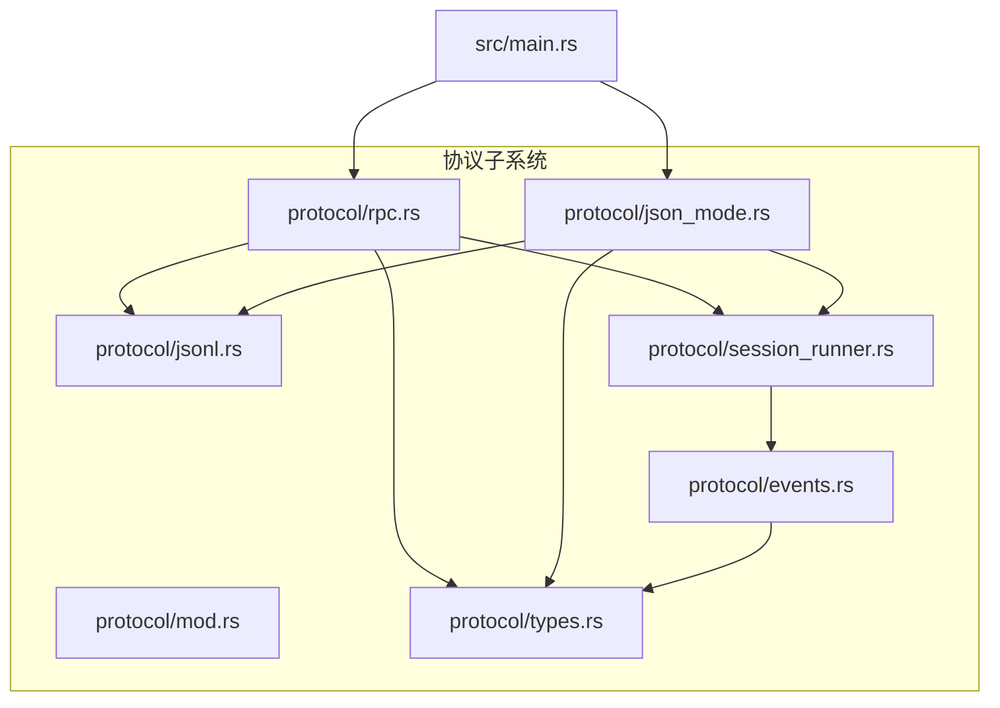
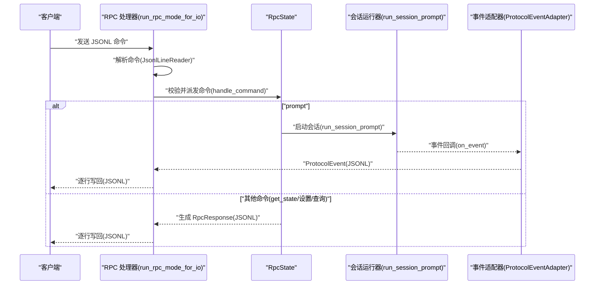
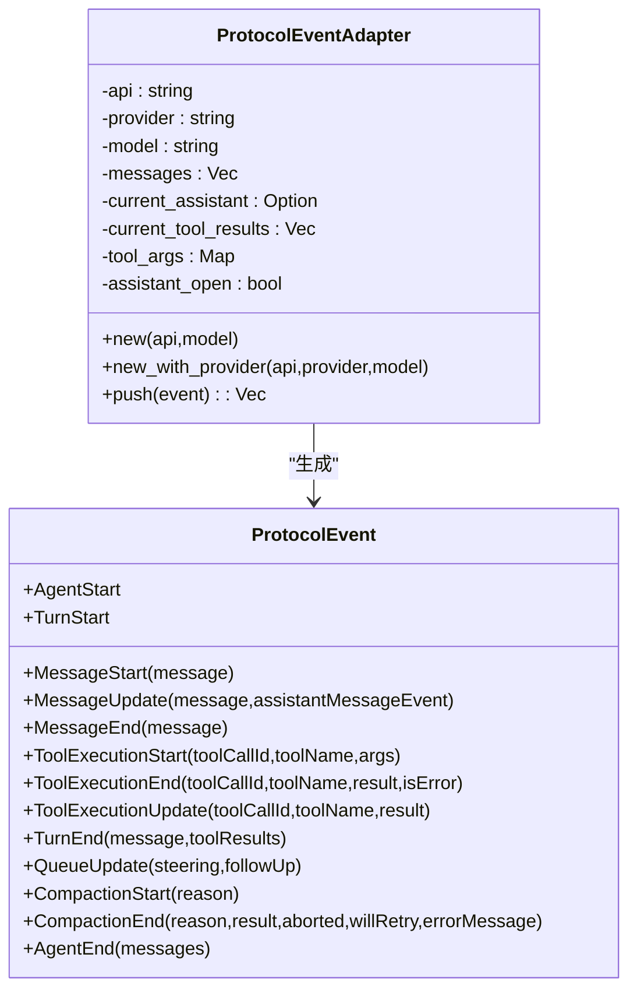
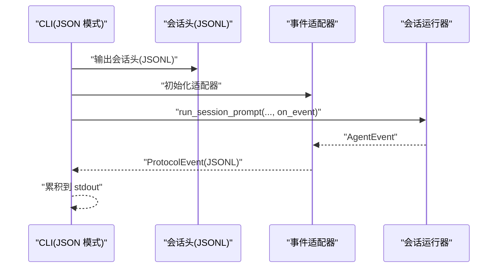
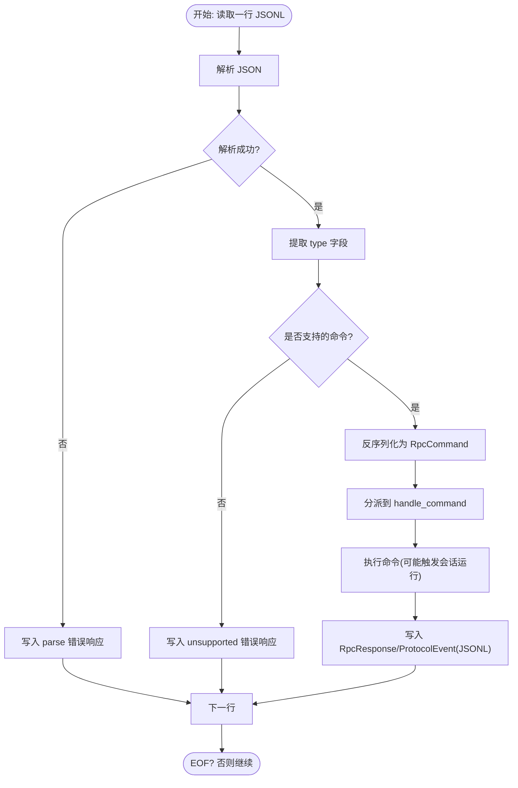
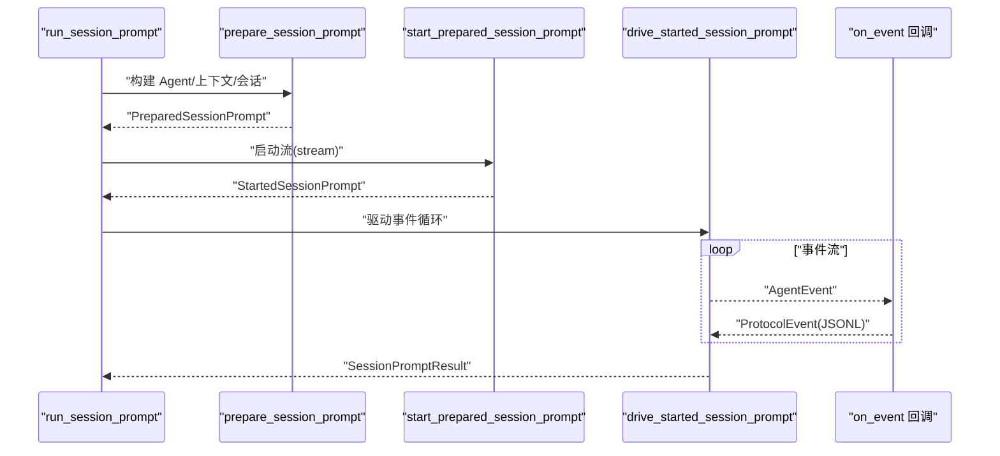
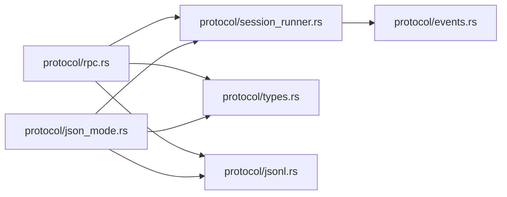

# 协议与 RPC 支持

<cite>
**本文引用的文件**   
- [crates/pi-coding-agent/src/protocol/mod.rs](file://crates/pi-coding-agent/src/protocol/mod.rs)
- [crates/pi-coding-agent/src/protocol/events.rs](file://crates/pi-coding-agent/src/protocol/events.rs)
- [crates/pi-coding-agent/src/protocol/json_mode.rs](file://crates/pi-coding-agent/src/protocol/json_mode.rs)
- [crates/pi-coding-agent/src/protocol/jsonl.rs](file://crates/pi-coding-agent/src/protocol/jsonl.rs)
- [crates/pi-coding-agent/src/protocol/rpc.rs](file://crates/pi-coding-agent/src/protocol/rpc.rs)
- [crates/pi-coding-agent/src/protocol/session_runner.rs](file://crates/pi-coding-agent/src/protocol/session_runner.rs)
- [crates/pi-coding-agent/src/protocol/types.rs](file://crates/pi-coding-agent/src/protocol/types.rs)
- [crates/pi-coding-agent/src/main.rs](file://crates/pi-coding-agent/src/main.rs)
- [crates/pi-coding-agent/src/runtime.rs](file://crates/pi-coding-agent/src/runtime.rs)
- [crates/pi-coding-agent/tests/protocol_events.rs](file://crates/pi-coding-agent/tests/protocol_events.rs)
- [crates/pi-coding-agent/tests/rpc_mode.rs](file://crates/pi-coding-agent/tests/rpc_mode.rs)
</cite>

## 目录
1. [引言](#引言)
2. [项目结构](#项目结构)
3. [核心组件](#核心组件)
4. [架构总览](#架构总览)
5. [详细组件分析](#详细组件分析)
6. [依赖关系分析](#依赖关系分析)
7. [性能考虑](#性能考虑)
8. [故障排查指南](#故障排查指南)
9. [结论](#结论)
10. [附录](#附录)

## 引言
本文件面向“协议与 RPC 支持”，系统性阐述协议模块的整体架构与实现，重点覆盖以下方面：
- JSON 模式：会话头、事件流与 JSONL 序列化/反序列化的运行机制
- RPC 协议：命令/响应模型、错误处理、连接管理与状态机
- 事件系统：事件类型定义、事件适配器、订阅与转发
- 扩展指南：如何扩展事件类型、自定义事件处理与性能优化建议

## 项目结构
协议子系统位于编码代理（pi-coding-agent）中，采用按功能域划分的模块组织：
- protocol 子模块：事件、JSON 模式、RPC、会话运行器、类型定义
- 运行时与入口：main 负责 CLI/RPC 入口分发；runtime 提供模型选择与配置构建
- 测试：覆盖事件映射、RPC 命令处理与错误路径

图表来源
- [crates/pi-coding-agent/src/protocol/mod.rs:1-7](file://crates/pi-coding-agent/src/protocol/mod.rs#L1-L7)
- [crates/pi-coding-agent/src/protocol/events.rs:1-310](file://crates/pi-coding-agent/src/protocol/events.rs#L1-L310)
- [crates/pi-coding-agent/src/protocol/json_mode.rs:1-75](file://crates/pi-coding-agent/src/protocol/json_mode.rs#L1-L75)
- [crates/pi-coding-agent/src/protocol/jsonl.rs:1-72](file://crates/pi-coding-agent/src/protocol/jsonl.rs#L1-L72)
- [crates/pi-coding-agent/src/protocol/rpc.rs:1-579](file://crates/pi-coding-agent/src/protocol/rpc.rs#L1-L579)
- [crates/pi-coding-agent/src/protocol/session_runner.rs:1-436](file://crates/pi-coding-agent/src/protocol/session_runner.rs#L1-L436)
- [crates/pi-coding-agent/src/protocol/types.rs:1-268](file://crates/pi-coding-agent/src/protocol/types.rs#L1-L268)
- [crates/pi-coding-agent/src/main.rs:1-60](file://crates/pi-coding-agent/src/main.rs#L1-L60)

章节来源
- [crates/pi-coding-agent/src/protocol/mod.rs:1-7](file://crates/pi-coding-agent/src/protocol/mod.rs#L1-L7)

## 核心组件
- 事件类型与适配器
  - ProtocolEvent：统一的协议事件枚举，涵盖会话生命周期、消息流、工具调用、队列更新、压缩等
  - ProtocolEventAdapter：将底层 AgentEvent 映射为 ProtocolEvent，并维护会话上下文（消息、当前助手、工具参数等）
- JSON 模式
  - 以 JSONL 行式输出会话头与事件，支持一次性打印模式
- RPC 模式
  - 基于 JSONL 的命令/响应协议，支持提示、引导、后续、中止、状态查询、自动压缩等控制
  - 内置状态机与错误处理，保持长连接健壮性
- 会话运行器
  - 将用户输入转化为 Agent 事件流，驱动会话执行并将事件回调给上层
- 类型与序列化
  - 统一的 RpcCommand、RpcResponse、RpcSessionState 等结构体，配合 serde tag/untagged 实现灵活序列化

章节来源
- [crates/pi-coding-agent/src/protocol/types.rs:8-268](file://crates/pi-coding-agent/src/protocol/types.rs#L8-L268)
- [crates/pi-coding-agent/src/protocol/events.rs:9-310](file://crates/pi-coding-agent/src/protocol/events.rs#L9-L310)
- [crates/pi-coding-agent/src/protocol/json_mode.rs:8-75](file://crates/pi-coding-agent/src/protocol/json_mode.rs#L8-L75)
- [crates/pi-coding-agent/src/protocol/rpc.rs:16-579](file://crates/pi-coding-agent/src/protocol/rpc.rs#L16-L579)
- [crates/pi-coding-agent/src/protocol/session_runner.rs:95-436](file://crates/pi-coding-agent/src/protocol/session_runner.rs#L95-L436)

## 架构总览
协议子系统围绕“事件驱动 + JSONL 流”的双模式展开：
- JSON 模式：一次性输出会话头与事件，适合批处理或非交互场景
- RPC 模式：通过标准输入/输出读取命令，实时返回响应与事件，适合交互式集成

图表来源
- [crates/pi-coding-agent/src/protocol/rpc.rs:39-98](file://crates/pi-coding-agent/src/protocol/rpc.rs#L39-L98)
- [crates/pi-coding-agent/src/protocol/rpc.rs:170-340](file://crates/pi-coding-agent/src/protocol/rpc.rs#L170-L340)
- [crates/pi-coding-agent/src/protocol/session_runner.rs:95-128](file://crates/pi-coding-agent/src/protocol/session_runner.rs#L95-L128)
- [crates/pi-coding-agent/src/protocol/events.rs:38-127](file://crates/pi-coding-agent/src/protocol/events.rs#L38-L127)

## 详细组件分析

### 事件系统与适配器
- 事件类型
  - 包含 agent_start/turn_start/message_* /tool_execution_* /turn_end /queue_update /compaction_* /agent_end 等
  - 工具结果携带可选 details，便于传递执行细节（如 diff、进度等）
- 适配器职责
  - 维护当前助手消息、工具调用参数、工具结果列表与会话消息历史
  - 将 LLM 事件（开始/增量/结束/错误）、工具调用事件、会话结束/错误等映射为协议事件
  - 自动完成回合（MessageEnd/TurnEnd），避免重复与遗漏

图表来源
- [crates/pi-coding-agent/src/protocol/types.rs:8-77](file://crates/pi-coding-agent/src/protocol/types.rs#L8-L77)
- [crates/pi-coding-agent/src/protocol/events.rs:9-245](file://crates/pi-coding-agent/src/protocol/events.rs#L9-L245)

章节来源
- [crates/pi-coding-agent/src/protocol/types.rs:8-77](file://crates/pi-coding-agent/src/protocol/types.rs#L8-L77)
- [crates/pi-coding-agent/src/protocol/events.rs:9-245](file://crates/pi-coding-agent/src/protocol/events.rs#L9-L245)

### JSON 模式
- 会话头
  - 输出包含 entry_type/version/id/timestamp/cwd/parent_session 的会话头
- 事件流
  - 在会话开始前输出 AgentStart，随后逐条输出 ProtocolEvent 对应的 JSONL 行
- 错误处理
  - 任一步骤失败返回 CliOutput，stderr 记录错误文本

图表来源
- [crates/pi-coding-agent/src/protocol/json_mode.rs:8-75](file://crates/pi-coding-agent/src/protocol/json_mode.rs#L8-L75)
- [crates/pi-coding-agent/src/protocol/jsonl.rs:4-8](file://crates/pi-coding-agent/src/protocol/jsonl.rs#L4-L8)
- [crates/pi-coding-agent/src/protocol/session_runner.rs:95-128](file://crates/pi-coding-agent/src/protocol/session_runner.rs#L95-L128)

章节来源
- [crates/pi-coding-agent/src/protocol/json_mode.rs:8-75](file://crates/pi-coding-agent/src/protocol/json_mode.rs#L8-L75)
- [crates/pi-coding-agent/src/protocol/jsonl.rs:4-8](file://crates/pi-coding-agent/src/protocol/jsonl.rs#L4-L8)

### RPC 协议
- 命令集
  - prompt、steer、follow_up、abort、new_session、get_state、set_*、compact、get_session_stats、get_last_assistant_text、set_session_name、get_messages
  - 部分命令在 Rust M5 中不支持（如 set_model），返回错误响应
- 响应模型
  - RpcResponse.success/error 统一输出 JSONL 响应
- 状态机
  - RpcState 维护模型、思考级别、队列模式、自动压缩、会话名、消息历史、是否正在流式等
  - handle_command 分派命令，必要时触发会话运行或队列更新
- 错误处理
  - 解析失败：返回 parse 错误
  - 不支持命令：返回 unsupported 错误
  - 运行期错误：返回 AgentFailure 或具体错误信息
- 连接管理
  - run_rpc_mode_for_io 循环读取 JSONL 行，逐条处理，保持进程常驻直至 EOF

图表来源
- [crates/pi-coding-agent/src/protocol/rpc.rs:39-98](file://crates/pi-coding-agent/src/protocol/rpc.rs#L39-L98)
- [crates/pi-coding-agent/src/protocol/rpc.rs:170-340](file://crates/pi-coding-agent/src/protocol/rpc.rs#L170-L340)
- [crates/pi-coding-agent/src/protocol/rpc.rs:544-579](file://crates/pi-coding-agent/src/protocol/rpc.rs#L544-L579)

章节来源
- [crates/pi-coding-agent/src/protocol/rpc.rs:16-579](file://crates/pi-coding-agent/src/protocol/rpc.rs#L16-L579)
- [crates/pi-coding-agent/src/protocol/types.rs:105-221](file://crates/pi-coding-agent/src/protocol/types.rs#L105-L221)

### 会话运行器与事件流
- 输入
  - SessionPromptOptions：模型、系统提示、工具、会话选项、思维级别、资源等
- 执行
  - prepare/start/drive 三阶段，从准备 Agent 到启动流，再到驱动事件循环
  - on_event 回调用于将 AgentEvent 转换为 ProtocolEvent 并输出
- 结果
  - 返回最终助手消息、完整消息列表、会话路径与叶子 ID

图表来源
- [crates/pi-coding-agent/src/protocol/session_runner.rs:95-342](file://crates/pi-coding-agent/src/protocol/session_runner.rs#L95-L342)

章节来源
- [crates/pi-coding-agent/src/protocol/session_runner.rs:95-342](file://crates/pi-coding-agent/src/protocol/session_runner.rs#L95-L342)

### JSONL 读写与序列化
- JSONL 序列化
  - serialize_json_line：对象序列化为单行 JSON 并追加换行
- JSONL 读取
  - JsonlLineReader：异步按行读取，处理缓冲与 EOF
- 使用场景
  - JSON 模式与 RPC 模式均依赖该基础设施进行事件与命令的传输

章节来源
- [crates/pi-coding-agent/src/protocol/jsonl.rs:4-72](file://crates/pi-coding-agent/src/protocol/jsonl.rs#L4-L72)

### 入口与运行时
- main
  - 当解析到 RPC 模式时，调用 run_rpc_mode_stdio
  - 否则走常规 CLI 流程
- 运行时
  - 提供模型选择、配置构建、会话目录等通用能力

章节来源
- [crates/pi-coding-agent/src/main.rs:1-60](file://crates/pi-coding-agent/src/main.rs#L1-L60)
- [crates/pi-coding-agent/src/runtime.rs:62-200](file://crates/pi-coding-agent/src/runtime.rs#L62-L200)

## 依赖关系分析
- 模块耦合
  - protocol/rpc 与 protocol/session_runner 强耦合：RPC 通过会话运行器驱动事件流
  - protocol/events 与 protocol/types：事件适配器依赖类型定义
  - protocol/json_mode 与 protocol/session_runner：复用会话运行器
  - protocol/jsonl 为通用序列化/反序列化基础
- 外部依赖
  - pi_agent_core：AgentEvent、Agent、会话存储接口
  - pi_ai：模型、内容块、流式事件等

图表来源
- [crates/pi-coding-agent/src/protocol/rpc.rs:1-14](file://crates/pi-coding-agent/src/protocol/rpc.rs#L1-L14)
- [crates/pi-coding-agent/src/protocol/json_mode.rs:1-6](file://crates/pi-coding-agent/src/protocol/json_mode.rs#L1-L6)
- [crates/pi-coding-agent/src/protocol/session_runner.rs:1-15](file://crates/pi-coding-agent/src/protocol/session_runner.rs#L1-L15)
- [crates/pi-coding-agent/src/protocol/events.rs:1-7](file://crates/pi-coding-agent/src/protocol/events.rs#L1-L7)
- [crates/pi-coding-agent/src/protocol/types.rs:1-6](file://crates/pi-coding-agent/src/protocol/types.rs#L1-L6)
- [crates/pi-coding-agent/src/protocol/jsonl.rs:1-2](file://crates/pi-coding-agent/src/protocol/jsonl.rs#L1-L2)

## 性能考虑
- 流式输出
  - RPC 模式逐事件写回 JSONL，避免大体积聚合，降低内存峰值
- 事件去重
  - 适配器在回合结束时仅追加新消息，减少重复写入
- 会话持久化
  - 可选启用压缩与会话存储，减少上下文占用；注意压缩策略与频率
- I/O 批量
  - JSONL 读写采用异步缓冲，建议在上游使用合适的缓冲策略
- 错误短路
  - 解析失败与不支持命令立即返回错误响应，避免无效计算

## 故障排查指南
- RPC 解析失败
  - 现象：收到 type 为 response、command 为 parse 的错误响应
  - 排查：检查命令 JSON 是否合法、字段拼写与类型
- 不支持命令
  - 现象：收到 unsupported 错误响应
  - 排查：确认命令是否在 Rust M5 支持列表内
- 正在流式中拒绝 prompt
  - 现象：收到需要设置 streamingBehavior 的错误
  - 排查：在流式期间将 streamingBehavior 设为 steer 或 followUp
- 图像输入不支持
  - 现象：prompt/steer/follow_up 返回错误
  - 排查：当前 RPC 模式不支持图像输入
- 会话统计与最后助手文本
  - 使用 get_session_stats 与 get_last_assistant_text 辅助诊断

章节来源
- [crates/pi-coding-agent/tests/rpc_mode.rs:81-108](file://crates/pi-coding-agent/tests/rpc_mode.rs#L81-L108)
- [crates/pi-coding-agent/tests/rpc_mode.rs:145-174](file://crates/pi-coding-agent/tests/rpc_mode.rs#L145-L174)
- [crates/pi-coding-agent/tests/rpc_mode.rs:176-203](file://crates/pi-coding-agent/tests/rpc_mode.rs#L176-L203)
- [crates/pi-coding-agent/src/protocol/rpc.rs:353-391](file://crates/pi-coding-agent/src/protocol/rpc.rs#L353-L391)

## 结论
协议与 RPC 子系统以“事件 + JSONL”为核心，提供了清晰的会话生命周期建模与稳健的命令/响应协议。通过事件适配器与会话运行器的解耦设计，既满足了 JSON 批处理需求，也支持交互式 RPC 场景。建议在扩展时遵循现有事件与命令命名约定，确保序列化一致性与可观测性。

## 附录

### 协议扩展指南
- 新增事件类型
  - 在 ProtocolEvent 中添加变体，并在 ProtocolEventAdapter 中补充映射逻辑
  - 若涉及消息存储，参考 StoredAgentMessage 的构造方式
- 新增 RPC 命令
  - 在 RpcCommand 中添加变体，实现 handle_command 分支
  - 编写测试覆盖命令解析、错误路径与响应格式
- 自定义事件处理
  - 在 on_event 回调中收集/过滤事件，必要时引入中间状态机
- 性能优化建议
  - 减少不必要的 JSON 序列化与字符串拼接
  - 合理批量写入，避免频繁 flush
  - 控制会话历史长度与压缩策略

章节来源
- [crates/pi-coding-agent/src/protocol/types.rs:8-268](file://crates/pi-coding-agent/src/protocol/types.rs#L8-L268)
- [crates/pi-coding-agent/src/protocol/events.rs:38-245](file://crates/pi-coding-agent/src/protocol/events.rs#L38-L245)
- [crates/pi-coding-agent/tests/protocol_events.rs:1-203](file://crates/pi-coding-agent/tests/protocol_events.rs#L1-L203)
- [crates/pi-coding-agent/tests/rpc_mode.rs:1-236](file://crates/pi-coding-agent/tests/rpc_mode.rs#L1-L236)