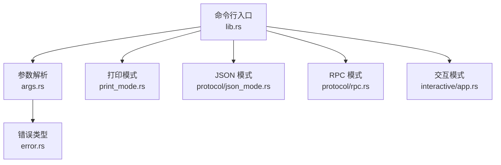
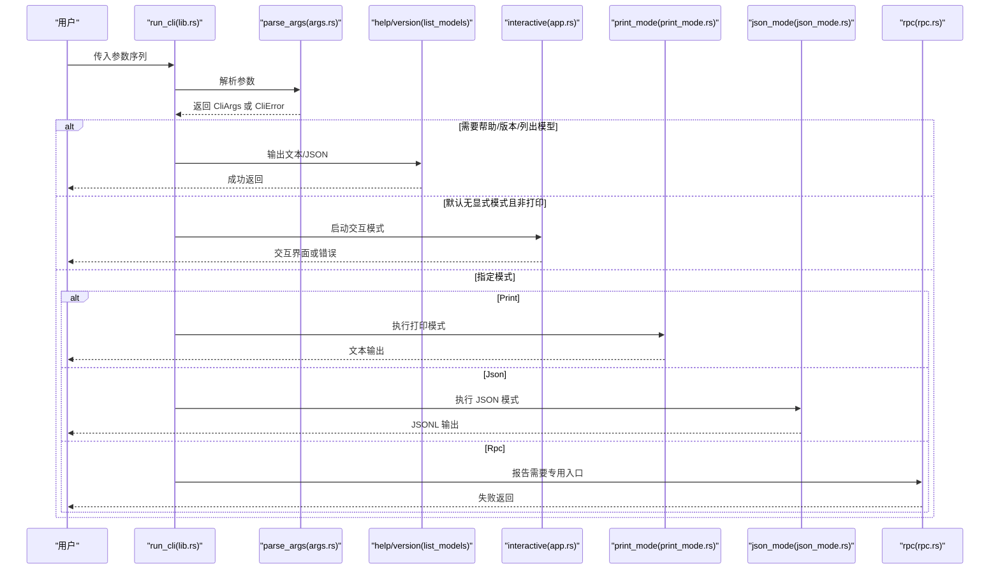
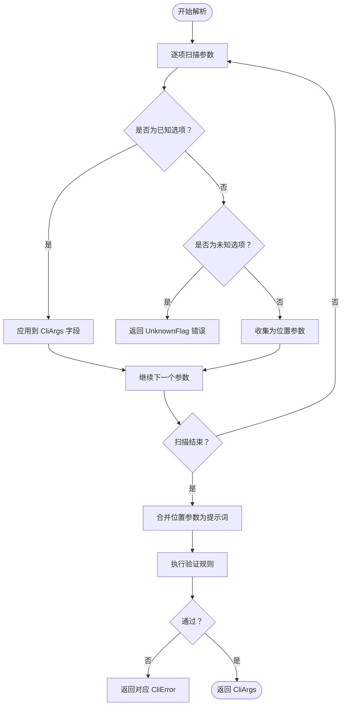
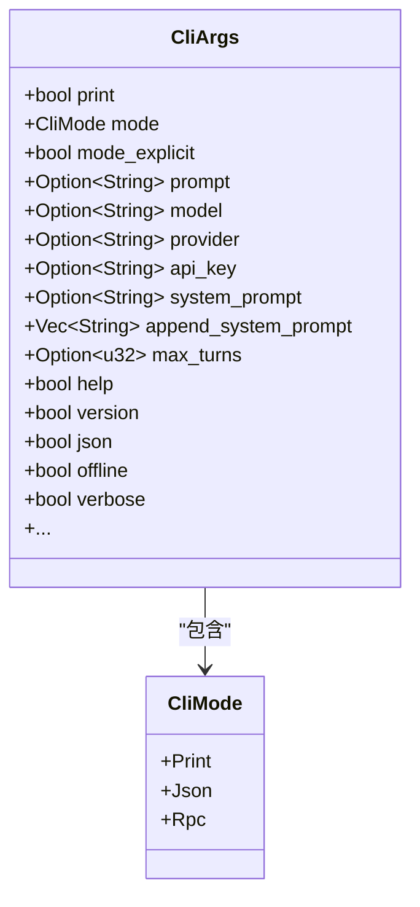
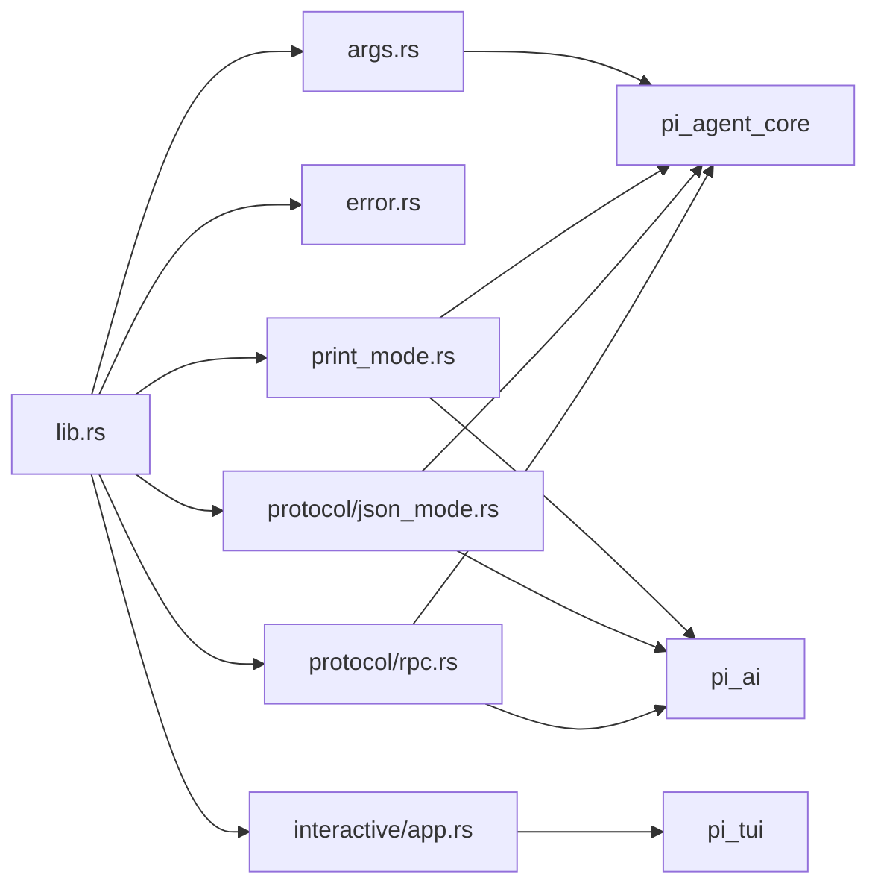

# 命令行接口设计

<cite>
**本文引用的文件列表**
- [args.rs](file://crates/pi-coding-agent/src/args.rs)
- [error.rs](file://crates/pi-coding-agent/src/error.rs)
- [lib.rs](file://crates/pi-coding-agent/src/lib.rs)
- [print_mode.rs](file://crates/pi-coding-agent/src/print_mode.rs)
- [json_mode.rs](file://crates/pi-coding-agent/src/protocol/json_mode.rs)
- [rpc.rs](file://crates/pi-coding-agent/src/protocol/rpc.rs)
- [app.rs](file://crates/pi-coding-agent/src/interactive/app.rs)
- [cli.rs](file://crates/pi-coding-agent/tests/cli.rs)
- [protocol_args.rs](file://crates/pi-coding-agent/tests/protocol_args.rs)
- [interactive_args.rs](file://crates/pi-coding-agent/tests/interactive_args.rs)
- [args.rs（测试）](file://crates/pi-coding-agent/tests/args.rs)
</cite>

## 目录
1. [简介](#简介)
2. [项目结构](#项目结构)
3. [核心组件](#核心组件)
4. [架构总览](#架构总览)
5. [详细组件分析](#详细组件分析)
6. [依赖关系分析](#依赖关系分析)
7. [性能考量](#性能考量)
8. [故障排查指南](#故障排查指南)
9. [结论](#结论)
10. [附录：命令行参数参考](#附录命令行参数参考)

## 简介
本文件面向命令行接口（CLI）设计，系统性阐述参数解析机制、模式切换逻辑与错误处理策略，并提供完整的参数参考、使用示例与最佳实践。CLI 支持三种运行模式：
- Print 模式：一次性打印助手响应，适合脚本与批处理。
- Json 模式：以 JSONL 流输出协议事件，便于集成到外部系统。
- Rpc 模式：通过标准输入输出进行流式 RPC 协议交互，需专用二进制入口。

## 项目结构
围绕 CLI 的关键模块分布如下：
- 参数解析与帮助：args.rs
- 错误类型定义：error.rs
- 运行时调度与模式分发：lib.rs
- 打印模式实现：print_mode.rs
- JSON 模式实现：protocol/json_mode.rs
- RPC 模式实现：protocol/rpc.rs
- 交互模式实现：interactive/app.rs
- 行为与约束的测试用例：tests 下的多个文件

图表来源
- [lib.rs:83-334](file://crates/pi-coding-agent/src/lib.rs#L83-L334)
- [args.rs:153-333](file://crates/pi-coding-agent/src/args.rs#L153-L333)
- [print_mode.rs:70-94](file://crates/pi-coding-agent/src/print_mode.rs#L70-L94)
- [json_mode.rs:8-75](file://crates/pi-coding-agent/src/protocol/json_mode.rs#L8-L75)
- [rpc.rs:39-98](file://crates/pi-coding-agent/src/protocol/rpc.rs#L39-L98)
- [app.rs:52-74](file://crates/pi-coding-agent/src/interactive/app.rs#L52-L74)

章节来源
- [lib.rs:1-352](file://crates/pi-coding-agent/src/lib.rs#L1-L352)
- [args.rs:1-343](file://crates/pi-coding-agent/src/args.rs#L1-L343)

## 核心组件
- CliArgs：承载所有解析后的命令行参数，包含模式、提示词、模型、会话、工具、系统提示等字段。
- CliMode：枚举型运行模式，支持 Print、Json、Rpc。
- CliError：统一的错误类型，涵盖缺失值、未知标志、不支持模式、缺失提示词、无效输入、会话标志冲突等。
- run_cli/run_cli_with_options：对外暴露的 CLI 入口，负责解析参数、执行帮助/版本、列出模型、分派到不同模式或交互模式。

章节来源
- [args.rs:25-117](file://crates/pi-coding-agent/src/args.rs#L25-L117)
- [args.rs:5-10](file://crates/pi-coding-agent/src/args.rs#L5-L10)
- [error.rs:1-24](file://crates/pi-coding-agent/src/error.rs#L1-L24)
- [lib.rs:83-334](file://crates/pi-coding-agent/src/lib.rs#L83-L334)

## 架构总览
CLI 的控制流从 run_cli 开始，先解析参数，再根据参数决定后续行为：显示帮助/版本、列出模型、进入交互模式、或按模式执行打印/JSON/RPC。

图表来源
- [lib.rs:83-334](file://crates/pi-coding-agent/src/lib.rs#L83-L334)
- [args.rs:153-333](file://crates/pi-coding-agent/src/args.rs#L153-L333)
- [print_mode.rs:70-94](file://crates/pi-coding-agent/src/print_mode.rs#L70-L94)
- [json_mode.rs:8-75](file://crates/pi-coding-agent/src/protocol/json_mode.rs#L8-L75)
- [rpc.rs:39-98](file://crates/pi-coding-agent/src/protocol/rpc.rs#L39-L98)
- [app.rs:52-74](file://crates/pi-coding-agent/src/interactive/app.rs#L52-L74)

## 详细组件分析

### 参数解析机制与 CliArgs 设计
- 结构体字段覆盖范围广泛，包括：
  - 模式与开关：print、mode、mode_explicit、help、version、json、offline、verbose 等。
  - 提示词与系统提示：prompt、system_prompt、append_system_prompt。
  - 模型与提供商：provider、model、models、list_models、api_key。
  - 会话控制：continue_session、resume、no_session、session、session_id、fork、session_dir、name。
  - 思维与工具：thinking、tool_execution、skills、prompt_templates、template_args、tools、exclude_tools、no_tools、no_builtin_tools、no_context_files、no_skills、no_prompt_templates、no_themes。
  - 最大轮次限制：max_turns。
- 默认值：CliArgs::default 将 mode 初始化为 Print，其他布尔开关默认为 false，字符串/可选字段默认为 None/空集合。
- 解析流程：
  - 顺序扫描参数，识别短/长选项与位置参数。
  - 对带值的选项调用 take_value 获取下一个参数作为值；对多值选项（如 --append-system-prompt、--template-arg、--skills、--prompt-templates）支持重复出现。
  - 特殊处理：-p/--print 可消费其后紧邻的非选项字符串作为提示词；--list-models 支持可选搜索词但不会将其视为位置参数。
  - 位置参数在循环结束后合并为单一提示词。
- 参数验证规则：
  - -p 与 --mode 组合限制：若显式指定 --mode 且非 Print，则报错“--print 只能与 --mode print 组合”。
  - Rpc 模式限制：Rpc 模式下不允许传入位置提示词。
  - 会话目标互斥：不能同时设置多个会话目标标志，且 --no-session 与会话选择标志/命名冲突。
  - 工具集互斥：--no-tools 与 --tools/--exclude-tools 冲突。
  - 列表模型输出：--json 只能在 --list-models 使用时有效。
  - 最大轮次：必须为正整数。
  - 技能与模板互斥：--skill 与 --prompt-template 不能同时使用。
- 默认值处理：
  - mode 默认 Print，mode_explicit 默认 false。
  - max_turns 默认 None（保持无限轮次，与 TS 版本一致）。
  - 其他布尔/集合字段默认关闭/空列表。

图表来源
- [args.rs:153-333](file://crates/pi-coding-agent/src/args.rs#L153-L333)

章节来源
- [args.rs:25-117](file://crates/pi-coding-agent/src/args.rs#L25-L117)
- [args.rs:153-333](file://crates/pi-coding-agent/src/args.rs#L153-L333)

### 模式切换逻辑与 CliMode
- 枚举定义：Print、Json、Rpc。
- 解析：--mode 接受 "print"|"json"|"rpc"，否则返回 InvalidInput。
- 默认行为：
  - 若未显式指定模式且未使用 -p，则进入交互模式（TTY 必需）。
  - 若显式指定 --mode 或使用 -p，则按模式执行。
- 模式适用场景：
  - Print：单次请求、批处理、脚本集成。
  - Json：需要结构化事件流，便于上游系统解析。
  - Rpc：需要通过标准输入输出进行流式 RPC 交互，需专用二进制入口。
- 限制：
  - Rpc 模式在当前入口中被标记为“需要专用入口”，直接调用会返回 UnsupportedMode。

图表来源
- [args.rs:5-10](file://crates/pi-coding-agent/src/args.rs#L5-L10)
- [args.rs:25-117](file://crates/pi-coding-agent/src/args.rs#L25-L117)

章节来源
- [args.rs:5-23](file://crates/pi-coding-agent/src/args.rs#L5-L23)
- [lib.rs:125-133](file://crates/pi-coding-agent/src/lib.rs#L125-L133)

### 错误处理机制与 CliError 分类
- 错误类型：
  - 缺失值：MissingValue
  - 未知标志：UnknownFlag
  - 不支持模式：UnsupportedMode
  - 缺失提示词：MissingPrompt
  - 未知模型：UnknownModel
  - 无效最大轮次：InvalidMaxTurns
  - 无效输入：InvalidInput
  - 代理失败：AgentFailure
  - 会话标志冲突：InvalidSessionFlags
  - 会话失败：SessionFailure
- 错误信息格式化：
  - 使用 thiserror 自动格式化，错误消息简洁明确，便于用户理解。
- 用户友好提示：
  - 交互模式要求 TTY 时，返回“interactive mode requires a TTY”。
  - 缺少提示词时，返回“missing prompt”。

章节来源
- [error.rs:1-24](file://crates/pi-coding-agent/src/error.rs#L1-L24)
- [lib.rs:55-61](file://crates/pi-coding-agent/src/lib.rs#L55-L61)
- [app.rs:53-59](file://crates/pi-coding-agent/src/interactive/app.rs#L53-L59)

### 打印模式（Print）
- 输入：从 CliArgs 转换为 PrintModeOptions，包含模型、工具、会话、思维级别、资源等。
- 处理：调用 run_session_prompt 执行一次会话，提取最终助手文本。
- 输出：追加换行符后返回 stdout；错误则返回 CliError。

章节来源
- [print_mode.rs:8-68](file://crates/pi-coding-agent/src/print_mode.rs#L8-L68)
- [print_mode.rs:70-94](file://crates/pi-coding-agent/src/print_mode.rs#L70-L94)

### JSON 模式（Json）
- 输入：SessionPromptOptions。
- 处理：生成会话头与起始事件，将事件序列化为 JSONL 行写入 stdout。
- 输出：成功返回 0 退出码与 JSONL；失败返回 1 退出码与错误信息。

章节来源
- [json_mode.rs:8-75](file://crates/pi-coding-agent/src/protocol/json_mode.rs#L8-L75)

### RPC 模式（Rpc）
- 入口：专用 IO/STDIO 流式处理函数，解析 JSONL 命令，驱动状态机并输出 JSONL 响应。
- 当前入口中的行为：返回“需要专用入口”的 UnsupportedMode 错误。
- 适用场景：与上游系统通过标准输入输出进行流式 RPC 交互。

章节来源
- [rpc.rs:39-98](file://crates/pi-coding-agent/src/protocol/rpc.rs#L39-L98)
- [lib.rs:129-133](file://crates/pi-coding-agent/src/lib.rs#L129-L133)

### 交互模式（Interactive）
- 条件：仅在 stdin/stdout 均为终端时启动。
- 行为：初始化 TUI，进入交互循环；否则返回“interactive mode requires a TTY”。

章节来源
- [app.rs:52-74](file://crates/pi-coding-agent/src/interactive/app.rs#L52-L74)

## 依赖关系分析
- 模块耦合：
  - lib.rs 依赖 args.rs（解析）、error.rs（错误）、print_mode.rs、protocol/json_mode.rs、protocol/rpc.rs、interactive/app.rs。
  - args.rs 依赖 pi_agent_core 的 ThinkingLevel、ToolExecutionMode。
  - print_mode.rs 依赖 protocol/session_runner 与 runtime。
  - json_mode.rs 依赖 protocol/events、jsonl、session_runner。
  - rpc.rs 依赖 protocol/types、jsonl、session_runner。
- 外部依赖：
  - pi_agent_core：会话、思维级别、工具执行模式。
  - pi_ai：模型、内容块、事件适配器。
  - pi_tui：交互式 TUI 组件（仅交互模式）。

图表来源
- [lib.rs:1-25](file://crates/pi-coding-agent/src/lib.rs#L1-L25)
- [args.rs:1-3](file://crates/pi-coding-agent/src/args.rs#L1-L3)
- [print_mode.rs:1-7](file://crates/pi-coding-agent/src/print_mode.rs#L1-L7)
- [json_mode.rs:1-7](file://crates/pi-coding-agent/src/protocol/json_mode.rs#L1-L7)
- [rpc.rs:1-14](file://crates/pi-coding-agent/src/protocol/rpc.rs#L1-L14)
- [app.rs:1-37](file://crates/pi-coding-agent/src/interactive/app.rs#L1-L37)

## 性能考量
- 参数解析：线性扫描，时间复杂度 O(n)，空间开销主要为临时存储原始参数与提示词拼接。
- 模式分发：解析完成后快速分支，无额外计算开销。
- 交互模式：依赖 TUI 渲染与事件泵，性能取决于终端能力与渲染频率。
- JSON/RPC 模式：事件序列化为 JSONL，注意避免频繁 flush 导致的 I/O 开销。

## 故障排查指南
- 未知标志或缺失值：
  - 现象：返回 UnknownFlag 或 MissingValue。
  - 排查：检查拼写与是否遗漏了必需的值。
- 会话标志冲突：
  - 现象：返回 InvalidSessionFlags。
  - 排查：确保只设置一个会话目标标志，且 --no-session 与其他会话相关标志不混用。
- 模式与提示词冲突：
  - 现象：Rpc 模式下传入位置提示词时报错。
  - 排查：Rpc 模式不接受位置提示词，请通过专用入口或相应协议传递。
- 交互模式无法启动：
  - 现象：返回“interactive mode requires a TTY”。
  - 排查：确认 stdin/stdout 为终端；在管道或重定向中请改用 Print/Json 模式。
- 缺少提示词：
  - 现象：返回 MissingPrompt。
  - 排查：确保提供 -p 或 --print 以及提示词，或通过 STDIN 注入。

章节来源
- [error.rs:1-24](file://crates/pi-coding-agent/src/error.rs#L1-L24)
- [args.rs:276-330](file://crates/pi-coding-agent/src/args.rs#L276-L330)
- [app.rs:53-59](file://crates/pi-coding-agent/src/interactive/app.rs#L53-L59)
- [lib.rs:149-150](file://crates/pi-coding-agent/src/lib.rs#L149-L150)

## 结论
该 CLI 采用清晰的参数解析与模式分发设计，通过 CliArgs 统一承载配置，借助 CliError 提供一致的错误反馈。Print/Json/Rpc 三模式分别满足不同使用场景，交互模式提供 TUI 体验。参数验证规则严格，有助于减少歧义与错误使用。

## 附录：命令行参数参考

- 基础模式与帮助
  - -p, --print：一次性运行并打印助手响应；可选地跟随提示词。
  - --mode <mode>：headless 模式选择，取值：print|json|rpc。
  - -h, --help：显示帮助文本。
  - -v, --version：显示版本号。

- 模型与提供商
  - --provider <id>：优先使用的提供商 ID。
  - --model <id>：内置模型表中的模型 ID。
  - --models <list>：逗号分隔的模型轮转通配符，可选指定模型:思维级别。
  - --list-models [search]：列出模型，可选模糊过滤。
  - --json：与 --list-models 搭配，输出 JSON。
  - --api-key <key>：传递给所选提供商的 API Key。

- 系统提示与上下文
  - --system-prompt <text>：覆盖系统提示。
  - --append-system-prompt <text>：追加到系统提示（可重复）。
  - --no-context-files：禁用 AGENTS.md/CLAUDE.md 发现。

- 会话控制
  - -c, --continue：继续最近会话。
  - -r, --resume：恢复最近会话。
  - --no-session：禁用会话持久化。
  - --session <path|id>：按路径或 ID 前缀打开会话。
  - --session-id <id>：按精确 ID 打开或创建会话。
  - --fork <path|id>：从现有会话派生。
  - --session-dir <dir>：会话文件存储目录。
  - --name <name>，-n <name>：当前会话名称。

- 思维与工具
  - --thinking <level>：思维级别，off|minimal|low|medium|high|xhigh。
  - --tool-execution <mode>：工具执行模式，parallel|sequential。
  - --tools <names>，-t <names>：内置工具白名单（逗号分隔）。
  - --exclude-tools <names>，-xt <names>：内置工具黑名单（逗号分隔）。
  - --no-tools：禁用所有工具。
  - --no-builtin-tools：不注册内置工具。
  - --skills <dir>：加载技能的目录（可重复）。
  - --prompt-templates 
：加载提示模板的路径（可重复）。
  - --no-skills：禁用技能发现。
  - --no-prompt-templates：禁用提示模板发现。
  - --no-themes：禁用主题发现。
  - --skill <name>：按名称调用已加载的技能。
  - --prompt-template <name>：按名称调用已加载的提示模板。
  - --template-arg <value>：提示模板参数（可重复）。

- 其他
  - --max-turns <n>：可选的代理循环轮次上限（默认不限制）。
  - --verbose：输出详细诊断信息。
  - --offline：尽量避免网络相关行为。

章节来源
- [args.rs:119-124](file://crates/pi-coding-agent/src/args.rs#L119-L124)

## 实际使用示例与最佳实践

- 示例：一次性打印助手响应
  - 用法：-p "<你的提示词>"
  - 注意：-p 与 --mode json 不能同时使用；Rpc 模式不接受位置提示词。
  - 参考测试：[protocol_args.rs:4-8](file://crates/pi-coding-agent/tests/protocol_args.rs#L4-L8)

- 示例：显式选择 Json 模式
  - 用法：--mode json "<提示词>"
  - 输出：JSONL 事件流，便于上游系统解析。
  - 参考测试：[protocol_args.rs:11-21](file://crates/pi-coding-agent/tests/protocol_args.rs#L11-L21)

- 示例：Rpc 模式（专用入口）
  - 说明：当前入口返回“需要专用入口”，请使用对应的流式二进制入口。
  - 参考测试：[protocol_args.rs:24-28](file://crates/pi-coding-agent/tests/protocol_args.rs#L24-L28)

- 示例：交互模式（TTY 必需）
  - 说明：在非 TTY 环境会返回“interactive mode requires a TTY”。
  - 参考测试：[interactive_args.rs:4-9](file://crates/pi-coding-agent/tests/interactive_args.rs#L4-L9)

- 示例：缺少提示词
  - 说明：仅传入 -p 未提供提示词会返回“missing prompt”。
  - 参考测试：[cli.rs:159-171](file://crates/pi-coding-agent/tests/cli.rs#L159-L171)

- 示例：未知模型
  - 说明：--model 指定不存在的模型会返回“unknown model: ...”。
  - 参考测试：[cli.rs:174-191](file://crates/pi-coding-agent/tests/cli.rs#L174-L191)

- 最佳实践
  - 显式指定 --mode 时，确保与 -p 的组合符合预期（-p 仅与 Print 模式配合）。
  - 在批处理或 CI 中优先使用 Print/Json 模式，避免交互模式。
  - 使用 --list-models 与 --json 获取结构化模型清单，便于自动化选择。
  - 会话相关标志互斥，避免同时设置多个会话目标。
  - 工具白/黑名单与 --no-tools 互斥，避免配置冲突。

章节来源
- [protocol_args.rs:1-65](file://crates/pi-coding-agent/tests/protocol_args.rs#L1-L65)
- [interactive_args.rs:1-16](file://crates/pi-coding-agent/tests/interactive_args.rs#L1-L16)
- [cli.rs:159-191](file://crates/pi-coding-agent/tests/cli.rs#L159-L191)