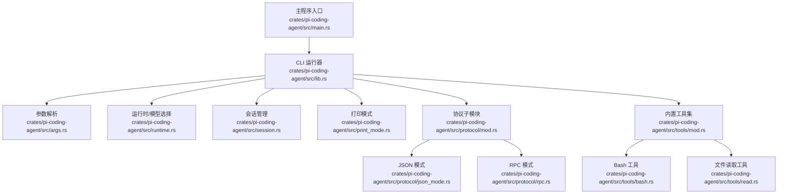
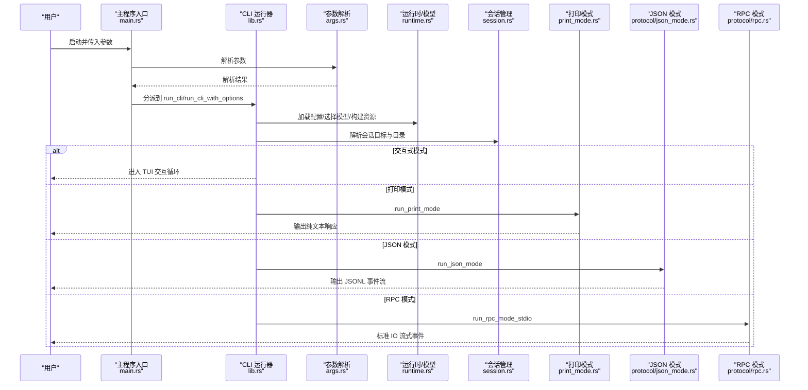
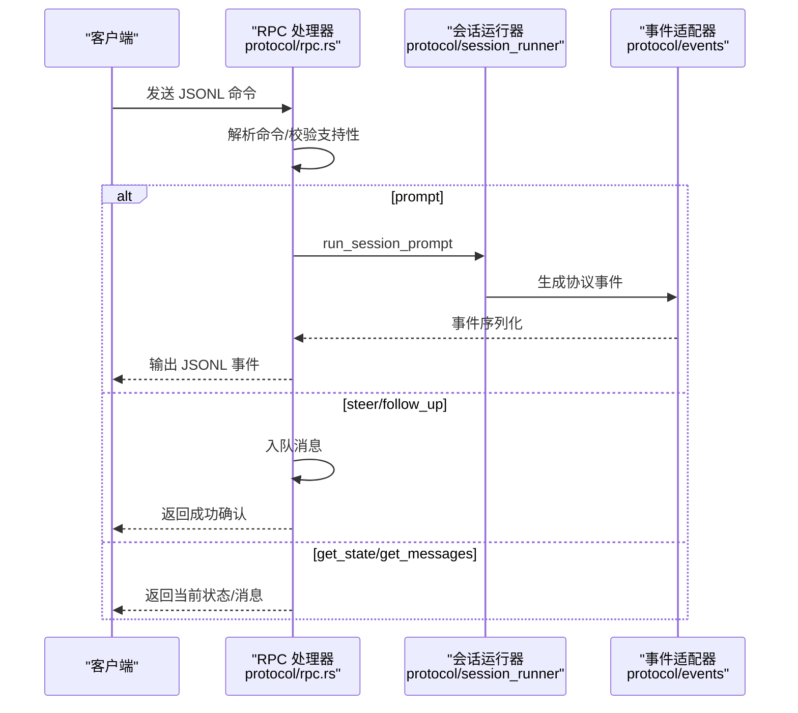
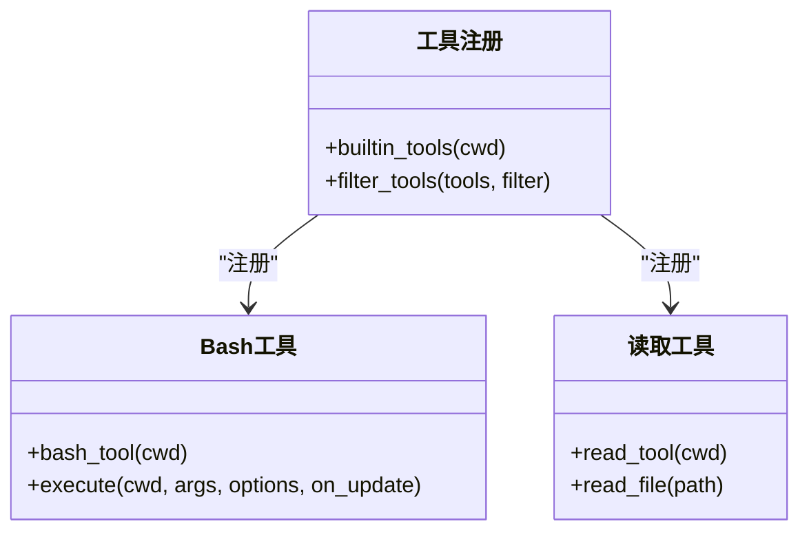
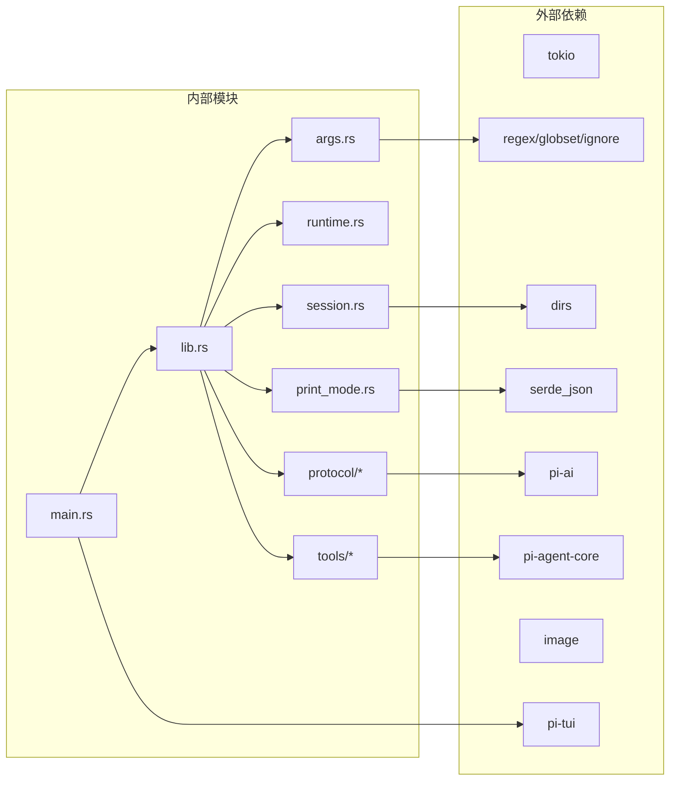

# 编码代理 CLI

<cite>
**本文引用的文件**
- [crates/pi-coding-agent/src/lib.rs](file://crates/pi-coding-agent/src/lib.rs)
- [crates/pi-coding-agent/src/main.rs](file://crates/pi-coding-agent/src/main.rs)
- [crates/pi-coding-agent/src/args.rs](file://crates/pi-coding-agent/src/args.rs)
- [crates/pi-coding-agent/src/session.rs](file://crates/pi-coding-agent/src/session.rs)
- [crates/pi-coding-agent/src/runtime.rs](file://crates/pi-coding-agent/src/runtime.rs)
- [crates/pi-coding-agent/src/print_mode.rs](file://crates/pi-coding-agent/src/print_mode.rs)
- [crates/pi-coding-agent/src/protocol/mod.rs](file://crates/pi-coding-agent/src/protocol/mod.rs)
- [crates/pi-coding-agent/src/protocol/json_mode.rs](file://crates/pi-coding-agent/src/protocol/json_mode.rs)
- [crates/pi-coding-agent/src/protocol/rpc.rs](file://crates/pi-coding-agent/src/protocol/rpc.rs)
- [crates/pi-coding-agent/src/tools/mod.rs](file://crates/pi-coding-agent/src/tools/mod.rs)
- [crates/pi-coding-agent/src/tools/bash.rs](file://crates/pi-coding-agent/src/tools/bash.rs)
- [crates/pi-coding-agent/src/tools/read.rs](file://crates/pi-coding-agent/src/tools/read.rs)
- [crates/pi-coding-agent/Cargo.toml](file://crates/pi-coding-agent/Cargo.toml)
</cite>

## 目录
1. [简介](#简介)
2. [项目结构](#项目结构)
3. [核心组件](#核心组件)
4. [架构总览](#架构总览)
5. [详细组件分析](#详细组件分析)
6. [依赖关系分析](#依赖关系分析)
7. [性能考虑](#性能考虑)
8. [故障排查指南](#故障排查指南)
9. [结论](#结论)
10. [附录：使用示例与配置](#附录使用示例与配置)

## 简介
本文件为“编码代理 CLI”的技术文档，面向开发者与高级用户，系统性阐述命令行接口设计、参数解析、模式切换、错误处理机制；交互式模式（TUI）的实现、输入处理与会话管理；协议与 RPC 支持（JSON 模式、RPC 协议、事件流）；内置工具系统（文件操作、Bash 命令、搜索等）的实现与使用；以及完整的使用示例、配置指南、自定义工具开发与扩展方法，并提供常见问题与性能优化建议。

## 项目结构
- 入口与运行时
  - 主程序入口负责检测模式并分派到相应执行路径（交互式或打印/JSON/RPC）。
  - 核心运行逻辑在库模块中组织，按功能拆分为参数解析、运行时配置、会话管理、协议与工具系统。
- 关键模块
  - 参数解析与帮助文本：定义 CLI 模式、选项与校验规则。
  - 运行时与模型选择：构建 Agent 配置、资源与会话选项。
  - 会话管理：解析会话目录、打开/创建/复用/派生会话。
  - 打印模式与 JSON 模式：非交互式输出策略。
  - RPC 模式：基于 JSONL 的协议事件流，支持队列与状态查询。
  - 内置工具：文件读取、写入、编辑、Bash 执行、搜索与列出等。
  - TUI 交互：提供交互式界面与事件桥接。

图示来源
- [crates/pi-coding-agent/src/main.rs:1-60](file://crates/pi-coding-agent/src/main.rs#L1-L60)
- [crates/pi-coding-agent/src/lib.rs:1-352](file://crates/pi-coding-agent/src/lib.rs#L1-L352)
- [crates/pi-coding-agent/src/args.rs:1-343](file://crates/pi-coding-agent/src/args.rs#L1-L343)
- [crates/pi-coding-agent/src/runtime.rs:1-217](file://crates/pi-coding-agent/src/runtime.rs#L1-L217)
- [crates/pi-coding-agent/src/session.rs:1-204](file://crates/pi-coding-agent/src/session.rs#L1-L204)
- [crates/pi-coding-agent/src/print_mode.rs:1-94](file://crates/pi-coding-agent/src/print_mode.rs#L1-L94)
- [crates/pi-coding-agent/src/protocol/mod.rs:1-7](file://crates/pi-coding-agent/src/protocol/mod.rs#L1-L7)
- [crates/pi-coding-agent/src/protocol/json_mode.rs:1-75](file://crates/pi-coding-agent/src/protocol/json_mode.rs#L1-L75)
- [crates/pi-coding-agent/src/protocol/rpc.rs:1-579](file://crates/pi-coding-agent/src/protocol/rpc.rs#L1-L579)
- [crates/pi-coding-agent/src/tools/mod.rs:1-51](file://crates/pi-coding-agent/src/tools/mod.rs#L1-L51)
- [crates/pi-coding-agent/src/tools/bash.rs:1-521](file://crates/pi-coding-agent/src/tools/bash.rs#L1-L521)
- [crates/pi-coding-agent/src/tools/read.rs:1-183](file://crates/pi-coding-agent/src/tools/read.rs#L1-L183)

章节来源
- [crates/pi-coding-agent/src/main.rs:1-60](file://crates/pi-coding-agent/src/main.rs#L1-L60)
- [crates/pi-coding-agent/src/lib.rs:1-352](file://crates/pi-coding-agent/src/lib.rs#L1-L352)

## 核心组件
- 命令行接口与模式
  - 支持 print、json、rpc 三种模式；rpc 模式需通过专用二进制入口。
  - 提供帮助、版本、模型列表、上下文文件、技能与模板加载、工具过滤等丰富选项。
- 参数解析与校验
  - 对互斥标志、组合约束进行严格校验（如 --print 仅能与 --mode print 组合；--json 仅能在 --list-models 下使用）。
- 运行时与模型选择
  - 从 CLI、配置与默认值综合选择模型；支持思考级别与工具执行模式。
- 会话管理
  - 解析会话根目录与工作目录映射；支持新建、继续最近、打开指定、按 ID 打开或创建、派生等。
- 协议与事件流
  - JSON 模式以 JSONL 输出协议事件；RPC 模式通过标准 IO 流式处理命令与事件。
- 内置工具系统
  - 默认注册一组工具（read、write、edit、bash、grep、find、ls），支持允许/拒绝白名单与禁用控制。

章节来源
- [crates/pi-coding-agent/src/args.rs:1-343](file://crates/pi-coding-agent/src/args.rs#L1-L343)
- [crates/pi-coding-agent/src/runtime.rs:1-217](file://crates/pi-coding-agent/src/runtime.rs#L1-L217)
- [crates/pi-coding-agent/src/session.rs:1-204](file://crates/pi-coding-agent/src/session.rs#L1-L204)
- [crates/pi-coding-agent/src/tools/mod.rs:1-51](file://crates/pi-coding-agent/src/tools/mod.rs#L1-L51)

## 架构总览
下图展示 CLI 启动后的主要流程：参数解析 → 模式判定 → 资源加载与模型选择 → 会话目标解析 → 选择运行模式（交互式/打印/JSON/RPC）并输出结果。

图示来源
- [crates/pi-coding-agent/src/main.rs:1-60](file://crates/pi-coding-agent/src/main.rs#L1-L60)
- [crates/pi-coding-agent/src/lib.rs:83-334](file://crates/pi-coding-agent/src/lib.rs#L83-L334)
- [crates/pi-coding-agent/src/args.rs:153-333](file://crates/pi-coding-agent/src/args.rs#L153-L333)
- [crates/pi-coding-agent/src/runtime.rs:62-131](file://crates/pi-coding-agent/src/runtime.rs#L62-L131)
- [crates/pi-coding-agent/src/session.rs:89-138](file://crates/pi-coding-agent/src/session.rs#L89-L138)
- [crates/pi-coding-agent/src/print_mode.rs:70-93](file://crates/pi-coding-agent/src/print_mode.rs#L70-L93)
- [crates/pi-coding-agent/src/protocol/json_mode.rs:8-74](file://crates/pi-coding-agent/src/protocol/json_mode.rs#L8-L74)
- [crates/pi-coding-agent/src/protocol/rpc.rs:100-104](file://crates/pi-coding-agent/src/protocol/rpc.rs#L100-L104)

## 详细组件分析

### 命令行接口与参数解析
- 模式与标志
  - 模式：print（默认）、json、rpc；rpc 仅在专用入口可用。
  - 会话相关：--continue、--resume、--session、--session-id、--fork、--no-session、--session-dir、--name 等。
  - 资源与工具：--skills、--prompt-templates、--no-context-files、--no-skills、--no-prompt-templates、--no-themes、--tools/-t、--exclude-tools/-xt、--no-tools、--no-builtin-tools。
  - 模型与推理：--provider、--model、--models、--thinking、--tool-execution、--max-turns、--api-key、--system-prompt、--append-system-prompt。
  - 列表与诊断：--list-models [search]、--json、--verbose、--offline、-h/--help、-v/--version。
- 解析与校验
  - 互斥与组合约束：例如 --print 与 --mode 的组合限制；--json 仅在 --list-models 下有效；--no-session 与会话目标标志互斥；--no-tools 与 --tools/--exclude-tools 互斥等。
  - 位置参数：当未显式提供 --print 或 --mode 时，若无提示词则进入交互式模式。
- 帮助文本
  - 提供完整选项说明与示例风格的描述。

章节来源
- [crates/pi-coding-agent/src/args.rs:5-124](file://crates/pi-coding-agent/src/args.rs#L5-L124)
- [crates/pi-coding-agent/src/args.rs:153-333](file://crates/pi-coding-agent/src/args.rs#L153-L333)

### 运行时与模型选择
- 模型选择优先级
  - --models 模式旋转匹配；--model 指定模型；--model 与 --provider 组合约束；否则回退到默认配置或内置默认模型。
- Agent 配置
  - 设置系统提示、最大轮次、重试策略、压缩设置、思考级别、工具执行模式与资源。
- 会话运行选项
  - 支持启用/禁用会话，指定工作目录与会话目录。

章节来源
- [crates/pi-coding-agent/src/runtime.rs:62-188](file://crates/pi-coding-agent/src/runtime.rs#L62-L188)
- [crates/pi-coding-agent/src/runtime.rs:190-202](file://crates/pi-coding-agent/src/runtime.rs#L190-L202)

### 会话管理
- 会话目录解析
  - 优先级：CLI --session-dir > 运行时 session_dir > 环境变量 PI_SESSION_DIR > 默认根目录（~/.pi-rust/sessions）。
- 会话目标解析
  - 支持新建、继续最近、打开指定路径/ID、按 ID 打开或创建、派生等。
- 存储与上下文
  - 使用 JSONL 存储；构建会话上下文消息基线，用于后续压缩与记忆。

章节来源
- [crates/pi-coding-agent/src/session.rs:19-47](file://crates/pi-coding-agent/src/session.rs#L19-L47)
- [crates/pi-coding-agent/src/session.rs:49-138](file://crates/pi-coding-agent/src/session.rs#L49-L138)

### 打印模式与 JSON 模式
- 打印模式
  - 将最终助手消息提取为纯文本输出，适合一次性任务。
- JSON 模式
  - 输出会话头（JSONL）与协议事件（AgentStart 等），便于外部消费与可视化。

章节来源
- [crates/pi-coding-agent/src/print_mode.rs:70-93](file://crates/pi-coding-agent/src/print_mode.rs#L70-L93)
- [crates/pi-coding-agent/src/protocol/json_mode.rs:8-74](file://crates/pi-coding-agent/src/protocol/json_mode.rs#L8-L74)

### RPC 模式与事件流
- 输入/输出
  - 通过标准 IO 读取 JSONL 命令，逐条处理并以 JSONL 事件流输出。
- 支持的命令
  - prompt、steer、follow_up、abort、new_session、get_state、set_thinking_level、set_steering_mode、set_follow_up_mode、compact、set_auto_compaction、get_session_stats、get_last_assistant_text、set_session_name、get_messages。
- 事件适配
  - 将内部事件转换为协议事件并序列化输出。
- 状态与统计
  - 维护模型、思考级别、队列长度、消息计数等状态；提供会话统计信息。

图示来源
- [crates/pi-coding-agent/src/protocol/rpc.rs:39-98](file://crates/pi-coding-agent/src/protocol/rpc.rs#L39-L98)
- [crates/pi-coding-agent/src/protocol/rpc.rs:170-340](file://crates/pi-coding-agent/src/protocol/rpc.rs#L170-L340)
- [crates/pi-coding-agent/src/protocol/rpc.rs:407-454](file://crates/pi-coding-agent/src/protocol/rpc.rs#L407-L454)

### 内置工具系统
- 工具注册
  - 默认注册 read、write、edit、bash、grep、find、ls 七类工具。
- 工具过滤
  - 支持 --tools/-t 白名单、--exclude-tools/-xt 黑名单、--no-tools 禁用全部、--no-builtin-tools 不注册内置工具。
- Bash 工具
  - 执行 bash 命令，合并 stdout/stderr，按行与字节上限截断，支持超时与进程组清理。
  - 可通过 spawn_hook 自定义命令前缀与环境。
- 文件读取工具
  - 读取文本文件内容，支持 offset/limit 分段读取；对图片 MIME 类型给出提示；按行/字节限制截断并提示续读。

图示来源
- [crates/pi-coding-agent/src/tools/mod.rs:17-50](file://crates/pi-coding-agent/src/tools/mod.rs#L17-L50)
- [crates/pi-coding-agent/src/tools/bash.rs:499-521](file://crates/pi-coding-agent/src/tools/bash.rs#L499-L521)
- [crates/pi-coding-agent/src/tools/read.rs:161-183](file://crates/pi-coding-agent/src/tools/read.rs#L161-L183)

章节来源
- [crates/pi-coding-agent/src/tools/mod.rs:17-50](file://crates/pi-coding-agent/src/tools/mod.rs#L17-L50)
- [crates/pi-coding-agent/src/tools/bash.rs:250-452](file://crates/pi-coding-agent/src/tools/bash.rs#L250-L452)
- [crates/pi-coding-agent/src/tools/read.rs:64-159](file://crates/pi-coding-agent/src/tools/read.rs#L64-L159)

### 交互式模式（TUI 集成）
- 启动条件
  - 需要 TTY（stdin/stdout 均为终端）；否则返回错误码。
- 输入泵与异步处理
  - 从标准输入读取输入块并通过通道传递给渲染循环。
- 事件桥接与转录
  - 将协议事件转化为 UI 事件，驱动转录显示与状态更新。
- 斜杠命令
  - 内置 /help、/settings、/model、/export、/import、/copy、/name、/session、/hotkeys、/fork、/clone、/tree、/login、/logout、/new、/compact、/resume、/reload、/quit 等命令；部分命令在 Rust TUI 中尚未实现，会提示暂不支持。
- 模型与会话选择
  - 支持模型轮换与选择、会话列表浏览与选择、主题与资源热加载等。

章节来源
- [crates/pi-coding-agent/src/main.rs:52-74](file://crates/pi-coding-agent/src/main.rs#L52-L74)
- [crates/pi-coding-agent/src/protocol/rpc.rs:100-104](file://crates/pi-coding-agent/src/protocol/rpc.rs#L100-L104)

## 依赖关系分析
- 外部依赖
  - tokio（异步运行时与 IO）、pi-agent-core（会话与代理核心）、pi-ai（模型与流式处理）、pi-tui（TUI 组件与渲染）、serde/serde_json（序列化）、dirs（用户目录）、regex/globset/ignore（文件与模式匹配）、image（图像处理）、futures/base64/toml/thiserror 等。
- 内部模块耦合
  - lib.rs 作为统一入口，聚合参数、运行时、会话、协议与工具模块；protocol 与 tools 子模块相对独立，通过共享类型与回调接口连接。

图示来源
- [crates/pi-coding-agent/Cargo.toml:6-22](file://crates/pi-coding-agent/Cargo.toml#L6-L22)
- [crates/pi-coding-agent/src/main.rs:1-60](file://crates/pi-coding-agent/src/main.rs#L1-L60)
- [crates/pi-coding-agent/src/lib.rs:1-352](file://crates/pi-coding-agent/src/lib.rs#L1-L352)

章节来源
- [crates/pi-coding-agent/Cargo.toml:1-27](file://crates/pi-coding-agent/Cargo.toml#L1-L27)

## 性能考虑
- I/O 与并发
  - 使用 tokio 的异步 IO 与多线程运行时，提升并发吞吐；Bash 工具采用双管道并发读取 stdout/stderr 并及时截断输出。
- 输出截断
  - Bash 与文件读取均采用行数与字节数上限截断，避免大输出阻塞与内存膨胀。
- 会话压缩
  - 运行时可启用压缩设置，减少上下文占用，提高长对话效率。
- 模型选择与缓存
  - 通过 --models 与 --provider 限定候选模型，减少无效尝试；合理设置 --max-turns 控制会话轮次。

## 故障排查指南
- 常见错误与定位
  - 参数冲突：例如 --print 与非 print 模式组合、--json 未配合 --list-models、--no-session 与会话目标标志混用等，会在解析阶段报错。
  - 模型未知：--model/--models 指定不存在的模型或与 --provider 不匹配时返回 UnknownModel 错误。
  - 会话失败：打开/创建/派生会话失败会返回 SessionFailure 错误。
  - RPC 不支持：在非专用入口调用 rpc 模式会提示需要流式二进制入口。
  - TTY 缺失：交互式模式要求 TTY，否则直接退出并报告错误。
- 排查步骤
  - 使用 --verbose 输出诊断信息。
  - 使用 --offline 避免网络相关行为，隔离问题范围。
  - 检查会话目录权限与磁盘空间。
  - 对 Bash 工具使用 --no-builtin-tools 临时禁用工具，验证是否由工具导致异常。

章节来源
- [crates/pi-coding-agent/src/args.rs:276-333](file://crates/pi-coding-agent/src/args.rs#L276-L333)
- [crates/pi-coding-agent/src/lib.rs:101-104](file://crates/pi-coding-agent/src/lib.rs#L101-L104)
- [crates/pi-coding-agent/src/runtime.rs:62-131](file://crates/pi-coding-agent/src/runtime.rs#L62-L131)
- [crates/pi-coding-agent/src/session.rs:89-138](file://crates/pi-coding-agent/src/session.rs#L89-L138)

## 结论
该 CLI 在参数解析、模式切换、会话管理与工具系统方面具备清晰的职责分离与强健的错误处理；在交互式模式与协议事件流方面提供了良好的扩展性与可观测性。通过合理的工具过滤、输出截断与压缩策略，能够在复杂场景下保持稳定与高效。

## 附录：使用示例与配置

### 使用示例
- 一次性打印响应
  - 使用 --print 与提示词；或直接提供提示词作为位置参数。
- JSON 模式
  - 使用 --mode json 输出协议事件流，便于外部集成。
- RPC 模式
  - 通过专用二进制入口启动，标准 IO 读取命令并输出事件。
- 交互式模式
  - 直接运行 CLI，进入 TUI；支持斜杠命令与模型/会话选择。
- 工具使用
  - 默认注册七类工具；可通过 --tools/-t 与 --exclude-tools/-xt 精细控制。

### 配置指南
- 会话目录
  - 通过 --session-dir 或环境变量 PI_SESSION_DIR 指定；默认位于 ~/.pi-rust/sessions。
- 模型与提供商
  - 通过 --provider 与 --model/--models 指定；支持模型轮换与思考级别。
- 资源加载
  - 通过 --skills、--prompt-templates、--no-context-files、--no-skills、--no-prompt-templates、--no-themes 控制资源发现与加载。
- 工具过滤
  - 使用 --no-tools、--no-builtin-tools、--tools/-t、--exclude-tools/-xt 控制工具集合。

### 自定义工具开发指南
- 工具接口
  - 实现 AgentTool，包含名称、描述、参数 Schema 与执行函数；可选顺序/并行执行模式。
- 截断与安全
  - 对大输出进行行数与字节上限截断，必要时提示续读或分页。
- 回调与进度
  - 通过 ToolUpdateCallback 提供增量输出，改善用户体验。
- 注册与过滤
  - 在运行时选项中注册工具；通过 ToolFilter 控制白名单/黑名单与禁用策略。

章节来源
- [crates/pi-coding-agent/src/tools/mod.rs:17-50](file://crates/pi-coding-agent/src/tools/mod.rs#L17-L50)
- [crates/pi-coding-agent/src/tools/bash.rs:250-452](file://crates/pi-coding-agent/src/tools/bash.rs#L250-L452)
- [crates/pi-coding-agent/src/tools/read.rs:64-159](file://crates/pi-coding-agent/src/tools/read.rs#L64-L159)