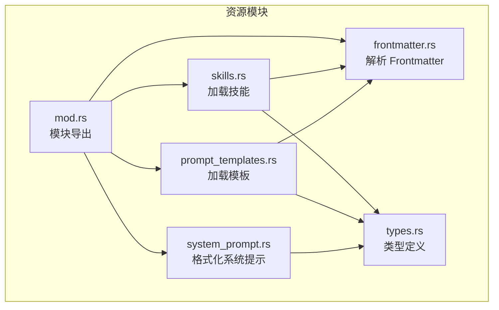
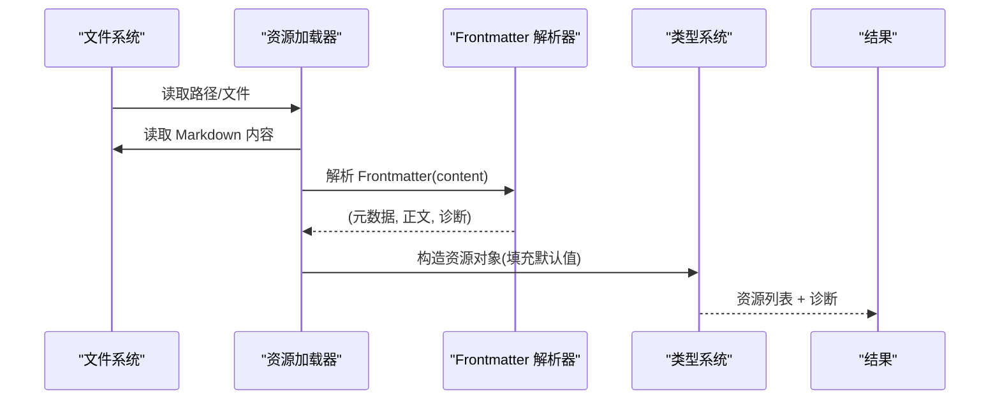
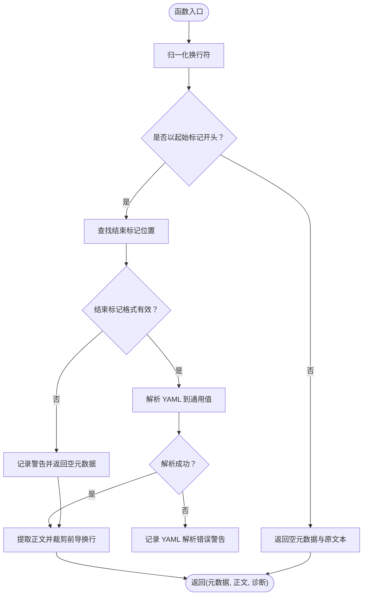
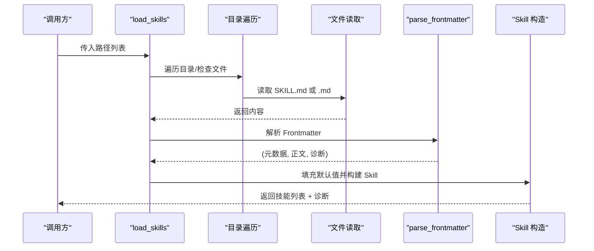
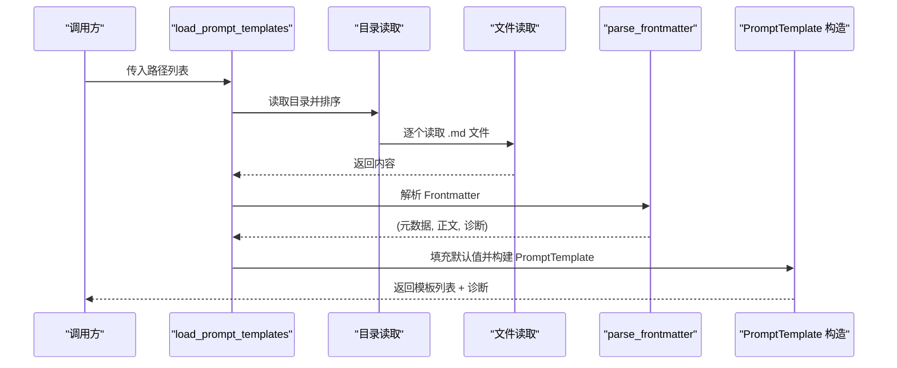
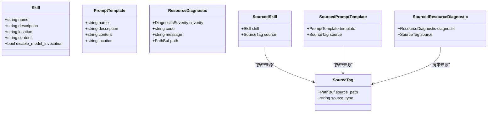
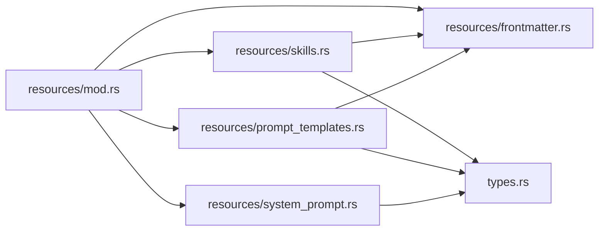

# 前端信息处理

<cite>
**本文引用的文件**
- [frontmatter.rs](file://crates/pi-agent-core/src/resources/frontmatter.rs)
- [mod.rs](file://crates/pi-agent-core/src/resources/mod.rs)
- [skills.rs](file://crates/pi-agent-core/src/resources/skills.rs)
- [prompt_templates.rs](file://crates/pi-agent-core/src/resources/prompt_templates.rs)
- [system_prompt.rs](file://crates/pi-agent-core/src/resources/system_prompt.rs)
- [types.rs](file://crates/pi-agent-core/src/types.rs)
- [resources.rs](file://crates/pi-agent-core/tests/resources.rs)
</cite>

## 目录
1. [简介](#简介)
2. [项目结构](#项目结构)
3. [核心组件](#核心组件)
4. [架构总览](#架构总览)
5. [详细组件分析](#详细组件分析)
6. [依赖关系分析](#依赖关系分析)
7. [性能考量](#性能考量)
8. [故障排查指南](#故障排查指南)
9. [结论](#结论)
10. [附录](#附录)

## 简介
本技术文档围绕前端信息（Frontmatter）处理机制展开，系统性阐述其解析算法、字段提取与数据类型转换、YAML 规范与校验规则、在不同类型资源中的应用场景与处理策略，并提供开发指南、错误处理与兼容性建议。目标是帮助初学者快速上手，同时为有经验的开发者提供足够的技术深度与可操作的实现参考。

## 项目结构
Frontmatter 处理位于资源模块中，主要由以下文件构成：
- 资源模块入口：导出 Frontmatter 解析器以及模板、技能、系统提示等加载器
- Frontmatter 解析器：负责识别并解析 YAML 片段，分离正文与诊断信息
- 技能加载器：从目录或文件加载技能，使用 Frontmatter 提取元数据
- 模板加载器：从目录或文件加载提示模板，使用 Frontmatter 提取元数据
- 类型定义：统一的资源类型、诊断类型与来源标签
- 测试用例：覆盖解析、错误处理、加载流程等关键场景

图表来源
- [mod.rs:1-12](file://crates/pi-agent-core/src/resources/mod.rs#L1-L12)
- [frontmatter.rs:1-117](file://crates/pi-agent-core/src/resources/frontmatter.rs#L1-L117)
- [skills.rs:1-246](file://crates/pi-agent-core/src/resources/skills.rs#L1-L246)
- [prompt_templates.rs:1-166](file://crates/pi-agent-core/src/resources/prompt_templates.rs#L1-L166)
- [system_prompt.rs:1-149](file://crates/pi-agent-core/src/resources/system_prompt.rs#L1-L149)
- [types.rs:186-230](file://crates/pi-agent-core/src/types.rs#L186-L230)

章节来源
- [mod.rs:1-12](file://crates/pi-agent-core/src/resources/mod.rs#L1-L12)

## 核心组件
- Frontmatter 解析器：从文本中提取 YAML 元数据与正文，生成诊断信息
- 技能加载器：扫描路径，读取 Markdown 文件，解析 Frontmatter，构造技能对象
- 模板加载器：扫描路径，读取 Markdown 文件，解析 Frontmatter，构造模板对象
- 类型与诊断：统一的资源类型、来源标签与诊断类型，便于错误追踪与溯源
- 系统提示格式化：将技能集合格式化为系统提示可用的 XML 结构

章节来源
- [frontmatter.rs:4-77](file://crates/pi-agent-core/src/resources/frontmatter.rs#L4-L77)
- [skills.rs:9-168](file://crates/pi-agent-core/src/resources/skills.rs#L9-L168)
- [prompt_templates.rs:8-127](file://crates/pi-agent-core/src/resources/prompt_templates.rs#L8-L127)
- [types.rs:188-230](file://crates/pi-agent-core/src/types.rs#L188-L230)
- [system_prompt.rs:3-60](file://crates/pi-agent-core/src/resources/system_prompt.rs#L3-L60)

## 架构总览
Frontmatter 解析贯穿“读取文件 → 解析元数据 → 构造资源对象”的主流程。解析器独立于具体资源类型，通过统一接口被技能与模板加载器复用；资源加载器负责路径遍历、文件筛选与默认值填充；类型系统提供稳定的结构与诊断能力。

图表来源
- [skills.rs:111-168](file://crates/pi-agent-core/src/resources/skills.rs#L111-L168)
- [prompt_templates.rs:67-127](file://crates/pi-agent-core/src/resources/prompt_templates.rs#L67-L127)
- [frontmatter.rs:4-77](file://crates/pi-agent-core/src/resources/frontmatter.rs#L4-L77)
- [types.rs:188-203](file://crates/pi-agent-core/src/types.rs#L188-L203)

## 详细组件分析

### Frontmatter 解析器
- 输入：原始文本
- 输出：(元数据, 正文, 诊断列表)
- 关键行为
  - 文本归一化：将 CRLF 统一为 LF
  - 标记识别：以固定标记序列作为边界
  - YAML 解析：使用通用值类型承载任意结构
  - 诊断生成：对不闭合、格式错误等情况发出警告级诊断
  - 正文裁剪：去除开头换行，保留正文

图表来源
- [frontmatter.rs:4-77](file://crates/pi-agent-core/src/resources/frontmatter.rs#L4-L77)

章节来源
- [frontmatter.rs:4-77](file://crates/pi-agent-core/src/resources/frontmatter.rs#L4-L77)

### 技能加载器
- 路径处理：支持单文件与目录，目录内递归遍历并忽略隐藏项
- 文件筛选：仅处理 Markdown 扩展名
- Frontmatter 使用：提取名称、描述、禁用模型调用标志等
- 默认值策略：未提供时回退到文件名或正文首行
- 诊断传播：将解析阶段的诊断附加到文件路径

图表来源
- [skills.rs:9-168](file://crates/pi-agent-core/src/resources/skills.rs#L9-L168)
- [frontmatter.rs:4-77](file://crates/pi-agent-core/src/resources/frontmatter.rs#L4-L77)

章节来源
- [skills.rs:9-168](file://crates/pi-agent-core/src/resources/skills.rs#L9-L168)

### 模板加载器
- 路径处理：支持单文件与目录，按文件名排序
- 文件筛选：仅处理 Markdown 扩展名
- Frontmatter 使用：提取名称、描述
- 默认值策略：未提供时回退到文件名或正文首行
- 诊断传播：将解析阶段的诊断附加到文件路径

图表来源
- [prompt_templates.rs:8-127](file://crates/pi-agent-core/src/resources/prompt_templates.rs#L8-L127)
- [frontmatter.rs:4-77](file://crates/pi-agent-core/src/resources/frontmatter.rs#L4-L77)

章节来源
- [prompt_templates.rs:8-127](file://crates/pi-agent-core/src/resources/prompt_templates.rs#L8-L127)

### 类型与诊断系统
- 资源类型
  - 技能：名称、描述、位置、内容、禁用模型调用标志
  - 提示模板：名称、描述、内容、位置
- 诊断类型
  - 严重级别：错误、警告、信息
  - 字段：代码、消息、路径
- 来源标签与溯源诊断：用于区分不同输入来源并携带路径信息

图表来源
- [types.rs:188-264](file://crates/pi-agent-core/src/types.rs#L188-L264)

章节来源
- [types.rs:188-264](file://crates/pi-agent-core/src/types.rs#L188-L264)

### 系统提示格式化
- 将可用技能集合格式化为 XML 结构，供系统提示使用
- 支持过滤禁用模型调用的技能
- 对特殊字符进行 XML 转义，确保输出安全

章节来源
- [system_prompt.rs:3-60](file://crates/pi-agent-core/src/resources/system_prompt.rs#L3-L60)

## 依赖关系分析
- 资源模块导出：统一暴露解析器与加载器
- 加载器依赖解析器：两者均依赖通用 YAML 值类型
- 类型系统提供稳定契约：资源对象与诊断类型
- 系统提示模块依赖技能类型

图表来源
- [mod.rs:1-12](file://crates/pi-agent-core/src/resources/mod.rs#L1-L12)
- [frontmatter.rs:1-2](file://crates/pi-agent-core/src/resources/frontmatter.rs#L1-L2)
- [skills.rs:1-7](file://crates/pi-agent-core/src/resources/skills.rs#L1-L7)
- [prompt_templates.rs:1-6](file://crates/pi-agent-core/src/resources/prompt_templates.rs#L1-L6)
- [types.rs:188-203](file://crates/pi-agent-core/src/types.rs#L188-L203)
- [system_prompt.rs:1-1](file://crates/pi-agent-core/src/resources/system_prompt.rs#L1-L1)

章节来源
- [mod.rs:1-12](file://crates/pi-agent-core/src/resources/mod.rs#L1-L12)

## 性能考量
- 解析复杂度：Frontmatter 解析为线性扫描与一次 YAML 解析，时间复杂度 O(n)，空间复杂度 O(n)
- I/O 成本：技能与模板加载涉及文件系统访问，建议批量读取与缓存
- 诊断收集：在解析阶段一次性收集，避免重复解析
- 字符串截断：对长描述进行截断，减少后续处理开销

## 故障排查指南
- 解析失败
  - 症状：出现 YAML 解析错误诊断
  - 排查：检查 Frontmatter 格式、缩进与引号使用
  - 参考：解析器对 YAML 错误发出警告级诊断
- 未找到结束标记
  - 症状：出现“无结束标记”警告
  - 排查：确认结束标记独占一行且前后换行正确
- 缺失必要字段
  - 名称缺失：回退到文件名或文件夹名
  - 描述缺失：回退到正文首行
  - 禁用标志：默认为 false
- 路径无效
  - 症状：忽略不存在路径，不产生错误
  - 排查：确认路径存在且具备读权限
- 目录遍历忽略
  - 行为：使用忽略规则跳过隐藏目录
  - 排查：检查忽略配置

章节来源
- [frontmatter.rs:28-66](file://crates/pi-agent-core/src/resources/frontmatter.rs#L28-L66)
- [skills.rs:116-168](file://crates/pi-agent-core/src/resources/skills.rs#L116-L168)
- [prompt_templates.rs:67-127](file://crates/pi-agent-core/src/resources/prompt_templates.rs#L67-L127)
- [resources.rs:10-27](file://crates/pi-agent-core/tests/resources.rs#L10-L27)

## 结论
Frontmatter 处理机制以轻量、稳健为核心设计原则：解析器专注于边界识别与 YAML 解析，加载器负责资源语义与默认值策略，类型系统提供一致的数据契约与诊断能力。该方案既满足初学者易用性，又为复杂场景提供扩展空间（如自定义字段、来源标签与诊断溯源）。

## 附录

### YAML 规范与字段定义
- 规范
  - 起始标记：固定序列
  - 结束标记：独占一行
  - 缩进与键值对：遵循 YAML 语法
- 字段
  - 技能：名称、描述、禁用模型调用标志
  - 模板：名称、描述
- 默认值
  - 名称：文件名或文件夹名
  - 描述：正文首行
  - 禁用标志：false

章节来源
- [frontmatter.rs:4-77](file://crates/pi-agent-core/src/resources/frontmatter.rs#L4-L77)
- [skills.rs:135-167](file://crates/pi-agent-core/src/resources/skills.rs#L135-L167)
- [prompt_templates.rs:90-126](file://crates/pi-agent-core/src/resources/prompt_templates.rs#L90-L126)

### 开发指南与最佳实践
- 字段命名
  - 使用小写与连字符风格，保持一致性
- 数据类型
  - 字符串优先，布尔值用于开关类字段
- 容错与默认值
  - 为关键字段提供合理默认值，避免运行时缺省
- 诊断与溯源
  - 为每个资源附加来源标签，便于定位问题
- 兼容性
  - 支持 CRLF 归一化，兼容不同平台
  - 严格结束标记格式，避免歧义

### 错误处理与扩展机制
- 错误处理
  - 解析失败：发出警告级诊断
  - 路径错误：忽略并记录
  - 结束标记异常：发出警告并返回空元数据
- 扩展机制
  - 自定义字段：解析器返回通用值，加载器按需读取
  - 来源标签：为每条诊断附加来源路径
  - 诊断类型：支持多级严重级别

章节来源
- [frontmatter.rs:28-66](file://crates/pi-agent-core/src/resources/frontmatter.rs#L28-L66)
- [skills.rs:116-168](file://crates/pi-agent-core/src/resources/skills.rs#L116-L168)
- [prompt_templates.rs:67-127](file://crates/pi-agent-core/src/resources/prompt_templates.rs#L67-L127)
- [types.rs:218-230](file://crates/pi-agent-core/src/types.rs#L218-L230)