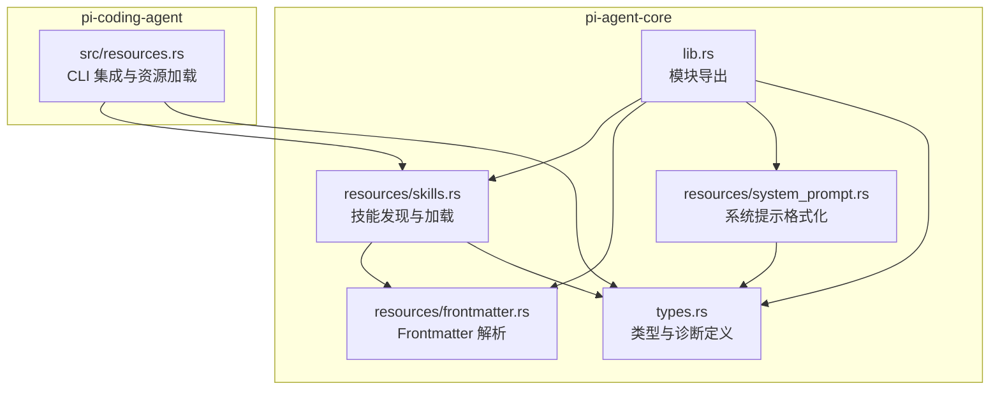
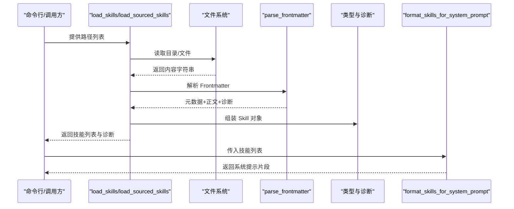
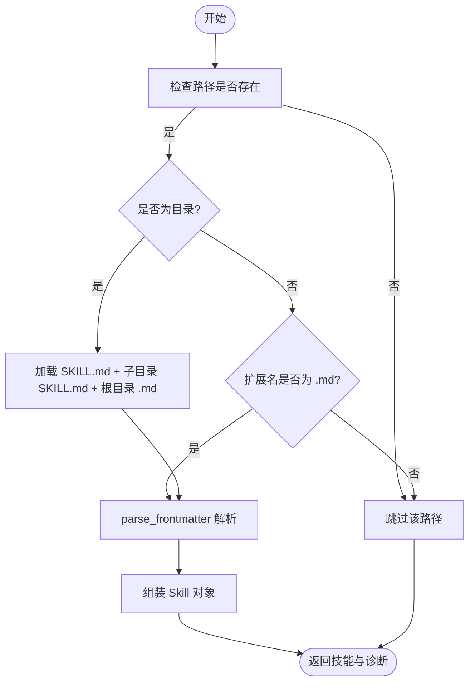
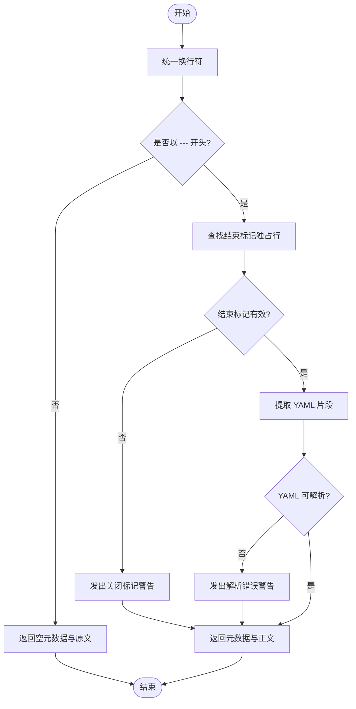
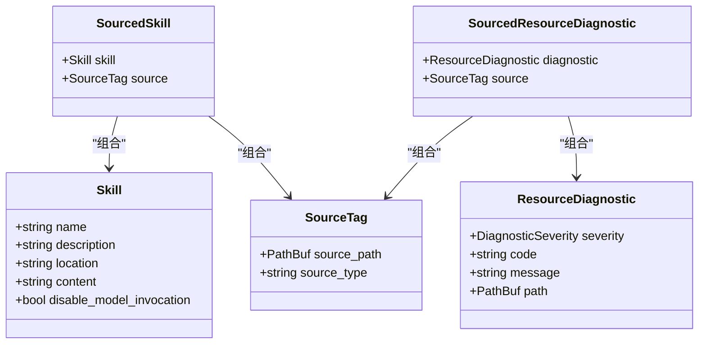
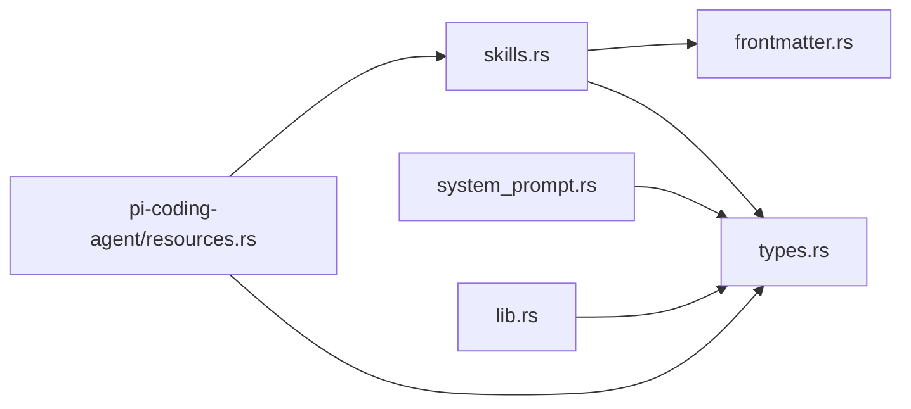

# 技能加载系统

<cite>
**本文档引用的文件**
- [skills.rs](file://crates/pi-agent-core/src/resources/skills.rs)
- [frontmatter.rs](file://crates/pi-agent-core/src/resources/frontmatter.rs)
- [system_prompt.rs](file://crates/pi-agent-core/src/resources/system_prompt.rs)
- [types.rs](file://crates/pi-agent-core/src/types.rs)
- [lib.rs](file://crates/pi-agent-core/src/lib.rs)
- [resources.rs](file://crates/pi-coding-agent/src/resources.rs)
- [resources.rs（测试）](file://crates/pi-agent-core/tests/resources.rs)
- [sourced_resources.rs（测试）](file://crates/pi-agent-core/tests/sourced_resources.rs)
</cite>

## 目录
1. [简介](#简介)
2. [项目结构](#项目结构)
3. [核心组件](#核心组件)
4. [架构总览](#架构总览)
5. [详细组件分析](#详细组件分析)
6. [依赖关系分析](#依赖关系分析)
7. [性能考虑](#性能考虑)
8. [故障排查指南](#故障排查指南)
9. [结论](#结论)
10. [附录](#附录)

## 简介
本文件面向“技能加载系统”的技术文档，聚焦于以下目标：
- 技能文件的发现机制与加载流程
- Frontmatter 的解析与校验
- 技能元数据的提取与注册
- 错误处理与诊断机制
- 技能格式规范与字段定义
- 自定义技能开发指南与最佳实践
- 冲突处理、版本管理与性能优化建议

该系统以 Markdown 文件为载体，通过 Frontmatter 提供元数据，支持从目录或单个文件加载技能，并在后续系统提示中按需注入可用技能清单。

## 项目结构
技能加载系统主要位于 pi-agent-core 的 resources 模块，核心文件包括：
- 技能加载与注册：resources/skills.rs
- Frontmatter 解析：resources/frontmatter.rs
- 系统提示格式化：resources/system_prompt.rs
- 类型定义与导出：types.rs、lib.rs
- CLI 资源加载入口（集成层）：pi-coding-agent/src/resources.rs
- 测试用例：pi-agent-core/tests/resources.rs、pi-agent-core/tests/sourced_resources.rs

图表来源
- [skills.rs:1-246](file://crates/pi-agent-core/src/resources/skills.rs#L1-L246)
- [frontmatter.rs:1-117](file://crates/pi-agent-core/src/resources/frontmatter.rs#L1-L117)
- [system_prompt.rs:1-149](file://crates/pi-agent-core/src/resources/system_prompt.rs#L1-L149)
- [types.rs:188-264](file://crates/pi-agent-core/src/types.rs#L188-L264)
- [lib.rs:1-47](file://crates/pi-agent-core/src/lib.rs#L1-L47)
- [resources.rs:1-200](file://crates/pi-coding-agent/src/resources.rs#L1-L200)

章节来源
- [skills.rs:1-246](file://crates/pi-agent-core/src/resources/skills.rs#L1-L246)
- [frontmatter.rs:1-117](file://crates/pi-agent-core/src/resources/frontmatter.rs#L1-L117)
- [system_prompt.rs:1-149](file://crates/pi-agent-core/src/resources/system_prompt.rs#L1-L149)
- [types.rs:188-264](file://crates/pi-agent-core/src/types.rs#L188-L264)
- [lib.rs:1-47](file://crates/pi-agent-core/src/lib.rs#L1-L47)
- [resources.rs:1-200](file://crates/pi-coding-agent/src/resources.rs#L1-L200)

## 核心组件
- 技能模型与诊断
  - Skill：技能实体，包含名称、描述、位置、正文内容、是否禁用模型调用等字段
  - ResourceDiagnostic：资源级诊断，携带严重级别、代码、消息与路径
  - SourceTag、SourcedSkill、SourcedResourceDiagnostic：用于标记来源的封装类型
- 加载器
  - load_skills：从路径列表加载技能，支持目录与文件两种输入
  - load_sourced_skills：带来源标签的技能加载，便于溯源
- Frontmatter 解析器
  - parse_frontmatter：识别并解析 YAML Frontmatter，产出元数据与正文，同时收集诊断
- 系统提示格式化
  - format_skills_for_system_prompt：生成系统提示中的技能清单 XML 块
  - format_skill_invocation：生成技能调用片段（含位置与内容）

章节来源
- [types.rs:188-264](file://crates/pi-agent-core/src/types.rs#L188-L264)
- [skills.rs:9-60](file://crates/pi-agent-core/src/resources/skills.rs#L9-L60)
- [frontmatter.rs:4-77](file://crates/pi-agent-core/src/resources/frontmatter.rs#L4-L77)
- [system_prompt.rs:3-60](file://crates/pi-agent-core/src/resources/system_prompt.rs#L3-L60)

## 架构总览
技能加载的端到端流程如下：

图表来源
- [skills.rs:9-168](file://crates/pi-agent-core/src/resources/skills.rs#L9-L168)
- [frontmatter.rs:4-77](file://crates/pi-agent-core/src/resources/frontmatter.rs#L4-L77)
- [system_prompt.rs:3-24](file://crates/pi-agent-core/src/resources/system_prompt.rs#L3-L24)

## 详细组件分析

### 技能文件发现与加载
- 发现策略
  - 目录：优先加载根目录下的 SKILL.md；随后使用忽略 .gitignore 的遍历器扫描子目录中的 SKILL.md；最后遍历根目录下所有 .md 文件作为候选
  - 文件：仅当扩展名为 .md 时尝试加载
- 错误处理
  - 文件读取失败：记录警告诊断，包含错误码、消息与路径
  - 忽略不存在的根路径
- 来源标注
  - load_sourced_skills 将每个技能与来源标签配对，便于后续溯源与定位

图表来源
- [skills.rs:9-109](file://crates/pi-agent-core/src/resources/skills.rs#L9-L109)

章节来源
- [skills.rs:9-168](file://crates/pi-agent-core/src/resources/skills.rs#L9-L168)

### Frontmatter 解析与校验
- 规范要求
  - 必须以 "---" 开头，且结束标记 "---" 独占一行，前后换行符规范化
  - YAML 片段必须可被 serde_yaml 正确解析
- 诊断规则
  - 缺少结束标记或结束标记不合法：发出警告诊断
  - YAML 解析失败：发出警告诊断
- 输出
  - 返回元数据（serde_yaml::Value）、正文字符串与诊断列表

图表来源
- [frontmatter.rs:4-77](file://crates/pi-agent-core/src/resources/frontmatter.rs#L4-L77)

章节来源
- [frontmatter.rs:4-77](file://crates/pi-agent-core/src/resources/frontmatter.rs#L4-L77)

### 技能元数据与注册
- 元数据字段
  - name：技能名称，最大长度限制
  - description：技能描述，最大长度限制
  - disable-model-invocation/disableModelInvocation：布尔值，控制是否允许模型调用该技能
- 回退策略
  - name：若未提供，回退至文件名（去扩展名），再无则父目录名，仍无则 "unnamed"
  - description：若未提供，回退至正文首行
- 注册流程
  - 读取内容 → 解析 Frontmatter → 校验与截断 → 组装 Skill → 返回结果
- 系统提示注入
  - format_skills_for_system_prompt：仅注入 disable_model_invocation 为 false 的技能
  - format_skill_invocation：生成技能调用片段，包含名称、位置与正文

图表来源
- [types.rs:188-264](file://crates/pi-agent-core/src/types.rs#L188-L264)

章节来源
- [skills.rs:111-190](file://crates/pi-agent-core/src/resources/skills.rs#L111-L190)
- [system_prompt.rs:3-44](file://crates/pi-agent-core/src/resources/system_prompt.rs#L3-L44)
- [types.rs:188-264](file://crates/pi-agent-core/src/types.rs#L188-L264)

### CLI 集成与资源加载
- 路径解析
  - 支持绝对/相对路径，自动解析到实际路径
  - 默认搜索路径：agent_dir/skills、cwd/.pi-rust/skills、用户指定路径
- 资源加载
  - 调用 core_load_skills/core_load_templates 进行加载
  - 合并诊断并选择主题
- 选项控制
  - 可禁用技能、模板或主题加载
  - 支持指定主题名称

章节来源
- [resources.rs:114-193](file://crates/pi-coding-agent/src/resources.rs#L114-L193)

## 依赖关系分析
- 模块内聚与耦合
  - skills.rs 依赖 frontmatter.rs 与 types.rs
  - system_prompt.rs 依赖 types.rs
  - lib.rs 导出 types 中的公开类型
  - pi-coding-agent 的 resources.rs 依赖 core 的 load_skills/load_prompt_templates 并桥接 CLI 选项
- 外部依赖
  - ignore::WalkBuilder：目录遍历与 .gitignore 忽略
  - serde_yaml：Frontmatter YAML 解析
  - 标准库：文件读写、路径操作

图表来源
- [skills.rs:1-7](file://crates/pi-agent-core/src/resources/skills.rs#L1-L7)
- [frontmatter.rs:1-2](file://crates/pi-agent-core/src/resources/frontmatter.rs#L1-L2)
- [system_prompt.rs:1-1](file://crates/pi-agent-core/src/resources/system_prompt.rs#L1-L1)
- [types.rs:1-10](file://crates/pi-agent-core/src/types.rs#L1-L10)
- [lib.rs:1-16](file://crates/pi-agent-core/src/lib.rs#L1-L16)
- [resources.rs:1-8](file://crates/pi-coding-agent/src/resources.rs#L1-L8)

章节来源
- [skills.rs:1-7](file://crates/pi-agent-core/src/resources/skills.rs#L1-L7)
- [frontmatter.rs:1-2](file://crates/pi-agent-core/src/resources/frontmatter.rs#L1-L2)
- [system_prompt.rs:1-1](file://crates/pi-agent-core/src/resources/system_prompt.rs#L1-L1)
- [types.rs:1-10](file://crates/pi-agent-core/src/types.rs#L1-L10)
- [lib.rs:1-16](file://crates/pi-agent-core/src/lib.rs#L1-L16)
- [resources.rs:1-8](file://crates/pi-coding-agent/src/resources.rs#L1-L8)

## 性能考虑
- 目录遍历
  - 使用 ignore::WalkBuilder 并启用 .gitignore 忽略，避免扫描无关目录
  - 遍历前先检查根路径存在性，减少无效 IO
- 文本处理
  - Frontmatter 解析仅在命中 .md 文件时进行
  - 字符串截断在组装阶段完成，避免重复计算
- 诊断聚合
  - 将解析诊断附加到统一的 Vec，便于后续合并与输出

[本节为通用性能建议，无需特定文件引用]

## 故障排查指南
- 常见问题与诊断
  - Frontmatter 未闭合或格式错误：parse_frontmatter 会发出警告诊断，检查 "---" 是否独占一行以及 YAML 语法
  - 文件读取失败：load_skills 记录 "skill_read_error" 诊断，检查权限与路径
  - 来源标签缺失：使用 load_sourced_skills 时确保 SourceTag 正确设置
- 定位技巧
  - 通过诊断中的 path 字段快速定位问题文件
  - 在 CLI 层面使用 --skill-paths/--prompt-paths 明确搜索范围
- 单元测试参考
  - 覆盖 Frontmatter 解析、非法 YAML、目录扫描与忽略、系统提示格式化等场景

章节来源
- [frontmatter.rs:28-67](file://crates/pi-agent-core/src/resources/frontmatter.rs#L28-L67)
- [skills.rs:116-127](file://crates/pi-agent-core/src/resources/skills.rs#L116-L127)
- [resources.rs（测试）:11-27](file://crates/pi-agent-core/tests/resources.rs#L11-L27)
- [sourced_resources.rs（测试）:79-98](file://crates/pi-agent-core/tests/sourced_resources.rs#L79-L98)

## 结论
技能加载系统以简洁的 Markdown + YAML Frontmatter 方案实现了灵活的技能发现与注册。通过严格的解析与诊断机制、可溯源的来源标签以及可选的系统提示注入，既满足初学者的易用性，也为高级用户提供足够的扩展空间。建议在团队内统一 Frontmatter 字段与命名规范，配合 CLI 选项与测试用例，持续提升稳定性与可维护性。

[本节为总结性内容，无需特定文件引用]

## 附录

### 技能文件格式规范
- 文件类型：Markdown（.md）
- Frontmatter：必需以 "---" 开始与结束，独占行
- 元数据字段
  - name：字符串，最大长度限制
  - description：字符串，最大长度限制
  - disable-model-invocation/disableModelInvocation：布尔值，控制模型调用开关
- 正文：任意 Markdown 内容
- 回退策略
  - name：文件名 → 父目录名 → "unnamed"
  - description：正文首行

章节来源
- [frontmatter.rs:4-77](file://crates/pi-agent-core/src/resources/frontmatter.rs#L4-L77)
- [skills.rs:135-190](file://crates/pi-agent-core/src/resources/skills.rs#L135-L190)

### 技能注册流程（步骤化）
- 输入：路径列表（目录或文件）
- 处理：
  - 若为目录：加载 SKILL.md → 遍历子目录 SKILL.md → 遍历根目录 .md
  - 若为文件：仅当扩展名为 .md
  - 读取内容 → 解析 Frontmatter → 校验与截断 → 组装 Skill
- 输出：技能列表与诊断列表

章节来源
- [skills.rs:9-109](file://crates/pi-agent-core/src/resources/skills.rs#L9-L109)

### 系统提示注入规则
- 只注入 disable_model_invocation 为 false 的技能
- XML 块包含 name/description/location
- 内容进行 XML 转义，防止注入风险

章节来源
- [system_prompt.rs:3-60](file://crates/pi-agent-core/src/resources/system_prompt.rs#L3-L60)

### 自定义技能开发指南
- 创建目录并在其中放置 SKILL.md
- 在 Frontmatter 中填写 name/description/disable-model-invocation
- 在正文编写技能说明与使用方法
- 使用 CLI 选项或默认路径加载技能
- 如需跨来源追踪，使用 load_sourced_skills 并设置 SourceTag

章节来源
- [skills.rs:35-60](file://crates/pi-agent-core/src/resources/skills.rs#L35-L60)
- [resources.rs:131-193](file://crates/pi-coding-agent/src/resources.rs#L131-L193)

### 最佳实践
- 统一命名：name 使用清晰语义，避免过长
- 描述精炼：description 控制在合理长度内
- 禁用策略：仅在必要时禁用模型调用
- 目录组织：按功能域分层放置 SKILL.md
- 诊断监控：关注 parse_frontmatter 与 skill_read_error 诊断

章节来源
- [frontmatter.rs:4-77](file://crates/pi-agent-core/src/resources/frontmatter.rs#L4-L77)
- [skills.rs:116-127](file://crates/pi-agent-core/src/resources/skills.rs#L116-L127)

### 常见问题与解决方案
- YAML 语法错误：修正 Frontmatter 语法，确保键值正确
- 忽略目录未生效：确认 .gitignore 规则与路径大小写
- 来源标签丢失：使用 load_sourced_skills 包裹输入路径与标签

章节来源
- [frontmatter.rs:28-67](file://crates/pi-agent-core/src/resources/frontmatter.rs#L28-L67)
- [sourced_resources.rs（测试）:79-98](file://crates/pi-agent-core/tests/sourced_resources.rs#L79-L98)