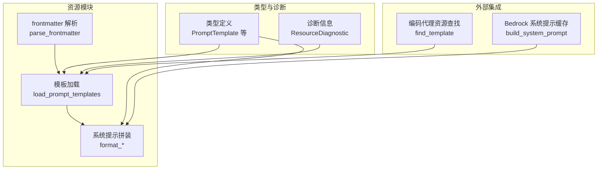
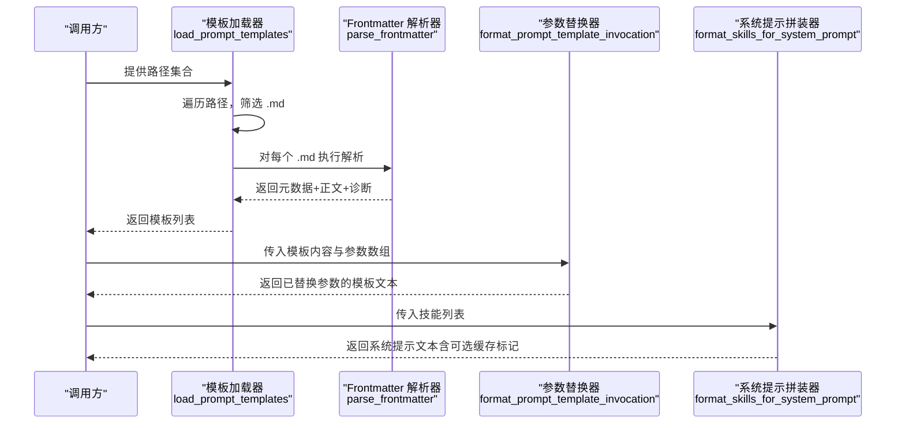
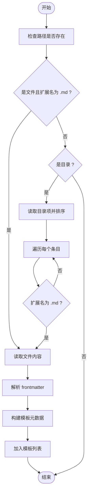
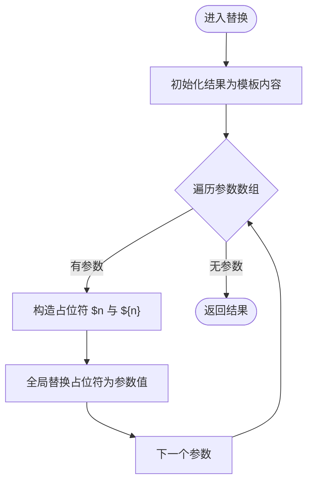
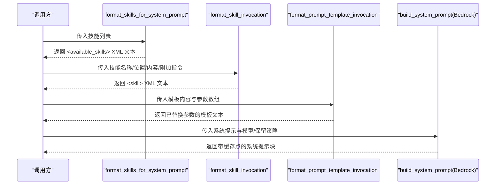
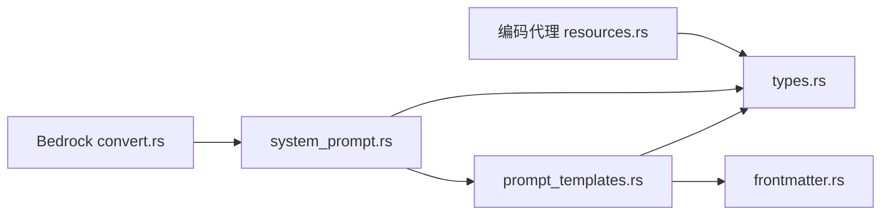

# 提示模板系统

<cite>
**本文引用的文件列表**
- [prompt_templates.rs](file://crates/pi-agent-core/src/resources/prompt_templates.rs)
- [system_prompt.rs](file://crates/pi-agent-core/src/resources/system_prompt.rs)
- [frontmatter.rs](file://crates/pi-agent-core/src/resources/frontmatter.rs)
- [types.rs](file://crates/pi-agent-core/src/types.rs)
- [resources.rs（测试）](file://crates/pi-agent-core/tests/resources.rs)
- [resources.rs（编码代理）](file://crates/pi-coding-agent/src/resources.rs)
- [convert.rs（Bedrock）](file://crates/pi-ai/src/providers/bedrock/convert.rs)
- [cloudflare.rs（AI）](file://crates/pi-ai/src/providers/cloudflare.rs)
- [lib.rs（Agent Core）](file://crates/pi-agent-core/src/lib.rs)
</cite>

## 目录
1. [简介](#简介)
2. [项目结构](#项目结构)
3. [核心组件](#核心组件)
4. [架构总览](#架构总览)
5. [组件详解](#组件详解)
6. [依赖关系分析](#依赖关系分析)
7. [性能与内存考量](#性能与内存考量)
8. [故障排查指南](#故障排查指南)
9. [结论](#结论)
10. [附录：模板开发指南](#附录模板开发指南)

## 简介
本技术文档围绕“提示模板系统”展开，系统性阐述模板文件的加载机制、解析流程、参数替换算法与上下文注入策略；说明模板格式规范、变量占位符语法与系统提示模板的特殊处理；介绍模板继承、组合与复用机制的设计思路；并提供模板开发最佳实践、错误处理、性能优化与内存管理建议。文档兼顾初学者易读性与资深开发者所需的技术深度。

## 项目结构
提示模板系统主要位于 Agent Core 的资源模块中，配合类型定义与工具函数共同完成模板的加载、解析与应用：
- 资源加载与解析：prompt_templates.rs、frontmatter.rs
- 模板调用与系统提示拼装：system_prompt.rs
- 类型与诊断：types.rs
- 使用示例与测试：resources.rs（测试）、resources.rs（编码代理）
- 系统提示缓存与优化：convert.rs（Bedrock）

图表来源
- [prompt_templates.rs:1-166](file://crates/pi-agent-core/src/resources/prompt_templates.rs#L1-L166)
- [frontmatter.rs:1-117](file://crates/pi-agent-core/src/resources/frontmatter.rs#L1-L117)
- [system_prompt.rs:1-149](file://crates/pi-agent-core/src/resources/system_prompt.rs#L1-L149)
- [types.rs:197-230](file://crates/pi-agent-core/src/types.rs#L197-L230)
- [resources.rs（编码代理）:362-389](file://crates/pi-coding-agent/src/resources.rs#L362-L389)
- [convert.rs（Bedrock）:64-82](file://crates/pi-ai/src/providers/bedrock/convert.rs#L64-L82)

章节来源
- [prompt_templates.rs:1-166](file://crates/pi-agent-core/src/resources/prompt_templates.rs#L1-L166)
- [system_prompt.rs:1-149](file://crates/pi-agent-core/src/resources/system_prompt.rs#L1-L149)
- [frontmatter.rs:1-117](file://crates/pi-agent-core/src/resources/frontmatter.rs#L1-L117)
- [types.rs:197-230](file://crates/pi-agent-core/src/types.rs#L197-L230)
- [resources.rs（编码代理）:362-389](file://crates/pi-coding-agent/src/resources.rs#L362-L389)
- [convert.rs（Bedrock）:64-82](file://crates/pi-ai/src/providers/bedrock/convert.rs#L64-L82)

## 核心组件
- 模板加载器：从文件或目录加载 .md 文件，过滤非 .md 后缀，按文件名排序，提取 frontmatter 与正文。
- Frontmatter 解析器：识别并解析 YAML frontmatter，返回元数据与正文，并收集诊断信息。
- 参数替换器：在模板内容中进行占位符替换，支持 $1、$2 与 ${1}、${2} 两种形式。
- 系统提示拼装器：将技能与模板调用结果拼接为系统提示文本，必要时进行 XML 转义。
- 类型与诊断：定义 PromptTemplate、AgentResources、ResourceDiagnostic 等类型，用于承载模板与诊断信息。
- 外部集成：编码代理通过 find_template 查找模板；Bedrock 提供系统提示缓存点以优化性能。

章节来源
- [prompt_templates.rs:8-40](file://crates/pi-agent-core/src/resources/prompt_templates.rs#L8-L40)
- [frontmatter.rs:4-77](file://crates/pi-agent-core/src/resources/frontmatter.rs#L4-L77)
- [system_prompt.rs:46-60](file://crates/pi-agent-core/src/resources/system_prompt.rs#L46-L60)
- [types.rs:197-230](file://crates/pi-agent-core/src/types.rs#L197-L230)
- [resources.rs（编码代理）:362-389](file://crates/pi-coding-agent/src/resources.rs#L362-L389)
- [convert.rs（Bedrock）:64-82](file://crates/pi-ai/src/providers/bedrock/convert.rs#L64-L82)

## 架构总览
模板系统采用“资源加载—解析—应用”的分层架构：
- 资源加载层：遍历路径集合，筛选 .md 文件，按名称排序，逐个读取。
- 解析层：frontmatter 解析 YAML 元数据，保留正文；记录解析警告。
- 应用层：模板调用替换参数；系统提示拼装时进行 XML 转义与可选缓存标记。

图表来源
- [prompt_templates.rs:8-40](file://crates/pi-agent-core/src/resources/prompt_templates.rs#L8-L40)
- [frontmatter.rs:4-77](file://crates/pi-agent-core/src/resources/frontmatter.rs#L4-L77)
- [system_prompt.rs:46-60](file://crates/pi-agent-core/src/resources/system_prompt.rs#L46-L60)
- [system_prompt.rs:3-24](file://crates/pi-agent-core/src/resources/system_prompt.rs#L3-L24)

## 组件详解

### 模板加载与解析
- 加载范围：支持单文件与目录。目录下仅处理 .md 文件，其他扩展名忽略。
- 排序规则：目录扫描后按文件名排序，保证加载顺序稳定。
- 错误处理：文件读取失败产生诊断；frontmatter 缺失或格式不正确产生警告。
- 名称与描述推断：若 frontmatter 中无 name/description，则回退到文件名与首行摘要。

图表来源
- [prompt_templates.rs:12-37](file://crates/pi-agent-core/src/resources/prompt_templates.rs#L12-L37)
- [prompt_templates.rs:67-127](file://crates/pi-agent-core/src/resources/prompt_templates.rs#L67-L127)
- [frontmatter.rs:4-77](file://crates/pi-agent-core/src/resources/frontmatter.rs#L4-L77)

章节来源
- [prompt_templates.rs:8-40](file://crates/pi-agent-core/src/resources/prompt_templates.rs#L8-L40)
- [prompt_templates.rs:67-127](file://crates/pi-agent-core/src/resources/prompt_templates.rs#L67-L127)
- [frontmatter.rs:4-77](file://crates/pi-agent-core/src/resources/frontmatter.rs#L4-L77)

### Frontmatter 解析
- 规范：以 "---" 开头与结尾，中间为 YAML；支持 CRLF 归一化。
- 行为：若未找到闭合标记或 YAML 解析失败，返回空元数据并发出警告；正文去除多余换行。
- 用途：为模板提供 name、description 等元信息，作为模板标识与描述来源。

章节来源
- [frontmatter.rs:4-77](file://crates/pi-agent-core/src/resources/frontmatter.rs#L4-L77)

### 参数替换算法
- 占位符语法：支持 $1、$2… 以及 ${1}、${2}… 两种形式。
- 替换策略：按参数索引顺序进行替换，先替换带花括号形式，再替换无花括号形式，避免重复替换冲突。
- 安全性：不引入正则表达式，直接字符串替换，复杂度 O(n*m)，n 为模板长度，m 为参数数量。

图表来源
- [system_prompt.rs:46-60](file://crates/pi-agent-core/src/resources/system_prompt.rs#L46-L60)

章节来源
- [system_prompt.rs:46-60](file://crates/pi-agent-core/src/resources/system_prompt.rs#L46-L60)

### 上下文注入与系统提示拼装
- 技能块拼装：将可用技能列表包装为 XML 结构，自动转义标签字符，排除禁用模型调用的技能。
- 技能调用块：将技能名称、位置与内容包裹为 <skill> 块，可附加额外指令。
- 模板调用：将模板内容与参数数组传入替换器，得到最终文本。
- 系统提示缓存：在支持的模型上，可在系统提示中插入缓存点，减少重复计算成本。

图表来源
- [system_prompt.rs:3-24](file://crates/pi-agent-core/src/resources/system_prompt.rs#L3-L24)
- [system_prompt.rs:26-44](file://crates/pi-agent-core/src/resources/system_prompt.rs#L26-L44)
- [system_prompt.rs:46-60](file://crates/pi-agent-core/src/resources/system_prompt.rs#L46-L60)
- [convert.rs（Bedrock）:64-82](file://crates/pi-ai/src/providers/bedrock/convert.rs#L64-L82)

章节来源
- [system_prompt.rs:3-24](file://crates/pi-agent-core/src/resources/system_prompt.rs#L3-L24)
- [system_prompt.rs:26-44](file://crates/pi-agent-core/src/resources/system_prompt.rs#L26-L44)
- [system_prompt.rs:46-60](file://crates/pi-agent-core/src/resources/system_prompt.rs#L46-L60)
- [convert.rs（Bedrock）:64-82](file://crates/pi-ai/src/providers/bedrock/convert.rs#L64-L82)

### 类型与诊断
- PromptTemplate：包含 name、description、content、location 四要素。
- AgentResources：聚合技能与模板列表，便于统一管理。
- ResourceDiagnostic：记录严重级别、代码、消息与路径，用于反馈加载过程中的问题。
- SourceTag：标注资源来源路径与类型，便于溯源。

章节来源
- [types.rs:197-230](file://crates/pi-agent-core/src/types.rs#L197-L230)
- [types.rs:205-215](file://crates/pi-agent-core/src/types.rs#L205-L215)
- [types.rs:217-230](file://crates/pi-agent-core/src/types.rs#L217-L230)
- [types.rs:232-264](file://crates/pi-agent-core/src/types.rs#L232-L264)

### 外部集成与使用
- 编码代理：通过 find_template 在模板列表中按名称检索，实现模板选择与复用。
- Bedrock：在系统提示中插入缓存点，结合模型能力提升推理效率。

章节来源
- [resources.rs（编码代理）:362-389](file://crates/pi-coding-agent/src/resources.rs#L362-L389)
- [convert.rs（Bedrock）:64-82](file://crates/pi-ai/src/providers/bedrock/convert.rs#L64-L82)

## 依赖关系分析
- 模块内聚：模板加载与解析紧密耦合于 frontmatter 解析；系统提示拼装依赖模板替换与 XML 转义。
- 外部依赖：frontmatter 使用 YAML 解析；系统提示缓存依赖模型能力检测。
- 可能的循环依赖：当前文件间无循环导入；类型定义集中于 types.rs，被各模块引用。

图表来源
- [prompt_templates.rs:1-6](file://crates/pi-agent-core/src/resources/prompt_templates.rs#L1-L6)
- [frontmatter.rs:1-2](file://crates/pi-agent-core/src/resources/frontmatter.rs#L1-L2)
- [system_prompt.rs:1-5](file://crates/pi-agent-core/src/resources/system_prompt.rs#L1-L5)
- [types.rs:1-10](file://crates/pi-agent-core/src/types.rs#L1-L10)
- [resources.rs（编码代理）:362-389](file://crates/pi-coding-agent/src/resources.rs#L362-L389)
- [convert.rs（Bedrock）:64-82](file://crates/pi-ai/src/providers/bedrock/convert.rs#L64-L82)

章节来源
- [prompt_templates.rs:1-6](file://crates/pi-agent-core/src/resources/prompt_templates.rs#L1-L6)
- [frontmatter.rs:1-2](file://crates/pi-agent-core/src/resources/frontmatter.rs#L1-L2)
- [system_prompt.rs:1-5](file://crates/pi-agent-core/src/resources/system_prompt.rs#L1-L5)
- [types.rs:1-10](file://crates/pi-agent-core/src/types.rs#L1-L10)
- [resources.rs（编码代理）:362-389](file://crates/pi-coding-agent/src/resources.rs#L362-L389)
- [convert.rs（Bedrock）:64-82](file://crates/pi-ai/src/providers/bedrock/convert.rs#L64-L82)

## 性能与内存考量
- 加载性能
  - 目录扫描与排序：O(k log k)，k 为 .md 文件数；整体加载复杂度近似 O(k·(m+n))，m 为平均文件大小，n 为参数数量。
  - 字符串替换：对每个参数执行两次替换（$n 与 ${n}），整体复杂度 O(m·n)。
- 内存管理
  - frontmatter 解析与模板构建均使用 String，避免不必要的拷贝；替换阶段复制一次结果字符串。
  - 建议：在高频场景下对模板内容与参数进行缓存，减少重复解析与替换开销。
- 系统提示缓存
  - Bedrock 支持在系统提示中插入缓存点，减少重复 token 计算；根据保留策略设置 TTL，平衡一致性与性能。

章节来源
- [prompt_templates.rs:24-36](file://crates/pi-agent-core/src/resources/prompt_templates.rs#L24-L36)
- [system_prompt.rs:46-60](file://crates/pi-agent-core/src/resources/system_prompt.rs#L46-L60)
- [convert.rs（Bedrock）:42-82](file://crates/pi-ai/src/providers/bedrock/convert.rs#L42-L82)

## 故障排查指南
- frontmatter 未闭合或 YAML 无效
  - 现象：返回空元数据并产生警告诊断。
  - 处理：检查 "---" 是否成对出现，确保 YAML 格式正确。
- 模板参数未替换
  - 现象：输出仍包含 $1、${2}。
  - 处理：确认参数数组索引与占位符一致；注意 $n 与 ${n} 两种写法。
- 模板加载为空
  - 现象：目录中无 .md 文件或路径不存在。
  - 处理：确认路径存在且包含 .md 文件；检查权限与扩展名。
- 系统提示拼装异常
  - 现象：XML 片段不完整或转义不当。
  - 处理：检查技能名称/描述/位置是否包含特殊字符；确保禁用模型调用的技能被正确过滤。

章节来源
- [frontmatter.rs:18-53](file://crates/pi-agent-core/src/resources/frontmatter.rs#L18-L53)
- [system_prompt.rs:46-60](file://crates/pi-agent-core/src/resources/system_prompt.rs#L46-L60)
- [prompt_templates.rs:13-15](file://crates/pi-agent-core/src/resources/prompt_templates.rs#L13-L15)
- [system_prompt.rs:11-20](file://crates/pi-agent-core/src/resources/system_prompt.rs#L11-L20)

## 结论
提示模板系统以简洁稳定的加载与解析流程为基础，结合灵活的参数替换与系统提示拼装能力，满足多场景下的模板化提示需求。通过类型化资源与诊断信息，系统具备良好的可维护性与可观测性；通过系统提示缓存等优化手段，进一步提升性能表现。未来可在模板继承与组合方面引入更高级的抽象，以增强复用性与可扩展性。

## 附录：模板开发指南
- 模板格式规范
  - 使用 Markdown 文件存储，文件扩展名为 .md。
  - frontmatter 使用 YAML，键包括 name、description 等；建议提供简短描述以便系统展示。
- 变量占位符语法
  - 支持 $1、$2… 与 ${1}、${2}… 两种形式；建议优先使用 ${n} 以避免歧义。
- 上下文注入策略
  - 将技能内容与模板调用结果拼接为系统提示；必要时附加额外指令。
  - 注意 XML 转义，避免标签被模型误解析。
- 设计原则
  - 简洁明确：模板应聚焦单一任务，参数尽量少而清晰。
  - 可复用：通过命名规范与 frontmatter 描述提升模板可发现性。
  - 可观测：提供有意义的 description，便于诊断与调试。
- 动态内容生成
  - 使用参数替换生成动态内容；在高并发场景下考虑缓存与预编译。
- 系统提示模板的特殊处理
  - 在支持的模型上插入缓存点，减少重复 token 计算；根据业务需要调整保留策略。
- 模板继承、组合与复用
  - 当前实现未内置继承/组合语法；可通过模板引用与系统提示拼装实现组合效果；未来可考虑引入模板引用与宏机制以提升复用性。

章节来源
- [prompt_templates.rs:84-119](file://crates/pi-agent-core/src/resources/prompt_templates.rs#L84-L119)
- [system_prompt.rs:3-24](file://crates/pi-agent-core/src/resources/system_prompt.rs#L3-L24)
- [system_prompt.rs:26-44](file://crates/pi-agent-core/src/resources/system_prompt.rs#L26-L44)
- [system_prompt.rs:46-60](file://crates/pi-agent-core/src/resources/system_prompt.rs#L46-L60)
- [convert.rs（Bedrock）:64-82](file://crates/pi-ai/src/providers/bedrock/convert.rs#L64-L82)