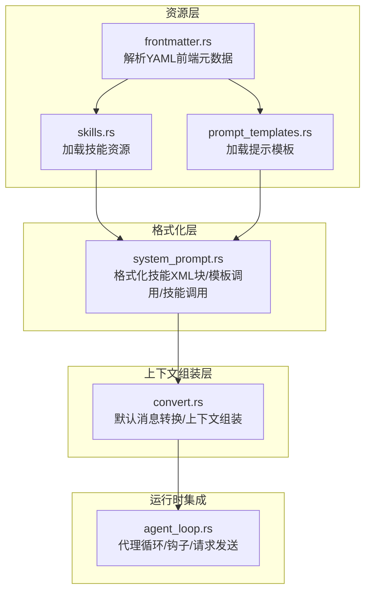
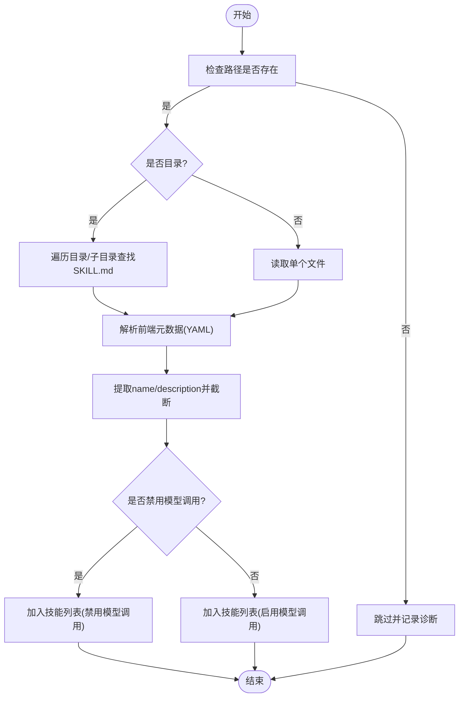
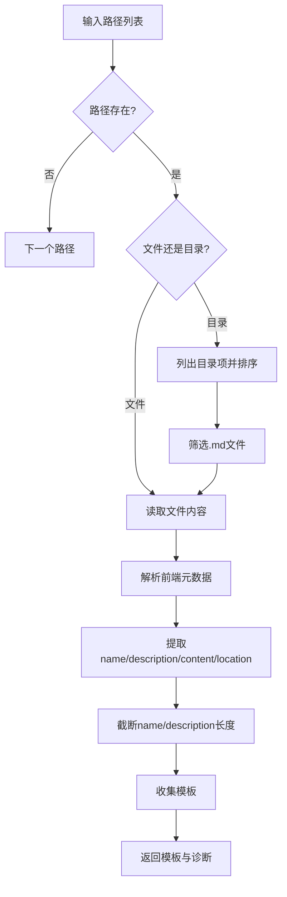
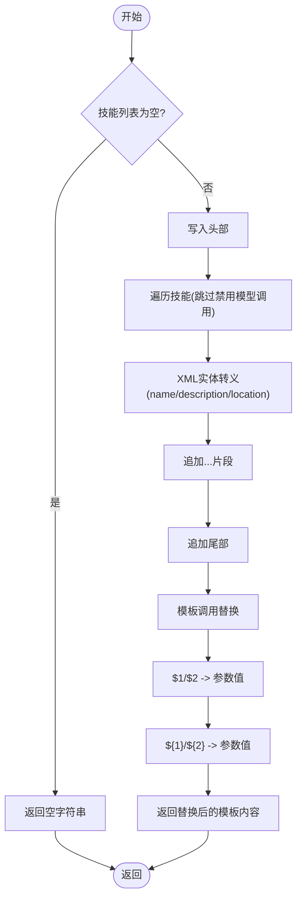
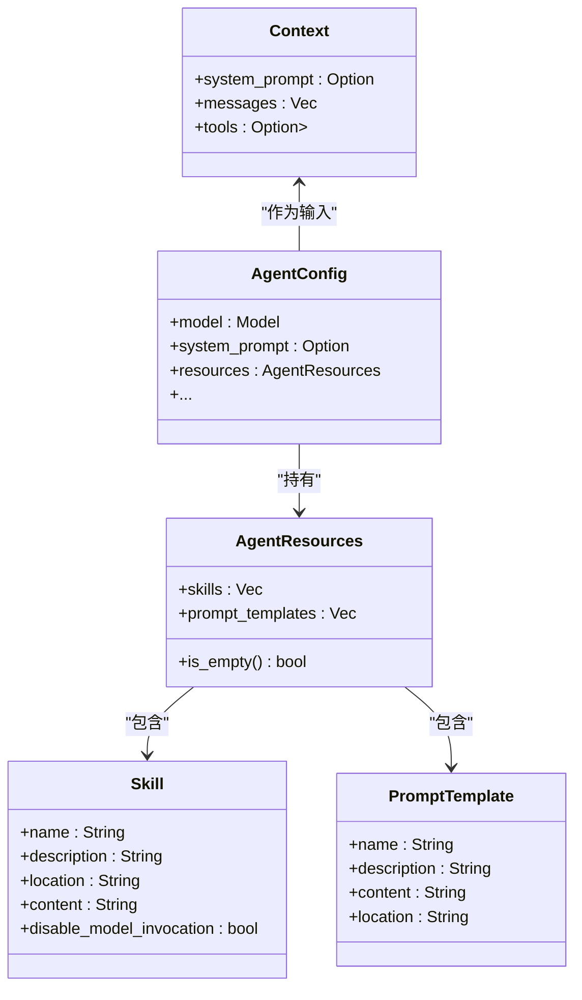
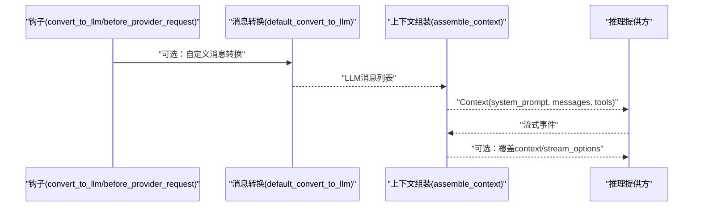
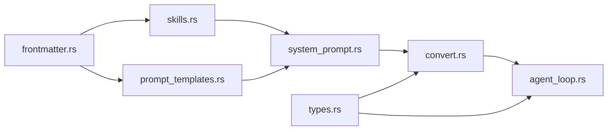

# 系统提示生成

<cite>
**本文引用的文件**   
- [system_prompt.rs](file://crates/pi-agent-core/src/resources/system_prompt.rs)
- [prompt_templates.rs](file://crates/pi-agent-core/src/resources/prompt_templates.rs)
- [skills.rs](file://crates/pi-agent-core/src/resources/skills.rs)
- [mod.rs](file://crates/pi-agent-core/src/resources/mod.rs)
- [types.rs](file://crates/pi-agent-core/src/types.rs)
- [convert.rs](file://crates/pi-agent-core/src/convert.rs)
- [frontmatter.rs](file://crates/pi-agent-core/src/resources/frontmatter.rs)
- [agent_loop.rs](file://crates/pi-agent-core/src/agent_loop.rs)
</cite>

## 目录
1. [引言](#引言)
2. [项目结构](#项目结构)
3. [核心组件](#核心组件)
4. [架构总览](#架构总览)
5. [组件详解](#组件详解)
6. [依赖关系分析](#依赖关系分析)
7. [性能考量](#性能考量)
8. [故障排查指南](#故障排查指南)
9. [结论](#结论)
10. [附录](#附录)

## 引言
本文件围绕“系统提示生成”机制进行系统化技术文档编写，聚焦以下目标：
- 解释系统提示的构建流程、模板格式化与技能注入策略
- 说明系统提示的结构化组织、内容优先级与动态生成算法
- 阐述技能调用格式化、提示模板调用格式化与系统提示优化技术
- 提供系统提示定制指南（格式化规则、内容调整、性能优化）
- 给出调试方法与常见问题排查（提示过长、格式错误、内容冲突）
- 覆盖系统提示的版本管理与向后兼容性建议

该机制在代理运行循环中被消费，最终进入大模型请求上下文，影响模型行为与工具调用。

## 项目结构
与系统提示生成直接相关的模块与文件如下：
- 资源层：技能加载、提示模板加载、前端数据解析
- 格式化层：系统提示格式化、技能注入、模板参数替换
- 上下文组装层：将系统提示与消息、工具列表合并为最终上下文
- 运行时集成：在代理循环中触发上下文组装与请求发送



**图表来源**
- [frontmatter.rs:1-117](file://crates/pi-agent-core/src/resources/frontmatter.rs#L1-L117)
- [skills.rs:1-246](file://crates/pi-agent-core/src/resources/skills.rs#L1-L246)
- [prompt_templates.rs:1-166](file://crates/pi-agent-core/src/resources/prompt_templates.rs#L1-L166)
- [system_prompt.rs:1-149](file://crates/pi-agent-core/src/resources/system_prompt.rs#L1-L149)
- [convert.rs:1-315](file://crates/pi-agent-core/src/convert.rs#L1-L315)
- [agent_loop.rs:1-860](file://crates/pi-agent-core/src/agent_loop.rs#L1-L860)

**章节来源**
- [mod.rs:1-12](file://crates/pi-agent-core/src/resources/mod.rs#L1-L12)

## 核心组件
- 技能资源加载与校验：从目录或文件加载 SKILL.md，解析前端元数据，支持忽略隐藏目录、缺失路径跳过等稳健性处理。
- 提示模板加载与描述截断：从单文件或目录批量加载 .md 模板，提取 name/description/content/location，description 截断至长度上限。
- 系统提示格式化：将技能集合格式化为 XML 块；将模板内容按 $1/$2 或 ${1}/${2} 占位符替换为实参；构造技能调用 XML 片段。
- 上下文组装：优先使用配置中的系统提示；若无则回退到消息中的 SystemPrompt；再将技能块拼接到基础系统提示末尾；最后附加工具列表。
- 类型与钩子：AgentConfig 中包含 system_prompt 字段；convert 层通过 convert_to_llm 钩子可覆盖默认消息转换；before_provider_request 钩子可覆盖上下文与流选项。

**章节来源**
- [skills.rs:9-33](file://crates/pi-agent-core/src/resources/skills.rs#L9-L33)
- [prompt_templates.rs:8-40](file://crates/pi-agent-core/src/resources/prompt_templates.rs#L8-L40)
- [system_prompt.rs:3-60](file://crates/pi-agent-core/src/resources/system_prompt.rs#L3-L60)
- [convert.rs:95-155](file://crates/pi-agent-core/src/convert.rs#L95-L155)
- [types.rs:409-443](file://crates/pi-agent-core/src/types.rs#L409-L443)

## 架构总览
系统提示生成在代理循环中被消费，关键流程：
- 代理循环准备阶段：可能执行会话压缩、消息转换钩子、工具转换钩子
- 上下文组装：将系统提示（来自配置或消息）、消息列表、工具列表合并为 Context
- 发送请求：将 Context 交给推理提供方接口

```mermaid
sequenceDiagram
participant Loop as "代理循环(agent_loop.rs)"
participant Conv as "消息转换(convert.rs)"
participant Ctx as "上下文组装(convert.rs)"
participant Prov as "推理提供方(pi_ai)"
Loop->>Conv : "default_convert_to_llm(messages, resources)"
Conv-->>Loop : "LLM消息列表"
Loop->>Ctx : "assemble_context(system_prompt, messages, llm_messages, tools, resources)"
Ctx-->>Loop : "Context(system_prompt, messages, tools)"
Loop->>Prov : "stream_model(model, context, options)"
Prov-->>Loop : "流式事件(LlmEvent/Done/Error)"
```

**图表来源**
- [agent_loop.rs:251-354](file://crates/pi-agent-core/src/agent_loop.rs#L251-L354)
- [convert.rs:95-155](file://crates/pi-agent-core/src/convert.rs#L95-L155)

## 组件详解

### 技能资源加载与前端元数据解析
- 加载策略
  - 支持从目录递归扫描 SKILL.md，使用忽略规则过滤隐藏/忽略目录
  - 支持从文件加载单个 .md
  - 对不存在路径进行跳过处理，避免中断
- 元数据解析
  - 使用 YAML 前端元数据解析器，支持 CRLF 归一化
  - 若未找到闭合标记或 YAML 解析失败，记录警告诊断
- 名称与描述截断
  - 技能名称与描述分别限制长度，防止过长元数据影响上下文
- 可用性控制
  - 支持禁用模型直接调用的技能（在系统提示中仍可注入，但不参与工具列表）



**图表来源**
- [skills.rs:9-33](file://crates/pi-agent-core/src/resources/skills.rs#L9-L33)
- [skills.rs:62-109](file://crates/pi-agent-core/src/resources/skills.rs#L62-L109)
- [skills.rs:111-168](file://crates/pi-agent-core/src/resources/skills.rs#L111-L168)
- [frontmatter.rs:4-77](file://crates/pi-agent-core/src/resources/frontmatter.rs#L4-L77)

**章节来源**
- [skills.rs:9-33](file://crates/pi-agent-core/src/resources/skills.rs#L9-L33)
- [skills.rs:62-109](file://crates/pi-agent-core/src/resources/skills.rs#L62-L109)
- [skills.rs:111-168](file://crates/pi-agent-core/src/resources/skills.rs#L111-L168)
- [frontmatter.rs:4-77](file://crates/pi-agent-core/src/resources/frontmatter.rs#L4-L77)

### 提示模板加载与描述截断
- 扫描范围：支持单文件与目录，目录内按文件名排序遍历
- 描述截断：name 与 description 均限制长度，超出部分以省略号收尾
- 位置信息：记录模板所在物理路径，便于溯源与诊断



**图表来源**
- [prompt_templates.rs:8-40](file://crates/pi-agent-core/src/resources/prompt_templates.rs#L8-L40)
- [prompt_templates.rs:67-127](file://crates/pi-agent-core/src/resources/prompt_templates.rs#L67-L127)
- [frontmatter.rs:4-77](file://crates/pi-agent-core/src/resources/frontmatter.rs#L4-L77)

**章节来源**
- [prompt_templates.rs:8-40](file://crates/pi-agent-core/src/resources/prompt_templates.rs#L8-L40)
- [prompt_templates.rs:67-127](file://crates/pi-agent-core/src/resources/prompt_templates.rs#L67-L127)

### 系统提示格式化与模板/技能注入
- 技能注入
  - 将可用技能格式化为 XML 块，每个技能包含 name/description/location
  - 跳过禁用模型调用的技能（不影响其内容注入）
  - XML 内容进行实体转义，避免注入风险
- 模板调用格式化
  - 支持 $1/$2 与 ${1}/${2} 两种占位符语法
  - 按参数索引顺序替换，确保多参数安全替换
- 技能调用格式化
  - 生成带 name/location 的技能调用 XML 片段，并可追加额外指令



**图表来源**
- [system_prompt.rs:3-24](file://crates/pi-agent-core/src/resources/system_prompt.rs#L3-L24)
- [system_prompt.rs:46-60](file://crates/pi-agent-core/src/resources/system_prompt.rs#L46-L60)
- [system_prompt.rs:26-44](file://crates/pi-agent-core/src/resources/system_prompt.rs#L26-L44)

**章节来源**
- [system_prompt.rs:3-24](file://crates/pi-agent-core/src/resources/system_prompt.rs#L3-L24)
- [system_prompt.rs:26-44](file://crates/pi-agent-core/src/resources/system_prompt.rs#L26-L44)
- [system_prompt.rs:46-60](file://crates/pi-agent-core/src/resources/system_prompt.rs#L46-L60)

### 上下文组装与系统提示优先级
- 系统提示来源优先级
  - 配置中的 system_prompt 优先于消息中的 SystemPrompt
- 技能块拼接
  - 当存在技能资源时，将其格式化为 XML 块并拼接到基础系统提示末尾
- 工具列表
  - 将 AgentTool 列表转换为 LLM 可识别的工具描述
- 最终 Context
  - 返回包含 system_prompt、messages、tools 的 Context 结构



**图表来源**
- [types.rs:188-209](file://crates/pi-agent-core/src/types.rs#L188-L209)
- [types.rs:189-195](file://crates/pi-agent-core/src/types.rs#L189-L195)
- [types.rs:198-203](file://crates/pi-agent-core/src/types.rs#L198-L203)
- [convert.rs:95-155](file://crates/pi-agent-core/src/convert.rs#L95-L155)
- [types.rs:409-443](file://crates/pi-agent-core/src/types.rs#L409-L443)

**章节来源**
- [convert.rs:95-155](file://crates/pi-agent-core/src/convert.rs#L95-L155)
- [types.rs:188-209](file://crates/pi-agent-core/src/types.rs#L188-L209)
- [types.rs:409-443](file://crates/pi-agent-core/src/types.rs#L409-L443)

### 代理循环中的系统提示集成
- 在每轮对话前，可能执行会话压缩、消息转换钩子、工具转换钩子
- 使用默认转换或钩子输出构建 LLM 消息列表
- 调用 assemble_context 或 default_convert_to_llm + assemble_context 生成 Context
- 触发 before_provider_request 钩子以允许覆盖上下文与流选项
- 将 Context 发送给推理提供方，接收流式事件直至完成或错误



**图表来源**
- [agent_loop.rs:228-354](file://crates/pi-agent-core/src/agent_loop.rs#L228-L354)
- [convert.rs:9-89](file://crates/pi-agent-core/src/convert.rs#L9-L89)
- [convert.rs:95-155](file://crates/pi-agent-core/src/convert.rs#L95-L155)

**章节来源**
- [agent_loop.rs:228-354](file://crates/pi-agent-core/src/agent_loop.rs#L228-L354)
- [convert.rs:9-89](file://crates/pi-agent-core/src/convert.rs#L9-L89)
- [convert.rs:95-155](file://crates/pi-agent-core/src/convert.rs#L95-L155)

## 依赖关系分析
- 资源加载依赖前端元数据解析器，保证 YAML 正确性与诊断输出
- 系统提示格式化依赖技能与模板资源，以及 XML 实体转义
- 上下文组装依赖类型定义（AgentResources、AgentConfig）与工具转换
- 代理循环通过钩子扩展点，实现对消息转换与上下文覆盖的灵活控制



**图表来源**
- [mod.rs:1-12](file://crates/pi-agent-core/src/resources/mod.rs#L1-L12)
- [frontmatter.rs:1-117](file://crates/pi-agent-core/src/resources/frontmatter.rs#L1-L117)
- [skills.rs:1-246](file://crates/pi-agent-core/src/resources/skills.rs#L1-L246)
- [prompt_templates.rs:1-166](file://crates/pi-agent-core/src/resources/prompt_templates.rs#L1-L166)
- [system_prompt.rs:1-149](file://crates/pi-agent-core/src/resources/system_prompt.rs#L1-L149)
- [convert.rs:1-315](file://crates/pi-agent-core/src/convert.rs#L1-L315)
- [types.rs:1-657](file://crates/pi-agent-core/src/types.rs#L1-L657)
- [agent_loop.rs:1-860](file://crates/pi-agent-core/src/agent_loop.rs#L1-L860)

**章节来源**
- [mod.rs:1-12](file://crates/pi-agent-core/src/resources/mod.rs#L1-L12)

## 性能考量
- 资源加载
  - 目录扫描使用忽略规则，避免不必要的子树遍历
  - 文件读取与 YAML 解析失败仅产生诊断，不阻断整体流程
- 系统提示构建
  - 技能 XML 块与模板替换均为线性复杂度，适合在循环前一次性构建
  - 对超长 name/description 进行截断，降低上下文开销
- 上下文组装
  - 优先使用配置中的 system_prompt，减少消息扫描成本
  - 工具列表转换为 Option<Vec<Tool>>，避免空工具列表带来的冗余
- 代理循环
  - 可通过钩子在转换阶段裁剪消息，减少上下文长度
  - 合理设置思考预算与流选项，平衡响应质量与延迟

[本节为通用性能指导，无需特定文件引用]

## 故障排查指南
- 系统提示过长
  - 检查是否启用了会话压缩（Compaction），并在 before_provider_request 钩子中确认覆盖生效
  - 减少技能数量或缩短技能描述
  - 使用钩子裁剪历史消息
- 格式错误
  - 检查前端元数据 YAML 是否正确闭合与缩进
  - 确认模板占位符使用 $1/$2 与 ${1}/${2} 的一致性
  - 校验 XML 实体转义是否完整
- 内容冲突
  - 确认配置中的 system_prompt 与消息中的 SystemPrompt 是否期望一致
  - 若两者同时存在，配置优先，注意预期差异
- 调试方法
  - 启用并查看 ResourceDiagnostic 输出，定位读取/解析问题
  - 在 convert_to_llm 钩子中打印中间消息列表，验证转换逻辑
  - 在 before_provider_request 钩子中打印 Context，核对 system_prompt 与 tools

**章节来源**
- [agent_loop.rs:47-97](file://crates/pi-agent-core/src/agent_loop.rs#L47-L97)
- [frontmatter.rs:4-77](file://crates/pi-agent-core/src/resources/frontmatter.rs#L4-L77)
- [prompt_templates.rs:129-166](file://crates/pi-agent-core/src/resources/prompt_templates.rs#L129-L166)
- [system_prompt.rs:62-67](file://crates/pi-agent-core/src/resources/system_prompt.rs#L62-L67)
- [convert.rs:95-155](file://crates/pi-agent-core/src/convert.rs#L95-L155)

## 结论
系统提示生成机制通过“资源加载 → 前端元数据解析 → 格式化注入 → 上下文组装”的流水线，将技能与模板无缝融入系统提示，并在代理循环中由钩子进一步增强可控性。遵循本文提供的格式化规则、内容调整策略与性能优化建议，可在保证稳定性的同时提升系统提示的质量与效率。

[本节为总结性内容，无需特定文件引用]

## 附录

### 系统提示定制指南
- 格式化规则
  - 技能注入：使用 XML 块包裹多个技能，字段包含 name/description/location
  - 模板调用：支持 $1/$2 与 ${1}/${2} 两种占位符，按参数顺序替换
  - 技能调用：生成带 name/location 的 XML 片段，可追加额外指令
- 内容调整
  - 控制 system_prompt 来源优先级：配置优先于消息
  - 通过钩子裁剪消息与覆盖上下文，避免过长提示
  - 合理设置思考预算与流选项，平衡质量与延迟
- 性能优化
  - 限制 name/description 长度，减少上下文占用
  - 启用会话压缩，定期汇总历史
  - 使用忽略规则减少无效目录扫描

**章节来源**
- [system_prompt.rs:3-60](file://crates/pi-agent-core/src/resources/system_prompt.rs#L3-L60)
- [convert.rs:95-155](file://crates/pi-agent-core/src/convert.rs#L95-L155)
- [agent_loop.rs:282-307](file://crates/pi-agent-core/src/agent_loop.rs#L282-L307)

### 版本管理与向后兼容性建议
- 元数据演进
  - 新增字段时保留兼容读取（如旧键名映射），避免破坏既有模板与技能
- 占位符语法
  - 同时支持 $1/$2 与 ${1}/${2}，逐步迁移至推荐语法
- 钩子扩展
  - 通过钩子实现非侵入式扩展，保持核心格式化逻辑稳定
- 诊断与回退
  - 对解析失败与异常路径提供诊断与安全回退，保障系统稳定性

**章节来源**
- [skills.rs:153-157](file://crates/pi-agent-core/src/resources/skills.rs#L153-L157)
- [prompt_templates.rs:90-119](file://crates/pi-agent-core/src/resources/prompt_templates.rs#L90-L119)
- [system_prompt.rs:46-60](file://crates/pi-agent-core/src/resources/system_prompt.rs#L46-L60)