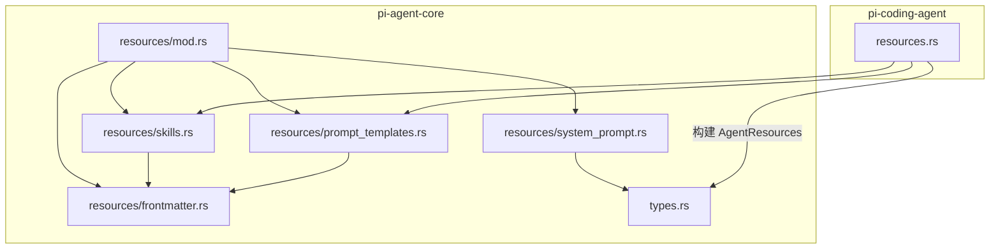
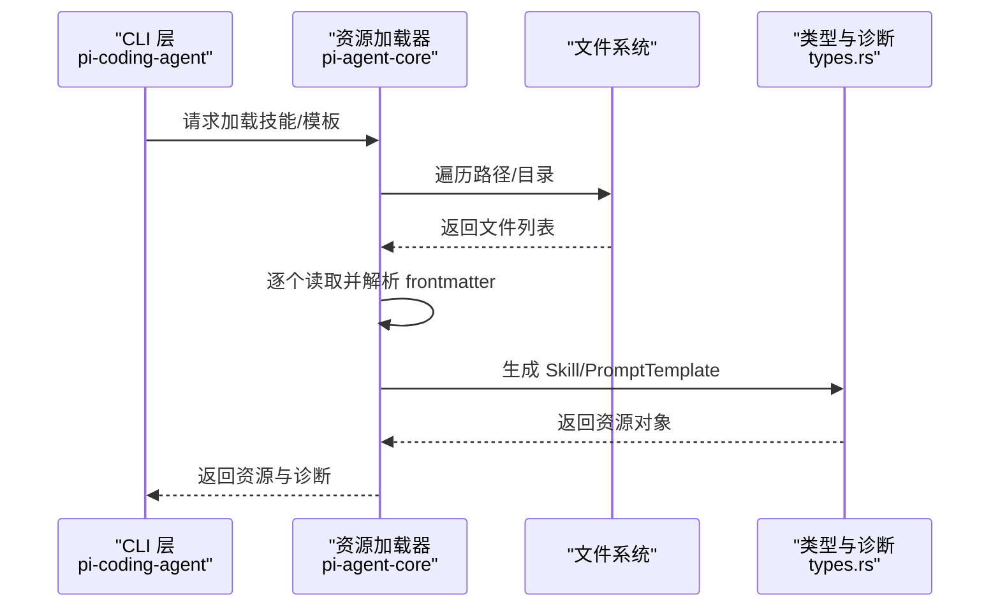
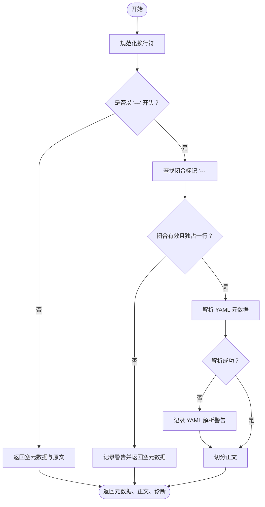
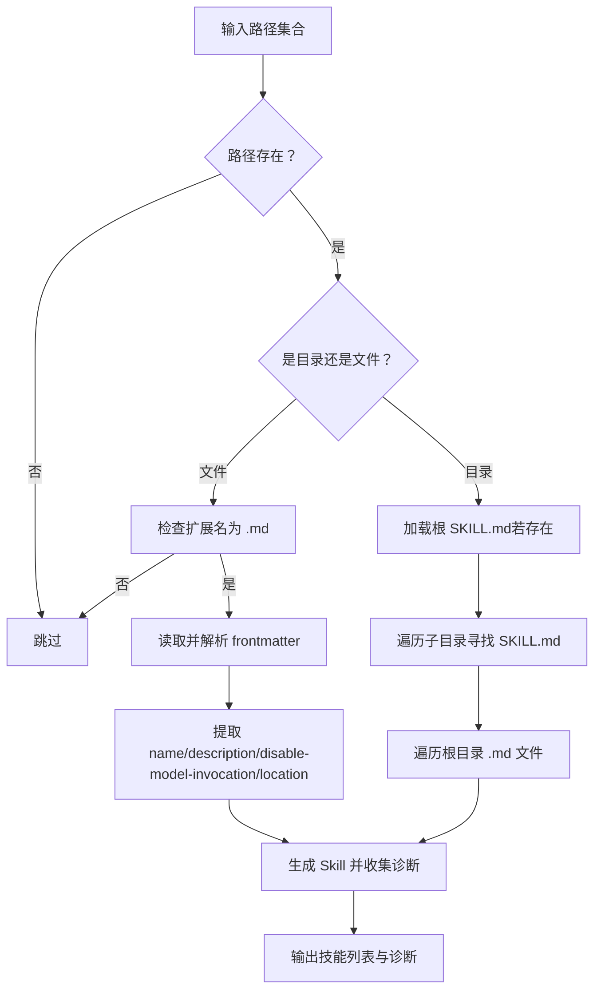
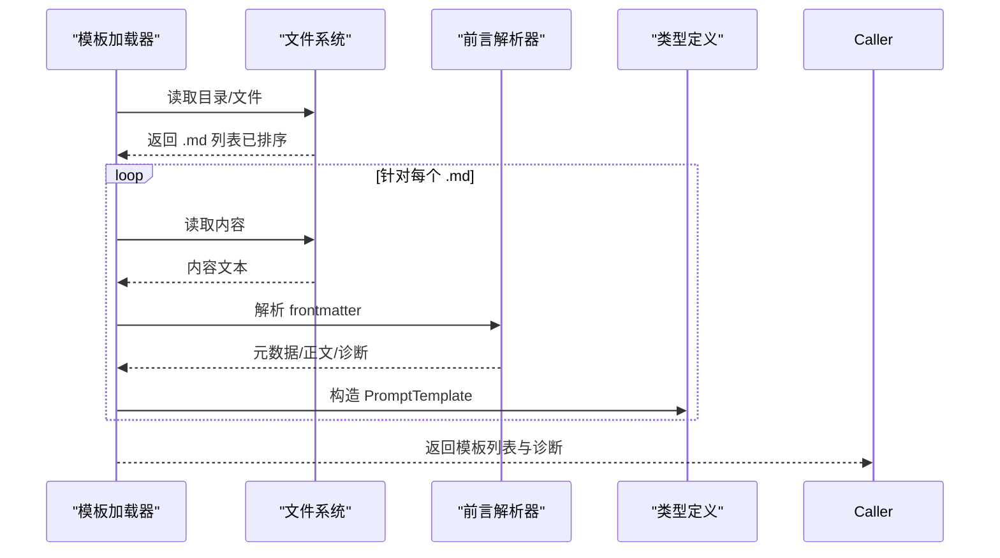
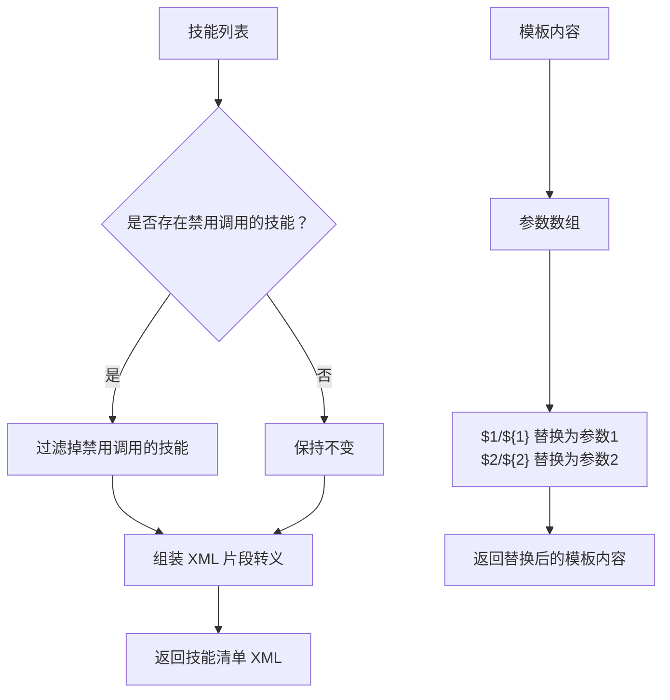
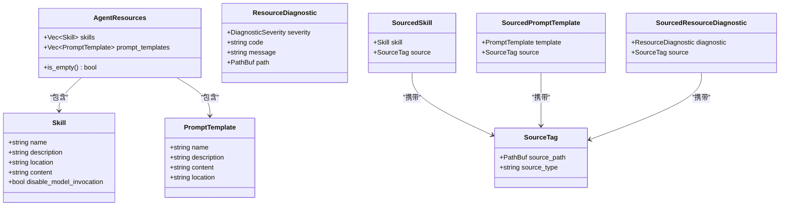
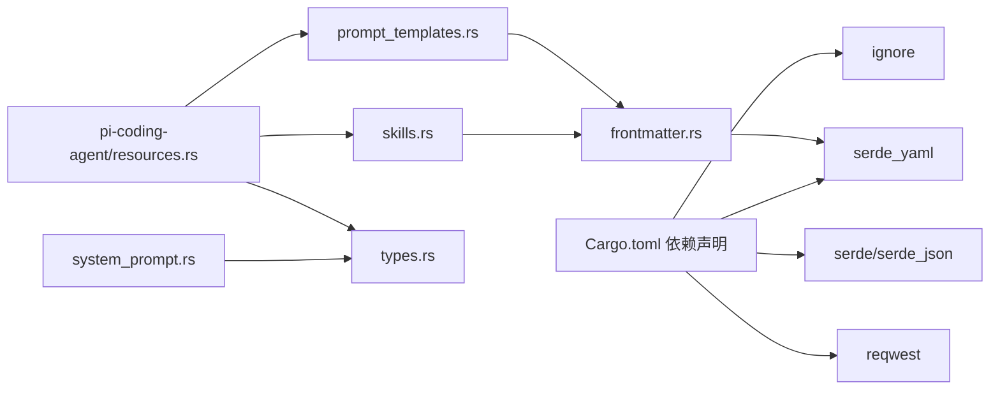

# 资源管理系统

<cite>
**本文引用的文件**
- [crates/pi-agent-core/src/resources/mod.rs](file://crates/pi-agent-core/src/resources/mod.rs)
- [crates/pi-agent-core/src/resources/frontmatter.rs](file://crates/pi-agent-core/src/resources/frontmatter.rs)
- [crates/pi-agent-core/src/resources/skills.rs](file://crates/pi-agent-core/src/resources/skills.rs)
- [crates/pi-agent-core/src/resources/prompt_templates.rs](file://crates/pi-agent-core/src/resources/prompt_templates.rs)
- [crates/pi-agent-core/src/resources/system_prompt.rs](file://crates/pi-agent-core/src/resources/system_prompt.rs)
- [crates/pi-agent-core/src/types.rs](file://crates/pi-agent-core/src/types.rs)
- [crates/pi-agent-core/tests/resources.rs](file://crates/pi-agent-core/tests/resources.rs)
- [crates/pi-coding-agent/src/resources.rs](file://crates/pi-coding-agent/src/resources.rs)
- [crates/pi-agent-core/Cargo.toml](file://crates/pi-agent-core/Cargo.toml)
- [docs/roadmap/M10-resources-input.md](file://docs/roadmap/M10-resources-input.md)
</cite>

## 目录
1. [简介](#简介)
2. [项目结构](#项目结构)
3. [核心组件](#核心组件)
4. [架构总览](#架构总览)
5. [详细组件分析](#详细组件分析)
6. [依赖关系分析](#依赖关系分析)
7. [性能考量](#性能考量)
8. [故障排查指南](#故障排查指南)
9. [结论](#结论)
10. [附录](#附录)

## 简介
本文件面向“资源管理系统”的技术文档，聚焦于以下目标：
- 技能加载系统：技能文件发现、YAML 前言（frontmatter）解析与技能注册机制
- 提示模板系统：模板解析、参数替换与系统提示注入策略
- 前言（frontmatter）处理：解析规则、错误诊断与使用场景
- 资源文件格式规范与最佳实践
- 自定义资源开发指南与扩展方法
- 常见问题与性能优化建议

该系统以 Markdown + YAML frontmatter 作为资源描述与内容的标准格式，通过统一的加载器将资源注入到智能体配置中，供后续会话与推理流程使用。

## 项目结构
资源管理位于 pi-agent-core 的 resources 子模块，并由 pi-coding-agent 在 CLI 层进行路径解析与资源聚合。核心文件组织如下：
- 资源入口与导出：resources/mod.rs
- 前言解析：resources/frontmatter.rs
- 技能加载：resources/skills.rs
- 提示模板加载：resources/prompt_templates.rs
- 系统提示注入：resources/system_prompt.rs
- 类型定义：types.rs
- CLI 资源聚合：pi-coding-agent/src/resources.rs
- 文档规范：docs/roadmap/M10-resources-input.md

图表来源
- [crates/pi-agent-core/src/resources/mod.rs:1-12](file://crates/pi-agent-core/src/resources/mod.rs#L1-L12)
- [crates/pi-agent-core/src/resources/frontmatter.rs:1-117](file://crates/pi-agent-core/src/resources/frontmatter.rs#L1-L117)
- [crates/pi-agent-core/src/resources/skills.rs:1-246](file://crates/pi-agent-core/src/resources/skills.rs#L1-L246)
- [crates/pi-agent-core/src/resources/prompt_templates.rs:1-166](file://crates/pi-agent-core/src/resources/prompt_templates.rs#L1-L166)
- [crates/pi-agent-core/src/resources/system_prompt.rs:1-149](file://crates/pi-agent-core/src/resources/system_prompt.rs#L1-L149)
- [crates/pi-agent-core/src/types.rs:188-264](file://crates/pi-agent-core/src/types.rs#L188-L264)
- [crates/pi-coding-agent/src/resources.rs:1-390](file://crates/pi-coding-agent/src/resources.rs#L1-L390)

章节来源
- [crates/pi-agent-core/src/resources/mod.rs:1-12](file://crates/pi-agent-core/src/resources/mod.rs#L1-L12)
- [crates/pi-coding-agent/src/resources.rs:114-193](file://crates/pi-coding-agent/src/resources.rs#L114-L193)

## 核心组件
- 前言解析器：负责识别并解析 Markdown 文件开头的 YAML frontmatter，返回元数据、正文与诊断信息
- 技能加载器：扫描目录或文件，提取 SKILL.md 或 .md 文件，解析 frontmatter 并生成 Skill 对象
- 提示模板加载器：扫描目录或文件，提取 .md 文件，解析 frontmatter 并生成 PromptTemplate 对象
- 系统提示注入器：将技能清单格式化为 XML 片段，或将模板调用参数替换后注入系统提示
- 类型与诊断：统一的资源类型、来源标签、诊断严重级别与资源诊断结构

章节来源
- [crates/pi-agent-core/src/resources/frontmatter.rs:4-77](file://crates/pi-agent-core/src/resources/frontmatter.rs#L4-L77)
- [crates/pi-agent-core/src/resources/skills.rs:9-168](file://crates/pi-agent-core/src/resources/skills.rs#L9-L168)
- [crates/pi-agent-core/src/resources/prompt_templates.rs:8-127](file://crates/pi-agent-core/src/resources/prompt_templates.rs#L8-L127)
- [crates/pi-agent-core/src/resources/system_prompt.rs:3-60](file://crates/pi-agent-core/src/resources/system_prompt.rs#L3-L60)
- [crates/pi-agent-core/src/types.rs:188-264](file://crates/pi-agent-core/src/types.rs#L188-L264)

## 架构总览
资源加载的整体流程：
- CLI 层解析用户提供的资源路径（技能、模板、主题）
- 核心层根据路径加载资源：扫描目录、过滤 .md/.json、解析 frontmatter
- 将资源对象注入 AgentResources，供系统提示与工具调用使用

图表来源
- [crates/pi-coding-agent/src/resources.rs:114-193](file://crates/pi-coding-agent/src/resources.rs#L114-L193)
- [crates/pi-agent-core/src/resources/skills.rs:9-109](file://crates/pi-agent-core/src/resources/skills.rs#L9-L109)
- [crates/pi-agent-core/src/resources/prompt_templates.rs:8-40](file://crates/pi-agent-core/src/resources/prompt_templates.rs#L8-L40)
- [crates/pi-agent-core/src/types.rs:188-209](file://crates/pi-agent-core/src/types.rs#L188-L209)

## 详细组件分析

### 前言（frontmatter）解析器
- 功能要点
  - 规范化换行符（\r\n → \n）
  - 识别起始标记“---”与结束标记“---”
  - 使用 YAML 解析器解析中间部分
  - 返回元数据、正文与诊断（如缺少闭合标记、YAML 解析失败）
- 错误处理
  - 无闭合标记时记录警告
  - YAML 解析失败时记录警告并返回空元数据
- 使用场景
  - 技能与模板的元信息（名称、描述、禁用模型调用等）
  - 主题 JSON 的元信息字段（名称）

图表来源
- [crates/pi-agent-core/src/resources/frontmatter.rs:4-77](file://crates/pi-agent-core/src/resources/frontmatter.rs#L4-L77)

章节来源
- [crates/pi-agent-core/src/resources/frontmatter.rs:4-77](file://crates/pi-agent-core/src/resources/frontmatter.rs#L4-L77)
- [crates/pi-agent-core/tests/resources.rs:10-27](file://crates/pi-agent-core/tests/resources.rs#L10-L27)

### 技能加载系统
- 文件发现
  - 支持传入目录或文件路径
  - 目录扫描：优先加载根目录下的 SKILL.md；随后遍历子目录寻找 SKILL.md；最后扫描根目录下所有 .md 文件
  - 使用忽略规则（如 .gitignore）跳过隐藏/忽略目录
- frontmatter 解析与回填
  - 读取文件内容，解析 frontmatter
  - 将诊断中的路径回填为当前文件路径
- 字段提取与回退策略
  - 名称：优先 frontmatter.name，否则取文件名（限制长度），否则“unnamed”
  - 描述：优先 frontmatter.description，否则取正文首行（限制长度），否则空字符串
  - 禁用模型调用：frontmatter 中支持两种键名（驼峰/短横线）
  - 位置：记录文件路径
- 源化加载
  - 提供 sourced 变体，为每个资源附加 SourceTag，便于溯源

图表来源
- [crates/pi-agent-core/src/resources/skills.rs:9-109](file://crates/pi-agent-core/src/resources/skills.rs#L9-L109)
- [crates/pi-agent-core/src/resources/frontmatter.rs:4-77](file://crates/pi-agent-core/src/resources/frontmatter.rs#L4-L77)

章节来源
- [crates/pi-agent-core/src/resources/skills.rs:9-168](file://crates/pi-agent-core/src/resources/skills.rs#L9-L168)
- [crates/pi-coding-agent/src/resources.rs:131-193](file://crates/pi-coding-agent/src/resources.rs#L131-L193)
- [crates/pi-agent-core/tests/resources.rs:30-68](file://crates/pi-agent-core/tests/resources.rs#L30-L68)

### 提示模板系统
- 文件发现
  - 支持传入目录或文件路径
  - 目录下按文件名排序加载 .md 文件
- frontmatter 解析与回填
  - 读取文件内容，解析 frontmatter
  - 将诊断中的路径回填为当前文件路径
- 字段提取与回退策略
  - 名称：优先 frontmatter.name，否则取文件名，否则“unnamed”
  - 描述：优先 frontmatter.description，否则取正文首行，均限制长度
- 源化加载
  - 提供 sourced 变体，为每个模板附加 SourceTag

图表来源
- [crates/pi-agent-core/src/resources/prompt_templates.rs:8-127](file://crates/pi-agent-core/src/resources/prompt_templates.rs#L8-L127)
- [crates/pi-agent-core/src/resources/frontmatter.rs:4-77](file://crates/pi-agent-core/src/resources/frontmatter.rs#L4-L77)
- [crates/pi-agent-core/src/types.rs:198-203](file://crates/pi-agent-core/src/types.rs#L198-L203)

章节来源
- [crates/pi-agent-core/src/resources/prompt_templates.rs:8-127](file://crates/pi-agent-core/src/resources/prompt_templates.rs#L8-L127)
- [crates/pi-coding-agent/src/resources.rs:131-193](file://crates/pi-coding-agent/src/resources.rs#L131-L193)
- [crates/pi-agent-core/tests/resources.rs:110-146](file://crates/pi-agent-core/tests/resources.rs#L110-L146)

### 系统提示注入策略
- 技能清单注入
  - 将可用技能格式化为 XML 片段，仅包含未禁用模型调用的技能
  - 对技能名称、描述、位置进行 XML 转义
- 技能调用注入
  - 生成带 name/location/content 的 XML 片段，可选附加额外指令
- 模板调用参数替换
  - 支持 $1、${2} 等两种占位符风格，按序替换

图表来源
- [crates/pi-agent-core/src/resources/system_prompt.rs:3-60](file://crates/pi-agent-core/src/resources/system_prompt.rs#L3-L60)
- [crates/pi-agent-core/src/resources/system_prompt.rs:69-148](file://crates/pi-agent-core/src/resources/system_prompt.rs#L69-L148)

章节来源
- [crates/pi-agent-core/src/resources/system_prompt.rs:3-60](file://crates/pi-agent-core/src/resources/system_prompt.rs#L3-L60)
- [crates/pi-agent-core/tests/resources.rs:71-133](file://crates/pi-agent-core/tests/resources.rs#L71-L133)

### 类型与诊断体系
- 资源类型
  - Skill：名称、描述、位置、内容、禁用模型调用标志
  - PromptTemplate：名称、描述、内容、位置
  - AgentResources：技能与模板的聚合容器
- 诊断与来源
  - ResourceDiagnostic：严重级别、代码、消息、路径
  - SourceTag：来源路径与来源类型
  - SourcedSkill/SourcedPromptTemplate/SourcedResourceDiagnostic：携带来源标签的资源与诊断
- CLI 资源聚合
  - 将加载到的技能与模板封装为 AgentResources，供智能体配置使用

图表来源
- [crates/pi-agent-core/src/types.rs:188-264](file://crates/pi-agent-core/src/types.rs#L188-L264)

章节来源
- [crates/pi-agent-core/src/types.rs:188-264](file://crates/pi-agent-core/src/types.rs#L188-L264)
- [crates/pi-coding-agent/src/resources.rs:28-39](file://crates/pi-coding-agent/src/resources.rs#L28-L39)

## 依赖关系分析
- 外部依赖
  - serde_yaml：用于 frontmatter 的 YAML 解析
  - ignore：用于目录遍历时忽略 .gitignore 等规则
  - tokio/futures：异步运行时与流式处理（在其他模块中使用）
- 内部依赖
  - resources 模块内部：frontmatter 为 skills 与 prompt_templates 的前置依赖
  - system_prompt 依赖 types 中的 Skill 结构
  - pi-coding-agent 的 resources.rs 调用核心加载器并聚合为 AgentResources

图表来源
- [crates/pi-agent-core/Cargo.toml:6-18](file://crates/pi-agent-core/Cargo.toml#L6-L18)
- [crates/pi-agent-core/src/resources/skills.rs:1](file://crates/pi-agent-core/src/resources/skills.rs#L1)
- [crates/pi-agent-core/src/resources/prompt_templates.rs:1](file://crates/pi-agent-core/src/resources/prompt_templates.rs#L1)
- [crates/pi-agent-core/src/resources/system_prompt.rs:1](file://crates/pi-agent-core/src/resources/system_prompt.rs#L1)
- [crates/pi-coding-agent/src/resources.rs:1-10](file://crates/pi-coding-agent/src/resources.rs#L1-L10)

章节来源
- [crates/pi-agent-core/Cargo.toml:6-18](file://crates/pi-agent-core/Cargo.toml#L6-L18)
- [crates/pi-agent-core/src/resources/mod.rs:1-12](file://crates/pi-agent-core/src/resources/mod.rs#L1-L12)

## 性能考量
- 目录扫描与忽略
  - 使用 ignore 库结合 .gitignore，避免扫描大量无关目录，减少 IO 压力
- 文件读取与解析
  - frontmatter 解析为 O(n) 线性扫描，YAML 解析为 O(m)，其中 n、m 为文件大小
  - 建议控制单个资源文件大小与 frontmatter 字段数量，避免超长描述导致内存占用上升
- 排序与去重
  - 模板目录按文件名排序，确保加载顺序稳定；CLI 层可进一步去重与合并
- 并发与批处理
  - 当前实现为同步读取；如需大规模资源加载，可在上层引入并发读取与批量解析

## 故障排查指南
- frontmatter 未闭合或 YAML 语法错误
  - 现象：返回警告诊断，元数据为空
  - 处理：修正 frontmatter 的起止标记与 YAML 语法
- 文件读取失败
  - 现象：返回“读取失败”诊断
  - 处理：检查文件权限、路径有效性与编码
- 忽略目录未生效
  - 现象：扫描到被忽略的目录
  - 处理：确认 .gitignore 规则与 ignore 库行为一致
- 模板参数未替换
  - 现象：输出仍包含 $1、${2}
  - 处理：确认参数数组与占位符风格一致（$1 与 ${2} 两种都支持）

章节来源
- [crates/pi-agent-core/src/resources/frontmatter.rs:28-51](file://crates/pi-agent-core/src/resources/frontmatter.rs#L28-L51)
- [crates/pi-agent-core/src/resources/skills.rs:116-127](file://crates/pi-agent-core/src/resources/skills.rs#L116-L127)
- [crates/pi-agent-core/src/resources/prompt_templates.rs:71-82](file://crates/pi-agent-core/src/resources/prompt_templates.rs#L71-L82)
- [crates/pi-agent-core/tests/resources.rs:109-146](file://crates/pi-agent-core/tests/resources.rs#L109-L146)

## 结论
资源管理系统以 Markdown + YAML frontmatter 为核心，提供了稳定的技能与提示模板加载能力，并通过系统提示注入策略将资源无缝整合进智能体工作流。其设计强调：
- 明确的文件发现与解析流程
- 可溯源的资源与诊断
- 可扩展的系统提示注入点
- 良好的错误处理与性能控制

## 附录

### 资源文件格式规范与最佳实践
- 文件命名与位置
  - 技能：推荐使用 SKILL.md 或直接在目录内放置 .md 文件
  - 模板：使用 .md 文件，文件名即模板名
- frontmatter 字段
  - name：资源名称（建议简短明确）
  - description：资源描述（建议简洁，必要时截断）
  - disable-model-invocation/disableModelInvocation：布尔值，控制是否允许模型直接调用该技能
- 正文内容
  - 技能：包含执行指导、边界条件、注意事项
  - 模板：包含占位符（$1、${2} 等）以便参数替换
- 路径与来源
  - CLI 层支持多来源路径与开关（如 --no-skills、--no-prompt-templates），建议按功能域分目录组织

章节来源
- [docs/roadmap/M10-resources-input.md:16-32](file://docs/roadmap/M10-resources-input.md#L16-L32)
- [crates/pi-agent-core/src/resources/skills.rs:135-167](file://crates/pi-agent-core/src/resources/skills.rs#L135-L167)
- [crates/pi-agent-core/src/resources/prompt_templates.rs:90-126](file://crates/pi-agent-core/src/resources/prompt_templates.rs#L90-L126)

### 自定义资源开发指南与扩展方法
- 新增资源类型
  - 在 resources 下新增模块，遵循“文件发现 → frontmatter 解析 → 类型构造 → 源化包装”的模式
  - 在 resources/mod.rs 中导出新模块与公共函数
- 系统提示集成
  - 在 system_prompt.rs 中添加新的格式化函数，或复用现有参数替换逻辑
- CLI 扩展
  - 在 pi-coding-agent 的 resources.rs 中增加路径解析与加载选项，并在命令行参数中暴露开关
- 诊断与日志
  - 使用统一的 ResourceDiagnostic 与 SourceTag，便于定位问题与追踪来源

章节来源
- [crates/pi-agent-core/src/resources/mod.rs:6-11](file://crates/pi-agent-core/src/resources/mod.rs#L6-L11)
- [crates/pi-agent-core/src/resources/system_prompt.rs:46-60](file://crates/pi-agent-core/src/resources/system_prompt.rs#L46-L60)
- [crates/pi-coding-agent/src/resources.rs:16-25](file://crates/pi-coding-agent/src/resources.rs#L16-L25)