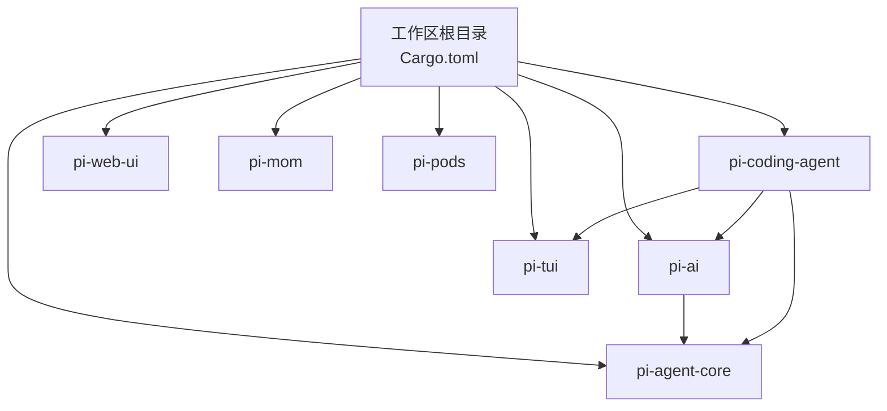
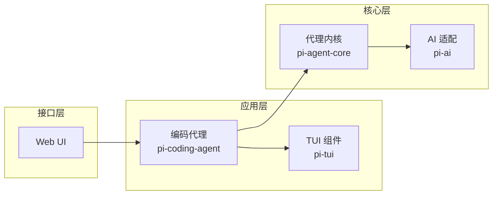
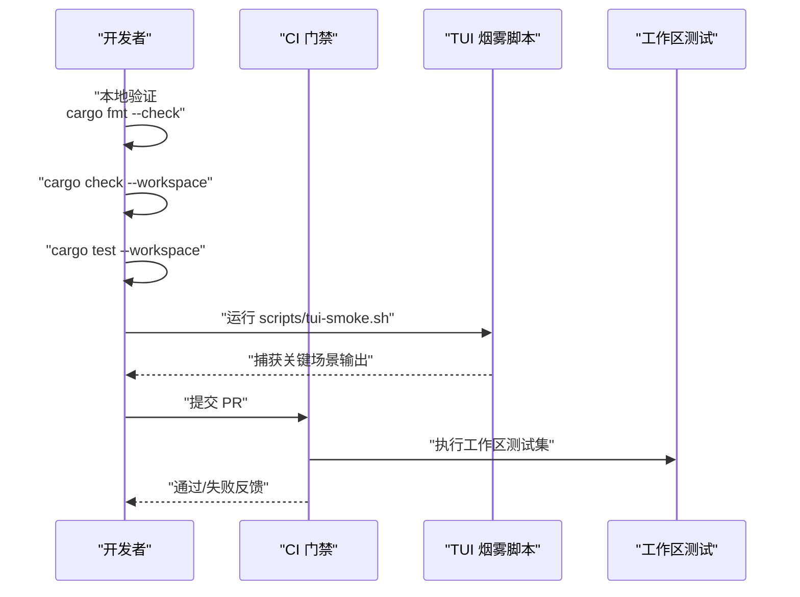
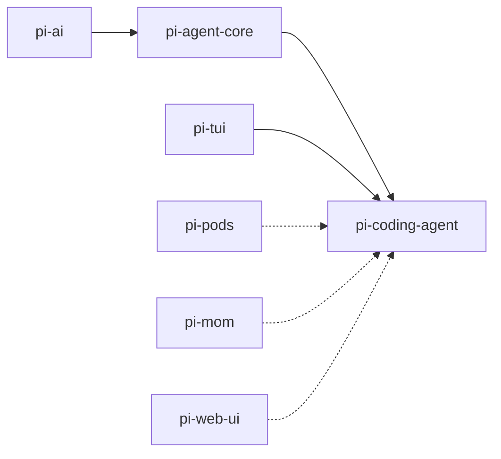

# 开发工作流程

<cite>
**本文档引用的文件**
- [Cargo.toml](file://Cargo.toml)
- [src/main.rs](file://src/main.rs)
- [ROADMAP.md](file://ROADMAP.md)
- [docs/TUI_INTERACTION_ROADMAP.md](file://docs/TUI_INTERACTION_ROADMAP.md)
- [scripts/tui-smoke.sh](file://scripts/tui-smoke.sh)
- [crates/pi-agent-core/Cargo.toml](file://crates/pi-agent-core/Cargo.toml)
- [crates/pi-ai/Cargo.toml](file://crates/pi-ai/Cargo.toml)
- [crates/pi-coding-agent/Cargo.toml](file://crates/pi-coding-agent/Cargo.toml)
- [crates/pi-tui/Cargo.toml](file://crates/pi-tui/Cargo.toml)
- [crates/pi-agent-core/tests/agent_loop.rs](file://crates/pi-agent-core/tests/agent_loop.rs)
- [crates/pi-coding-agent/tests/session_cli.rs](file://crates/pi-coding-agent/tests/session_cli.rs)
- [docs/superpowers/plans/2026-06-03-pi-agent-core-rust-poc.md](file://docs/superpowers/plans/2026-06-03-pi-agent-core-rust-poc.md)
- [docs/superpowers/plans/2026-06-04-pi-coding-agent-builtin-tools.md](file://docs/superpowers/plans/2026-06-04-pi-coding-agent-builtin-tools.md)
</cite>

## 目录
1. [简介](#简介)
2. [项目结构](#项目结构)
3. [核心组件](#核心组件)
4. [架构总览](#架构总览)
5. [详细组件分析](#详细组件分析)
6. [依赖分析](#依赖分析)
7. [性能考虑](#性能考虑)
8. [故障排查指南](#故障排查指南)
9. [结论](#结论)
10. [附录](#附录)

## 简介
本文件面向 Pi-Rust 项目团队，提供一套完整的开发工作流程指南，涵盖代码规范与最佳实践、提交与分支管理策略、测试与质量保证流程、版本控制与发布流程、开发工具与 CI/CD 集成建议，并针对常见协作问题给出解决方案。该指南以仓库现有实践为基础，结合各 crate 的 Cargo.toml 与测试用例，确保新成员快速上手并维持高质量交付节奏。

## 项目结构
Pi-Rust 采用多 crate 工作区组织，顶层 Cargo.toml 声明了统一的 workspace 成员，包含核心引擎、AI 提供商适配、编码代理、TUI 组件与 Web UI 等模块。每个 crate 独立管理自身依赖与测试，通过 path 依赖形成清晰的分层关系。

图表来源
- [Cargo.toml:1-12](file://Cargo.toml#L1-L12)

章节来源
- [Cargo.toml:1-12](file://Cargo.toml#L1-L12)

## 核心组件
- 工作区与入口
  - 工作区在顶层 Cargo.toml 中声明，包含多个 crate 成员。
  - 顶层 src/main.rs 当前为最小示例入口，实际功能由各 crate 提供。
- 依赖与特性
  - 所有 crate 使用统一的 edition（2024），并在 dev-dependencies 中引入测试与异步运行时支持。
  - 关键 crate 的依赖特征体现了异步、序列化、HTTP 客户端、错误处理与终端交互等能力。

章节来源
- [Cargo.toml:1-12](file://Cargo.toml#L1-L12)
- [src/main.rs:1-4](file://src/main.rs#L1-L4)
- [crates/pi-agent-core/Cargo.toml:1-23](file://crates/pi-agent-core/Cargo.toml#L1-L23)
- [crates/pi-ai/Cargo.toml:1-21](file://crates/pi-ai/Cargo.toml#L1-L21)
- [crates/pi-coding-agent/Cargo.toml:1-27](file://crates/pi-coding-agent/Cargo.toml#L1-L27)
- [crates/pi-tui/Cargo.toml:1-14](file://crates/pi-tui/Cargo.toml#L1-L14)

## 架构总览
Pi-Rust 的核心分层如下：
- 提供商适配层（pi-ai）：统一抽象不同大模型提供商的请求、流式响应与成本估算。
- 代理内核层（pi-agent-core）：会话管理、资源加载、提示模板与压缩流程等核心逻辑。
- 编码代理层（pi-coding-agent）：命令行与交互式运行时、内置工具、协议与会话持久化。
- 用户界面层（pi-tui）：终端内联渲染、编辑器、主题与可访问性。
- Web UI 层（pi-web-ui）：占位模块，后续扩展。
- 周边与基础设施（pi-mom、pi-pods）：范围尚未明确，作为横切关注点预留。

图表来源
- [ROADMAP.md:44-50](file://ROADMAP.md#L44-L50)
- [Cargo.toml:2-4](file://Cargo.toml#L2-L4)

章节来源
- [ROADMAP.md:44-50](file://ROADMAP.md#L44-L50)

## 详细组件分析

### 代码规范与最佳实践
- Rust 风格与命名
  - 统一使用 edition 2024，确保现代语言特性可用。
  - 依赖中广泛使用 async/await、serde derive、thiserror 错误处理与 reqwest 流式 HTTP 客户端，体现异步与类型安全优先的设计取向。
- 注释与文档
  - 文档采用 Markdown，里程碑与设计文档分散在 docs/roadmap 与 docs/superpowers 下，便于追踪演进。
- 一致性检查
  - 工作区健康度检查包含 cargo fmt --check、cargo check --workspace、cargo test --workspace 与 TUI 烟雾测试脚本，确保格式、编译与关键路径通过。

章节来源
- [ROADMAP.md:36-37](file://ROADMAP.md#L36-L37)
- [docs/TUI_INTERACTION_ROADMAP.md:108-118](file://docs/TUI_INTERACTION_ROADMAP.md#L108-L118)

### 提交规范与分支管理策略
- 提交流程
  - 建议遵循“小步快跑 + 主题分支”的原则，每次提交聚焦单一功能或修复。
  - 在任务完成后进行本地验证：cargo fmt --check、cargo check --workspace、cargo test --workspace。
- 分支策略
  - 基于主干（main/master）派生功能分支，完成评审后合并并删除分支，保持历史整洁。
  - 里程碑相关工作可在 docs/superpowers/plans 下沉淀计划，作为评审材料与知识资产。
- 合并与评审
  - 合并前必须通过所有测试与格式检查；涉及终端行为的变更需补充 TUI 烟雾测试证据。

章节来源
- [docs/TUI_INTERACTION_ROADMAP.md:108-118](file://docs/TUI_INTERACTION_ROADMAP.md#L108-L118)
- [docs/superpowers/plans/2026-06-03-pi-agent-core-rust-poc.md:1131-1152](file://docs/superpowers/plans/2026-06-03-pi-agent-core-rust-poc.md#L1131-L1152)

### 测试策略与质量保证
- 单元测试
  - 各 crate 在 tests/ 下维护针对性测试，如 pi-coding-agent 的 session_cli.rs 通过 CLI 运行与输出断言验证会话行为。
- 集成测试
  - pi-agent-core 的 agent_loop.rs 用于代理循环集成测试，配合测试提供商与脚本化回合，验证核心流程。
- 端到端测试
  - TUI 交互稳定性通过 scripts/tui-smoke.sh 在 tmux 中自动化捕获关键场景（启动、首字符、宽字符、尺寸变化、帮助命令、退出清理等），形成跨终端的烟雾测试矩阵。
- 质量门禁
  - 每个里程碑的验收清单包含 cargo fmt --check、cargo test -p pi-tui、cargo test -p pi-coding-agent、cargo test --workspace、cargo check --workspace；涉及终端行为的里程碑还需运行 TUI 烟雾套件。

图表来源
- [docs/TUI_INTERACTION_ROADMAP.md:108-118](file://docs/TUI_INTERACTION_ROADMAP.md#L108-L118)
- [scripts/tui-smoke.sh:1-82](file://scripts/tui-smoke.sh#L1-L82)

章节来源
- [crates/pi-coding-agent/tests/session_cli.rs:282-325](file://crates/pi-coding-agent/tests/session_cli.rs#L282-L325)
- [crates/pi-agent-core/tests/agent_loop.rs](file://crates/pi-agent-core/tests/agent_loop.rs)
- [scripts/tui-smoke.sh:1-82](file://scripts/tui-smoke.sh#L1-L82)
- [docs/TUI_INTERACTION_ROADMAP.md:108-118](file://docs/TUI_INTERACTION_ROADMAP.md#L108-L118)

### 版本控制与发布流程
- 语义化版本控制
  - 所有 crate 的版本号目前为 0.1.0，遵循语义化版本（主版本.次版本.修订），在功能破坏性变更时提升主版本，新增向后兼容功能时提升次版本，修复提升修订号。
- 变更日志维护
  - 建议在 docs/roadmap/ 与 docs/superpowers/plans/ 中记录里程碑与计划，形成可追溯的演进线索；发布时汇总为 CHANGELOG 或在 GitHub Releases 中说明。
- 发布门禁
  - 里程碑验收清单中的测试与检查项作为发布门禁；涉及终端行为的功能需通过 TUI 烟雾测试。

章节来源
- [ROADMAP.md:36-37](file://ROADMAP.md#L36-L37)
- [docs/TUI_INTERACTION_ROADMAP.md:108-118](file://docs/TUI_INTERACTION_ROADMAP.md#L108-L118)

### 开发工具配置与 CI/CD 集成建议
- 本地工具
  - Rust 工具链：rustup、cargo、rustfmt、clippy。
  - IDE/编辑器：启用 rust-analyzer，自动格式化与诊断。
- CI/CD 建议
  - 触发条件：push 到主分支与 PR。
  - 步骤建议：
    - 安装工具链与缓存依赖
    - cargo fmt --check
    - cargo check --workspace
    - cargo test --workspace
    - 针对 TUI 的 PR 运行 scripts/tui-smoke.sh 并上传捕获产物
  - 结果：通过后方可合并。

章节来源
- [docs/TUI_INTERACTION_ROADMAP.md:108-118](file://docs/TUI_INTERACTION_ROADMAP.md#L108-L118)
- [scripts/tui-smoke.sh:1-82](file://scripts/tui-smoke.sh#L1-L82)

### 常见问题与协作挑战
- 终端行为差异
  - 不同终端模拟器对光标、清屏与滚动行为存在差异，需通过 TUI 烟雾测试覆盖主流终端。
- 依赖与 TLS
  - reqwest 默认启用 rustls-tls，避免系统 OpenSSL 依赖差异带来的构建问题。
- 会话兼容性
  - 会话 JSONL 与上游 TS 实现保持互通，避免漂移导致的数据不一致。
- 任务拆分与评审
  - 将大型功能拆分为里程碑与计划，评审前准备测试与文档，减少返工。

章节来源
- [ROADMAP.md:18-19](file://ROADMAP.md#L18-L19)
- [crates/pi-ai/Cargo.toml:10](file://crates/pi-ai/Cargo.toml#L10)
- [crates/pi-agent-core/Cargo.toml:18](file://crates/pi-agent-core/Cargo.toml#L18)
- [docs/TUI_INTERACTION_ROADMAP.md:68-83](file://docs/TUI_INTERACTION_ROADMAP.md#L68-L83)

## 依赖分析
各 crate 的依赖关系与职责边界如下：

图表来源
- [ROADMAP.md:44-50](file://ROADMAP.md#L44-L50)
- [crates/pi-coding-agent/Cargo.toml:13-15](file://crates/pi-coding-agent/Cargo.toml#L13-L15)
- [crates/pi-agent-core/Cargo.toml:6-7](file://crates/pi-agent-core/Cargo.toml#L6-L7)

章节来源
- [ROADMAP.md:44-50](file://ROADMAP.md#L44-L50)
- [crates/pi-coding-agent/Cargo.toml:1-27](file://crates/pi-coding-agent/Cargo.toml#L1-L27)
- [crates/pi-agent-core/Cargo.toml:1-23](file://crates/pi-agent-core/Cargo.toml#L1-L23)
- [crates/pi-ai/Cargo.toml:1-21](file://crates/pi-ai/Cargo.toml#L1-L21)
- [crates/pi-tui/Cargo.toml:1-14](file://crates/pi-tui/Cargo.toml#L1-L14)

## 性能考虑
- 异步与流式处理
  - 通过 tokio、futures、async-stream 与 reqwest 流式响应，降低阻塞与内存峰值。
- 渲染与输入节流
  - TUI 使用 RenderScheduler 控制渲染频率，避免高频重绘造成卡顿。
- I/O 与磁盘
  - 会话与资源读写尽量采用增量与差异更新，减少不必要的全量扫描与序列化。

章节来源
- [crates/pi-ai/Cargo.toml:7-10](file://crates/pi-ai/Cargo.toml#L7-L10)
- [crates/pi-agent-core/Cargo.toml:8-10](file://crates/pi-agent-core/Cargo.toml#L8-L10)
- [docs/TUI_INTERACTION_ROADMAP.md:50-53](file://docs/TUI_INTERACTION_ROADMAP.md#L50-L53)

## 故障排查指南
- 本地验证失败
  - 按照里程碑验收清单逐项执行：cargo fmt --check、cargo check --workspace、cargo test --workspace。
- TUI 行为异常
  - 运行 scripts/tui-smoke.sh，对比捕获输出与验收清单中的期望项，定位终端差异引发的问题。
- 会话与 CLI 行为
  - 参考 session_cli.rs 的断言方式，编写或复用测试用例，确保 CLI 参数与输出符合预期。

章节来源
- [docs/TUI_INTERACTION_ROADMAP.md:108-118](file://docs/TUI_INTERACTION_ROADMAP.md#L108-L118)
- [scripts/tui-smoke.sh:65-82](file://scripts/tui-smoke.sh#L65-L82)
- [crates/pi-coding-agent/tests/session_cli.rs:282-325](file://crates/pi-coding-agent/tests/session_cli.rs#L282-L325)

## 结论
本工作流程以“可验证、可追溯、可扩展”为目标，结合现有测试与文档实践，为 Pi-Rust 项目提供了从开发到发布的标准化路径。建议团队在日常工作中持续完善测试矩阵、沉淀设计文档与评审材料，并在里程碑节点进行回顾与优化，确保高质量交付与长期可维护性。

## 附录
- 术语
  - TUI：文本用户界面
  - JSONL：每行一条 JSON 的日志/会话数据格式
  - POC：概念验证
- 参考
  - 里程碑与路线图：docs/roadmap/
  - 设计与计划：docs/superpowers/specs/ 与 docs/superpowers/plans/