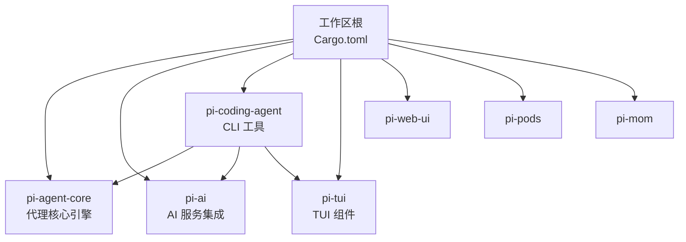
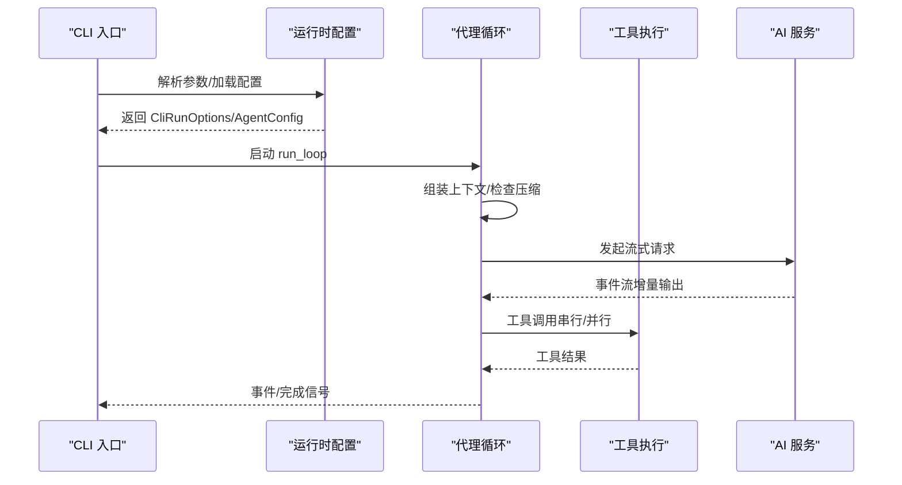
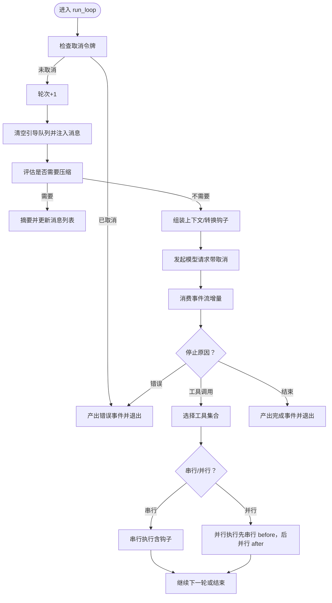
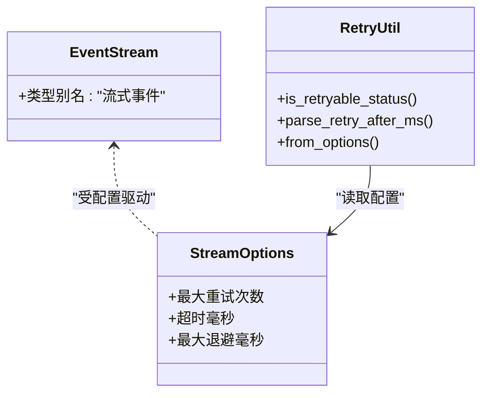
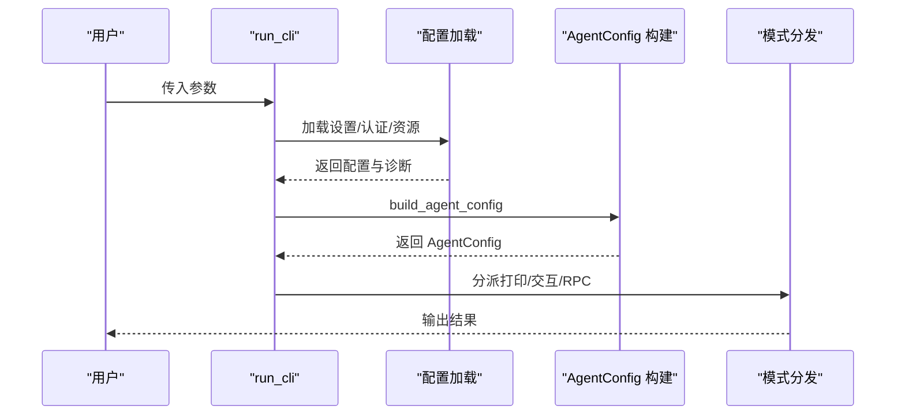
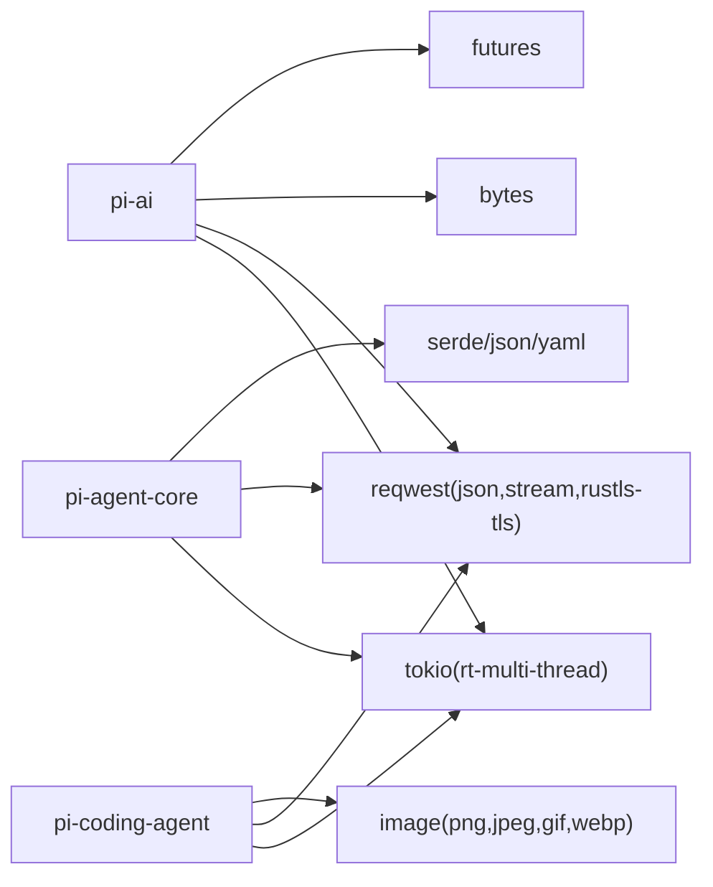

# 性能优化

<cite>
**本文引用的文件**
- [Cargo.toml](file://Cargo.toml)
- [main.rs](file://src/main.rs)
- [pi-agent-core/Cargo.toml](file://crates/pi-agent-core/Cargo.toml)
- [pi-agent-core/lib.rs](file://crates/pi-agent-core/src/lib.rs)
- [pi-agent-core/agent_loop.rs](file://crates/pi-agent-core/src/agent_loop.rs)
- [pi-ai/Cargo.toml](file://crates/pi-ai/Cargo.toml)
- [pi-ai/lib.rs](file://crates/pi-ai/src/lib.rs)
- [pi-ai/stream.rs](file://crates/pi-ai/src/stream.rs)
- [pi-coding-agent/Cargo.toml](file://crates/pi-coding-agent/Cargo.toml)
- [pi-coding-agent/lib.rs](file://crates/pi-coding-agent/src/lib.rs)
- [pi-coding-agent/runtime.rs](file://crates/pi-coding-agent/src/runtime.rs)
- [pi-coding-agent/protocol/rpc.rs](file://crates/pi-coding-agent/src/protocol/rpc.rs)
- [pi-coding-agent/tests/file_mutation_queue.rs](file://crates/pi-coding-agent/tests/file_mutation_queue.rs)
- [pi-coding-agent/tests/tool_operations.rs](file://crates/pi-coding-agent/tests/tool_operations.rs)
- [pi-ai/tests/http_retry.rs](file://crates/pi-ai/tests/http_retry.rs)
- [docs/superpowers/plans/2026-06-19-pi-tui-tui8-spinner.md](file://docs/superpowers/plans/2026-06-19-pi-tui-tui8-spinner.md)
- [docs/superpowers/specs/2026-06-19-pi-tui-tui8-spinner-design.md](file://docs/superpowers/specs/2026-06-19-pi-tui-tui8-spinner-design.md)
- [docs/superpowers/plans/2026-06-03-pi-agent-core-rust-poc.md](file://docs/superpowers/plans/2026-06-03-pi-agent-core-rust-poc.md)
- [docs/superpowers/plans/2026-06-05-pi-agent-session-persistence.md](file://docs/superpowers/plans/2026-06-05-pi-agent-session-persistence.md)
- [Cargo.lock](file://Cargo.lock)
</cite>

## 目录
1. [引言](#引言)
2. [项目结构](#项目结构)
3. [核心组件](#核心组件)
4. [架构总览](#架构总览)
5. [详细组件分析](#详细组件分析)
6. [依赖关系分析](#依赖关系分析)
7. [性能考量与优化策略](#性能考量与优化策略)
8. [故障排查指南](#故障排查指南)
9. [结论](#结论)
10. [附录：性能分析与基准测试方法](#附录性能分析与基准测试方法)

## 引言
本文件面向 Pi-Rust 项目，系统化梳理并提出性能优化方案，覆盖内存管理、并发编程、编译优化、异步运行时配置、任务调度与资源池管理、网络请求与 I/O 优化，并结合各 crate 的实现特性给出可操作的优化建议与瓶颈定位方法。目标是帮助开发者在不牺牲功能与正确性的前提下，获得更稳定、更低延迟、更可控资源占用的系统表现。

## 项目结构
Pi-Rust 采用多 crate 工作区组织，核心模块包括：
- 代理核心引擎（pi-agent-core）：负责智能体循环、工具调用、上下文组装、会话压缩与事件流。
- AI 服务集成（pi-ai）：统一模型注册、流式事件处理、HTTP 重试策略与通用工具。
- 编码代理 CLI（pi-coding-agent）：命令行入口、交互模式、打印模式、RPC 协议与工具集。
- TUI 组件（pi-tui）：终端用户界面组件与渲染调度。
- Web UI（pi-web-ui）、Pods/MOM（pi-pods, pi-mom）：当前仓库中作为占位或独立模块存在。

工作区根 Cargo.toml 声明了成员 crate；各 crate 的 Cargo.toml 明确了异步运行时、网络栈与并发相关依赖。

图表来源
- [Cargo.toml](file://Cargo.toml)
- [pi-agent-core/Cargo.toml](file://crates/pi-agent-core/Cargo.toml)
- [pi-ai/Cargo.toml](file://crates/pi-ai/Cargo.toml)
- [pi-coding-agent/Cargo.toml](file://crates/pi-coding-agent/Cargo.toml)

章节来源
- [Cargo.toml](file://Cargo.toml)
- [pi-agent-core/Cargo.toml](file://crates/pi-agent-core/Cargo.toml)
- [pi-ai/Cargo.toml](file://crates/pi-ai/Cargo.toml)
- [pi-coding-agent/Cargo.toml](file://crates/pi-coding-agent/Cargo.toml)

## 核心组件
- 代理核心引擎（pi-agent-core）
  - 提供 Agent 循环、消息队列、上下文组装、工具调用、会话压缩与事件流。
  - 关键路径：agent_loop.rs 中的 run_loop 实现，支持串行/并行工具执行、取消令牌、思考级别与流选项。
- AI 服务集成（pi-ai）
  - 提供 EventStream 类型别名与 complete 辅助函数，统一处理 LLM 流式事件。
  - 提供重试策略工具与 HTTP 重试测试，支撑网络请求稳定性。
- CLI 工具（pi-coding-agent）
  - 提供命令行解析、打印模式、交互模式、RPC 协议与工具集。
  - 运行时配置 build_agent_config 支持最大轮次、思考级别、工具执行模式与会话压缩等。

章节来源
- [pi-agent-core/lib.rs](file://crates/pi-agent-core/src/lib.rs)
- [pi-ai/lib.rs](file://crates/pi-ai/src/lib.rs)
- [pi-coding-agent/lib.rs](file://crates/pi-coding-agent/src/lib.rs)

## 架构总览
整体数据流从 CLI 入口进入，经由运行时配置构建 AgentConfig，随后进入代理循环；在循环内根据思考级别与工具执行模式选择串行或并行执行工具，期间通过 AI 服务进行模型推理与事件流消费。

图表来源
- [pi-coding-agent/lib.rs](file://crates/pi-coding-agent/src/lib.rs)
- [pi-coding-agent/runtime.rs](file://crates/pi-coding-agent/src/runtime.rs)
- [pi-agent-core/agent_loop.rs](file://crates/pi-agent-core/src/agent_loop.rs)
- [pi-ai/stream.rs](file://crates/pi-ai/src/stream.rs)

## 详细组件分析

### 代理核心引擎（pi-agent-core）
- 并发与取消
  - 使用 CancellationToken 驱动中断；在每轮循环前检查取消状态，避免无谓计算。
  - 在工具执行阶段，串行路径与并行路径均支持取消传播。
- 工具执行策略
  - 串行模式：顺序触发 before/execute/after 钩子，保证状态一致性。
  - 并行模式：先串行执行 before 钩子，再并行执行工具，最后串行 after 钩子，兼顾吞吐与一致性。
- 上下文与压缩
  - 在每次请求前估算 token 数量，按配置决定是否压缩历史消息，减少上下文长度，降低延迟与成本。
- 事件流
  - 将 LLM 事件逐条透传到上层，避免一次性缓冲大量中间态。

图表来源
- [pi-agent-core/agent_loop.rs](file://crates/pi-agent-core/src/agent_loop.rs)

章节来源
- [pi-agent-core/agent_loop.rs](file://crates/pi-agent-core/src/agent_loop.rs)
- [docs/superpowers/plans/2026-06-03-pi-agent-core-rust-poc.md](file://docs/superpowers/plans/2026-06-03-pi-agent-core-rust-poc.md)

### AI 服务集成（pi-ai）
- 流式事件处理
  - EventStream 以 Pin<Box<dyn Stream + Send>> 表达，便于跨提供方抽象。
  - complete 辅助函数等待 Done 或 Error 事件，简化调用端逻辑。
- HTTP 重试策略
  - 提供 is_retryable_status 与 parse_retry_after_ms 等工具，配合 StreamOptions 控制最大重试次数与退避上限。
  - 测试覆盖常见重试状态与上限行为，保障稳定性。

图表来源
- [pi-ai/stream.rs](file://crates/pi-ai/src/stream.rs)
- [pi-ai/Cargo.toml](file://crates/pi-ai/Cargo.toml)
- [pi-ai/tests/http_retry.rs](file://crates/pi-ai/tests/http_retry.rs)

章节来源
- [pi-ai/stream.rs](file://crates/pi-ai/src/stream.rs)
- [pi-ai/Cargo.toml](file://crates/pi-ai/Cargo.toml)
- [pi-ai/tests/http_retry.rs](file://crates/pi-ai/tests/http_retry.rs)

### CLI 工具（pi-coding-agent）
- 运行时配置
  - build_agent_config 将 CLI 参数映射为 AgentConfig，支持思考级别、工具执行模式、会话压缩与重试策略。
- 模式分流
  - 打印模式、交互模式与 RPC 模式分别对应不同的输入/输出路径，避免不必要的 I/O 开销。
- 资源加载与上下文文件
  - 支持按需加载技能与模板，控制上下文文件数量，降低组装成本。

图表来源
- [pi-coding-agent/lib.rs](file://crates/pi-coding-agent/src/lib.rs)
- [pi-coding-agent/runtime.rs](file://crates/pi-coding-agent/src/runtime.rs)
- [pi-coding-agent/protocol/rpc.rs](file://crates/pi-coding-agent/src/protocol/rpc.rs)

章节来源
- [pi-coding-agent/lib.rs](file://crates/pi-coding-agent/src/lib.rs)
- [pi-coding-agent/runtime.rs](file://crates/pi-coding-agent/src/runtime.rs)
- [pi-coding-agent/protocol/rpc.rs](file://crates/pi-coding-agent/src/protocol/rpc.rs)

### TUI 渲染与定时器（pi-tui）
- 定时器驱动的渲染节拍
  - 文档计划中使用 tokio::time::sleep 驱动旋转器帧推进与强制刷新，避免固定频率定时器带来的抖动。
  - 该方式在渲染循环中按需创建计时器，确保约 120ms 的刷新节奏，适合轻量 UI 更新。

章节来源
- [docs/superpowers/plans/2026-06-19-pi-tui-tui8-spinner.md](file://docs/superpowers/plans/2026-06-19-pi-tui-tui8-spinner.md)
- [docs/superpowers/specs/2026-06-19-pi-tui-tui8-spinner-design.md](file://docs/superpowers/specs/2026-06-19-pi-tui-tui8-spinner-design.md)

## 依赖关系分析
- 运行时与并发
  - pi-ai 与 pi-coding-agent 均启用 tokio rt-multi-thread 特性，适合高并发 I/O 场景。
  - reqwest 默认禁用默认特性并启用 json、stream、rustls-tls，提升 TLS 与流式处理性能。
- 第三方库
  - bytes/futures/tokio-util 用于高性能字节流与异步工具。
  - ring/base64 用于加密与编码场景，保障安全与兼容性。

图表来源
- [pi-ai/Cargo.toml](file://crates/pi-ai/Cargo.toml)
- [pi-coding-agent/Cargo.toml](file://crates/pi-coding-agent/Cargo.toml)
- [pi-agent-core/Cargo.toml](file://crates/pi-agent-core/Cargo.toml)

章节来源
- [pi-ai/Cargo.toml](file://crates/pi-ai/Cargo.toml)
- [pi-coding-agent/Cargo.toml](file://crates/pi-coding-agent/Cargo.toml)
- [pi-agent-core/Cargo.toml](file://crates/pi-agent-core/Cargo.toml)
- [Cargo.lock](file://Cargo.lock)

## 性能考量与优化策略

### 内存管理
- 避免不必要的克隆
  - 在代理循环中对消息列表与资源的访问尽量复用引用，减少 Vec/字符串克隆次数。
  - 对于工具执行结果，优先使用就地更新或增量拼接，避免大对象频繁分配。
- 事件流与缓冲
  - 利用 EventStream 的增量特性，避免将整个流缓存到内存；仅在必要时保留少量中间态。
- 会话存储
  - 参考 InMemorySessionStorage 的设计，使用哈希表索引与紧凑向量存储，降低查找与遍历开销。

章节来源
- [pi-agent-core/agent_loop.rs](file://crates/pi-agent-core/src/agent_loop.rs)
- [docs/superpowers/plans/2026-06-05-pi-agent-session-persistence.md](file://docs/superpowers/plans/2026-06-05-pi-agent-session-persistence.md)

### 并发编程
- 串行 vs 并行工具执行
  - 串行模式保证一致性，适合有副作用或共享状态的工具；并行模式提升吞吐，但需注意钩子与资源竞争。
  - 在工具执行前先串行执行 before 钩子，再并行执行工具，最后串行 after 钩子，平衡性能与一致性。
- 取消与中断
  - 在关键路径（如网络请求、文件 I/O）传递取消令牌，确保快速响应中断。
- 任务调度
  - 使用 tokio::select! 与 futures::select! 组合，避免阻塞等待；对高频事件（如 TUI 旋转器）采用按需计时器，减少固定 tick 的开销。

章节来源
- [pi-agent-core/agent_loop.rs](file://crates/pi-agent-core/src/agent_loop.rs)
- [docs/superpowers/plans/2026-06-19-pi-tui-tui8-spinner.md](file://docs/superpowers/plans/2026-06-19-pi-tui-tui8-spinner.md)

### 编译优化
- 启用合适的优化等级
  - Release 构建开启 LTO、codegen-units 与 opt-level，减少二进制体积与提升运行时性能。
- 减少动态分发
  - 对热点路径尽量内联小函数，避免过度泛型导致的 monomorphization 压力。
- 依赖裁剪
  - 保持最小依赖集，避免引入不必要的特性与功能分支。

### 异步运行时配置
- 多线程运行时
  - 通过 rt-multi-thread 提升 I/O 密集场景下的并发度；合理设置线程数与 CPU 绑定策略。
- I/O 多路复用
  - 使用 io-util/fs/process/time 等特性，充分利用底层 epoll/kqueue 的高效性。
- 资源池管理
  - 对外部连接（如 HTTP 客户端）复用连接池，限制并发上限，避免资源枯竭。

章节来源
- [pi-ai/Cargo.toml](file://crates/pi-ai/Cargo.toml)
- [pi-coding-agent/Cargo.toml](file://crates/pi-coding-agent/Cargo.toml)

### 网络请求优化
- 重试策略
  - 使用 is_retryable_status 与 parse_retry_after_ms 控制退避与上限，避免雪崩效应。
  - 在 StreamOptions 中配置最大重试次数与最大退避时间，结合服务端 Retry-After 头部。
- 连接与传输
  - 启用 rustls-tls 与流式 JSON，减少 TLS 握手与解析开销。
- 超时与背压
  - 为每个请求设置合理超时，防止下游阻塞影响整体吞吐。

章节来源
- [pi-ai/stream.rs](file://crates/pi-ai/src/stream.rs)
- [pi-ai/Cargo.toml](file://crates/pi-ai/Cargo.toml)
- [pi-ai/tests/http_retry.rs](file://crates/pi-ai/tests/http_retry.rs)

### I/O 操作优化
- 文件操作
  - 使用 with_file_mutation_queue 等机制串行化写入，避免竞态与落盘抖动。
  - 对批量写入采用缓冲与批处理，减少系统调用次数。
- 图像处理
  - 仅启用所需格式（png/jpg/gif/webp），避免不必要的解码器初始化。
- 标准输入/输出
  - 在 CLI 模式中按需读取 stdin，避免阻塞等待；对大文本输出采用流式写入。

章节来源
- [pi-coding-agent/tests/file_mutation_queue.rs](file://crates/pi-coding-agent/tests/file_mutation_queue.rs)
- [pi-coding-agent/Cargo.toml](file://crates/pi-coding-agent/Cargo.toml)

### 性能瓶颈识别与解决
- 瓶颈定位
  - 使用火焰图与性能剖析工具识别热点函数；关注代理循环中的工具执行、网络请求与事件流消费。
- 解决方案
  - 对热点路径进行缓存（如模型查询、资源加载）；对长链路调用拆分并增加细粒度指标。
  - 优化上下文大小（压缩与截断），降低模型推理成本。

## 故障排查指南
- 代理循环异常
  - 检查取消令牌是否正确传递；确认工具执行钩子返回值与错误处理。
- 流式事件缺失
  - 确认 EventStream 是否提前结束；使用 complete 辅助函数验证 Done/Error 事件是否到达。
- CLI 模式问题
  - 核对 run_cli_with_options 的参数解析与资源加载流程；检查 RPC 模式的命令支持范围。
- TUI 渲染卡顿
  - 检查定时器创建频率与渲染节拍；避免在渲染循环中执行耗时同步操作。

章节来源
- [pi-agent-core/agent_loop.rs](file://crates/pi-agent-core/src/agent_loop.rs)
- [pi-ai/stream.rs](file://crates/pi-ai/src/stream.rs)
- [pi-coding-agent/lib.rs](file://crates/pi-coding-agent/src/lib.rs)
- [pi-coding-agent/protocol/rpc.rs](file://crates/pi-coding-agent/src/protocol/rpc.rs)

## 结论
通过对代理核心引擎、AI 服务集成与 CLI 工具的性能分析，可以发现当前实现已在异步运行时、事件流与工具执行策略方面具备良好基础。进一步的优化应聚焦于：减少不必要的克隆与缓冲、合理选择串行/并行策略、完善重试与超时控制、优化 I/O 与网络请求、以及建立完善的性能监控与剖析体系。这些措施将显著提升系统的吞吐、延迟与稳定性。

## 附录：性能分析与基准测试方法
- 性能分析工具
  - 使用 perf/flamegraph/profiler 等工具生成火焰图，定位热点函数。
  - 使用 tokio-console 观察任务调度与阻塞点。
- 基准测试
  - 对工具执行、会话压缩、事件流消费等关键路径编写基准测试，覆盖不同规模与并发场景。
  - 对比串行与并行工具执行的吞吐差异，评估取消与中断的响应时间。
- 指标与日志
  - 在代理循环与工具执行处埋点，记录轮次、事件数量、耗时与错误率，形成可观测性闭环。