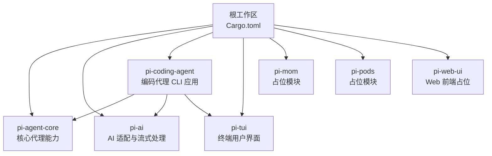
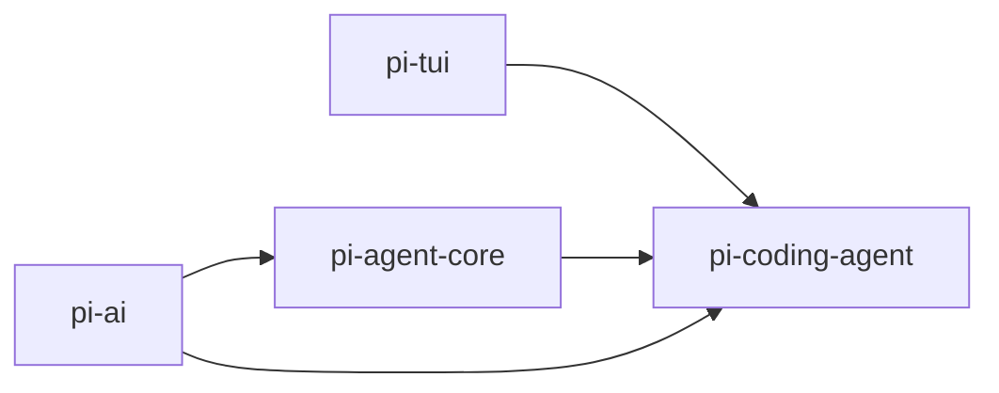
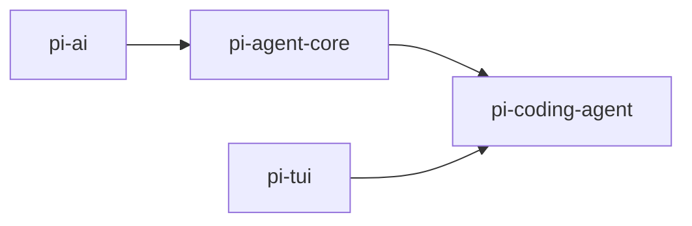

# 构建配置

<cite>
**本文引用的文件**
- [Cargo.toml](file://Cargo.toml)
- [Cargo.lock](file://Cargo.lock)
- [main.rs](file://src/main.rs)
- [pi-agent-core/Cargo.toml](file://crates/pi-agent-core/Cargo.toml)
- [pi-ai/Cargo.toml](file://crates/pi-ai/Cargo.toml)
- [pi-coding-agent/Cargo.toml](file://crates/pi-coding-agent/Cargo.toml)
- [pi-tui/Cargo.toml](file://crates/pi-tui/Cargo.toml)
- [pi-mom/Cargo.toml](file://crates/pi-mom/Cargo.toml)
- [pi-pods/Cargo.toml](file://crates/pi-pods/Cargo.toml)
- [pi-web-ui/Cargo.toml](file://crates/pi-web-ui/Cargo.toml)
- [tui-smoke.sh](file://scripts/tui-smoke.sh)
</cite>

## 目录
1. [简介](#简介)
2. [项目结构](#项目结构)
3. [核心组件](#核心组件)
4. [架构总览](#架构总览)
5. [详细组件分析](#详细组件分析)
6. [依赖关系分析](#依赖关系分析)
7. [性能与优化](#性能与优化)
8. [故障排查指南](#故障排查指南)
9. [结论](#结论)
10. [附录](#附录)

## 简介
本文件面向 Pi-Rust 项目的开发者，系统化梳理工作区（workspace）的构建配置与依赖关系，覆盖包成员管理、依赖声明与版本策略、构建顺序、优化选项、自动化脚本与常见问题诊断。内容从基础构建到高级优化，帮助不同层次读者快速上手并深入掌握构建体系。

## 项目结构
Pi-Rust 采用 Cargo 工作区组织多 crate 的开发与测试。根目录的 Cargo.toml 声明了工作区成员，包含核心库与应用层模块；各子 crate 在 crates 目录下独立维护，彼此通过路径依赖相互引用；顶层 src/main.rs 提供可执行入口示例。

图表来源
- [Cargo.toml:1-12](file://Cargo.toml#L1-L12)
- [pi-coding-agent/Cargo.toml:1-27](file://crates/pi-coding-agent/Cargo.toml#L1-L27)
- [pi-agent-core/Cargo.toml:1-23](file://crates/pi-agent-core/Cargo.toml#L1-L23)
- [pi-ai/Cargo.toml:1-21](file://crates/pi-ai/Cargo.toml#L1-L21)
- [pi-tui/Cargo.toml:1-14](file://crates/pi-tui/Cargo.toml#L1-L14)

章节来源
- [Cargo.toml:1-12](file://Cargo.toml#L1-L12)
- [main.rs:1-4](file://src/main.rs#L1-L4)

## 核心组件
- 工作区与成员
  - 工作区在根 Cargo.toml 中通过 members 字段声明所有子 crate，统一版本与工具链策略。
  - 成员包括：pi-agent-core、pi-ai、pi-coding-agent、pi-tui、pi-mom、pi-pods、pi-web-ui。
- 版本与编辑器
  - 所有成员 crate 统一使用 2024 edition，便于共享特性与语法。
  - 根包信息（名称、版本、edition）用于标识工作区整体元数据。
- 顶层入口
  - src/main.rs 当前为最小示例程序，实际业务由各 crate 提供。

章节来源
- [Cargo.toml:1-12](file://Cargo.toml#L1-L12)
- [main.rs:1-4](file://src/main.rs#L1-L4)

## 架构总览
工作区采用“库优先”的分层设计：
- pi-ai：提供跨模型供应商的通用能力（HTTP 客户端、流式处理、认证等），作为上层组件的依赖。
- pi-agent-core：封装会话、资源、编排与持久化等核心逻辑，并依赖 pi-ai。
- pi-tui：提供终端交互组件，被上层应用复用。
- pi-coding-agent：CLI 应用，聚合 pi-agent-core、pi-ai、pi-tui 并扩展工具集与运行时。
- 占位模块（pi-mom、pi-pods、pi-web-ui）暂无依赖，保留扩展空间。

图表来源
- [pi-coding-agent/Cargo.toml:1-27](file://crates/pi-coding-agent/Cargo.toml#L1-L27)
- [pi-agent-core/Cargo.toml:1-23](file://crates/pi-agent-core/Cargo.toml#L1-L23)
- [pi-tui/Cargo.toml:1-14](file://crates/pi-tui/Cargo.toml#L1-L14)

## 详细组件分析

### pi-ai（AI 适配与流式处理）
- 关键依赖
  - 异步运行时与流式处理：tokio、futures、async-stream、tokio-util。
  - HTTP 客户端：reqwest（禁用默认特性，启用 json、stream、rustls-tls）。
  - 序列化与加密：serde、serde_json、ring、base64。
  - 开发依赖：更丰富的 tokio 特性集合。
- 设计要点
  - 将供应商差异抽象为统一接口，屏蔽底层实现细节。
  - 流式响应与 SSE 处理，结合异步生态保证高吞吐。

章节来源
- [pi-ai/Cargo.toml:1-21](file://crates/pi-ai/Cargo.toml#L1-L21)

### pi-agent-core（核心代理能力）
- 关键依赖
  - 与 pi-ai 同步：异步生态、HTTP 客户端、序列化。
  - 文件与忽略规则：ignore。
  - 时间与时序：time。
  - 标识与错误：uuid、thiserror。
  - 开发依赖：临时目录、多线程运行时。
- 设计要点
  - 会话与资源管理、编排与持久化、代理循环与钩子机制。
  - 与 pi-ai 解耦，通过接口消费 AI 能力。

章节来源
- [pi-agent-core/Cargo.toml:1-23](file://crates/pi-agent-core/Cargo.toml#L1-L23)

### pi-coding-agent（编码代理 CLI 应用）
- 关键依赖
  - 文件系统与图像：dirs、image（禁用默认特性，启用 png、jpeg、gif、webp）。
  - 模式匹配与搜索：globset、regex。
  - 配置与归一化：toml、unicode-normalization。
  - 上游库：pi-agent-core、pi-ai、pi-tui。
  - 开发依赖：异步流、临时目录。
- 设计要点
  - CLI 入口与交互模式，协议事件与 JSONL 支持，内置工具集（编辑、查找、读写等）。
  - 与 TUI 组件解耦，支持无头模式与交互模式切换。

章节来源
- [pi-coding-agent/Cargo.toml:1-27](file://crates/pi-coding-agent/Cargo.toml#L1-L27)

### pi-tui（终端用户界面）
- 关键依赖
  - 终端渲染与输入：crossterm、unicode-width、unicode-segmentation。
  - 文本与渲染：pulldown-cmark。
  - 错误与标记：thiserror、bitflags。
- 设计要点
  - 组件化 UI（编辑器、选择列表、设置列表等），键盘绑定与事件桥接。
  - 与上层应用解耦，专注渲染与交互。

章节来源
- [pi-tui/Cargo.toml:1-14](file://crates/pi-tui/Cargo.toml#L1-L14)

### 占位模块（pi-mom、pi-pods、pi-web-ui）
- 当前为空壳，仅声明依赖段落，便于后续扩展。

章节来源
- [pi-mom/Cargo.toml:1-7](file://crates/pi-mom/Cargo.toml#L1-L7)
- [pi-pods/Cargo.toml:1-7](file://crates/pi-pods/Cargo.toml#L1-L7)
- [pi-web-ui/Cargo.toml:1-7](file://crates/pi-web-ui/Cargo.toml#L1-L7)

## 依赖关系分析
- 明确依赖链
  - pi-coding-agent 依赖 pi-agent-core、pi-ai、pi-tui。
  - pi-agent-core 依赖 pi-ai。
  - pi-tui 为独立 UI 组件，被上层应用复用。
- 版本策略
  - 所有成员 crate 使用相同 edition（2024），确保兼容性。
  - 第三方依赖广泛采用语义化版本范围（如 "1" 或 "0.x"），以平衡稳定性与更新频率。
- 冲突与锁定
  - Cargo.lock 记录了确定性的依赖树，确保跨环境一致性。

图表来源
- [pi-coding-agent/Cargo.toml:1-27](file://crates/pi-coding-agent/Cargo.toml#L1-L27)
- [pi-agent-core/Cargo.toml:1-23](file://crates/pi-agent-core/Cargo.toml#L1-L23)
- [pi-tui/Cargo.toml:1-14](file://crates/pi-tui/Cargo.toml#L1-L14)

章节来源
- [Cargo.lock:1-800](file://Cargo.lock#L1-L800)

## 性能与优化
- 编译与链接优化
  - 使用 Cargo 默认的 release 配置进行生产构建，可获得合理的 LTO 与代码生成优化。
  - 对于大型应用（如 pi-coding-agent），可考虑启用 lto = "fat" 以进一步提升二进制体积与运行时性能。
- 运行时特性开关
  - reqwest 已禁用默认特性并启用 rustls-tls，减少 openssl 依赖，提高跨平台兼容性。
  - image 在默认关闭特性后显式启用常用格式，避免不必要的编解码器。
- 并发与 I/O
  - tokio 多线程运行时与 fs/process/io 等特性组合，适合 I/O 密集型与并发任务。
- 目标平台
  - 保持默认主机平台构建；如需交叉编译，请在 .cargo/config.toml 中配置目标三元组与链接器。
- 构建缓存与增量
  - 利用 Cargo 的增量编译与 .cargo/README 中的缓存策略，缩短迭代时间。

[本节为通用指导，不直接分析具体文件]

## 故障排查指南
- 依赖解析失败
  - 症状：cargo build 报告版本冲突或无法满足依赖。
  - 排查：检查 Cargo.lock 是否最新；清理并重新生成锁文件；核对各 crate 的 semver 范围是否过宽。
- TLS/HTTPS 请求异常
  - 症状：网络请求失败或证书校验错误。
  - 排查：确认 reqwest 的 rustls-tls 特性已启用；检查系统根证书；必要时设置 HTTPS_PROXY。
- 图像处理相关错误
  - 症状：编译期或运行时报错与图像格式相关。
  - 排查：确保 image 的启用格式与实际输入一致；避免同时启用相互冲突的特性。
- TUI 渲染异常
  - 症状：终端显示错乱或按键无响应。
  - 排查：检查终端类型与编码；验证 crossterm 的平台支持；运行 smoke 测试脚本定位问题。
- 构建缓慢
  - 症状：首次构建或大变更后耗时较长。
  - 排查：启用并行编译；升级到较新版本的 Rust 工具链；使用 cargo-insta 或类似工具加速测试。

章节来源
- [pi-ai/Cargo.toml:1-21](file://crates/pi-ai/Cargo.toml#L1-L21)
- [pi-coding-agent/Cargo.toml:1-27](file://crates/pi-coding-agent/Cargo.toml#L1-L27)
- [pi-tui/Cargo.toml:1-14](file://crates/pi-tui/Cargo.toml#L1-L14)
- [tui-smoke.sh](file://scripts/tui-smoke.sh)

## 结论
Pi-Rust 的工作区构建配置清晰地划分了库与应用边界：pi-ai 提供统一的 AI 能力抽象，pi-agent-core 实现核心编排与会话管理，pi-tui 专注于终端交互，pi-coding-agent 将上述能力整合为 CLI 应用。通过 Cargo 工作区与 Cargo.lock，项目实现了稳定的依赖管理与可重复构建。建议在日常开发中遵循统一的 edition 与特性开关策略，并结合 release 优化与平台配置，持续提升构建效率与运行性能。

[本节为总结性内容，不直接分析具体文件]

## 附录

### 构建命令与自动化
- 基础构建
  - 开发构建：cargo build
  - 发布构建：cargo build --release
- 测试与覆盖率
  - 单 crate 测试：cargo test -p <crate-name>
  - 全工作区测试：cargo test
  - 覆盖率：cargo install cargo-tarpaulin；cargo tarpaulin --workspace
- 文档与示例
  - 生成文档：cargo doc --workspace
  - 运行示例：cargo run -p <crate-name> --example <example-name>
- 自动化脚本
  - TUI 烟雾测试：./scripts/tui-smoke.sh

章节来源
- [tui-smoke.sh](file://scripts/tui-smoke.sh)

### 版本与工具链
- 工具链
  - Rust edition：2024
  - 版本策略：语义化版本范围与 Cargo.lock 锁定
- 变更记录
  - 通过 Cargo.lock 观察依赖树变化，确保回溯与审计

章节来源
- [Cargo.toml:1-12](file://Cargo.toml#L1-L12)
- [Cargo.lock:1-800](file://Cargo.lock#L1-L800)