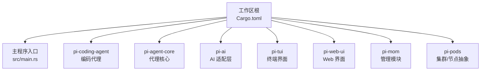
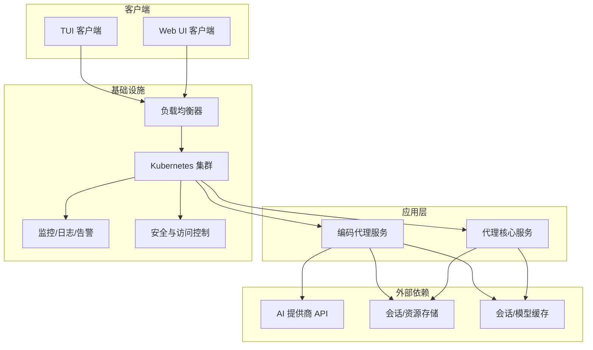
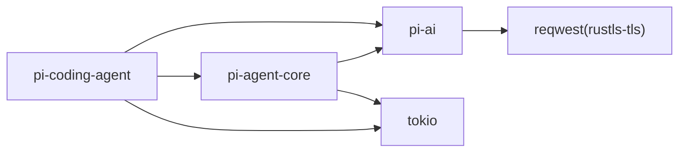

# 生产部署

<cite>
**本文引用的文件**
- [Cargo.toml](file://Cargo.toml)
- [src/main.rs](file://src/main.rs)
- [crates/pi-coding-agent/Cargo.toml](file://crates/pi-coding-agent/Cargo.toml)
- [crates/pi-agent-core/Cargo.toml](file://crates/pi-agent-core/Cargo.toml)
- [crates/pi-ai/Cargo.toml](file://crates/pi-ai/Cargo.toml)
- [docs/superpowers/plans/2026-06-04-pi-coding-agent-builtin-tools.md](file://docs/superpowers/plans/2026-06-04-pi-coding-agent-builtin-tools.md)
- [docs/superpowers/plans/2026-06-11-pi-coding-agent-interactive-async-abort.md](file://docs/superpowers/plans/2026-06-11-pi-coding-agent-interactive-async-abort.md)
- [docs/superpowers/plans/2026-06-03-pi-ai-rust-poc.md](file://docs/superpowers/plans/2026-06-03-pi-ai-rust-poc.md)
</cite>

## 目录
1. [简介](#简介)
2. [项目结构](#项目结构)
3. [核心组件](#核心组件)
4. [架构总览](#架构总览)
5. [详细组件分析](#详细组件分析)
6. [依赖分析](#依赖分析)
7. [性能考虑](#性能考虑)
8. [故障排查指南](#故障排查指南)
9. [结论](#结论)
10. [附录](#附录)

## 简介
本文件面向 Pi-Rust 项目的生产部署，围绕容器化与镜像优化、CI/CD 流水线、Kubernetes 部署与高可用、监控与日志、安全与访问控制、以及常见运维问题进行系统化说明。由于当前仓库未包含容器编排与 CI/CD 配置文件，本文在“可落地”的部分基于现有代码与测试实践给出建议；对于尚未实现的编排与流水线，将以“建议”形式呈现，便于后续落地。

## 项目结构
Pi-Rust 采用 Rust 工作区组织，包含多个 crate：核心代理能力、AI 提供商适配层、编码代理、TUI、Web UI 等。顶层入口程序目前仅输出“Hello, world!”，实际业务逻辑集中在各 crate 中。

图表来源
- [Cargo.toml:1-12](file://Cargo.toml#L1-L12)
- [src/main.rs:1-4](file://src/main.rs#L1-L4)

章节来源
- [Cargo.toml:1-12](file://Cargo.toml#L1-L12)
- [src/main.rs:1-4](file://src/main.rs#L1-L4)

## 核心组件
- 工作区与成员 crate：通过工作区统一版本与依赖管理，便于并行构建与测试。
- 编码代理（pi-coding-agent）：提供工具执行、会话协议、交互式运行等能力，并依赖代理核心与 AI 层。
- 代理核心（pi-agent-core）：提供会话持久化、资源与提示词管理、并发队列、代理循环等基础能力。
- AI 适配层（pi-ai）：抽象不同提供商的流式响应、鉴权、重试与超时等通用能力。
- TUI/Web UI：提供用户交互界面，支持命令行与 Web 界面两种形态。

章节来源
- [Cargo.toml:1-12](file://Cargo.toml#L1-L12)
- [crates/pi-coding-agent/Cargo.toml:1-27](file://crates/pi-coding-agent/Cargo.toml#L1-L27)
- [crates/pi-agent-core/Cargo.toml:1-23](file://crates/pi-agent-core/Cargo.toml#L1-L23)
- [crates/pi-ai/Cargo.toml:1-21](file://crates/pi-ai/Cargo.toml#L1-L21)

## 架构总览
下图展示生产部署视角下的典型分层：客户端接入（TUI/Web UI）、应用服务（编码代理/核心）、外部 AI 提供商、存储与缓存、可观测性与安全。

## 详细组件分析

### 容器化与镜像优化
- 多阶段构建建议
  - 阶段一：使用 Rust 官方镜像构建，启用 LTO 与目标特定优化，产物仅包含最终二进制。
  - 阶段二：使用最小化基础镜像（如 distroless/static 或 alpine），仅拷贝二进制与必要运行时文件，避免引入多余依赖。
  - 阶段三：可选地在只读根文件系统上运行，禁用不必要的设备与网络权限，结合 seccomp/bpf 过滤。
- 镜像优化要点
  - 分层缓存：将依赖安装与源码编译分离，优先复用依赖层。
  - 去重与压缩：利用镜像层去重，启用容器镜像压缩。
  - 启动探针：健康检查与就绪探针，确保服务稳定上线。
- 运行参数
  - 使用非 root 用户运行，限制 CPU/内存配额，设置合理的重启策略与优雅停机窗口。

章节来源
- [crates/pi-coding-agent/Cargo.toml:1-27](file://crates/pi-coding-agent/Cargo.toml#L1-L27)
- [crates/pi-agent-core/Cargo.toml:1-23](file://crates/pi-agent-core/Cargo.toml#L1-L23)
- [crates/pi-ai/Cargo.toml:1-21](file://crates/pi-ai/Cargo.toml#L1-L21)

### CI/CD 集成方案
- 自动化测试
  - 单元与集成测试：在 PR 中强制运行工作区全量测试，确保新增/修改不会破坏既有功能。
  - 端到端测试：对编码代理内置工具链路进行端到端验证，参考任务清单中对工具链路与交互式中断的测试设计思路。
- 构建流水线
  - 并行构建：利用工作区特性并行构建各 crate，缩短构建时间。
  - 多架构镜像：针对 x86_64 与 arm64 生成镜像，满足多云与边缘场景。
- 部署策略
  - 蓝绿/金丝雀：结合 Kubernetes 的滚动更新策略，逐步放量新版本流量。
  - 回滚机制：保留最近若干镜像版本，异常时快速回滚。

章节来源
- [docs/superpowers/plans/2026-06-04-pi-coding-agent-builtin-tools.md:321-346](file://docs/superpowers/plans/2026-06-04-pi-coding-agent-builtin-tools.md#L321-L346)
- [docs/superpowers/plans/2026-06-11-pi-coding-agent-interactive-async-abort.md:75-157](file://docs/superpowers/plans/2026-06-11-pi-coding-agent-interactive-async-abort.md#L75-L157)

### 部署架构与基础设施配置
- Kubernetes 部署
  - Deployment/StatefulSet：根据是否需要持久化会话选择合适的控制器。
  - ConfigMap/Secret：集中管理模型提供商密钥与运行参数，避免硬编码。
  - Service/LB：暴露 Web/TUI 接口，结合 Ingress 控制器实现域名与 TLS 终止。
- 负载均衡与高可用
  - 多副本：至少 2-3 个 Pod 实例，配合就绪/存活探针提升可用性。
  - 跨可用区部署：将 Pod 均匀分布在多个节点，降低单点风险。
- 存储与缓存
  - 会话与资源：使用持久卷或对象存储，确保数据可恢复。
  - 模型/提示词缓存：在本地或共享缓存中预热常用资源，降低冷启动成本。

章节来源
- [crates/pi-agent-core/Cargo.toml:1-23](file://crates/pi-agent-core/Cargo.toml#L1-L23)

### 监控与日志配置
- 指标采集
  - 应用指标：暴露 HTTP 端点导出请求速率、错误率、处理耗时、并发数等。
  - 基础设施指标：CPU/内存/磁盘/网络 IO，结合 Pod 指标与节点指标。
- 日志聚合
  - 结构化日志：统一 JSON 格式，包含 trace_id、level、module、message 等字段。
  - 日志收集：通过 Sidecar 或 DaemonSet 收集容器 stdout/stderr，发送至集中式日志平台。
- 告警设置
  - 关键阈值：错误率、P95/P99 延迟、队列积压、磁盘空间、内存压力等。
  - 通知渠道：邮件/IM/电话，区分严重与一般级别。

章节来源
- [crates/pi-ai/Cargo.toml:1-21](file://crates/pi-ai/Cargo.toml#L1-L21)

### 安全配置与访问控制
- 认证与授权
  - API 密钥：为每个提供商配置独立密钥，最小权限原则下发。
  - 传输加密：TLS 终止于 Ingress，内部服务间通信建议 mTLS。
- 访问控制
  - RBAC：为不同角色分配最小权限，限制对敏感 ConfigMap/Secret 的访问。
  - 网络策略：默认拒绝入站流量，仅开放必要的端口与来源。
- 镜像与运行时安全
  - 只读根文件系统、丢弃不必要的 Linux 能力，限制写权限路径。
  - 定期扫描镜像漏洞，建立补丁与升级流程。

章节来源
- [crates/pi-ai/Cargo.toml:1-21](file://crates/pi-ai/Cargo.toml#L1-L21)

### 生产常见问题与运维挑战
- 性能瓶颈
  - 会话并发：通过队列与限流控制并发，避免 AI 提供商限流触发。
  - 冷启动：预热常用模型与提示词，减少首次调用延迟。
- 可观测性缺失
  - 缺少关键指标：补充请求大小、重试次数、取消次数等维度。
  - 日志噪声：过滤无关日志，聚焦错误与慢查询。
- 安全事件
  - 密钥泄露：定期轮换密钥，审计访问日志。
  - 注入攻击：严格校验输入，限制工具执行范围与权限。

章节来源
- [docs/superpowers/plans/2026-06-03-pi-ai-rust-poc.md:2527-2547](file://docs/superpowers/plans/2026-06-03-pi-ai-rust-poc.md#L2527-L2547)

## 依赖分析
- crate 间关系
  - pi-coding-agent 依赖 pi-agent-core、pi-ai、pi-tui，承担工具执行与交互式会话。
  - pi-agent-core 依赖 pi-ai 与网络库，负责会话持久化与并发控制。
  - pi-ai 抽象多家提供商，统一流式响应与鉴权。
- 外部依赖
  - 异步运行时与网络栈：Tokio、Reqwest（rustls-tls）、Futures 等。
  - 序列化与类型系统：Serde、UUID、时间格式化等。

图表来源
- [crates/pi-coding-agent/Cargo.toml:6-22](file://crates/pi-coding-agent/Cargo.toml#L6-L22)
- [crates/pi-agent-core/Cargo.toml:6-18](file://crates/pi-agent-core/Cargo.toml#L6-L18)
- [crates/pi-ai/Cargo.toml:6-17](file://crates/pi-ai/Cargo.toml#L6-L17)

章节来源
- [crates/pi-coding-agent/Cargo.toml:1-27](file://crates/pi-coding-agent/Cargo.toml#L1-L27)
- [crates/pi-agent-core/Cargo.toml:1-23](file://crates/pi-agent-core/Cargo.toml#L1-L23)
- [crates/pi-ai/Cargo.toml:1-21](file://crates/pi-ai/Cargo.toml#L1-L21)

## 性能考虑
- 构建优化
  - 启用 LTO 与目标特定优化，减小二进制体积与加载时间。
  - 利用工作区并行构建，缩短流水线时间。
- 运行时优化
  - 合理设置线程池与异步任务数量，避免上下文切换开销。
  - 对频繁调用的外部接口增加连接池与超时控制，防止级联阻塞。
- 存储与缓存
  - 将热点数据放入内存缓存，降低数据库压力。
  - 对会话与资源进行压缩与分片，提高 IO 效率。

## 故障排查指南
- 启动失败
  - 检查密钥与配置项是否正确注入，确认 Secret/ConfigMap 挂载路径。
  - 查看 Pod 事件与日志，定位初始化阶段错误。
- 请求异常
  - 关注错误率与 P99 延迟，核对 AI 提供商限流阈值与重试策略。
  - 对比工具执行日志，确认参数与权限是否符合预期。
- 会话卡顿
  - 检查队列长度与消费者数量，评估并发与资源配额。
  - 审视磁盘 IO 与网络延迟，必要时迁移至更高性能存储。

章节来源
- [docs/superpowers/plans/2026-06-11-pi-coding-agent-interactive-async-abort.md:75-157](file://docs/superpowers/plans/2026-06-11-pi-coding-agent-interactive-async-abort.md#L75-L157)

## 结论
Pi-Rust 在 Rust 工作区与多 crate 架构下具备良好的可维护性与扩展性。生产部署应以“安全、可观测、高可用”为核心目标，结合多阶段容器化与 CI/CD 流水线，逐步完善 Kubernetes 编排与监控告警体系。同时，持续优化构建与运行时性能，强化安全基线与应急响应机制，确保系统在复杂生产环境中稳定高效运行。

## 附录
- 快速检查清单
  - 容器镜像：多阶段构建、最小化基础镜像、只读根文件系统。
  - CI/CD：PR 强制测试、并行构建、多架构镜像、蓝绿发布。
  - Kubernetes：多副本、就绪/存活探针、Ingress/TLS、RBAC。
  - 监控：应用指标、结构化日志、关键告警阈值。
  - 安全：密钥轮换、mTLS、网络策略、能力裁剪。