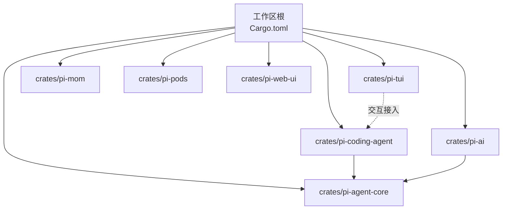
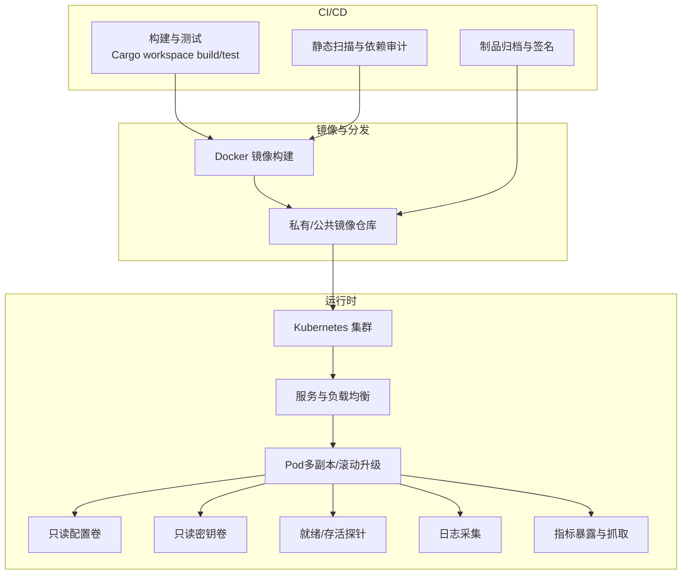
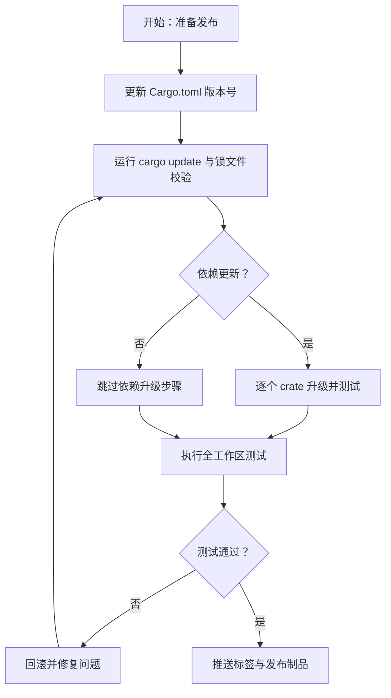
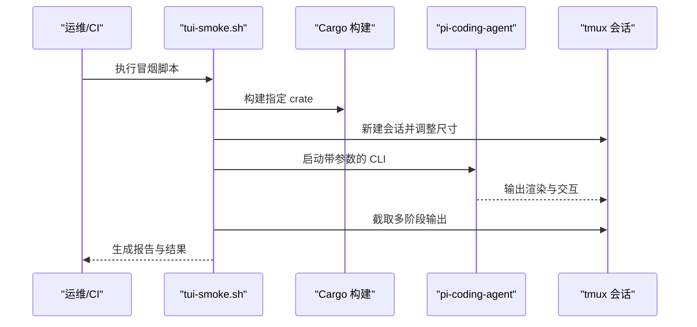
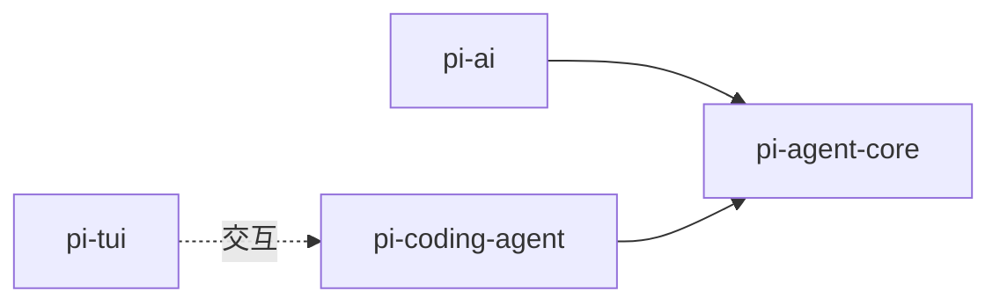

# 部署与运维

<cite>
**本文引用的文件**
- [Cargo.toml](file://Cargo.toml)
- [Cargo.lock](file://Cargo.lock)
- [src/main.rs](file://src/main.rs)
- [ROADMAP.md](file://ROADMAP.md)
- [scripts/tui-smoke.sh](file://scripts/tui-smoke.sh)
- [crates/pi-coding-agent/src/config/paths.rs](file://crates/pi-coding-agent/src/config/paths.rs)
- [crates/pi-coding-agent/src/config/auth.rs](file://crates/pi-coding-agent/src/config/auth.rs)
- [crates/pi-coding-agent/src/tools/path.rs](file://crates/pi-coding-agent/src/tools/path.rs)
- [crates/pi-ai/src/types.rs](file://crates/pi-ai/src/types.rs)
- [crates/pi-agent-core/tests/m9_harness.rs](file://crates/pi-agent-core/tests/m9_harness.rs)
</cite>

## 目录
1. [简介](#简介)
2. [项目结构](#项目结构)
3. [核心组件](#核心组件)
4. [架构总览](#架构总览)
5. [详细组件分析](#详细组件分析)
6. [依赖分析](#依赖分析)
7. [性能考虑](#性能考虑)
8. [故障排除指南](#故障排除指南)
9. [结论](#结论)
10. [附录](#附录)

## 简介
本文件面向运维人员，提供 Pi-Rust 项目的部署与运维指南。内容涵盖构建配置（Cargo 工作区、依赖管理、版本控制）、开发工作流程（代码规范、提交规范、发布流程）、生产环境最佳实践（容器化、CI/CD 集成、监控）、性能优化与资源管理、以及常见问题排查与运维工具使用方法。文档在保证可操作性的同时，提供足够的技术深度，帮助团队稳定高效地交付与维护系统。

## 项目结构
Pi-Rust 采用多 crate 的工作区组织方式，核心 crate 包括：
- pi-agent-core：智能体内核与测试夹具
- pi-ai：AI 提供商适配层与类型定义
- pi-coding-agent：编码代理 CLI 与交互协议
- pi-tui：终端用户界面
- pi-mom、pi-pods、pi-web-ui：辅助/空壳 crate（当前处于早期阶段）

顶层 Cargo.toml 定义了工作区成员与基础包信息；Cargo.lock 锁定所有依赖版本，确保可重复构建。

图表来源
- [Cargo.toml:1-12](file://Cargo.toml#L1-L12)

章节来源
- [Cargo.toml:1-12](file://Cargo.toml#L1-L12)
- [ROADMAP.md:44-50](file://ROADMAP.md#L44-L50)

## 核心组件
- 构建与工作区
  - 工作区成员在根 Cargo.toml 中声明，统一版本与工具链策略。
  - 使用 Cargo.lock 固定依赖版本，避免“依赖漂移”。
- 配置与认证
  - 全局与项目级配置路径解析，支持环境变量覆盖全局目录。
  - 认证密钥来源优先级与权限校验，保障安全。
- 运行入口
  - 顶层 main.rs 当前为空实现，实际运行由各 crate 子命令或库功能承担。
- 测试与验收
  - TUI 冒烟脚本驱动 tmux 会话，捕获输出以验证交互行为。
  - 关键集成测试覆盖代理夹具与文件系统操作。

章节来源
- [Cargo.toml:1-12](file://Cargo.toml#L1-L12)
- [Cargo.lock:1-20](file://Cargo.lock#L1-L20)
- [src/main.rs:1-4](file://src/main.rs#L1-L4)
- [scripts/tui-smoke.sh:1-82](file://scripts/tui-smoke.sh#L1-L82)
- [crates/pi-coding-agent/src/config/paths.rs:1-61](file://crates/pi-coding-agent/src/config/paths.rs#L1-L61)
- [crates/pi-coding-agent/src/config/auth.rs:184-235](file://crates/pi-coding-agent/src/config/auth.rs#L184-L235)
- [crates/pi-agent-core/tests/m9_harness.rs:102-145](file://crates/pi-agent-core/tests/m9_harness.rs#L102-L145)

## 架构总览
下图展示生产环境部署的关键节点与数据流：构建产物经 CI 产出镜像，部署至容器编排平台；服务通过健康检查与探针保障可用性；日志与指标采集用于监控与告警；配置与密钥通过安全存储与只读挂载注入。

（本图为概念性架构示意，不直接映射具体源文件，故无图表来源）

## 详细组件分析

### 构建与依赖管理
- 工作区与成员
  - 在根 Cargo.toml 中声明工作区成员，统一管理多 crate 的版本与特性开关。
- 依赖锁定
  - 使用 Cargo.lock 锁定依赖树，确保不同环境一致的二进制产物。
- 版本控制策略
  - 建议遵循语义化版本：主版本用于破坏性变更，次版本用于新增兼容功能，修订版本用于修复。
  - 依赖更新采用“小步快跑”，先在 PR 中升级单个 crate 的依赖，再进行整体回归测试。

章节来源
- [Cargo.toml:1-12](file://Cargo.toml#L1-L12)
- [Cargo.lock:1-20](file://Cargo.lock#L1-L20)

### 开发工作流程
- 代码规范
  - 统一使用 rustfmt 与 clippy；在 CI 中强制检查。
  - 为关键模块编写单元测试与集成测试，覆盖率纳入质量门禁。
- 提交规范
  - 使用约定式提交（如 feat/fix/docs/chore），并在 PR 标题中明确影响范围。
  - 小步提交，配合自述文件中的里程碑计划进行迭代。
- 发布流程
  - 在本地完成构建、测试与安全扫描；在 CI 中执行全量测试矩阵与依赖审计；通过后打标签并发布制品。

章节来源
- [ROADMAP.md:36-38](file://ROADMAP.md#L36-L38)

### 生产环境部署最佳实践
- 容器化
  - 使用多阶段构建减少镜像体积；仅在最终阶段安装运行时依赖。
  - 将配置与密钥以只读卷挂载，避免硬编码到镜像。
- CI/CD 集成
  - 在流水线中串联：构建 → 单元测试 → 集成测试 → 安全扫描 → 镜像构建 → 推送镜像 → 编排部署。
  - 使用蓝绿/金丝雀发布策略，结合滚动升级与探针保障平滑切换。
- 监控配置
  - 暴露指标端点，结合抓取器收集 CPU/内存/请求延迟等关键指标。
  - 配置日志聚合与结构化日志，便于检索与关联分析。

（本节为通用实践说明，不直接分析具体源文件，故无章节来源）

### 性能优化与资源管理
- 依赖与编译优化
  - 合理启用特性开关与条件编译，避免不必要的依赖进入生产镜像。
  - 使用增量构建与缓存（如 Cargo 缓存目录）提升 CI 效率。
- 运行时优化
  - 控制并发与连接池大小，避免资源争用。
  - 对外部调用设置合理的超时与重试策略，防止级联故障。

（本节为通用指导，不直接分析具体源文件，故无章节来源）

### 运维工具与使用方法
- TUI 冒烟测试
  - 通过脚本自动启动 tmux 会话，运行编码代理并捕获输出，验证交互与渲染。
  - 支持通过环境变量注入真实提示词与等待时间，便于端到端验证。

图表来源
- [scripts/tui-smoke.sh:16-63](file://scripts/tui-smoke.sh#L16-L63)

章节来源
- [scripts/tui-smoke.sh:1-82](file://scripts/tui-smoke.sh#L1-L82)

## 依赖分析
- 工作区依赖关系
  - pi-ai 依赖 pi-agent-core；pi-coding-agent 依赖 pi-agent-core，并在交互模式接入 pi-tui。
- 关键外部依赖
  - 通过 Cargo.lock 可见大量常用库（如 async、http、tokio 等），应关注其版本与安全通告。
- 依赖更新与审计
  - 建议定期运行 cargo update 与安全扫描工具，确保依赖链安全与稳定。

图表来源
- [ROADMAP.md:44-50](file://ROADMAP.md#L44-L50)

章节来源
- [ROADMAP.md:44-50](file://ROADMAP.md#L44-L50)
- [Cargo.lock:1-20](file://Cargo.lock#L1-L20)

## 性能考虑
- 构建性能
  - 合理划分 crate，避免不必要的跨 crate 依赖；使用并行构建与缓存。
- 运行性能
  - 控制并发与批处理大小；对外部 API 设置超时与指数退避重试。
- 资源限制
  - 在容器编排中设置 CPU/内存请求与限制，结合 HPA 自动扩缩容。

（本节为通用指导，不直接分析具体源文件，故无章节来源）

## 故障排除指南
- 构建失败
  - 检查 Cargo.toml 成员是否完整；确认 Cargo.lock 与本地锁文件一致。
  - 在 CI 中开启详细日志，定位具体 crate 的编译错误。
- 配置与认证问题
  - 若认证文件权限不当，将触发诊断警告；请修正为只允许属主访问。
  - 确认全局与项目级配置路径解析逻辑，必要时通过环境变量覆盖。
- 交互与渲染异常
  - 使用 TUI 冒烟脚本捕获关键阶段输出，比对预期行为。
  - 如涉及宽字符或窗口尺寸变化，检查终端与字体支持情况。
- 集成测试失败
  - 关注代理夹具与文件系统操作的测试用例，确保测试环境具备所需工具与权限。

章节来源
- [crates/pi-coding-agent/src/config/auth.rs:184-235](file://crates/pi-coding-agent/src/config/auth.rs#L184-L235)
- [crates/pi-coding-agent/src/config/paths.rs:1-61](file://crates/pi-coding-agent/src/config/paths.rs#L1-L61)
- [scripts/tui-smoke.sh:1-82](file://scripts/tui-smoke.sh#L1-L82)
- [crates/pi-agent-core/tests/m9_harness.rs:102-145](file://crates/pi-agent-core/tests/m9_harness.rs#L102-L145)

## 结论
通过规范化的工作区与依赖管理、完善的开发与发布流程、以及容器化与可观测性的最佳实践，Pi-Rust 项目可在生产环境中实现稳定、可追溯、可扩展的交付。建议持续完善插件与周边能力，补齐缺失的提供商实现，并加强安全与合规检查，以满足更高标准的运维要求。

## 附录
- 快速参考
  - 构建：在工作区根目录执行构建与测试命令，确保所有 crate 通过。
  - 配置：通过环境变量覆盖全局配置目录；注意认证文件权限。
  - 监控：暴露指标端点并接入抓取器；集中收集与检索日志。
  - 测试：使用 TUI 冒烟脚本快速验证交互与渲染；补充集成测试覆盖关键路径。

（本节为通用附录，不直接分析具体源文件，故无章节来源）