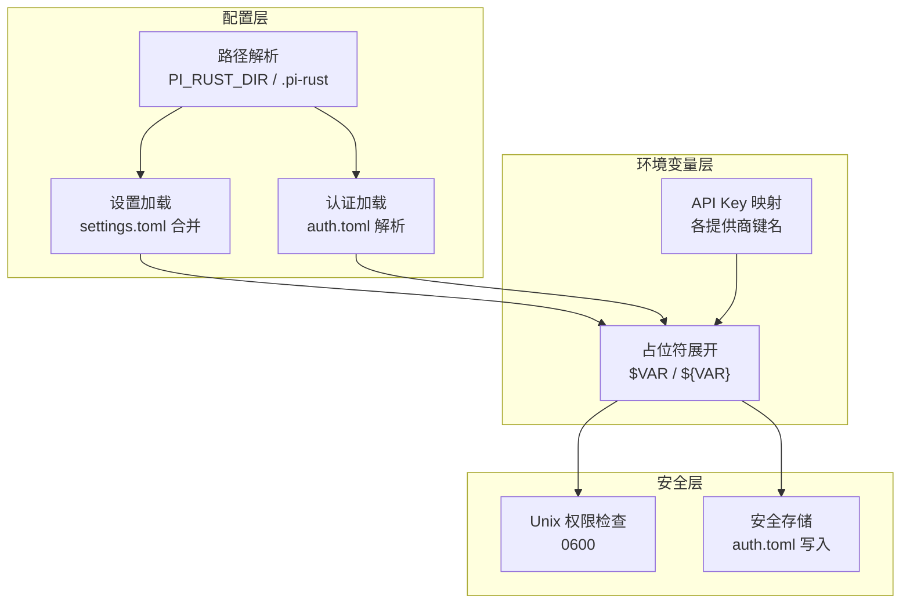
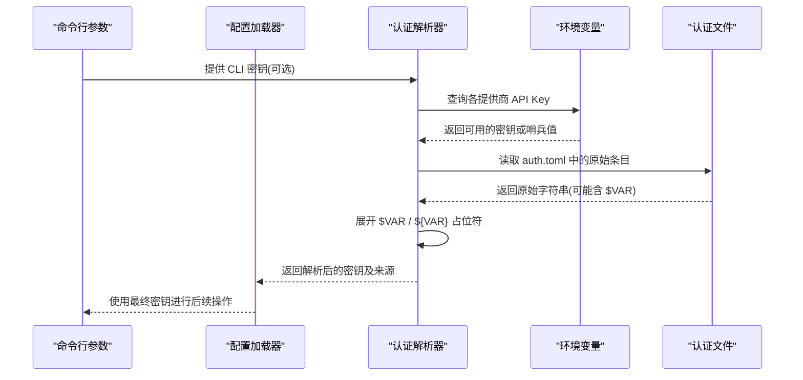
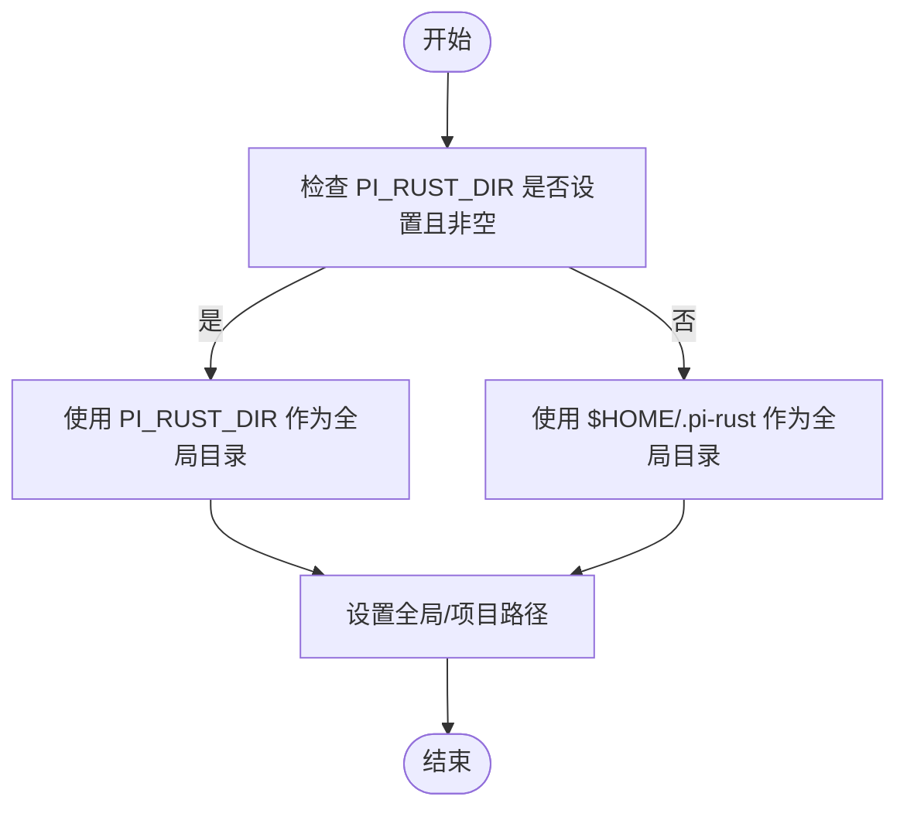
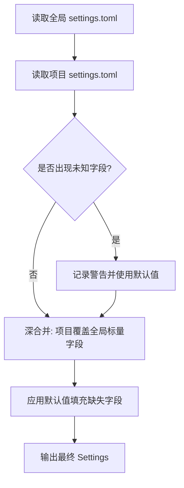
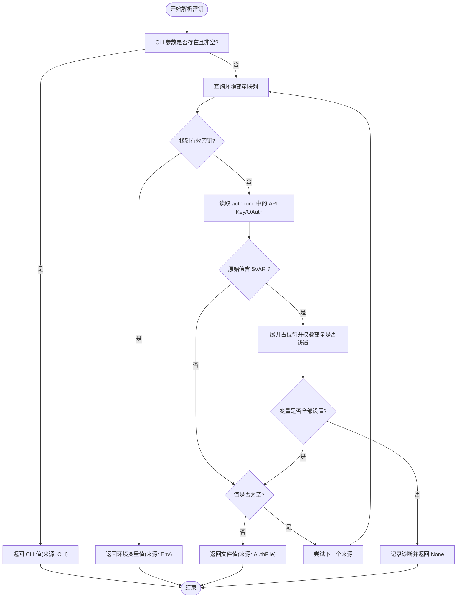
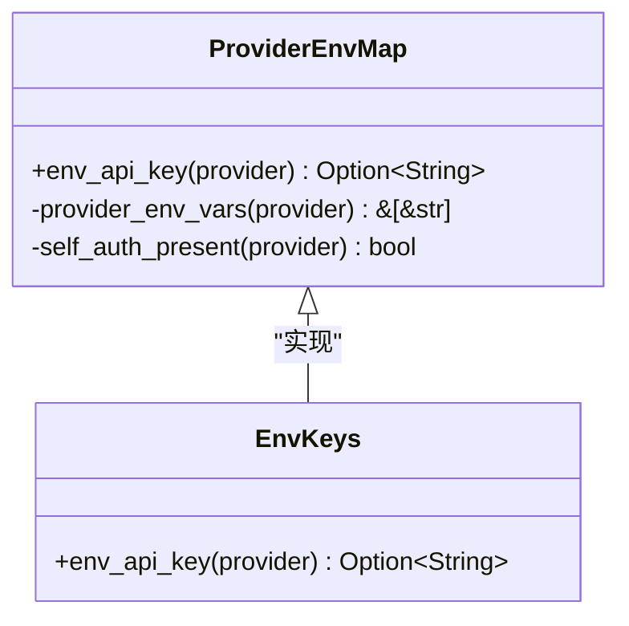
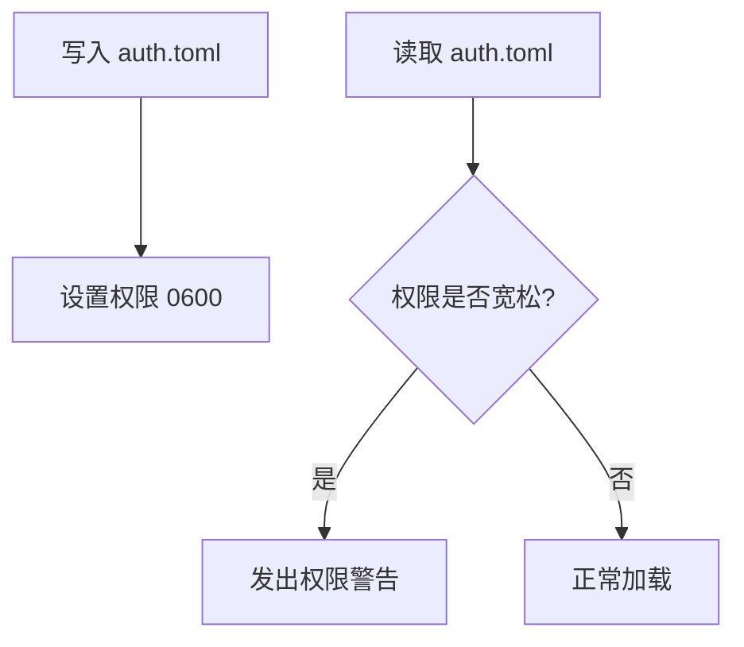
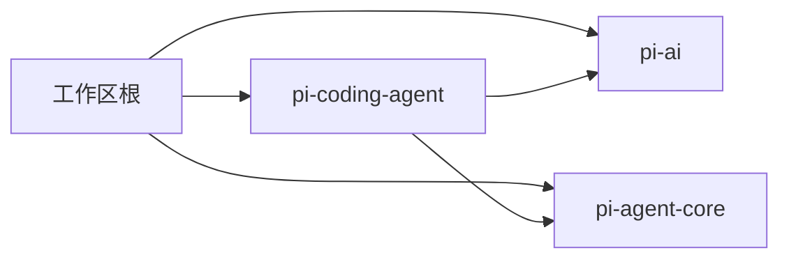

# 环境变量处理

<cite>
**本文引用的文件**
- [crates/pi-agent-core/src/env.rs](file://crates/pi-agent-core/src/env.rs)
- [crates/pi-ai/src/util/env_keys.rs](file://crates/pi-ai/src/util/env_keys.rs)
- [crates/pi-coding-agent/src/config/mod.rs](file://crates/pi-coding-agent/src/config/mod.rs)
- [crates/pi-coding-agent/src/config/paths.rs](file://crates/pi-coding-agent/src/config/paths.rs)
- [crates/pi-coding-agent/src/config/settings.rs](file://crates/pi-coding-agent/src/config/settings.rs)
- [crates/pi-coding-agent/src/config/auth.rs](file://crates/pi-coding-agent/src/config/auth.rs)
- [crates/pi-coding-agent/tests/config_wiring.rs](file://crates/pi-coding-agent/tests/config_wiring.rs)
- [crates/pi-ai/tests/env_keys.rs](file://crates/pi-ai/tests/env_keys.rs)
- [Cargo.toml](file://Cargo.toml)
- [crates/pi-coding-agent/Cargo.toml](file://crates/pi-coding-agent/Cargo.toml)
- [crates/pi-ai/Cargo.toml](file://crates/pi-ai/Cargo.toml)
</cite>

## 目录
1. [简介](#简介)
2. [项目结构](#项目结构)
3. [核心组件](#核心组件)
4. [架构总览](#架构总览)
5. [详细组件分析](#详细组件分析)
6. [依赖分析](#依赖分析)
7. [性能考虑](#性能考虑)
8. [故障排除指南](#故障排除指南)
9. [结论](#结论)
10. [附录](#附录)

## 简介
本文件面向“环境变量处理系统”的技术文档，聚焦于以下目标：
- 解释环境变量的解析机制：变量名映射、类型转换与默认值处理、占位符展开与安全替换。
- 阐述敏感信息的安全处理：API 密钥的环境变量注入与安全存储策略。
- 说明跨平台差异与兼容性处理（如 Unix 权限检查）。
- 提供完整的配置示例与命名约定，明确优先级与覆盖机制。
- 覆盖 Docker 与容器化部署中的环境变量管理建议。
- 对初学者友好，同时提供足够的技术深度。

## 项目结构
该系统由多个子模块协同完成：
- 配置加载与合并：全局与项目级 settings.toml 的深合并与默认值解析。
- 认证与密钥解析：从 CLI、环境变量、认证文件中按优先级解析 API 密钥或访问令牌。
- 环境变量映射：针对多家大模型提供商的 API Key 变量名映射与自认证提供程序的哨兵值处理。
- 安全与权限：认证文件的权限检查与最小化暴露策略。
- 平台兼容：通过条件编译支持 Unix 权限校验。

图表来源
- [crates/pi-coding-agent/src/config/paths.rs:20-31](file://crates/pi-coding-agent/src/config/paths.rs#L20-L31)
- [crates/pi-coding-agent/src/config/settings.rs:221-225](file://crates/pi-coding-agent/src/config/settings.rs#L221-L225)
- [crates/pi-coding-agent/src/config/auth.rs:108-132](file://crates/pi-coding-agent/src/config/auth.rs#L108-L132)
- [crates/pi-ai/src/util/env_keys.rs:1-32](file://crates/pi-ai/src/util/env_keys.rs#L1-L32)
- [crates/pi-coding-agent/src/config/auth.rs:178-191](file://crates/pi-coding-agent/src/config/auth.rs#L178-L191)

章节来源
- [crates/pi-coding-agent/src/config/mod.rs:47-53](file://crates/pi-coding-agent/src/config/mod.rs#L47-L53)
- [crates/pi-coding-agent/src/config/paths.rs:20-31](file://crates/pi-coding-agent/src/config/paths.rs#L20-L31)
- [crates/pi-coding-agent/src/config/settings.rs:221-225](file://crates/pi-coding-agent/src/config/settings.rs#L221-L225)
- [crates/pi-coding-agent/src/config/auth.rs:108-132](file://crates/pi-coding-agent/src/config/auth.rs#L108-L132)

## 核心组件
- 路径解析与优先级
  - 全局目录优先级：PI_RUST_DIR > $HOME/.pi-rust；项目目录固定为当前工作目录下的 .pi-rust。
  - 通过环境变量覆盖全局目录，便于多用户或多项目隔离。
- 设置加载与合并
  - 读取全局 settings.toml 与项目 settings.toml，进行字段级深合并，未显式提供的字段使用默认值。
- 认证与密钥解析
  - 优先级：CLI 参数 > 环境变量 > 认证文件（API Key 或 OAuth 访问令牌）。
  - 支持在认证文件中使用 $VAR / ${VAR} 占位符，并对未设置的变量发出诊断。
- 环境变量映射
  - 针对多家大模型提供商提供标准键名映射；部分自认证提供程序返回哨兵值以指示凭据存在。
- 安全与权限
  - 认证文件保存时强制权限 0600（Unix），加载时若发现宽松权限则发出警告。
- 平台兼容
  - 条件编译仅在 Unix 上执行权限检查，避免 Windows 平台误报。

章节来源
- [crates/pi-coding-agent/src/config/paths.rs:20-31](file://crates/pi-coding-agent/src/config/paths.rs#L20-L31)
- [crates/pi-coding-agent/src/config/settings.rs:135-193](file://crates/pi-coding-agent/src/config/settings.rs#L135-L193)
- [crates/pi-coding-agent/src/config/auth.rs:224-265](file://crates/pi-coding-agent/src/config/auth.rs#L224-L265)
- [crates/pi-ai/src/util/env_keys.rs:1-32](file://crates/pi-ai/src/util/env_keys.rs#L1-L32)
- [crates/pi-coding-agent/src/config/auth.rs:178-191](file://crates/pi-coding-agent/src/config/auth.rs#L178-L191)

## 架构总览
下图展示从命令行到最终密钥解析的关键流程，以及环境变量与配置文件之间的交互。

图表来源
- [crates/pi-coding-agent/src/config/auth.rs:224-265](file://crates/pi-coding-agent/src/config/auth.rs#L224-L265)
- [crates/pi-ai/src/util/env_keys.rs:34-46](file://crates/pi-ai/src/util/env_keys.rs#L34-L46)
- [crates/pi-coding-agent/src/config/auth.rs:6-78](file://crates/pi-coding-agent/src/config/auth.rs#L6-L78)

## 详细组件分析

### 组件一：路径解析与优先级
- 全局目录优先级：PI_RUST_DIR > $HOME/.pi-rust；项目目录固定为 .pi-rust。
- 作用：统一配置文件位置，支持多项目隔离与用户自定义路径。

图表来源
- [crates/pi-coding-agent/src/config/paths.rs:20-31](file://crates/pi-coding-agent/src/config/paths.rs#L20-L31)

章节来源
- [crates/pi-coding-agent/src/config/paths.rs:20-31](file://crates/pi-coding-agent/src/config/paths.rs#L20-L31)

### 组件二：设置加载与合并
- 读取全局 settings.toml 与项目 settings.toml，进行字段级深合并。
- 默认值：未显式提供的字段采用预设默认值（如 transport、steering_mode、retry 等）。
- 错误处理：文件缺失或解析失败时记录诊断并回退到默认值。

图表来源
- [crates/pi-coding-agent/src/config/settings.rs:195-225](file://crates/pi-coding-agent/src/config/settings.rs#L195-L225)

章节来源
- [crates/pi-coding-agent/src/config/settings.rs:195-225](file://crates/pi-coding-agent/src/config/settings.rs#L195-L225)

### 组件三：认证与密钥解析
- 优先级：CLI 参数 > 环境变量 > 认证文件（API Key 或 OAuth 访问令牌）。
- 占位符展开：支持 $VAR 与 ${VAR}，转义 $$ → $，$! → !；未设置变量时返回 None 并记录诊断。
- 自认证哨兵：对于 AWS Bedrock、Google Vertex 等无需单键的提供程序，若检测到凭据存在则返回哨兵值表示已认证。

图表来源
- [crates/pi-coding-agent/src/config/auth.rs:224-265](file://crates/pi-coding-agent/src/config/auth.rs#L224-L265)
- [crates/pi-ai/src/util/env_keys.rs:34-46](file://crates/pi-ai/src/util/env_keys.rs#L34-L46)
- [crates/pi-coding-agent/src/config/auth.rs:6-78](file://crates/pi-coding-agent/src/config/auth.rs#L6-L78)

章节来源
- [crates/pi-coding-agent/src/config/auth.rs:224-265](file://crates/pi-coding-agent/src/config/auth.rs#L224-L265)
- [crates/pi-ai/src/util/env_keys.rs:34-46](file://crates/pi-ai/src/util/env_keys.rs#L34-L46)
- [crates/pi-coding-agent/src/config/auth.rs:6-78](file://crates/pi-coding-agent/src/config/auth.rs#L6-L78)

### 组件四：环境变量映射与自认证哨兵
- 映射表：针对多家大模型提供商提供标准键名映射（如 OPENAI_API_KEY、ANTHROPIC_API_KEY 等）。
- 自认证：当检测到 AWS Profile/AWS Access Key、Google Application Credentials 等存在时，返回哨兵值表示已认证。

图表来源
- [crates/pi-ai/src/util/env_keys.rs:1-32](file://crates/pi-ai/src/util/env_keys.rs#L1-L32)
- [crates/pi-ai/src/util/env_keys.rs:34-46](file://crates/pi-ai/src/util/env_keys.rs#L34-L46)
- [crates/pi-ai/src/util/env_keys.rs:51-65](file://crates/pi-ai/src/util/env_keys.rs#L51-L65)

章节来源
- [crates/pi-ai/src/util/env_keys.rs:1-32](file://crates/pi-ai/src/util/env_keys.rs#L1-L32)
- [crates/pi-ai/src/util/env_keys.rs:34-46](file://crates/pi-ai/src/util/env_keys.rs#L34-L46)
- [crates/pi-ai/src/util/env_keys.rs:51-65](file://crates/pi-ai/src/util/env_keys.rs#L51-L65)

### 组件五：安全与权限
- 写入安全：保存 auth.toml 时强制权限 0600（Unix），防止其他用户读取。
- 加载安全：加载时若发现宽松权限则发出警告，提醒用户修正。
- 占位符安全：未设置的变量不会被展开，而是返回 None 并记录诊断，避免泄露。

图表来源
- [crates/pi-coding-agent/src/config/auth.rs:178-191](file://crates/pi-coding-agent/src/config/auth.rs#L178-L191)
- [crates/pi-coding-agent/src/config/auth.rs:194-209](file://crates/pi-coding-agent/src/config/auth.rs#L194-L209)

章节来源
- [crates/pi-coding-agent/src/config/auth.rs:178-191](file://crates/pi-coding-agent/src/config/auth.rs#L178-L191)
- [crates/pi-coding-agent/src/config/auth.rs:194-209](file://crates/pi-coding-agent/src/config/auth.rs#L194-L209)

### 组件六：跨平台差异与兼容性
- Unix 权限检查：仅在 Unix 平台执行，Windows 不适用。
- 条件编译：通过 cfg(unix) 控制权限检查逻辑，避免在非 Unix 平台报错或误判。

章节来源
- [crates/pi-coding-agent/src/config/auth.rs:194-209](file://crates/pi-coding-agent/src/config/auth.rs#L194-L209)

## 依赖分析
- 工作区与成员包
  - 工作区包含多个成员包，其中 pi-coding-agent 依赖 pi-agent-core 与 pi-ai。
- 外部依赖
  - toml：用于解析与序列化配置文件。
  - dirs：用于解析用户主目录，确定默认全局目录。
  - serde：用于结构化数据的序列化与反序列化。

图表来源
- [Cargo.toml:1-12](file://Cargo.toml#L1-L12)
- [crates/pi-coding-agent/Cargo.toml:13-14](file://crates/pi-coding-agent/Cargo.toml#L13-L14)
- [crates/pi-ai/Cargo.toml:1-21](file://crates/pi-ai/Cargo.toml#L1-L21)

章节来源
- [Cargo.toml:1-12](file://Cargo.toml#L1-L12)
- [crates/pi-coding-agent/Cargo.toml:13-14](file://crates/pi-coding-agent/Cargo.toml#L13-L14)
- [crates/pi-ai/Cargo.toml:1-21](file://crates/pi-ai/Cargo.toml#L1-L21)

## 性能考虑
- 环境变量读取：O(N) 遍历映射表，N 为提供商数量，常数很小，影响可忽略。
- 占位符展开：线性扫描字符串，复杂度 O(L)，L 为原始字符串长度。
- 文件读取与解析：settings.toml 与 auth.toml 通常较小，I/O 成本低。
- 合并策略：字段级深合并，时间复杂度与配置项数量线性相关。

## 故障排除指南
- 未设置的环境变量导致解析失败
  - 现象：返回 None 并记录诊断。
  - 排查：确认变量名拼写正确、大小写一致；必要时使用 $VAR 包裹并在外部设置。
  - 参考：[crates/pi-coding-agent/src/config/auth.rs:6-78](file://crates/pi-coding-agent/src/config/auth.rs#L6-L78)
- 认证文件权限过宽
  - 现象：加载时提示权限宽松。
  - 排查：在 Unix 上将 auth.toml 权限调整为 0600。
  - 参考：[crates/pi-coding-agent/src/config/auth.rs:194-209](file://crates/pi-coding-agent/src/config/auth.rs#L194-L209)
- 优先级不符合预期
  - 现象：CLI 未生效或被环境变量覆盖。
  - 排查：确认 CLI 参数非空；检查环境变量是否设置；核对 auth.toml 中的原始值与占位符。
  - 参考：[crates/pi-coding-agent/src/config/auth.rs:224-265](file://crates/pi-coding-agent/src/config/auth.rs#L224-L265)
- 设置文件缺失或格式错误
  - 现象：使用默认值或记录警告。
  - 排查：检查 settings.toml 路径与格式；确保无未知字段。
  - 参考：[crates/pi-coding-agent/src/config/settings.rs:195-225](file://crates/pi-coding-agent/src/config/settings.rs#L195-L225)

章节来源
- [crates/pi-coding-agent/src/config/auth.rs:6-78](file://crates/pi-coding-agent/src/config/auth.rs#L6-L78)
- [crates/pi-coding-agent/src/config/auth.rs:194-209](file://crates/pi-coding-agent/src/config/auth.rs#L194-L209)
- [crates/pi-coding-agent/src/config/auth.rs:224-265](file://crates/pi-coding-agent/src/config/auth.rs#L224-L265)
- [crates/pi-coding-agent/src/config/settings.rs:195-225](file://crates/pi-coding-agent/src/config/settings.rs#L195-L225)

## 结论
本系统通过清晰的优先级与严格的错误处理，实现了对环境变量与配置文件的稳健管理。其设计兼顾易用性与安全性：既允许灵活的环境变量注入，又通过权限控制与占位符展开降低泄露风险。跨平台兼容性通过条件编译保障，适合在多种环境中稳定运行。

## 附录

### 环境变量配置示例与命名约定
- 全局目录覆盖
  - Windows: %PI_RUST_DIR%
  - Unix: $PI_RUST_DIR
  - 示例：PI_RUST_DIR=/custom/cfg
- 大模型提供商 API Key
  - OPENAI_API_KEY
  - ANTHROPIC_API_KEY / CLAUDE_API_KEY / ANTHROPIC_KEY
  - DEEPSEEK_API_KEY / DEEPSEEK_KEY
  - GEMINI_API_KEY / GOOGLE_API_KEY
  - GROQ_API_KEY
  - XAI_API_KEY
  - OPENROUTER_API_KEY
  - AI_GATEWAY_API_KEY
  - ZAI_API_KEY
  - MISTRAL_API_KEY
  - MOONSHOT_API_KEY
  - HF_TOKEN（Hugging Face）
  - FIREWORKS_API_KEY / TOGETHER_API_KEY
  - OPENCODE_API_KEY / OPENCODE_GO_API_KEY
  - KIMI_API_KEY
  - CLOUDFLARE_API_KEY（Workers AI / AI Gateway）
  - MINIMAX_API_KEY / MINIMAX_CN_API_KEY
  - XIAOMI_API_KEY 及 Token Plan 系列
  - COPILOT_GITHUB_TOKEN（GitHub Copilot）
  - OPENAI_CODEX_API_KEY / OPENAI_API_KEY（兼容）
- 自认证提供程序
  - Amazon Bedrock：AWS_PROFILE、AWS_ACCESS_KEY_ID、AWS_BEARER_TOKEN_BEDROCK
  - Google Vertex：GOOGLE_APPLICATION_CREDENTIALS

章节来源
- [crates/pi-ai/src/util/env_keys.rs:1-32](file://crates/pi-ai/src/util/env_keys.rs#L1-L32)
- [crates/pi-ai/src/util/env_keys.rs:51-65](file://crates/pi-ai/src/util/env_keys.rs#L51-L65)

### 优先级规则与覆盖机制
- 密钥解析优先级
  - CLI 参数 > 环境变量 > 认证文件（API Key 或 OAuth 访问令牌）
- 设置合并优先级
  - 项目 settings.toml 覆盖全局 settings.toml 的标量字段；嵌套对象按字段合并；未提供字段使用默认值。
- 认证文件占位符
  - $VAR 与 ${VAR} 支持；$$ → $；$! → !；未设置变量返回 None 并记录诊断。

章节来源
- [crates/pi-coding-agent/src/config/auth.rs:224-265](file://crates/pi-coding-agent/src/config/auth.rs#L224-L265)
- [crates/pi-coding-agent/src/config/settings.rs:135-193](file://crates/pi-coding-agent/src/config/settings.rs#L135-L193)
- [crates/pi-coding-agent/src/config/auth.rs:6-78](file://crates/pi-coding-agent/src/config/auth.rs#L6-L78)

### Docker 与容器化部署建议
- 使用环境变量注入
  - 在容器启动时通过 -e 或 env 字段注入 API Key；避免将密钥硬编码进镜像。
- 配置文件挂载
  - 将 auth.toml 挂载到容器内的 /root/.pi-rust 或通过 PI_RUST_DIR 指定的路径。
- 权限控制
  - 在容器内确保 auth.toml 权限为 0600；若无法设置，应在宿主机侧保证文件权限。
- 占位符安全
  - 在 auth.toml 中使用 $VAR 引用外部环境变量，避免直接写入明文密钥。

章节来源
- [crates/pi-coding-agent/src/config/auth.rs:178-191](file://crates/pi-coding-agent/src/config/auth.rs#L178-L191)
- [crates/pi-coding-agent/src/config/paths.rs:20-31](file://crates/pi-coding-agent/src/config/paths.rs#L20-L31)