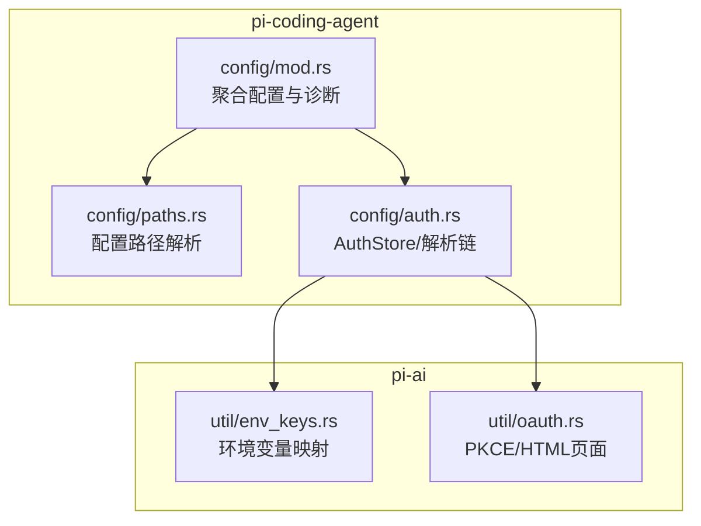
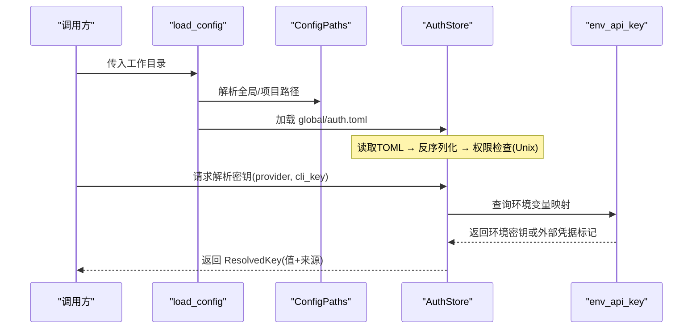
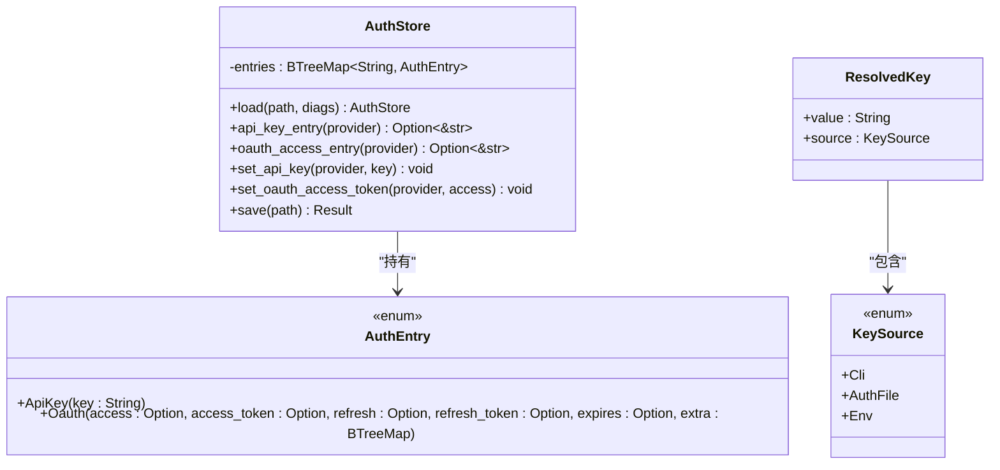
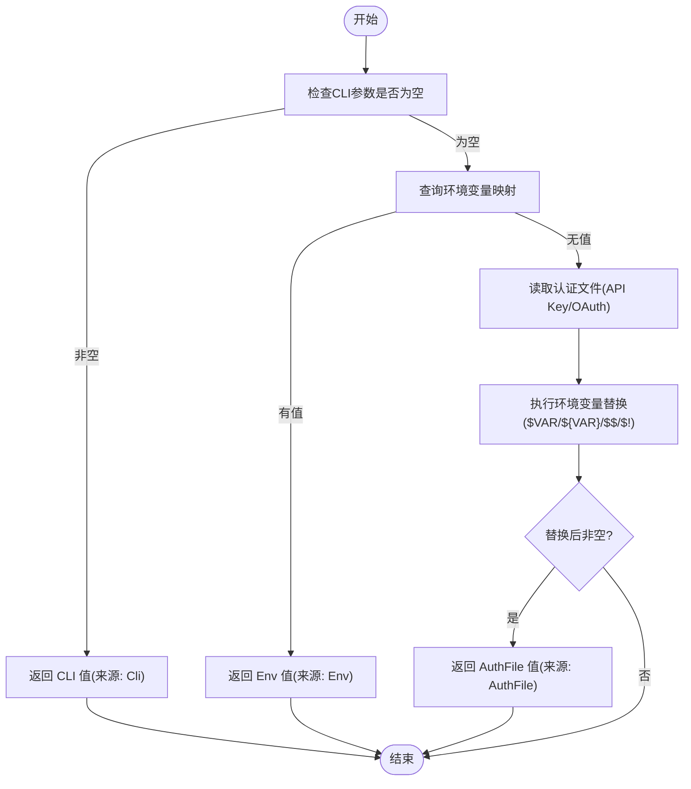
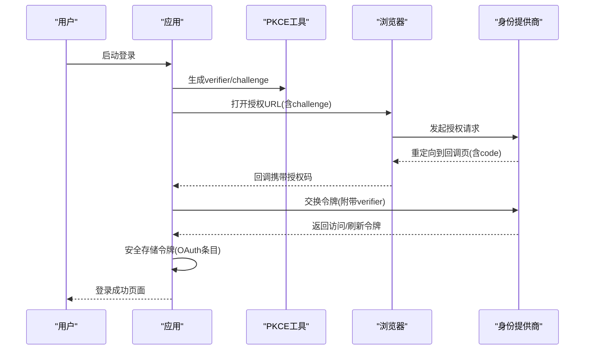
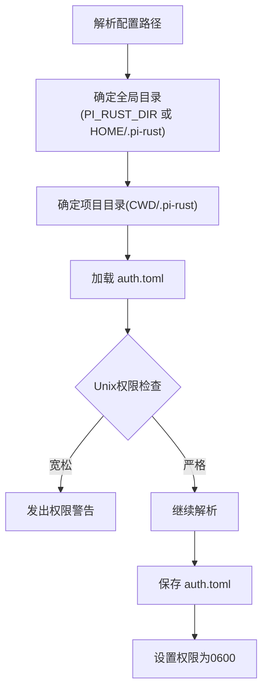
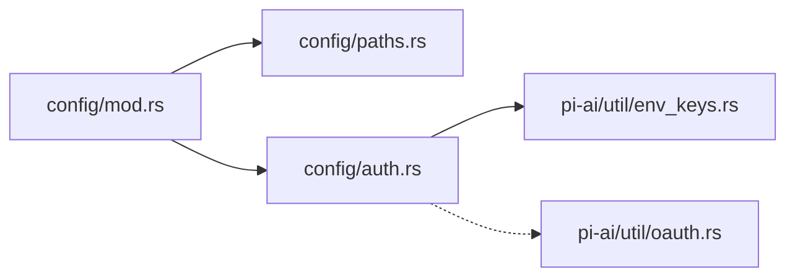

# 认证系统

<cite>
**本文引用的文件**
- [crates/pi-coding-agent/src/config/auth.rs](file://crates/pi-coding-agent/src/config/auth.rs)
- [crates/pi-coding-agent/src/config/mod.rs](file://crates/pi-coding-agent/src/config/mod.rs)
- [crates/pi-coding-agent/src/config/paths.rs](file://crates/pi-coding-agent/src/config/paths.rs)
- [crates/pi-ai/src/util/env_keys.rs](file://crates/pi-ai/src/util/env_keys.rs)
- [crates/pi-ai/src/util/oauth.rs](file://crates/pi-ai/src/util/oauth.rs)
- [docs/roadmap/M8-provider-breadth.md](file://docs/roadmap/M8-provider-breadth.md)
- [docs/superpowers/plans/2026-06-19-pi-coding-agent-m7-config-auth.md](file://docs/superpowers/plans/2026-06-19-pi-coding-agent-m7-config-auth.md)
- [docs/superpowers/specs/2026-06-19-pi-coding-agent-m7-config-auth-design.md](file://docs/superpowers/specs/2026-06-19-pi-coding-agent-m7-config-auth-design.md)
</cite>

## 目录
1. [简介](#简介)
2. [项目结构](#项目结构)
3. [核心组件](#核心组件)
4. [架构总览](#架构总览)
5. [详细组件分析](#详细组件分析)
6. [依赖关系分析](#依赖关系分析)
7. [性能考量](#性能考量)
8. [故障排除指南](#故障排除指南)
9. [结论](#结论)
10. [附录](#附录)

## 简介
本文件面向“认证系统”的技术文档，聚焦于以下目标：
- 解释 AuthStore 的实现机制：认证信息的存储、检索与更新流程
- 深入说明 API 密钥管理：不同提供商的认证方式与密钥格式
- 阐述 OAuth 集成流程：授权码获取、令牌刷新与安全存储
- 提供完整的认证配置示例与最佳实践
- 包含认证失败的处理策略与安全考虑
- 解决常见认证问题与故障排除方法
- 覆盖跨平台认证存储差异与权限管理

该认证系统以 TOML 文件为全局认证存储（auth.toml），支持 API Key 与 OAuth 两种模式，并在解析时进行环境变量替换与权限检查。同时，系统通过统一的配置加载入口聚合设置与认证信息。

## 项目结构
认证相关的核心代码位于两个 crate 中：
- pi-coding-agent：负责配置路径解析、认证存储的加载/保存、API 密钥解析链
- pi-ai：提供环境变量映射与 OAuth 辅助工具（PKCE、HTML 页面）

**图表来源**
- [crates/pi-coding-agent/src/config/mod.rs:47-53](file://crates/pi-coding-agent/src/config/mod.rs#L47-L53)
- [crates/pi-coding-agent/src/config/paths.rs:8-18](file://crates/pi-coding-agent/src/config/paths.rs#L8-L18)
- [crates/pi-coding-agent/src/config/auth.rs:224-265](file://crates/pi-coding-agent/src/config/auth.rs#L224-L265)
- [crates/pi-ai/src/util/env_keys.rs:34-46](file://crates/pi-ai/src/util/env_keys.rs#L34-L46)
- [crates/pi-ai/src/util/oauth.rs:4-7](file://crates/pi-ai/src/util/oauth.rs#L4-L7)

**章节来源**
- [crates/pi-coding-agent/src/config/mod.rs:1-124](file://crates/pi-coding-agent/src/config/mod.rs#L1-L124)
- [crates/pi-coding-agent/src/config/paths.rs:1-62](file://crates/pi-coding-agent/src/config/paths.rs#L1-L62)
- [crates/pi-coding-agent/src/config/auth.rs:1-514](file://crates/pi-coding-agent/src/config/auth.rs#L1-L514)
- [crates/pi-ai/src/util/env_keys.rs:1-143](file://crates/pi-ai/src/util/env_keys.rs#L1-L143)
- [crates/pi-ai/src/util/oauth.rs:1-52](file://crates/pi-ai/src/util/oauth.rs#L1-L52)

## 核心组件
- AuthStore：全局认证存储，基于 BTreeMap 的 TOML 结构，支持 API Key 与 OAuth 条目
- AuthEntry：枚举类型，区分 ApiKey 与 Oauth 两类条目
- KeySource/ResolvedKey：定义密钥来源（命令行、认证文件、环境变量）与解析结果
- resolve_api_key：统一的密钥解析链，按优先级从 CLI → 环境变量 → 认证文件（API Key/OAuth）
- ConfigPaths/load_config：解析配置目录并加载 settings 与 auth

关键接口与行为：
- 加载与保存：AuthStore.load/save 支持 TOML 序列化、权限检查（Unix 下 0600）
- 值替换：$VAR 与 ${VAR} 的环境变量替换，支持 $$ → $ 与 $! → !
- OAuth 支持：oauth_access_entry 兼容 access/access_token 字段
- 跨平台路径：使用 dirs crate 获取用户主目录，支持 PI_RUST_DIR 环境覆盖

**章节来源**
- [crates/pi-coding-agent/src/config/auth.rs:80-192](file://crates/pi-coding-agent/src/config/auth.rs#L80-L192)
- [crates/pi-coding-agent/src/config/auth.rs:211-265](file://crates/pi-coding-agent/src/config/auth.rs#L211-L265)
- [crates/pi-coding-agent/src/config/mod.rs:47-73](file://crates/pi-coding-agent/src/config/mod.rs#L47-L73)
- [crates/pi-coding-agent/src/config/paths.rs:20-31](file://crates/pi-coding-agent/src/config/paths.rs#L20-L31)

## 架构总览
认证系统采用“配置聚合 + 存储 + 解析链”的分层设计：
- 配置聚合层：load_config 统一加载 settings 与 auth
- 存储层：AuthStore 以 TOML 文件持久化认证信息
- 解析层：resolve_api_key 将多源密钥合并为单一可用值

**图表来源**
- [crates/pi-coding-agent/src/config/mod.rs:47-53](file://crates/pi-coding-agent/src/config/mod.rs#L47-L53)
- [crates/pi-coding-agent/src/config/paths.rs:8-18](file://crates/pi-coding-agent/src/config/paths.rs#L8-L18)
- [crates/pi-coding-agent/src/config/auth.rs:224-265](file://crates/pi-coding-agent/src/config/auth.rs#L224-L265)
- [crates/pi-ai/src/util/env_keys.rs:34-46](file://crates/pi-ai/src/util/env_keys.rs#L34-L46)

## 详细组件分析

### AuthStore 实现与数据模型
AuthStore 使用 BTreeMap 存放 Provider 到 AuthEntry 的映射，支持：
- ApiKey：简单字符串密钥
- Oauth：支持 access/access_token、refresh/refresh_token、expires 等字段，额外字段以扁平形式保留

**图表来源**
- [crates/pi-coding-agent/src/config/auth.rs:80-105](file://crates/pi-coding-agent/src/config/auth.rs#L80-L105)
- [crates/pi-coding-agent/src/config/auth.rs:211-222](file://crates/pi-coding-agent/src/config/auth.rs#L211-L222)

**章节来源**
- [crates/pi-coding-agent/src/config/auth.rs:102-192](file://crates/pi-coding-agent/src/config/auth.rs#L102-L192)

### API 密钥解析链与环境变量替换
resolve_api_key 按以下优先级解析密钥：
1) 命令行参数（最高优先级）
2) 环境变量映射（pi-ai 提供）
3) 认证文件中的 API Key/OAuth 字段（先尝试 API Key，再尝试 OAuth）

环境变量替换规则：
- $VAR → 展开为 VAR 的值
- ${VAR} → 同上
- $$ → 单个 $
- $! → 保留为 !

**图表来源**
- [crates/pi-coding-agent/src/config/auth.rs:224-265](file://crates/pi-coding-agent/src/config/auth.rs#L224-L265)
- [crates/pi-coding-agent/src/config/auth.rs:6-78](file://crates/pi-coding-agent/src/config/auth.rs#L6-L78)
- [crates/pi-ai/src/util/env_keys.rs:34-46](file://crates/pi-ai/src/util/env_keys.rs#L34-L46)

**章节来源**
- [crates/pi-coding-agent/src/config/auth.rs:224-265](file://crates/pi-coding-agent/src/config/auth.rs#L224-L265)
- [crates/pi-coding-agent/src/config/auth.rs:6-78](file://crates/pi-coding-agent/src/config/auth.rs#L6-L78)

### OAuth 集成与 PKCE
- OAuth 条目支持 access 与 access_token 字段别名，兼容 wire 协议风格
- 系统提供 PKCE 挑战生成函数，用于 OAuth 授权码流程
- 提供成功/失败 HTML 页面模板，便于本地回调展示

**图表来源**
- [crates/pi-ai/src/util/oauth.rs:4-7](file://crates/pi-ai/src/util/oauth.rs#L4-L7)
- [crates/pi-coding-agent/src/config/auth.rs:86-99](file://crates/pi-coding-agent/src/config/auth.rs#L86-L99)

**章节来源**
- [crates/pi-ai/src/util/oauth.rs:1-52](file://crates/pi-ai/src/util/oauth.rs#L1-L52)
- [crates/pi-coding-agent/src/config/auth.rs:86-99](file://crates/pi-coding-agent/src/config/auth.rs#L86-L99)

### 跨平台路径与权限管理
- 路径解析：默认全局目录为用户主目录下的 .pi-rust，可通过 PI_RUST_DIR 覆盖
- 项目目录：工作目录下的 .pi-rust
- 权限检查（Unix）：加载 auth.toml 时若权限宽松则发出警告；保存时强制设置为 0600

**图表来源**
- [crates/pi-coding-agent/src/config/paths.rs:20-31](file://crates/pi-coding-agent/src/config/paths.rs#L20-L31)
- [crates/pi-coding-agent/src/config/auth.rs:108-132](file://crates/pi-coding-agent/src/config/auth.rs#L108-L132)
- [crates/pi-coding-agent/src/config/auth.rs:194-209](file://crates/pi-coding-agent/src/config/auth.rs#L194-L209)
- [crates/pi-coding-agent/src/config/auth.rs:178-191](file://crates/pi-coding-agent/src/config/auth.rs#L178-L191)

**章节来源**
- [crates/pi-coding-agent/src/config/paths.rs:1-62](file://crates/pi-coding-agent/src/config/paths.rs#L1-L62)
- [crates/pi-coding-agent/src/config/auth.rs:108-132](file://crates/pi-coding-agent/src/config/auth.rs#L108-L132)
- [crates/pi-coding-agent/src/config/auth.rs:178-191](file://crates/pi-coding-agent/src/config/auth.rs#L178-L191)
- [crates/pi-coding-agent/src/config/auth.rs:194-209](file://crates/pi-coding-agent/src/config/auth.rs#L194-L209)

## 依赖关系分析
- config/mod.rs 依赖 paths.rs 与 auth.rs，提供聚合加载与诊断输出
- auth.rs 依赖 pi-ai 的 env_keys 提供环境变量映射
- auth.rs 在 Unix 平台依赖标准库进行权限控制
- oauth.rs 为 OAuth 流程提供辅助能力

**图表来源**
- [crates/pi-coding-agent/src/config/mod.rs:47-53](file://crates/pi-coding-agent/src/config/mod.rs#L47-L53)
- [crates/pi-coding-agent/src/config/auth.rs:238-242](file://crates/pi-coding-agent/src/config/auth.rs#L238-L242)
- [crates/pi-ai/src/util/env_keys.rs:34-46](file://crates/pi-ai/src/util/env_keys.rs#L34-L46)
- [crates/pi-ai/src/util/oauth.rs:4-7](file://crates/pi-ai/src/util/oauth.rs#L4-L7)

**章节来源**
- [crates/pi-coding-agent/src/config/mod.rs:1-124](file://crates/pi-coding-agent/src/config/mod.rs#L1-L124)
- [crates/pi-coding-agent/src/config/auth.rs:238-242](file://crates/pi-coding-agent/src/config/auth.rs#L238-L242)

## 性能考量
- AuthStore 使用 BTreeMap，插入/查找为 O(log n)，适合小到中等规模的 Provider 数量
- TOML 序列化/反序列化在小文件场景下开销可忽略
- 环境变量替换为线性扫描，建议避免在 auth.toml 中使用过多占位符
- 权限检查仅在 Unix 平台执行，Windows 不受影响

## 故障排除指南
常见问题与处理：
- 认证文件不存在：不会报错，返回空存储；请确认路径与权限
- 认证文件权限过松（Unix）：加载时发出警告；请将文件权限设为 0600
- 环境变量未设置：在 auth.toml 中使用 $VAR 时，若变量未设置会返回错误并产生诊断
- OAuth 条目未生效（M7）：当前版本仅加载 API Key，OAuth 条目会被跳过；升级至后续版本以启用完整 OAuth 支持
- 外部凭据（如 AWS/GCP）：通过环境变量检测返回“已认证”标记，实际签名由后续模块实现

排查步骤：
1) 检查 PI_RUST_DIR 是否正确指向包含 auth.toml 的目录
2) 确认 auth.toml 的 TOML 语法与字段名称
3) 在 Unix 上运行 chmod 0600 设置权限
4) 使用测试用例验证解析链：CLI > 环境变量 > 认证文件

**章节来源**
- [crates/pi-coding-agent/src/config/auth.rs:108-132](file://crates/pi-coding-agent/src/config/auth.rs#L108-L132)
- [crates/pi-coding-agent/src/config/auth.rs:194-209](file://crates/pi-coding-agent/src/config/auth.rs#L194-L209)
- [crates/pi-coding-agent/src/config/auth.rs:311-320](file://crates/pi-coding-agent/src/config/auth.rs#L311-L320)
- [crates/pi-ai/src/util/env_keys.rs:48-65](file://crates/pi-ai/src/util/env_keys.rs#L48-L65)

## 结论
本认证系统以简洁可靠的方式实现了全局认证存储与多源密钥解析链，具备良好的跨平台与安全性基础。AuthStore 提供了 API Key 与 OAuth 的基础支持，配合环境变量映射与 PKCE 工具，为后续更复杂的 OAuth 流程打下基础。建议在生产环境中：
- 严格限制 auth.toml 权限
- 优先使用环境变量或外部凭据，避免将敏感信息硬编码在文件中
- 在需要时扩展 OAuth 支持，完善令牌刷新与持久化

## 附录

### 认证配置示例与最佳实践
- 全局配置位置
  - Windows/macOS/Linux：默认 ~/.pi-rust/auth.toml
  - 可通过 PI_RUST_DIR 覆盖全局目录
- 示例字段
  - API Key：type = "api_key"，key = "<你的密钥>"
  - OAuth：type = "oauth"，access = "<访问令牌>"，access_token = "<访问令牌别名>"，refresh/refresh_token/expires 可选
- 最佳实践
  - 将 auth.toml 权限设为 0600（Unix）
  - 使用 $ENV 形式引用环境变量，避免明文密钥
  - 对于外部凭据（AWS/GCP），确保环境变量存在或使用 SDK 默认链

**章节来源**
- [docs/superpowers/specs/2026-06-19-pi-coding-agent-m7-config-auth-design.md:63-79](file://docs/superpowers/specs/2026-06-19-pi-coding-agent-m7-config-auth-design.md#L63-L79)
- [crates/pi-coding-agent/src/config/paths.rs:20-31](file://crates/pi-coding-agent/src/config/paths.rs#L20-L31)
- [crates/pi-coding-agent/src/config/auth.rs:80-100](file://crates/pi-coding-agent/src/config/auth.rs#L80-L100)
- [crates/pi-coding-agent/src/config/auth.rs:178-191](file://crates/pi-coding-agent/src/config/auth.rs#L178-L191)

### OAuth 集成路线图
- M7：加载 API Key，OAuth 条目跳过
- M8：增强 OAuth 支持，包括外部凭据检测与令牌刷新

**章节来源**
- [docs/roadmap/M8-provider-breadth.md:67-72](file://docs/roadmap/M8-provider-breadth.md#L67-L72)
- [docs/superpowers/plans/2026-06-19-pi-coding-agent-m7-config-auth.md:535-566](file://docs/superpowers/plans/2026-06-19-pi-coding-agent-m7-config-auth.md#L535-L566)