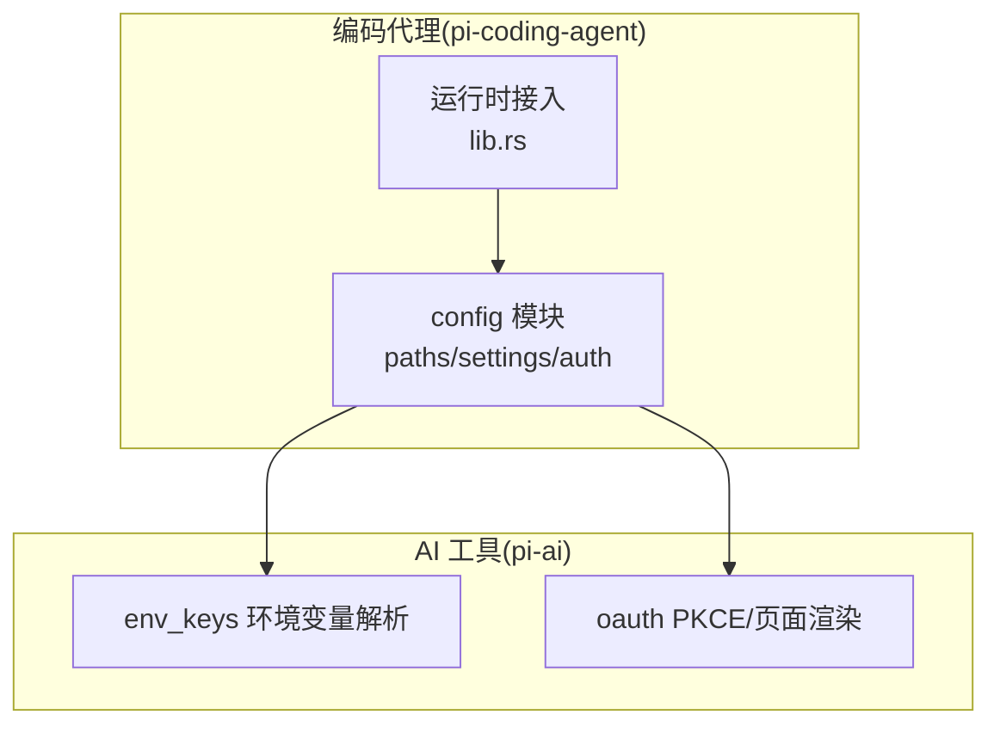
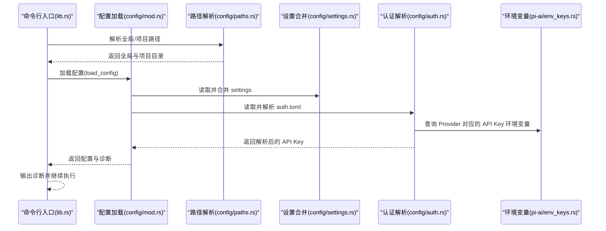
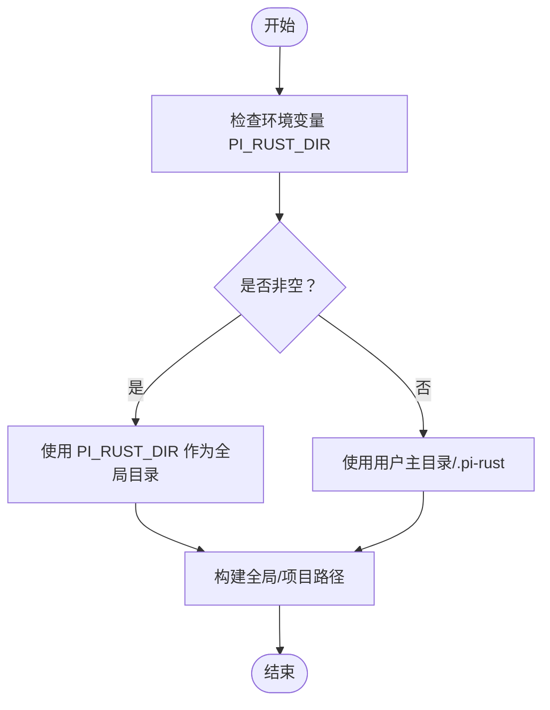
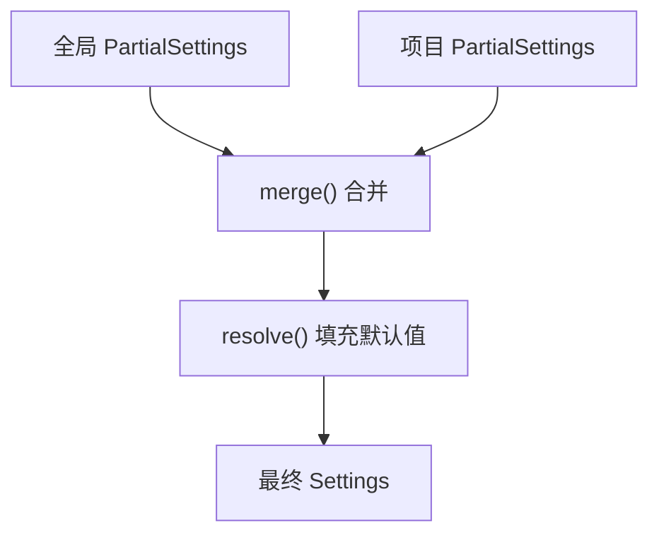
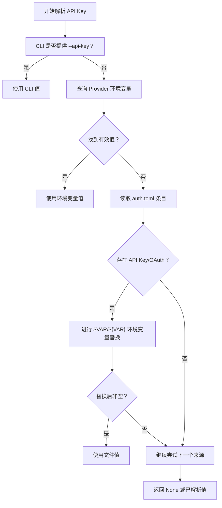
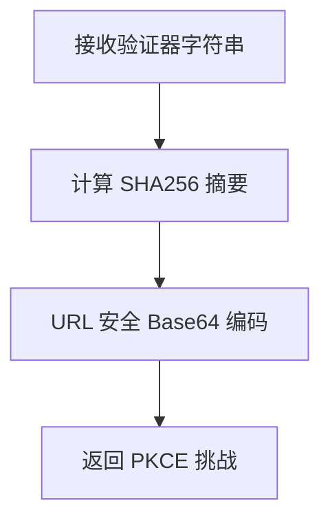
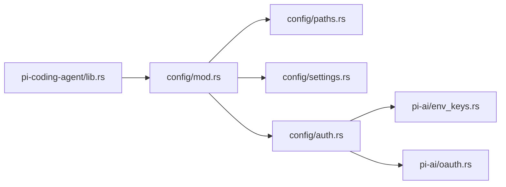

# 配置与认证

<cite>
**本文引用的文件**
- [crates/pi-coding-agent/src/config/mod.rs](file://crates/pi-coding-agent/src/config/mod.rs)
- [crates/pi-coding-agent/src/config/paths.rs](file://crates/pi-coding-agent/src/config/paths.rs)
- [crates/pi-coding-agent/src/config/settings.rs](file://crates/pi-coding-agent/src/config/settings.rs)
- [crates/pi-coding-agent/src/config/auth.rs](file://crates/pi-coding-agent/src/config/auth.rs)
- [crates/pi-ai/src/util/env_keys.rs](file://crates/pi-ai/src/util/env_keys.rs)
- [crates/pi-ai/src/util/oauth.rs](file://crates/pi-ai/src/util/oauth.rs)
- [crates/pi-coding-agent/src/lib.rs](file://crates/pi-coding-agent/src/lib.rs)
- [crates/pi-coding-agent/tests/config_wiring.rs](file://crates/pi-coding-agent/tests/config_wiring.rs)
- [docs/roadmap/M7-config-auth.md](file://docs/roadmap/M7-config-auth.md)
</cite>

## 目录
1. [简介](#简介)
2. [项目结构](#项目结构)
3. [核心组件](#核心组件)
4. [架构总览](#架构总览)
5. [详细组件分析](#详细组件分析)
6. [依赖关系分析](#依赖关系分析)
7. [性能考量](#性能考量)
8. [故障排除指南](#故障排除指南)
9. [结论](#结论)
10. [附录](#附录)

## 简介
本文件面向“配置与认证系统”的技术文档，聚焦于：
- 配置文件管理：TOML 配置解析、全局与项目级配置、配置合并策略
- 环境变量与认证机制：API 密钥管理、环境变量解析、安全存储与权限检查
- OAuth 集成与第三方认证流程：PKCE 挑战生成、认证成功/失败页面渲染
- 配置示例与认证设置指南、最佳实践与安全建议
- 常见问题与认证故障排除方法

该系统以 Rust 原生实现，采用 TOML 格式进行配置与认证存储，并通过明确的优先级与合并策略保证一致性与安全性。

## 项目结构
配置与认证相关的核心模块位于编码代理（pi-coding-agent）与 AI 工具（pi-ai）两个 crate 中：
- 配置加载与合并：config 模块负责路径解析、settings 合并、auth 存储与解析
- 环境变量解析：pi-ai 提供跨 Provider 的 API Key 环境变量映射与外部凭据检测
- OAuth 辅助：pi-ai 提供 PKCE 挑战与认证页面渲染工具
- CLI 接入：编码代理在运行时加载配置并解析 API Key

图表来源
- [crates/pi-coding-agent/src/config/mod.rs:1-54](file://crates/pi-coding-agent/src/config/mod.rs#L1-L54)
- [crates/pi-coding-agent/src/config/paths.rs:1-62](file://crates/pi-coding-agent/src/config/paths.rs#L1-L62)
- [crates/pi-coding-agent/src/config/settings.rs:1-389](file://crates/pi-coding-agent/src/config/settings.rs#L1-L389)
- [crates/pi-coding-agent/src/config/auth.rs:1-514](file://crates/pi-coding-agent/src/config/auth.rs#L1-L514)
- [crates/pi-ai/src/util/env_keys.rs:1-143](file://crates/pi-ai/src/util/env_keys.rs#L1-L143)
- [crates/pi-ai/src/util/oauth.rs:1-52](file://crates/pi-ai/src/util/oauth.rs#L1-L52)
- [crates/pi-coding-agent/src/lib.rs:157-200](file://crates/pi-coding-agent/src/lib.rs#L157-L200)

章节来源
- [crates/pi-coding-agent/src/config/mod.rs:1-54](file://crates/pi-coding-agent/src/config/mod.rs#L1-L54)
- [crates/pi-coding-agent/src/config/paths.rs:1-62](file://crates/pi-coding-agent/src/config/paths.rs#L1-L62)
- [crates/pi-coding-agent/src/config/settings.rs:1-389](file://crates/pi-coding-agent/src/config/settings.rs#L1-L389)
- [crates/pi-coding-agent/src/config/auth.rs:1-514](file://crates/pi-coding-agent/src/config/auth.rs#L1-L514)
- [crates/pi-ai/src/util/env_keys.rs:1-143](file://crates/pi-ai/src/util/env_keys.rs#L1-L143)
- [crates/pi-ai/src/util/oauth.rs:1-52](file://crates/pi-ai/src/util/oauth.rs#L1-L52)
- [crates/pi-coding-agent/src/lib.rs:157-200](file://crates/pi-coding-agent/src/lib.rs#L157-L200)

## 核心组件
- 配置路径解析：根据环境变量或用户主目录确定全局与项目配置目录
- 设置合并：支持全局 settings 与项目 settings 的字段级合并与默认值填充
- 认证存储：支持 API Key 与 OAuth Token 的 TOML 存储、环境变量替换、权限检查
- API Key 解析：优先级为 CLI 参数 > 环境变量 > 认证文件，支持 $VAR/${VAR} 替换
- 运行时接入：CLI 在执行前加载配置并解析 API Key，输出诊断信息

章节来源
- [crates/pi-coding-agent/src/config/paths.rs:20-31](file://crates/pi-coding-agent/src/config/paths.rs#L20-L31)
- [crates/pi-coding-agent/src/config/settings.rs:135-193](file://crates/pi-coding-agent/src/config/settings.rs#L135-L193)
- [crates/pi-coding-agent/src/config/auth.rs:108-132](file://crates/pi-coding-agent/src/config/auth.rs#L108-L132)
- [crates/pi-coding-agent/src/config/auth.rs:224-265](file://crates/pi-coding-agent/src/config/auth.rs#L224-L265)
- [crates/pi-coding-agent/src/lib.rs:157-187](file://crates/pi-coding-agent/src/lib.rs#L157-L187)

## 架构总览
配置与认证的运行时流程如下：
- CLI 启动后解析参数，定位工作目录
- 加载配置路径（全局与项目）
- 读取并合并 settings，解析 auth.toml 并进行环境变量替换
- 输出诊断信息（警告/错误）
- 依据模型选择与 Provider，解析 API Key（CLI > 环境变量 > 认证文件）
- 将配置注入到运行时资源加载与请求构建中

图表来源
- [crates/pi-coding-agent/src/lib.rs:157-187](file://crates/pi-coding-agent/src/lib.rs#L157-L187)
- [crates/pi-coding-agent/src/config/mod.rs:47-53](file://crates/pi-coding-agent/src/config/mod.rs#L47-L53)
- [crates/pi-coding-agent/src/config/paths.rs:20-31](file://crates/pi-coding-agent/src/config/paths.rs#L20-L31)
- [crates/pi-coding-agent/src/config/settings.rs:221-225](file://crates/pi-coding-agent/src/config/settings.rs#L221-L225)
- [crates/pi-coding-agent/src/config/auth.rs:224-265](file://crates/pi-coding-agent/src/config/auth.rs#L224-L265)
- [crates/pi-ai/src/util/env_keys.rs:34-46](file://crates/pi-ai/src/util/env_keys.rs#L34-L46)

## 详细组件分析

### 配置路径解析（ConfigPaths）
- 全局目录优先使用环境变量 PI_RUST_DIR，否则回退到用户主目录下的 .pi-rust
- 项目目录固定为 <cwd>/.pi-rust
- 提供 settings 与 auth 文件路径访问器

图表来源
- [crates/pi-coding-agent/src/config/paths.rs:20-31](file://crates/pi-coding-agent/src/config/paths.rs#L20-L31)

章节来源
- [crates/pi-coding-agent/src/config/paths.rs:1-62](file://crates/pi-coding-agent/src/config/paths.rs#L1-L62)

### 设置合并（Settings）
- 支持全局 settings 与项目 settings 的字段级合并
- 合并规则：
  - 标量字段：项目覆盖全局，否则保留全局，缺失则使用默认值
  - 数组字段：拼接（全局 + 项目）
  - 嵌套对象：逐字段覆盖（项目优先）
- 默认值填充：在 resolve 阶段统一填充未指定字段的默认值

图表来源
- [crates/pi-coding-agent/src/config/settings.rs:135-193](file://crates/pi-coding-agent/src/config/settings.rs#L135-L193)

章节来源
- [crates/pi-coding-agent/src/config/settings.rs:1-389](file://crates/pi-coding-agent/src/config/settings.rs#L1-L389)

### 认证存储与解析（AuthStore 与 API Key 解析）
- 支持两种认证条目：
  - API Key：键名为 key
  - OAuth：支持 access/access_token、refresh/refresh_token、expires 等字段
- 认证文件读取：
  - 缺失文件返回空存储，不产生诊断
  - 解析失败产生警告诊断
  - Unix 下检查 0600 权限，松散权限发出警告
- 环境变量替换：
  - 支持 $VAR、${VAR}、$$（转义为 $）、$!（转义为 !）
  - 未设置的变量会记录诊断并返回 None
- API Key 解析优先级：
  - CLI 参数（如 --api-key）优先
  - Provider 对应的 API Key 环境变量（pi-ai 提供映射）
  - 认证文件中的原始值（可能包含 $VAR 引用），随后进行环境变量替换
  - 若为 OAuth，可使用 access/access_token 作为 Bearer Token

图表来源
- [crates/pi-coding-agent/src/config/auth.rs:224-265](file://crates/pi-coding-agent/src/config/auth.rs#L224-L265)
- [crates/pi-ai/src/util/env_keys.rs:34-46](file://crates/pi-ai/src/util/env_keys.rs#L34-L46)

章节来源
- [crates/pi-coding-agent/src/config/auth.rs:1-514](file://crates/pi-coding-agent/src/config/auth.rs#L1-L514)
- [crates/pi-ai/src/util/env_keys.rs:1-143](file://crates/pi-ai/src/util/env_keys.rs#L1-L143)

### OAuth 集成与第三方认证流程
- PKCE 挑战生成：基于随机验证器生成 SHA256 摘要并通过 URL 安全 Base64 编码
- 成功/失败页面：渲染 HTML 页面，包含标题、消息与可选详情，对 HTML 进行转义避免 XSS

图表来源
- [crates/pi-ai/src/util/oauth.rs:4-7](file://crates/pi-ai/src/util/oauth.rs#L4-L7)

章节来源
- [crates/pi-ai/src/util/oauth.rs:1-52](file://crates/pi-ai/src/util/oauth.rs#L1-L52)

### 运行时接入与诊断输出
- CLI 在执行前调用配置加载函数，输出诊断文本
- 将解析出的 API Key 传递给后续资源加载与请求构建逻辑

章节来源
- [crates/pi-coding-agent/src/lib.rs:157-187](file://crates/pi-coding-agent/src/lib.rs#L157-L187)
- [crates/pi-coding-agent/src/config/mod.rs:55-73](file://crates/pi-coding-agent/src/config/mod.rs#L55-L73)

## 依赖关系分析
- config 模块依赖：
  - paths：提供全局/项目路径
  - settings：提供 settings 合并与默认值填充
  - auth：提供认证存储与 API Key 解析
- 运行时依赖：
  - pi-ai 的 env_keys：提供 Provider 到 API Key 环境变量的映射
  - pi-ai 的 oauth：提供 PKCE 与页面渲染工具（用于 OAuth 流程）

图表来源
- [crates/pi-coding-agent/src/config/mod.rs:1-9](file://crates/pi-coding-agent/src/config/mod.rs#L1-L9)
- [crates/pi-coding-agent/src/config/paths.rs:1-62](file://crates/pi-coding-agent/src/config/paths.rs#L1-L62)
- [crates/pi-coding-agent/src/config/settings.rs:1-389](file://crates/pi-coding-agent/src/config/settings.rs#L1-L389)
- [crates/pi-coding-agent/src/config/auth.rs:1-514](file://crates/pi-coding-agent/src/config/auth.rs#L1-L514)
- [crates/pi-ai/src/util/env_keys.rs:1-143](file://crates/pi-ai/src/util/env_keys.rs#L1-L143)
- [crates/pi-ai/src/util/oauth.rs:1-52](file://crates/pi-ai/src/util/oauth.rs#L1-L52)
- [crates/pi-coding-agent/src/lib.rs:157-187](file://crates/pi-coding-agent/src/lib.rs#L157-L187)

章节来源
- [crates/pi-coding-agent/src/config/mod.rs:1-9](file://crates/pi-coding-agent/src/config/mod.rs#L1-L9)
- [crates/pi-coding-agent/src/lib.rs:157-187](file://crates/pi-coding-agent/src/lib.rs#L157-L187)

## 性能考量
- 配置读取与解析为启动阶段一次性操作，开销极低
- 合并策略采用浅拷贝与必要时扩展数组，时间复杂度与字段数量线性相关
- 环境变量替换为一次遍历，字符处理成本低
- 认证文件权限检查仅在 Unix 平台启用，避免不必要的系统调用

## 故障排除指南
- 无法读取 settings/auth 文件
  - 检查文件是否存在与可读权限
  - 查看诊断输出中的警告信息
- settings 解析失败
  - 确认 TOML 语法正确且字段名符合定义
  - 使用默认值策略回退，确认未误用未知字段
- auth.toml 权限问题（Unix）
  - 确保文件权限为 0600，避免宽松权限警告
- API Key 未生效
  - 检查 CLI 参数是否传入
  - 确认环境变量名称与 Provider 匹配（参考映射）
  - 检查 auth.toml 中的 $VAR 是否被正确替换
- OAuth 流程
  - 使用 PKCE 挑战生成与页面渲染工具辅助实现
  - 确保回调端口与重定向 URI 正确配置

章节来源
- [crates/pi-coding-agent/src/config/settings.rs:195-219](file://crates/pi-coding-agent/src/config/settings.rs#L195-L219)
- [crates/pi-coding-agent/src/config/auth.rs:108-132](file://crates/pi-coding-agent/src/config/auth.rs#L108-L132)
- [crates/pi-coding-agent/src/config/auth.rs:194-209](file://crates/pi-coding-agent/src/config/auth.rs#L194-L209)
- [crates/pi-coding-agent/tests/config_wiring.rs:22-82](file://crates/pi-coding-agent/tests/config_wiring.rs#L22-L82)
- [crates/pi-ai/src/util/oauth.rs:4-25](file://crates/pi-ai/src/util/oauth.rs#L4-L25)

## 结论
本配置与认证系统以 Rust 原生实现，提供清晰的优先级与合并策略，兼顾易用性与安全性。通过环境变量映射与 $VAR 替换，满足多 Provider 的灵活部署需求；通过权限检查与诊断输出，降低运维风险。OAuth 相关能力在 pi-ai 中提供基础支撑，便于后续在 M8 等里程碑中完善完整流程。

## 附录

### 配置文件与示例
- 全局配置目录：可通过环境变量 PI_RUST_DIR 覆盖，默认为用户主目录下的 .pi-rust
- 项目配置目录：<cwd>/.pi-rust
- 配置文件：
  - settings.toml：全局与项目 settings 合并
  - auth.toml：API Key 与 OAuth Token 存储

章节来源
- [docs/roadmap/M7-config-auth.md:13-19](file://docs/roadmap/M7-config-auth.md#L13-L19)
- [crates/pi-coding-agent/src/config/paths.rs:20-31](file://crates/pi-coding-agent/src/config/paths.rs#L20-L31)

### 认证设置指南
- API Key 获取与设置
  - 优先使用 CLI 参数传入
  - 设置 Provider 对应的环境变量（参考映射）
  - 在 auth.toml 中保存原始值，支持 $VAR 引用
- OAuth Token
  - 在 auth.toml 中使用 OAuth 条目，支持 access/access_token 等字段
  - 使用 PKCE 挑战生成与页面渲染工具辅助流程

章节来源
- [docs/roadmap/M7-config-auth.md:37-43](file://docs/roadmap/M7-config-auth.md#L37-L43)
- [crates/pi-coding-agent/src/config/auth.rs:80-100](file://crates/pi-coding-agent/src/config/auth.rs#L80-L100)
- [crates/pi-ai/src/util/oauth.rs:4-25](file://crates/pi-ai/src/util/oauth.rs#L4-L25)

### 最佳实践与安全建议
- 严格控制 auth.toml 权限（Unix：0600），避免泄露敏感信息
- 使用 $VAR 引用环境变量，避免将明文密钥硬编码到文件
- 优先使用 CLI 参数或环境变量，减少对本地文件的依赖
- 对于外部凭据（如 AWS Profile、Google Application Credentials），通过环境变量或 ADC 机制提供，避免在文件中存储

章节来源
- [crates/pi-coding-agent/src/config/auth.rs:194-209](file://crates/pi-coding-agent/src/config/auth.rs#L194-L209)
- [crates/pi-ai/src/util/env_keys.rs:51-65](file://crates/pi-ai/src/util/env_keys.rs#L51-L65)