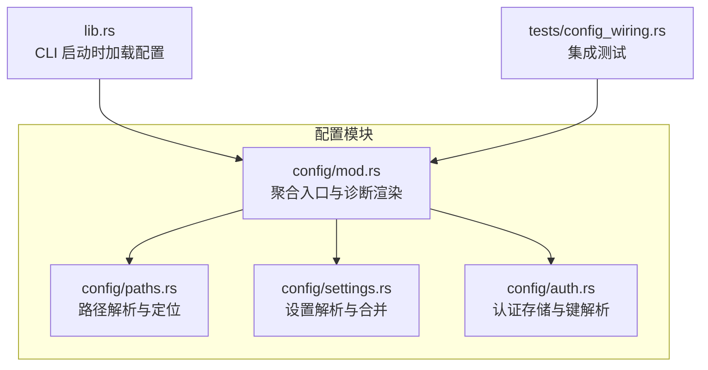
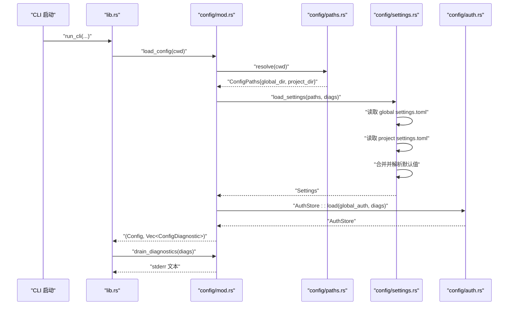
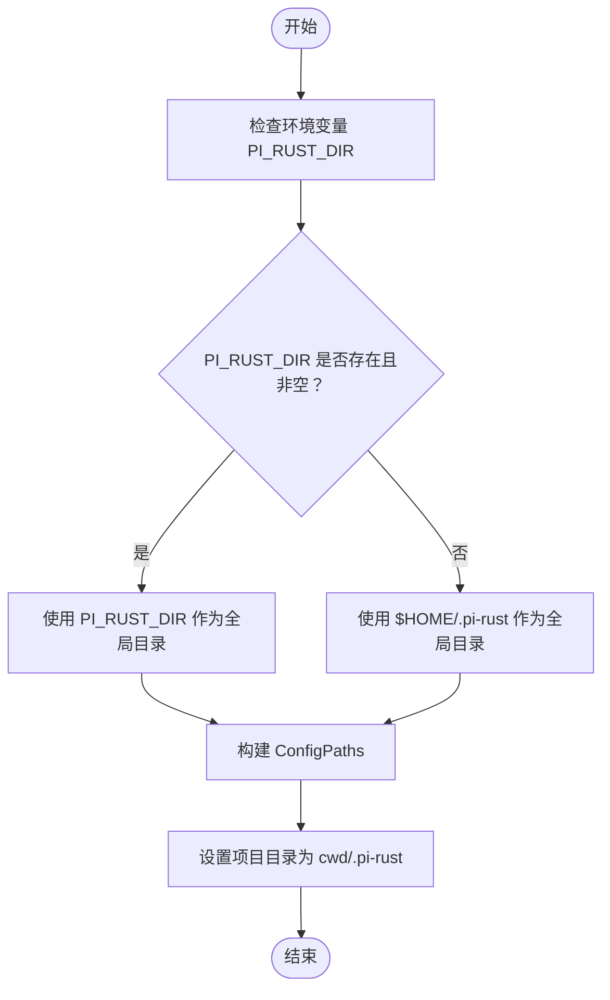
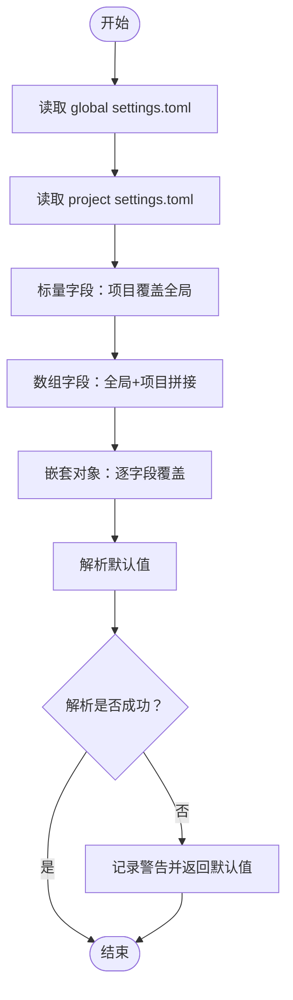
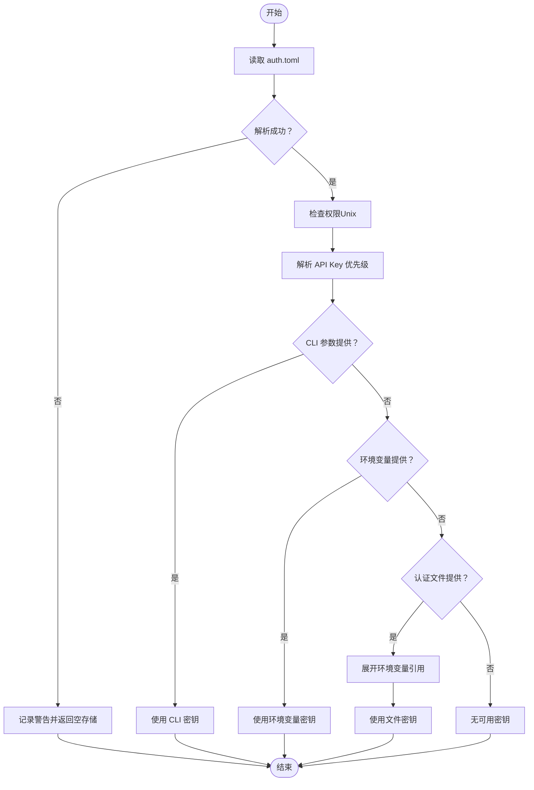
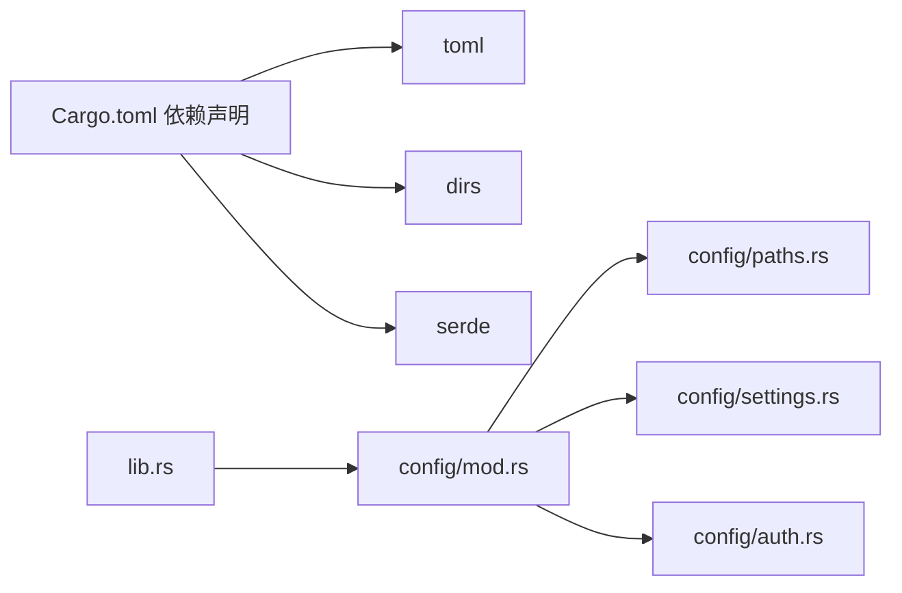

# 配置文件管理

<cite>
**本文引用的文件**
- [crates/pi-coding-agent/src/config/mod.rs](file://crates/pi-coding-agent/src/config/mod.rs)
- [crates/pi-coding-agent/src/config/settings.rs](file://crates/pi-coding-agent/src/config/settings.rs)
- [crates/pi-coding-agent/src/config/paths.rs](file://crates/pi-coding-agent/src/config/paths.rs)
- [crates/pi-coding-agent/src/config/auth.rs](file://crates/pi-coding-agent/src/config/auth.rs)
- [crates/pi-coding-agent/src/lib.rs](file://crates/pi-coding-agent/src/lib.rs)
- [crates/pi-coding-agent/tests/config_wiring.rs](file://crates/pi-coding-agent/tests/config_wiring.rs)
- [Cargo.toml](file://Cargo.toml)
</cite>

## 目录
1. [简介](#简介)
2. [项目结构](#项目结构)
3. [核心组件](#核心组件)
4. [架构总览](#架构总览)
5. [详细组件分析](#详细组件分析)
6. [依赖关系分析](#依赖关系分析)
7. [性能考量](#性能考量)
8. [故障排除指南](#故障排除指南)
9. [结论](#结论)
10. [附录：配置文件示例与字段说明](#附录配置文件示例与字段说明)

## 简介
本文件系统性地阐述了该 Rust 项目中的配置文件管理系统，重点覆盖：
- TOML 配置解析机制：配置文件的发现、读取与验证流程
- 全局与项目级配置的层次结构与合并策略
- 配置路径解析逻辑（含 PI_RUST_DIR 环境变量）
- 完整的配置文件示例与字段说明
- 配置验证规则与错误处理机制
- 常见问题与故障排除方法

目标是让初学者能够快速理解配置系统的运作方式，同时为有经验的开发者提供足够的技术深度。

## 项目结构
配置系统位于编码代理子包中，采用模块化设计，分别负责路径解析、设置加载、认证存储与诊断输出。

图表来源
- [crates/pi-coding-agent/src/config/mod.rs:47-73](file://crates/pi-coding-agent/src/config/mod.rs#L47-L73)
- [crates/pi-coding-agent/src/config/paths.rs:20-31](file://crates/pi-coding-agent/src/config/paths.rs#L20-L31)
- [crates/pi-coding-agent/src/config/settings.rs:221-225](file://crates/pi-coding-agent/src/config/settings.rs#L221-L225)
- [crates/pi-coding-agent/src/config/auth.rs:108-132](file://crates/pi-coding-agent/src/config/auth.rs#L108-L132)
- [crates/pi-coding-agent/src/lib.rs:157-187](file://crates/pi-coding-agent/src/lib.rs#L157-L187)
- [crates/pi-coding-agent/tests/config_wiring.rs:22-82](file://crates/pi-coding-agent/tests/config_wiring.rs#L22-L82)

章节来源
- [crates/pi-coding-agent/src/config/mod.rs:1-124](file://crates/pi-coding-agent/src/config/mod.rs#L1-L124)
- [crates/pi-coding-agent/src/config/paths.rs:1-62](file://crates/pi-coding-agent/src/config/paths.rs#L1-L62)
- [crates/pi-coding-agent/src/config/settings.rs:1-389](file://crates/pi-coding-agent/src/config/settings.rs#L1-L389)
- [crates/pi-coding-agent/src/config/auth.rs:1-514](file://crates/pi-coding-agent/src/config/auth.rs#L1-L514)
- [crates/pi-coding-agent/src/lib.rs:157-187](file://crates/pi-coding-agent/src/lib.rs#L157-L187)
- [crates/pi-coding-agent/tests/config_wiring.rs:1-116](file://crates/pi-coding-agent/tests/config_wiring.rs#L1-L116)

## 核心组件
- 聚合入口与诊断渲染
  - 提供统一的配置加载接口与诊断信息渲染能力
  - 关键函数：load_config、drain_diagnostics
- 路径解析
  - 解析全局与项目级配置目录与文件位置
  - 支持通过环境变量覆盖全局目录
- 设置解析与合并
  - 使用 TOML 解析 settings.toml
  - 实现全局与项目级设置的分层合并
- 认证存储与键解析
  - 加载 auth.toml 并支持环境变量引用
  - 提供多源优先级的密钥解析策略

章节来源
- [crates/pi-coding-agent/src/config/mod.rs:42-73](file://crates/pi-coding-agent/src/config/mod.rs#L42-L73)
- [crates/pi-coding-agent/src/config/paths.rs:20-31](file://crates/pi-coding-agent/src/config/paths.rs#L20-L31)
- [crates/pi-coding-agent/src/config/settings.rs:221-225](file://crates/pi-coding-agent/src/config/settings.rs#L221-L225)
- [crates/pi-coding-agent/src/config/auth.rs:108-132](file://crates/pi-coding-agent/src/config/auth.rs#L108-L132)

## 架构总览
配置系统在 CLI 启动阶段被调用，按以下顺序完成配置发现、读取与合并，并输出诊断信息。

图表来源
- [crates/pi-coding-agent/src/lib.rs:157-187](file://crates/pi-coding-agent/src/lib.rs#L157-L187)
- [crates/pi-coding-agent/src/config/mod.rs:47-53](file://crates/pi-coding-agent/src/config/mod.rs#L47-L53)
- [crates/pi-coding-agent/src/config/paths.rs:20-31](file://crates/pi-coding-agent/src/config/paths.rs#L20-L31)
- [crates/pi-coding-agent/src/config/settings.rs:221-225](file://crates/pi-coding-agent/src/config/settings.rs#L221-L225)
- [crates/pi-coding-agent/src/config/auth.rs:108-132](file://crates/pi-coding-agent/src/config/auth.rs#L108-L132)

## 详细组件分析

### 路径解析与配置发现
- 全局目录优先级
  - 若环境变量 PI_RUST_DIR 存在且非空，则作为全局目录
  - 否则使用用户主目录下的 .pi-rust
- 项目目录
  - 固定为当前工作目录下的 .pi-rust
- 文件定位
  - settings.toml 与 auth.toml 分别位于上述目录中

图表来源
- [crates/pi-coding-agent/src/config/paths.rs:20-31](file://crates/pi-coding-agent/src/config/paths.rs#L20-L31)

章节来源
- [crates/pi-coding-agent/src/config/paths.rs:20-31](file://crates/pi-coding-agent/src/config/paths.rs#L20-L31)
- [crates/pi-coding-agent/tests/config_wiring.rs:32-43](file://crates/pi-coding-agent/tests/config_wiring.rs#L32-L43)

### 设置解析与合并策略
- TOML 解析
  - 读取 settings.toml，若文件不存在或读取失败，记录警告并返回默认值
  - 使用 toml 库进行反序列化；启用未知字段拒绝以保证配置健壮性
- 层次结构
  - 全局 settings.toml：系统范围默认
  - 项目 settings.toml：项目特定覆盖
- 合并规则
  - 标量字段：项目级覆盖全局级
  - 数组字段：项目级追加到全局级
  - 嵌套对象：逐字段覆盖（如 terminal、compaction、retry）
  - 默认值：未指定时填充合理默认值（如 transport、steering_mode、terminal 显示开关等）

图表来源
- [crates/pi-coding-agent/src/config/settings.rs:195-219](file://crates/pi-coding-agent/src/config/settings.rs#L195-L219)
- [crates/pi-coding-agent/src/config/settings.rs:135-193](file://crates/pi-coding-agent/src/config/settings.rs#L135-L193)

章节来源
- [crates/pi-coding-agent/src/config/settings.rs:195-219](file://crates/pi-coding-agent/src/config/settings.rs#L195-L219)
- [crates/pi-coding-agent/src/config/settings.rs:221-225](file://crates/pi-coding-agent/src/config/settings.rs#L221-L225)
- [crates/pi-coding-agent/tests/config_wiring.rs:34-43](file://crates/pi-coding-agent/tests/config_wiring.rs#L34-L43)

### 认证存储与键解析
- 文件加载
  - 读取 auth.toml；不存在则返回空存储；读取/解析失败记录警告并返回空存储
  - 在 Unix 系统上检查文件权限（建议 0600），松散权限会触发警告
- 环境变量引用
  - 支持 $VAR 与 ${VAR} 语法；$$ 输出单个 $，$! 输出 ! 字面量
  - 未设置的变量会触发警告并导致解析失败
- 多源优先级
  - CLI 参数 > 环境变量 > 认证文件（API Key 或 OAuth 访问令牌）
  - OAuth 的 access 与 access_token 字段均可用作访问令牌

图表来源
- [crates/pi-coding-agent/src/config/auth.rs:108-132](file://crates/pi-coding-agent/src/config/auth.rs#L108-L132)
- [crates/pi-coding-agent/src/config/auth.rs:224-265](file://crates/pi-coding-agent/src/config/auth.rs#L224-L265)

章节来源
- [crates/pi-coding-agent/src/config/auth.rs:108-132](file://crates/pi-coding-agent/src/config/auth.rs#L108-L132)
- [crates/pi-coding-agent/src/config/auth.rs:224-265](file://crates/pi-coding-agent/src/config/auth.rs#L224-L265)
- [crates/pi-coding-agent/tests/config_wiring.rs:68-82](file://crates/pi-coding-agent/tests/config_wiring.rs#L68-L82)

### 聚合入口与诊断渲染
- 统一加载
  - 通过 load_config(cwd) 获取完整配置与诊断列表
- 诊断渲染
  - drain_diagnostics 将诊断转换为标准错误文本，便于 CLI 输出

章节来源
- [crates/pi-coding-agent/src/config/mod.rs:47-73](file://crates/pi-coding-agent/src/config/mod.rs#L47-L73)
- [crates/pi-coding-agent/src/lib.rs:157-187](file://crates/pi-coding-agent/src/lib.rs#L157-L187)

## 依赖关系分析
- 外部依赖
  - toml：用于 TOML 解析与序列化
  - dirs：用于获取用户主目录
  - serde：用于结构体的序列化/反序列化
- 内部依赖
  - config/mod.rs 依赖 paths、settings、auth 模块
  - lib.rs 在启动时调用 config::load_config

图表来源
- [Cargo.toml:6-22](file://Cargo.toml#L6-L22)
- [crates/pi-coding-agent/src/config/mod.rs:1-10](file://crates/pi-coding-agent/src/config/mod.rs#L1-L10)
- [crates/pi-coding-agent/src/lib.rs:157-187](file://crates/pi-coding-agent/src/lib.rs#L157-L187)

章节来源
- [Cargo.toml:6-22](file://Cargo.toml#L6-L22)
- [crates/pi-coding-agent/src/config/mod.rs:1-10](file://crates/pi-coding-agent/src/config/mod.rs#L1-L10)
- [crates/pi-coding-agent/src/lib.rs:157-187](file://crates/pi-coding-agent/src/lib.rs#L157-L187)

## 性能考量
- 文件 I/O
  - 配置文件仅在启动时读取一次，开销可忽略
- 解析复杂度
  - settings.toml 为纯标量、数组与嵌套对象组合，解析时间与配置大小线性相关
- 权限检查
  - 仅在 Unix 平台执行，通常为常数时间操作
- 建议
  - 将大型资源路径置于项目级配置，避免全局配置膨胀
  - 合理使用数组字段（如 skills/prompts/themes）进行增量扩展

## 故障排除指南
- 配置文件未生效
  - 确认 PI_RUST_DIR 环境变量指向正确的全局目录
  - 确认项目目录下存在 .pi-rust/settings.toml
- TOML 解析失败
  - 检查 settings.toml 语法与字段名称（未知字段会被拒绝）
  - 查看 stderr 中的诊断信息
- 认证文件权限问题
  - 在 Unix 上确保 auth.toml 权限为 0600，否则会提示松散权限
- 环境变量未设置
  - 若 auth.toml 中使用了 $VAR 引用，需确保对应环境变量已导出
- 键解析失败
  - 检查 CLI 参数、环境变量与认证文件的优先级顺序
  - 确保 OAuth 的 access 或 access_token 字段正确填写

章节来源
- [crates/pi-coding-agent/src/config/settings.rs:195-219](file://crates/pi-coding-agent/src/config/settings.rs#L195-L219)
- [crates/pi-coding-agent/src/config/auth.rs:108-132](file://crates/pi-coding-agent/src/config/auth.rs#L108-L132)
- [crates/pi-coding-agent/src/config/auth.rs:194-209](file://crates/pi-coding-agent/src/config/auth.rs#L194-L209)
- [crates/pi-coding-agent/src/config/auth.rs:224-265](file://crates/pi-coding-agent/src/config/auth.rs#L224-L265)
- [crates/pi-coding-agent/tests/config_wiring.rs:32-82](file://crates/pi-coding-agent/tests/config_wiring.rs#L32-L82)

## 结论
该配置系统通过清晰的层次结构与稳健的解析策略，实现了从全局到项目级的配置覆盖与合并。借助环境变量与多源密钥解析，既满足了灵活性也兼顾了安全性。配合完善的诊断机制，能够帮助用户快速定位并解决问题。

## 附录：配置文件示例与字段说明

### 全局配置（settings.toml）
- 作用域：系统范围默认
- 文件位置：由 PI_RUST_DIR 或 $HOME/.pi-rust 决定
- 示例字段（不展示具体值，仅列字段名与含义）
  - default_provider：默认模型提供商
  - default_model：默认模型 ID
  - default_thinking_level：默认思考层级
  - transport：传输方式（如 auto）
  - steering_mode：引导模式（如 one-at-a-time）
  - follow_up_mode：后续模式（如 one-at-a-time）
  - session_dir：会话目录路径
  - skills：技能资源路径列表（项目级追加）
  - prompts：提示词模板路径列表（项目级追加）
  - themes：主题资源路径列表（项目级追加）
  - theme：当前主题名称
  - no_context_files：是否禁用上下文文件
  - terminal：终端显示选项
    - show_images：是否显示图片
    - show_progress：是否显示进度
  - compaction：压缩设置
    - enabled：是否启用
    - reserve_tokens：保留令牌数
    - keep_recent_tokens：保留最近令牌数
  - retry：重试设置
    - enabled：是否启用
    - max_retries：最大重试次数
    - base_delay_ms：基础延迟毫秒数

章节来源
- [crates/pi-coding-agent/src/config/settings.rs:5-85](file://crates/pi-coding-agent/src/config/settings.rs#L5-L85)
- [crates/pi-coding-agent/src/config/settings.rs:135-193](file://crates/pi-coding-agent/src/config/settings.rs#L135-L193)

### 项目配置（settings.toml）
- 作用域：当前工作目录下的 .pi-rust
- 文件位置：cwd/.pi-rust/settings.toml
- 合并策略：标量字段项目覆盖全局；数组字段全局+项目拼接；嵌套对象逐字段覆盖

章节来源
- [crates/pi-coding-agent/src/config/paths.rs:29](file://crates/pi-coding-agent/src/config/paths.rs#L29)
- [crates/pi-coding-agent/src/config/settings.rs:135-154](file://crates/pi-coding-agent/src/config/settings.rs#L135-L154)

### 认证配置（auth.toml）
- 作用域：全局认证存储
- 文件位置：由 PI_RUST_DIR 或 $HOME/.pi-rust 决定
- 示例条目
  - provider: { type = "api_key", key = "<你的密钥>" }
  - provider: { type = "oauth", access = "<访问令牌>", access_token = "<访问令牌别名>", refresh = "<刷新令牌>", expires = <过期时间戳> }
- 环境变量引用
  - key 或 access 可使用 $VAR 或 ${VAR} 语法
  - $$ 输出单个 $，$! 输出 ! 字面量
- 权限要求（Unix）
  - 建议设置为 0600，否则会提示松散权限

章节来源
- [crates/pi-coding-agent/src/config/auth.rs:80-100](file://crates/pi-coding-agent/src/config/auth.rs#L80-L100)
- [crates/pi-coding-agent/src/config/auth.rs:108-132](file://crates/pi-coding-agent/src/config/auth.rs#L108-L132)
- [crates/pi-coding-agent/src/config/auth.rs:194-209](file://crates/pi-coding-agent/src/config/auth.rs#L194-L209)

### 环境变量与路径解析
- PI_RUST_DIR
  - 优先级高于默认主目录路径
  - 为空字符串时回退到默认行为
- 项目目录
  - 固定为 cwd/.pi-rust

章节来源
- [crates/pi-coding-agent/src/config/paths.rs:20-31](file://crates/pi-coding-agent/src/config/paths.rs#L20-L31)
- [crates/pi-coding-agent/tests/config_wiring.rs:32-43](file://crates/pi-coding-agent/tests/config_wiring.rs#L32-L43)