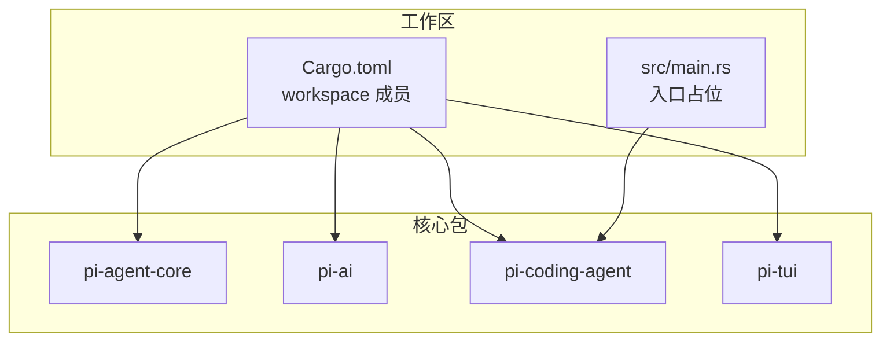
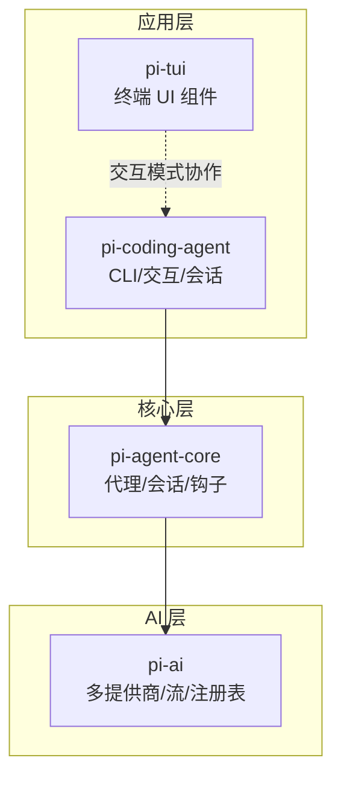
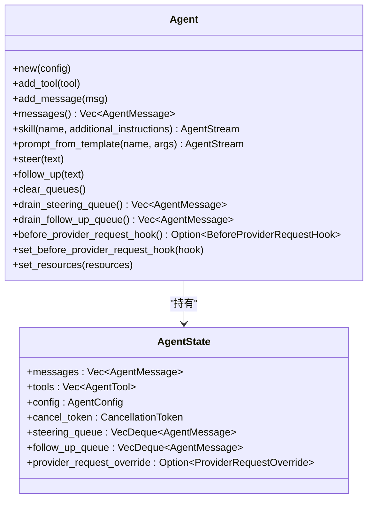
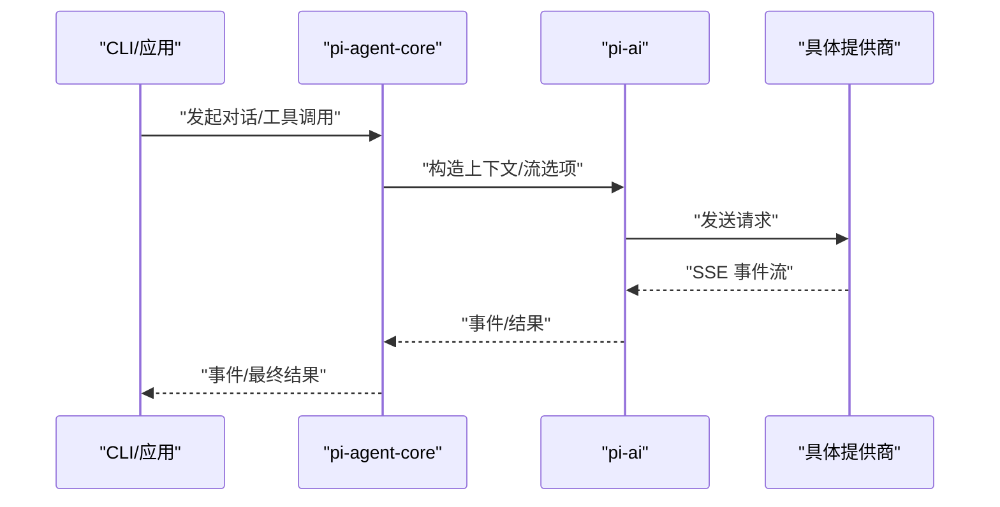
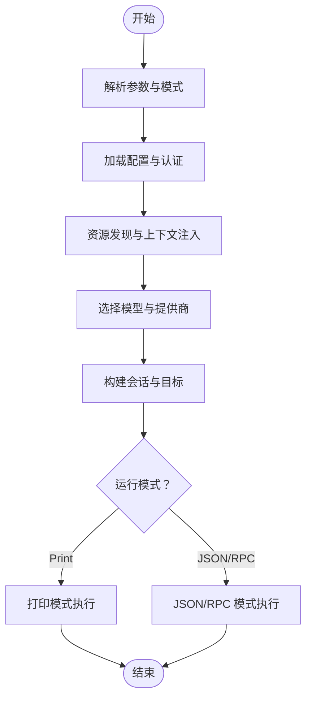
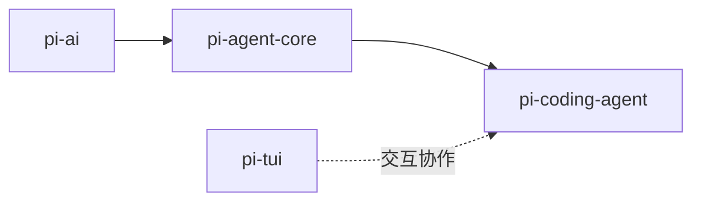

# 项目概述

<cite>
**本文档引用的文件**
- [Cargo.toml](file://Cargo.toml)
- [src/main.rs](file://src/main.rs)
- [ROADMAP.md](file://ROADMAP.md)
- [crates/pi-agent-core/Cargo.toml](file://crates/pi-agent-core/Cargo.toml)
- [crates/pi-agent-core/src/lib.rs](file://crates/pi-agent-core/src/lib.rs)
- [crates/pi-agent-core/src/agent.rs](file://crates/pi-agent-core/src/agent.rs)
- [crates/pi-ai/Cargo.toml](file://crates/pi-ai/Cargo.toml)
- [crates/pi-ai/src/lib.rs](file://crates/pi-ai/src/lib.rs)
- [crates/pi-ai/src/providers/mod.rs](file://crates/pi-ai/src/providers/mod.rs)
- [crates/pi-coding-agent/Cargo.toml](file://crates/pi-coding-agent/Cargo.toml)
- [crates/pi-coding-agent/src/lib.rs](file://crates/pi-coding-agent/src/lib.rs)
- [crates/pi-coding-agent/examples/manual_test.rs](file://crates/pi-coding-agent/examples/manual_test.rs)
- [crates/pi-tui/Cargo.toml](file://crates/pi-tui/Cargo.toml)
- [crates/pi-tui/src/lib.rs](file://crates/pi-tui/src/lib.rs)
</cite>

## 目录
1. [简介](#简介)
2. [项目结构](#项目结构)
3. [核心组件](#核心组件)
4. [架构总览](#架构总览)
5. [详细组件分析](#详细组件分析)
6. [依赖分析](#依赖分析)
7. [性能考虑](#性能考虑)
8. [故障排除指南](#故障排除指南)
9. [结论](#结论)
10. [附录](#附录)

## 简介
Pi-Rust 是一个 Rust 多包 AI 代理框架系统，目标是将 JavaScript/TypeScript 生态中的“pi”项目以 Rust 语言进行特性对标的重构与迁移。项目强调：
- 对标上游 TS 行为，但不照搬实现，充分利用 Rust 的类型安全、零成本抽象与并发模型
- 采用异步运行时（Tokio）与事件驱动架构，构建可扩展、可插拔的 AI 代理内核
- 提供从命令行到交互式 TUI 的完整使用链路，并支持多提供商 AI 集成与工具调用

本项目当前处于 M0–M11 完成阶段，核心优先，周边能力后置，已实现会话 JSONL 互通与多 crate 分层组织。

## 项目结构
仓库采用工作区（workspace）组织，核心 crate 包括：
- pi-agent-core：核心代理引擎与会话持久化
- pi-ai：AI 服务集成层与多提供商适配
- pi-coding-agent：编码代理 CLI 与交互模式
- pi-tui：终端用户界面组件库
- pi-mom / pi-pods / pi-web-ui：空壳或范围未定的辅助 crate

图表来源
- [Cargo.toml:1-12](file://Cargo.toml#L1-L12)
- [src/main.rs:1-4](file://src/main.rs#L1-L4)

章节来源
- [Cargo.toml:1-12](file://Cargo.toml#L1-L12)
- [ROADMAP.md:44-51](file://ROADMAP.md#L44-L51)

## 核心组件
- pi-agent-core
  - 职责：代理生命周期管理、消息队列、工具注册、钩子系统、会话上下文与持久化、资源加载与提示模板
  - 关键模块：agent、agent_loop、harness、hooks、session、resources、queues、truncate、types
  - 技术要点：Tokio 取消令牌、RwLock/Arc 并发安全、事件驱动循环、可中断的推理流
- pi-ai
  - 职责：统一的 AI 服务抽象、模型注册表、事件流、多提供商适配（Anthropic、OpenAI、Google、Mistral、Bedrock、DeepSeek、Cloudflare 等）
  - 关键模块：providers/*、registry、stream、types、util
  - 技术要点：异步 SSE 流、请求转换、响应解析、成本计算、环境密钥解析
- pi-coding-agent
  - 职责：CLI 与交互模式、配置与认证、资源发现、工具集、打印模式、RPC/JSON 模式、会话运行器
  - 关键模块：args、config、interactive、protocol、resources、runtime、session、tools
  - 技术要点：参数解析、模式切换、会话目标解析、工具过滤与注册、事件桥接
- pi-tui
  - 职责：终端 UI 组件库（编辑器、输入、列表、Markdown、主题、虚拟终端、图像渲染）
  - 关键模块：components/*、input、terminal、theme、tui、runtime
  - 技术要点：键盘绑定、自动补全、模糊匹配、ANSI 渲染、图像协议（Kitty/iTerm2）

章节来源
- [crates/pi-agent-core/src/lib.rs:1-47](file://crates/pi-agent-core/src/lib.rs#L1-L47)
- [crates/pi-ai/src/lib.rs:1-19](file://crates/pi-ai/src/lib.rs#L1-L19)
- [crates/pi-coding-agent/src/lib.rs:1-352](file://crates/pi-coding-agent/src/lib.rs#L1-L352)
- [crates/pi-tui/src/lib.rs:1-61](file://crates/pi-tui/src/lib.rs#L1-L61)

## 架构总览
Pi-Rust 采用分层架构：AI 服务层（pi-ai）为上层提供统一的模型与流接口；核心代理层（pi-agent-core）负责代理状态、钩子与会话；应用层（pi-coding-agent）提供 CLI/交互入口；TUI 层（pi-tui）提供终端 UI 组件。交互模式下，CLI 与 TUI 协同工作，形成完整的用户体验闭环。

图表来源
- [ROADMAP.md:44-51](file://ROADMAP.md#L44-L51)
- [crates/pi-coding-agent/Cargo.toml:13-15](file://crates/pi-coding-agent/Cargo.toml#L13-L15)
- [crates/pi-agent-core/Cargo.toml:7](file://crates/pi-agent-core/Cargo.toml#L7)
- [crates/pi-ai/Cargo.toml:6-10](file://crates/pi-ai/Cargo.toml#L6-L10)

## 详细组件分析

### 组件一：pi-agent-core（核心代理引擎）
- 设计要点
  - Agent 结构体封装消息、工具、配置与取消令牌，支持并发安全访问
  - 运行时通过 agent_loop 驱动一次或多轮对话，支持中断与后续队列
  - 资源系统支持技能与提示模板的动态装载与格式化
  - 钩子系统提供 Before/After 阶段的扩展点，便于注入逻辑
- 数据结构与复杂度
  - AgentState 使用 RwLock 保护共享状态，写操作 O(1)，读操作 O(1)
  - Steering/FollowUp 队列为双端队列，入队/出队 O(1)
- 错误处理
  - 使用 thiserror 定义错误类型，区分执行、文件、分支汇总、代理夹具等错误域
- 性能影响
  - 通过取消令牌实现非阻塞中断，避免长时间等待
  - 事件驱动循环减少阻塞 IO 开销

图表来源
- [crates/pi-agent-core/src/agent.rs:39-200](file://crates/pi-agent-core/src/agent.rs#L39-L200)

章节来源
- [crates/pi-agent-core/src/agent.rs:1-200](file://crates/pi-agent-core/src/agent.rs#L1-L200)
- [crates/pi-agent-core/src/lib.rs:18-47](file://crates/pi-agent-core/src/lib.rs#L18-L47)

### 组件二：pi-ai（AI 服务集成层）
- 设计要点
  - 提供统一的模型与流接口，屏蔽不同提供商差异
  - 注册表集中管理模型与提供商，支持动态注册与查询
  - 支持多提供商（Anthropic、OpenAI、Google、Mistral、Bedrock、DeepSeek、Cloudflare 等）
  - 事件流支持文本、思维与工具调用的增量输出
- 数据流
  - 模型选择 → 认证解析 → 请求构建 → 事件流消费 → 结果聚合
- 错误处理
  - 通过 ProviderResponseInfo 与 DiagnosticErrorInfo 提供诊断信息
- 性能影响
  - SSE 流式传输降低首字延迟，结合 Tokio 并发提升吞吐

图表来源
- [crates/pi-ai/src/lib.rs:10-19](file://crates/pi-ai/src/lib.rs#L10-L19)
- [crates/pi-ai/src/providers/mod.rs:17-61](file://crates/pi-ai/src/providers/mod.rs#L17-L61)
- [crates/pi-coding-agent/src/lib.rs:322-334](file://crates/pi-coding-agent/src/lib.rs#L322-L334)

章节来源
- [crates/pi-ai/src/lib.rs:1-19](file://crates/pi-ai/src/lib.rs#L1-19)
- [crates/pi-ai/src/providers/mod.rs:1-61](file://crates/pi-ai/src/providers/mod.rs#L1-61)

### 组件三：pi-coding-agent（编码代理 CLI）
- 设计要点
  - 支持 Print、JSON、RPC 等多种模式，交互模式与打印模式可无缝切换
  - 参数解析与模式判定，资源发现与上下文文件注入
  - 会话目标解析（新建/打开/继续/Fork），工具过滤与注册
  - 事件桥接与异步中止能力（M11 规划）
- 关键流程
  - 解析参数 → 加载配置与认证 → 资源发现 → 选择模型 → 构建会话 → 执行 → 输出结果
- 错误处理
  - 使用 CliError 统一错误表达，支持缺失提示、无效输入、模式不支持等

图表来源
- [crates/pi-coding-agent/src/lib.rs:83-334](file://crates/pi-coding-agent/src/lib.rs#L83-L334)

章节来源
- [crates/pi-coding-agent/src/lib.rs:1-352](file://crates/pi-coding-agent/src/lib.rs#L1-L352)

### 组件四：pi-tui（终端用户界面）
- 设计要点
  - 组件化设计：编辑器、输入、列表、Markdown、设置列表、加载器等
  - 键盘绑定与自动补全，模糊匹配与虚拟终端
  - 主题与颜色支持，图像渲染（Kitty/iTerm2）
- 交互模式
  - 在交互模式下，CLI 与 TUI 协同，事件桥接保证 UI 与后台任务解耦

章节来源
- [crates/pi-tui/src/lib.rs:1-61](file://crates/pi-tui/src/lib.rs#L1-L61)

## 依赖分析
- 依赖关系
  - pi-ai 依赖 tokio/futures/reqwest 等，为异步与网络提供基础
  - pi-agent-core 依赖 pi-ai 与 tokio-util/uuid/time 等，提供代理与会话能力
  - pi-coding-agent 依赖 pi-agent-core/pi-ai/pi-tui 与 tokio/fs/process 等，提供 CLI 与交互能力
  - pi-tui 依赖 crossterm/pulldown-cmark 等，提供终端 UI 能力
- 耦合与内聚
  - 核心内聚在 pi-agent-core，向上提供统一接口；向下通过 pi-ai 解耦多提供商
  - CLI 与 TUI 通过协议与事件桥接，降低直接耦合

图表来源
- [ROADMAP.md:44-51](file://ROADMAP.md#L44-L51)
- [crates/pi-coding-agent/Cargo.toml:13-15](file://crates/pi-coding-agent/Cargo.toml#L13-L15)

章节来源
- [crates/pi-ai/Cargo.toml:6-18](file://crates/pi-ai/Cargo.toml#L6-L18)
- [crates/pi-agent-core/Cargo.toml:6-18](file://crates/pi-agent-core/Cargo.toml#L6-L18)
- [crates/pi-coding-agent/Cargo.toml:6-20](file://crates/pi-coding-agent/Cargo.toml#L6-L20)
- [crates/pi-tui/Cargo.toml:6-14](file://crates/pi-tui/Cargo.toml#L6-L14)

## 性能考虑
- 异步与并发
  - 使用 Tokio 多线程运行时与通道（mpsc/oneshot）实现高并发与低延迟
  - 取消令牌与非阻塞中断避免长时间等待
- 流式处理
  - SSE 事件流降低首字延迟，适合长文本与工具调用的渐进式输出
- 资源与会话
  - 会话 JSONL 互通确保跨平台一致性，减少重复计算
- I/O 优化
  - 文件系统与进程执行通过 tokio 的异步接口，避免阻塞

## 故障排除指南
- 常见问题
  - 缺少 API Key：检查配置与认证解析流程，确保提供商对应的密钥已正确注入
  - 模式不支持：RPC 模式需要流式二进制入口，否则返回不支持错误
  - 会话目标无效：确认会话目录、ID 或目标存在且可访问
  - 工具执行失败：检查工具过滤与注册，确认工具名称与权限
- 调试建议
  - 启用诊断输出，关注 ProviderResponseInfo 与诊断错误
  - 使用示例程序（如手动测试）验证流式响应与事件桥接
  - 在交互模式下观察事件桥接与异步中止是否正常

章节来源
- [crates/pi-coding-agent/src/lib.rs:101-150](file://crates/pi-coding-agent/src/lib.rs#L101-L150)
- [crates/pi-coding-agent/examples/manual_test.rs:16-88](file://crates/pi-coding-agent/examples/manual_test.rs#L16-L88)

## 结论
Pi-Rust 以 Rust 重构了 JS/TS 生态中的 AI 代理系统，通过清晰的分层与事件驱动架构，实现了对多提供商的统一抽象、可扩展的代理内核与丰富的交互体验。当前已完成 M0–M11，剩余工作集中在插件系统与周边能力完善。该架构既满足初学者的概念理解，也为资深开发者提供了深入的技术细节与扩展空间。

## 附录
- 实际使用场景与价值演示
  - 快速原型与脚本：通过 Print 模式快速获取 LLM 输出，适合自动化脚本与批处理
  - 交互式开发：在交互模式下与代理持续对话，利用工具执行文件操作与代码变更
  - 会话持久化：通过会话 JSONL 保持上下文，支持继续/恢复/分支/复用
  - 多提供商对比：通过模型注册表与认证配置，快速切换与比较不同提供商的输出质量与成本
  - TUI 体验：在终端中获得富文本、自动补全与图像渲染的现代化交互

章节来源
- [ROADMAP.md:71-81](file://ROADMAP.md#L71-L81)
- [crates/pi-coding-agent/examples/manual_test.rs:16-88](file://crates/pi-coding-agent/examples/manual_test.rs#L16-L88)