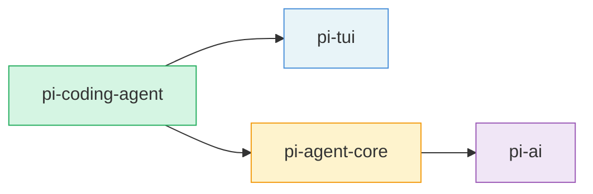
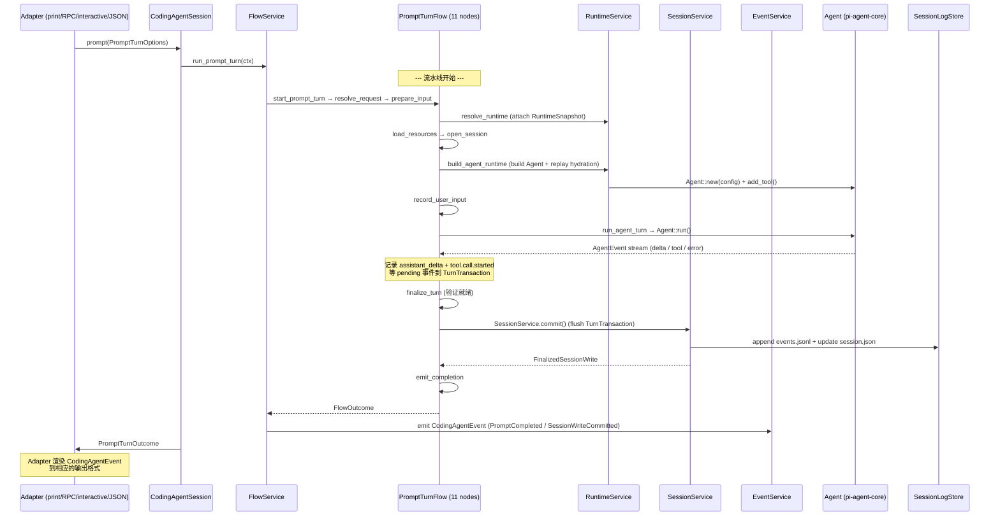
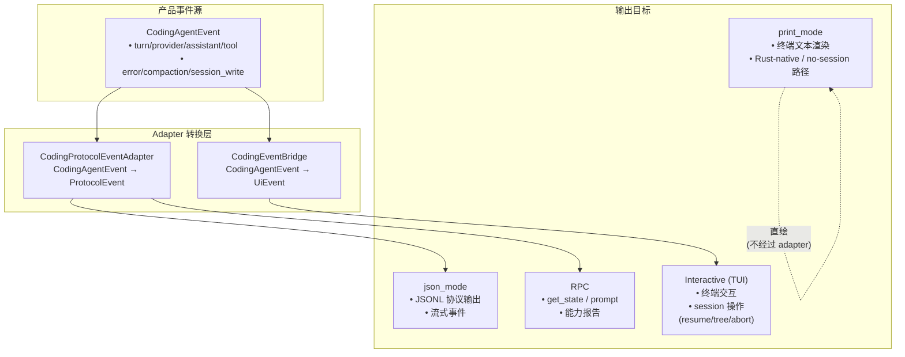
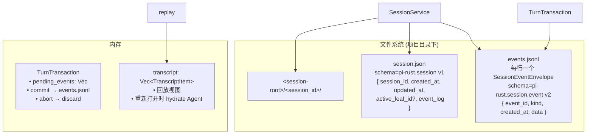
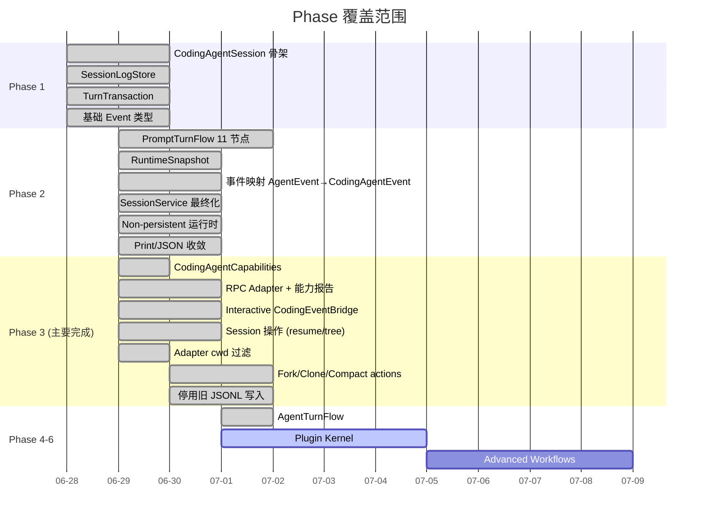
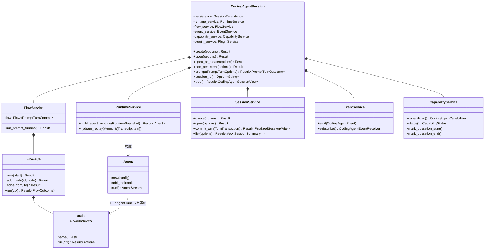

# pi-rust 架构图

> 生成时间: 2026-07-05
> 展示 `pi-agent-core` 与 `pi-coding-agent` 的内部结构及协作关系。
>
> Stage 9 已完成：外部使用 `pi_coding_agent::api`，所有 first-party live-session 操作经 `CodingAgentSession::run(CodingAgentOperation)` 进入统一 admission/dispatch 路径。验证证据见 [05-STAGE-9-CLOSURE.md](../../.planning/milestones/v1.0-phases/05-boundary-enforcement-and-stage-9-closure/05-STAGE-9-CLOSURE.md)。Stage 10 仅处理 typed `ProductEvent` payload convergence 与 compatibility subscription deletion。

---

## 1. Crate 依赖全景

```mermaid
graph TB
    subgraph external["外部 / 用户"]
        USER["用户 / CLI / 嵌入式"]
    end

    subgraph pi_tui_crate["pi-tui (crate)"]
        direction TB
        tui_main["Tui&lt;T: Terminal&gt;<br/>• 组件树管理<br/>• 渲染管线<br/>• 输入分发<br/>• overlay 管理"]
        tui_components["components<br/>• Editor / Input / Markdown<br/>• SelectList / SelectorDialog<br/>• SettingsList / Loader / Text<br/>• Box / Image / Spacer"]
        tui_input["input<br/>• InputEvent / KeyEvent<br/>• KeybindingsManager<br/>• StdinBuffer"]
        tui_terminal["terminal<br/>• Terminal trait<br/>• ProcessTerminal<br/>• NegotiationResult"]
        tui_render["RenderScheduler<br/>• diff 渲染<br/>• RenderStrategy"]
        tui_theme["theme<br/>• TuiTheme / ThemePalette<br/>• dark / light"]
        tui_overlay["overlay<br/>• OverlayHandle<br/>• OverlayOptions"]
        tui_image["terminal_image<br/>• Kitty / iTerm2 协议<br/>• TerminalCapabilities"]
        tui_cursor["CursorPosition<br/>• cursor 追踪"]
    end

    subgraph pi_ai_crate["pi-ai (crate)"]
        direction TB
        ai_registry["registry<br/>• ApiProvider trait<br/>• 全局注册表<br/>• stream_model()"]
        ai_providers["providers<br/>• Anthropic / OpenAI / DeepSeek<br/>• Google / Mistral / Azure<br/>• Bedrock / Cloudflare<br/>• Faux / Codex / Images"]
        ai_types["types<br/>• AssistantMessageEvent<br/>• Context / Model / Usage<br/>• ContentBlock / Tool<br/>• StopReason / Cost"]
        ai_transport["transport<br/>• HTTP 客户端<br/>• 重试 / SSO 头<br/>• 错误处理"]
        ai_compat["compat<br/>• OpenAI completions↔responses<br/>• Anthropic ↔ OpenAI 转换<br/>• Thinking/reasoning"]
        ai_stream["stream<br/>• EventStream type alias<br/>• complete() 聚合"]
        ai_models["models<br/>• 模型注册/查找<br/>• 费用计算"]
        ai_images["images<br/>• 图像处理"]
    end

    subgraph pi_agent_core_crate["pi-agent-core (crate)"]
        direction TB
        paf_flow["flow<br/>Flow&lt;C&gt; 运行时<br/>• FlowNode trait<br/>• Flow 图引擎<br/>• 事件/错误类型"]
        paf_agent["Agent<br/>• Agent::run()<br/>• AgentEvent stream<br/>• 工具注册"]
        paf_agent_loop["agent_loop<br/>• 上下文管理<br/>• 工具执行<br/>• 模型调用"]
        paf_compaction["compaction<br/>• 上下文压缩<br/>• 历史摘要"]
        paf_resources["resources<br/>• AgentResources<br/>• 资源管理"]
        paf_session["session<br/>• 会话状态<br/>• replay 支持"]
    end

    subgraph pi_coding_agent_crate["pi-coding-agent (crate)"]
        direction TB

        subgraph api["api 模块 (稳定对外接口)"]
            CAS["CodingAgentSession<br/>• create / open / open_or_create<br/>• run(CodingAgentOperation)<br/>• snapshot / query / control<br/>• product-event subscription"]
            CAE["CodingAgentEvent<br/>• PromptStarted / AssistantDelta<br/>• ToolCallStarted / ToolCallFinished<br/>• SessionWriteCommitted<br/>• ..."]
            Opts["CodingAgentSessionOptions<br/>PromptTurnOptions<br/>PromptTurnOutcome<br/>CapabilityStatus"]
        end

        subgraph cs["coding_session 内部"]
            FS["FlowService<br/>• PromptTurnFlow / ExportFlow<br/>• PluginLoadFlow<br/>• AgentInvocationFlow / AgentTeamFlow<br/>• SelfHealingEditFlow"]
            PTF["PromptTurnFlow<br/>11 节点流水线"]
            RS["RuntimeService<br/>• build_agent_runtime()<br/>• replay_hydration()"]
            SS["SessionService<br/>• 持久化 session 管理<br/>• TurnTransaction 最终化<br/>• SessionWrite* 事件"]
            ES["EventService<br/>• 事件订阅/分发<br/>• CodingAgentEventReceiver"]
            CapSvc["CapabilityService<br/>• 能力状态报告<br/>• idle/busy/disabled"]
            PS["PluginService<br/>• tool/command/hook providers<br/>• UI/keybind/dialog providers<br/>• Lua host metadata<br/>• FlowExtension points"]
            PR["ProfileRegistry<br/>• AgentProfile / TeamProfile<br/>• default_agent_profile_id<br/>• delegation policy"]
        end

        subgraph adapters["Adapter 层"]
            PM["print_mode<br/>• CLI 打印<br/>• 会话目标解析"]
            JM["json_mode<br/>• protocol event output<br/>• 通过 CodingAgentEvent 渲染"]
            RPC["RPC (protocol)<br/>• RpcCodingEventAdapter<br/>• get_state 能力报告<br/>• prompt 命令路由"]
            INTR["interactive<br/>• CodingEventBridge<br/>• UiEvent → C.A.Session"]
        end

        subgraph slog["Session Log (Rust-native)"]
            SLS["SessionLogStore<br/>• session.json / events.jsonl<br/>• 目录管理"]
            TTX["TurnTransaction<br/>• 事件缓冲<br/>• commit / abort / fail"]
            RPL["replay<br/>• TranscriptItem<br/>• SessionReplay"]
            ENV["SessionEventEnvelope<br/>• 类型化事件<br/>• OperationKind"]
        end

        subgraph cfg["配置 & 工具"]
            ARG["args<br/>• CliArgs 解析"]
            CFG["config<br/>• 配置加载"]
            TST["tools<br/>• 内置工具集"]
        end
    end

    %% 依赖箭头
    pi_coding_agent_crate --> pi_agent_core_crate
    pi_coding_agent_crate --> pi_tui_crate
    pi_agent_core_crate --> pi_ai_crate

    %% CodingAgentSession 复合关系
    CAS --> FS
    CAS --> RS
    CAS --> SS
    CAS --> ES
    CAS --> CapSvc
    CAS --> PS
    CAS --> PR

    FS --> PTF
    PTF --> RS
    PTF --> SS

    RS --> paf_agent
    SS --> slog

    adapters --> CAS
    adapters --> CAE

    PM --> ARG
    PM --> CFG
    RPC --> JM
    INTR --> pi_tui_crate

    %% 用户交互
    USER --> PM
    USER --> RPC
    USER --> INTR
```



---

## 1a. Crate 依赖层级



- **pi-tui** — 纯 UI 层，**零依赖**其他 pi crate
- **pi-ai** — 基础 LLM 抽象层，**零依赖**其他 pi crate
- **pi-agent-core** — Agent 运行时，依赖 pi-ai
- **pi-coding-agent** — 产品层，依赖 pi-agent-core + pi-tui

---

## 2. pi-ai 架构

```mermaid
graph TB
    subgraph registry["registry 模块 — 核心入口"]
        API_PROVIDER["ApiProvider trait<br/>• fn stream(model, ctx, opts) -> EventStream"]
        REGISTRY["全局注册表<br/>HashMap&lt;String, Arc&lt;ApiProvider&gt;&gt;"]
        STREAM_MODEL["stream_model()<br/>• 按 model.api 查找 provider<br/>• 注入 env API key<br/>• 委托 provider.stream()"]
    end

    subgraph providers["providers — 提供者实现"]
        ANTHROPIC["anthropic<br/>• AnthropicMessagesProvider"]
        OPENAI_C["openai::completions<br/>• OpenAICompletionsProvider"]
        OPENAI_R["openai::responses<br/>• OpenAIResponsesProvider"]
        OPENAI_CX["openai_codex_responses<br/>• OpenAICodexResponsesProvider"]
        AZURE["azure_openai_responses<br/>• AzureOpenAIResponsesProvider"]
        DEEPSEEK["deepseek<br/>• DeepSeekProvider"]
        GOOGLE["google<br/>• GoogleGenerativeAiProvider"]
        MISTRAL["mistral<br/>• MistralProvider"]
        BEDROCK["bedrock<br/>• BedrockProvider"]
        CLOUDFLARE["cloudflare<br/>(预留)"]
        FAUX["faux<br/>• 测试用假提供者"]
        IMG_PROV["images<br/>• 图像生成提供者"]
    end

    subgraph types["types — 核心类型系统"]
        MSG_EVENT["AssistantMessageEvent<br/>• Start / Delta / Done<br/>• Error / Aborted"]
        MSG["AssistantMessage<br/>• content: Vec&lt;ContentBlock&gt;<br/>• usage / stop_reason<br/>• error_message / diagnostics"]
        CTX["Context<br/>• messages / tools / system"]
        MODEL["Model / ModelCost / ModelInput"]
        CONTENT["ContentBlock<br/>• Text / ToolCall<br/>• ToolResult / Image"]
        USAGE["Usage / Cost / StopReason"]
        HOOKS["ProviderStreamHooks<br/>• ProviderResponseInfo"]
    end

    subgraph transport["transport — 协议传输"]
        HTTP["http<br/>• HTTP 客户端封装"]
        RETRY["retry<br/>• 指数退避重试"]
        HEADERS["headers<br/>• 认证头 / SSO"]
        ERR_TRAN["error<br/>• 传输错误类型"]
    end

    subgraph compat["compat — 兼容层"]
        ANTH_COMPAT["anthropic ↔ openai 消息转换"]
        OAI_C["openai completions → responses"]
        THINK["thinking / reasoning 参数适配"]
    end

    subgraph stream_util["stream + util"]
        ESTREAM["EventStream<br/>type EventStream = Pin&lt;Box&lt;dyn Stream&lt;Item = AssistantMessageEvent&gt;&gt;&gt;"]
        COMPLETE["complete()<br/>• 聚合 stream 为单个 AssistantMessage"]
        SSE["process_framework::SseEventHandler<br/>• SSE 流解析底座<br/>• 所有 API 提供者复用"]
    end

    subgraph models_registry["models — 模型注册"]
        ALL_MODELS["all_models()<br/>get_model() / lookup_model()"]
        COST["calculate_cost()<br/>" ]
        PROVIDERS["get_providers()"]
    end

    %% 数据流
    STREAM_MODEL --> REGISTRY
    REGISTRY --> ANTHROPIC
    REGISTRY --> OPENAI_C
    REGISTRY --> OPENAI_R
    REGISTRY --> DEEPSEEK
    REGISTRY --> GOOGLE
    REGISTRY --> MISTRAL
    REGISTRY --> BEDROCK
    REGISTRY --> AZURE
    REGISTRY --> FAUX
    REGISTRY --> IMG_PROV
    REGISTRY --> OPENAI_CX
    REGISTRY --> CLOUDFLARE

    STREAM_MODEL --> ESTREAM

    ANTHROPIC --> SSE
    OPENAI_C --> SSE
    OPENAI_R --> SSE
    DEEPSEEK --> SSE
    GOOGLE --> SSE
    MISTRAL --> SSE
    BEDROCK --> SSE
    AZURE --> SSE

    ANTHROPIC --> HTTP
    OPENAI_C --> HTTP
    OPENAI_R --> HTTP

    ANTHROPIC --> ANTH_COMPAT
    OPENAI_C --> OAI_C
    OPENAI_R --> OAI_C

    providers --> MSG_EVENT
    providers --> CTX
    providers --> MODEL
    providers --> HOOKS

    ANTHROPIC --> THINK
    OPENAI_C --> THINK
    DEEPSEEK --> THINK

    MSG_EVENT --> MSG
    CONTENT --> MSG

    models_registry --> MODEL
    models_registry --> COST
```



### pi-ai 一次流式调用链路

```mermaid
sequenceDiagram
    participant Caller as 调用者 (Agent)
    participant Reg as registry
    participant Prov as 具体 Provider
    participant SSE as process_framework
    participant HTTP as HTTP 传输
    participant API as 远程 API

    Caller->>Reg: stream_model(model, ctx, opts)
    Reg->>Reg: 按 model.api 查找 provider
    Reg->>Reg: 注入 env API key
    Reg->>Prov: provider.stream(model, ctx, opts)
    Prov->>Prov: 组装请求体 / 消息转换
    Prov->>SSE: process_sse(body, handler)
    SSE->>HTTP: HTTP POST + SSE 连接
    HTTP->>API: 发送请求

    loop 流式响应
        API-->>HTTP: SSE chunk
        HTTP-->>SSE: Bytes
        SSE->>SSE: SseEventHandler.handle_event()
        SSE-->>Prov: Vec&lt;AssistantMessageEvent&gt;
        Prov-->>Reg: EventStream
        Reg-->>Caller: EventStream (Start / Delta / ...)
    end

    API-->>HTTP: stream 结束
    SSE->>SSE: SseEventHandler.finalize()
    SSE-->>Prov: Done / Error
    Prov-->>Reg: Done event
    Reg-->>Caller: Done event
```

---

## 3. pi-tui 架构

```mermaid
graph TB
    subgraph tui_main["Tui&lt;T: Terminal&gt; — 核心结构"]
        direction TB
        TUI_DESC["• 组件树 (children: Vec&lt;(ComponentId, Box&lt;dyn Component&gt;)&gt;)<br/>• overlay 栈 (overlays: Vec&lt;OverlayEntry&gt;)<br/>• 聚焦管理 (focused_component)<br/>• 渲染管线 (differential / full redraw)<br/>• 输入分发 (input_listeners → focused component)<br/>• Kitty 图像追踪"]
    end

    subgraph component_trait["Component trait — 组件协议"]
        COMP["Component (trait)<br/>+ render(width) -> Vec&lt;String&gt;<br/>+ handle_input(event)<br/>+ set_viewport_size(w, h)<br/>+ set_focused(focused)<br/>+ invalidate()"]
        CONTAINER["Container<br/>• 子组件容器<br/>• 按序拼接 render 输出"]
    end

    subgraph components["内置组件集"]
        EDITOR["Editor<br/>• 多行文本编辑<br/>• 语法高亮<br/>• undo/redo"]
        INPUT_C["Input<br/>• 单行输入<br/>• autocomplete 钩子"]
        MARKDOWN["Markdown<br/>• 渲染 markdown 文本<br/>• 代码块 / 格式化"]
        SELECT["SelectList<br/>• 可选列表<br/>• SelectItem 模型"]
        SELECTOR["SelectorDialog<br/>• 模态选择器<br/>• 搜索过滤"]
        SETTINGS["SettingsList<br/>• 设置项列表<br/>• SettingSubmenu"]
        LOADER["Loader / CancellableLoader<br/>• 加载指示器<br/>• 可取消"]
        TEXT["Text / TruncatedText<br/>• 静态文本<br/>• 截断控制"]
        BOX["Box<br/>• 背景块<br/>• BackgroundFn"]
        IMAGE_C["Image<br/>• 内嵌图像<br/>• Kitty / iTerm2"]
        SPACER["Spacer<br/>• 空白占位"]
    end

    subgraph input_system["输入系统"]
        INPUT_EVENT["InputEvent<br/>• Key(KeyEvent)<br/>• Paste(String)<br/>• Raw(String)<br/>• Resize(TerminalSize)"]
        KEY_EVENT["KeyEvent<br/>• key: Key<br/>• modifiers: KeyModifiers<br/>• kind: KeyEventKind"]
        KEYBINDINGS["KeybindingsManager<br/>• 键绑定解析<br/>• TUI_KEYBINDINGS<br/>• 冲突检测"]
        STDIN["StdinBuffer<br/>• 标准输入缓冲"]
    end

    subgraph terminal_layer["终端抽象层"]
        TERM_TRAIT["Terminal (trait)<br/>+ read() -> InputEvent<br/>+ write(bytes)<br/>+ size() -> TerminalSize<br/>+ flush()"]
        PROC_TERM["ProcessTerminal<br/>• stdio 实现<br/>• 原始模式设置<br/>• Kitty 协议协商"]
        VIRT_TERM["VirtualTerminal<br/>• TerminalOp 队列<br/>• 测试用虚拟终端"]
        NEGOTIATION["NegotiationResult<br/>• Kitty 协议<br/>• 颜色方案查询"]
    end

    subgraph rendering["渲染管线"]
        RENDER_SCHED["RenderScheduler<br/>• 请求 / 强制刷新<br/>• 最小间隔节流"]
        RENDER_STRAT["RenderStrategy<br/>• FullRedraw<br/>• Differential{first,last}<br/>• NoChange"]
        RENDER_OUT["RenderOutcome<br/>• strategy + line_count"]
        SURFACE["RenderSurface<br/>• Inline / Clearing"]
    end

    subgraph theme_styles["主题 & 样式"]
        TUI_THEME["TuiTheme<br/>• dark_theme() / light_theme()<br/>• ThemeMode"]
        PALETTE["ThemePalette<br/>• 颜色语义"]
        STYLE["Style / Color / ColorLevel<br/>• ANSI 样式生成<br/>• paint() / paint_with()"]
        SUB_THEMES["子主题<br/>• EditorTheme / MarkdownTheme<br/>• SelectListTheme / SettingsListTheme<br/>• ImageTheme"]
    end

    subgraph image_proto["图像协议"]
        KITTY["Kitty 协议<br/>• encode_kitty()<br/>• delete_kitty_image()"]
        ITERM2["iTerm2 协议<br/>• encode_iterm2()"]
        CAPS["TerminalCapabilities<br/>• 协议检测<br/>• CellDimensions"]
    end

    subgraph utils_support["工具模块"]
        FUZZY["fuzzy<br/>• FuzzyMatch<br/>• fuzzy_filter_indices()"]
        AUTOCOMPLETE["autocomplete<br/>• AutocompleteProvider trait<br/>• CombinedAutocompleteProvider<br/>• SlashCommand"]
        CURSOR["cursor<br/>• CURSOR_MARKER<br/>• CursorPosition"]
        KILL_RING["kill_ring<br/>• 剪切环 (Emacs 风格)"]
        UNDO["undo_stack<br/>• 撤销栈"]
        WIDTH["utils<br/>• visible_width()<br/>• truncate_to_width()<br/>• wrap_text_with_ansi()"]
        OVERLAY["overlay<br/>• OverlayAnchor / OverlayHandle<br/>• OverlayOptions / OverlayMargin"]
    end

    %% 关系
    TUI_DESC --- COMP
    TUI_DESC --- COMPONENTS
    TUI_DESC --- RENDERING
    TUI_DESC --- INPUT_SYSTEM
    TUI_DESC --- TERMINAL_LAYER

    TUI_DESC ---- IMAGE_PROTO

    components --- COMP
    components --- CONTAINER

    input_system --- KEY_EVENT
    input_system --- KEYBINDINGS
    input_system --- STDIN

    terminal_layer --- TERM_TRAIT
    terminal_layer --- NEGOTIATION

    rendering --- RENDER_SCHED
    rendering --- RENDER_STRAT
    rendering --- SURFACE

    theme_styles --- TUI_THEME
    theme_styles --- STYLE
    theme_styles --- SUB_THEMES

    image_proto --- CAPS

    IMAGE_C --> image_proto

    INPUT_C --> autocomplete

    PROC_TERM --> NEGOTIATION
    VIRT_TERM --> TERM_TRAIT
    PROC_TERM --> TERM_TRAIT

    INPUT_EVENT --> KEY_EVENT
    INPUT_C --> INPUT_EVENT
```



### pi-tui 渲染与输入周期

```mermaid
sequenceDiagram
    participant Terminal as ProcessTerminal
    participant Tui as Tui&lt;T&gt;
    participant Comp as Component

    loop 事件循环
        Terminal->>Tui: read() -> InputEvent

        alt KeyEvent / Paste / Raw
            Tui->>Tui: add_input_listener 全局过滤
            Tui->>Comp: handle_input(event)
            Comp-->>Tui: (可能修改内部状态)
            Comp->>Comp: invalidate()
        end

        Note over Tui,Comp: 渲染阶段
        Tui->>Tui: RenderScheduler 判断是否应渲染
        Tui->>Comp: render(width) -> 行数组
        Comp-->>Tui: Vec&lt;String&gt;

        Tui->>Tui: 与 previous_lines 差分 → RenderStrategy
        Tui->>Terminal: 写入 ANSI (差异 / 全量 / 无变化)
        Tui->>Tui: 更新 cursor 位置
        Terminal->>Terminal: flush()
    end
```

---

## 4. PromptTurnFlow — 内部流水线

```mermaid
graph LR
    START["start_prompt_turn"] --> RREQ["resolve_request<br/>验证 PromptTurnOptions"]
    RREQ --> PIN["prepare_input<br/>规范/验证 prompt 输入"]
    PIN --> RRUN["resolve_runtime<br/>挂载 RuntimeSnapshot"]
    RRUN --> LRES["load_resources<br/>注入 AgentResources"]
    LRES --> OSES["open_session<br/>验证 session id/replay/transaction"]
    OSES --> BAGT["build_agent_runtime<br/>从 RuntimeSnapshot 构建 Agent<br/>+ replay hydration"]
    BAGT --> RINP["record_user_input<br/>持久化输入事件"]
    RINP --> RAGT["run_agent_turn<br/>驱动 Agent::run() stream<br/>记录 assistant delta + tool lifecycle"]
    RAGT --> FTUR["finalize_turn<br/>验证终态就绪<br/>(不下刷 event — SessionService 接管)"]
    FTUR --> ECOM["emit_completion<br/>追加 PromptCompleted 事件"]

    style START fill:#f0f0f0,stroke:#666
    style ECOM fill:#e6ffe6,stroke:#0a0
```



---

## 5. 一次 prompt() 调用的完整数据流



---

## 6. 适配层与其目标格式



---

## 7. Session 持久化结构



---

## 8. Crate 职责边界

| Crate | 核心职责 | 不负责 | 依赖 |
|---|---|---|---|
| **pi-tui** | 终端 UI 渲染、组件系统、输入绑定、终端协商 | 产品概念、LLM 通信、Agent 逻辑 | 纯 Rust 生态 (无 pi 内部依赖) |
| **pi-ai** | LLM 提供者抽象、消息/工具类型、协议传输、SSE 流处理 | 产品概念、会话管理、Agent 循环 | 纯 Rust 生态 (无 pi 内部依赖) |
| **pi-agent-core** | Flow 运行时引擎、Agent 生命周期、AgentEvent 流、工具执行、上下文压缩 | 产品事件、会话持久化、编码场景 | pi-ai |
| **pi-coding-agent** | CodingAgentSession 所有、产品事件、适配器、Rust-native 会话日志、PromptTurnFlow | LLM 协议细节、低层 Agent 循环实现 | pi-agent-core, pi-tui |

---

## 9. 当前各 Phase 覆盖的模块



---

## 10. 关键类型关系


